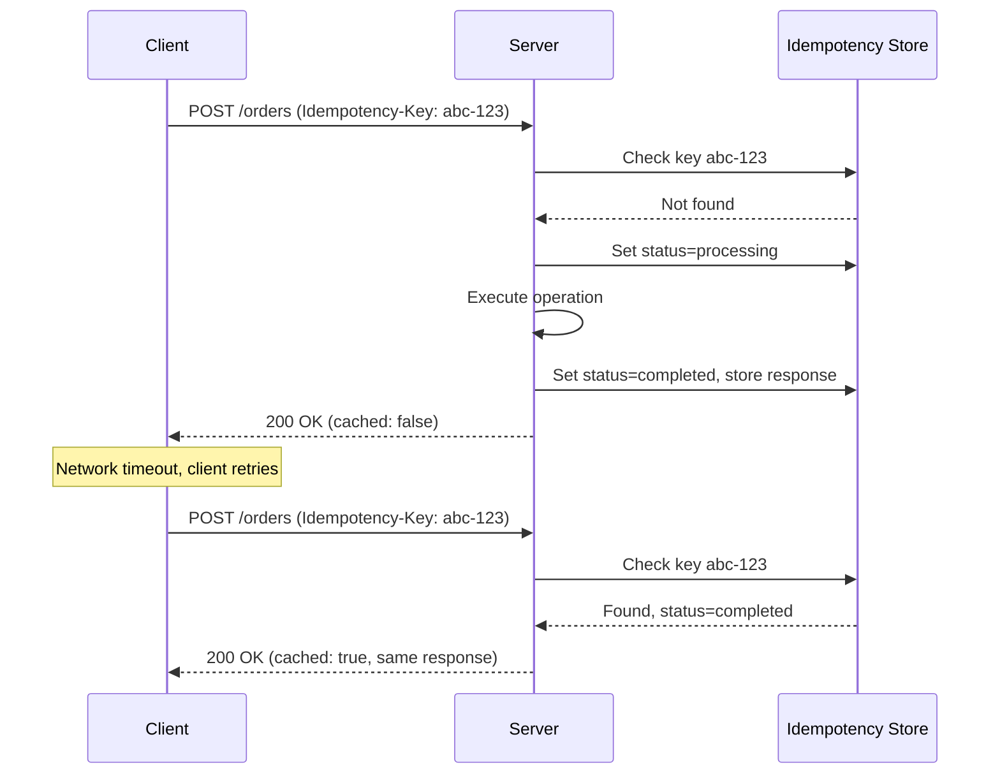

## Overview

I once watched a payment system charge a customer three times for the same order.
The client retried after a timeout, the server processed each retry, and nobody
noticed until the customer complained. That's the problem idempotency solves.

Idempotency guarantees that making the same API request several times produces the
same result as making it once, with no duplicate side effects. In distributed
systems where networks fail, timeouts happen, and clients retry, this matters
more than you'd expect.

This recipe covers how to build idempotent endpoints with idempotency keys,
natural key constraints, and state checks. I've included working examples in
Python (FastAPI), JavaScript (Express), and Java (Spring Boot) so you can copy
them directly.

## When to Use

- Building payment or order APIs where duplicate charges must be prevented. See
  the [API Security Checklist](/guides/api-security-checklist-guide/) for secure
  payment patterns.
- Designing APIs consumed by mobile apps with unreliable network connectivity.
  See [Call REST API](/recipes/call-rest-api/) for client retry patterns.
- Implementing retry logic where the same request may be sent several times.
- Creating webhook receivers that may deliver the same event more than once.

### When to avoid

- Read-only endpoints (`GET`, `HEAD`, `OPTIONS`) are already idempotent by the
  HTTP spec: they don't need extra handling.
- Operations with no side effects or no retry risk rarely justify the added
  storage and logic.

## Solution

### Python (FastAPI)

```python
from fastapi import FastAPI, Header, HTTPException
from pydantic import BaseModel
import uuid
import time
from typing import Optional

app = FastAPI()

idempotency_store = {}
IDEMPOTENCY_TTL = 86400  # 24 hours

class CreateOrderRequest(BaseModel):
    customer_id: str
    amount: float
    currency: str = "USD"

@app.post("/orders")
def create_order(
    request: CreateOrderRequest,
    idempotency_key: Optional[str] = Header(None)
):
    if not idempotency_key:
        raise HTTPException(status_code=400, detail="Idempotency-Key header required")

    try:
        uuid.UUID(idempotency_key)
    except ValueError:
        raise HTTPException(status_code=400, detail="Invalid Idempotency-Key format")

    now = time.time()

    expired = [k for k, v in idempotency_store.items() if now - v["timestamp"] > IDEMPOTENCY_TTL]
    for k in expired:
        del idempotency_store[k]

    if idempotency_key in idempotency_store:
        stored = idempotency_store[idempotency_key]
        if stored["status"] == "completed":
            return {
                "id": stored["order_id"],
                "status": "completed",
                "cached": True
            }
        elif stored["status"] == "processing":
            raise HTTPException(status_code=409, detail="Request already in progress")

    idempotency_store[idempotency_key] = {
        "status": "processing",
        "timestamp": now,
        "order_id": None
    }

    try:
        order_id = str(uuid.uuid4())
        # ... save to database ...

        idempotency_store[idempotency_key] = {
            "status": "completed",
            "timestamp": now,
            "order_id": order_id
        }

        return {"id": order_id, "status": "completed", "cached": False}
    except Exception:
        del idempotency_store[idempotency_key]
        raise
```

### JavaScript (Express)

```javascript
import express from "express";
import { v4 as uuidv4, validate as validateUuid } from "uuid";

const app = express();
app.use(express.json());

const idempotencyStore = new Map();
const IDEMPOTENCY_TTL = 86400 * 1000; // 24 hours

function isExpired(timestamp) {
  return Date.now() - timestamp > IDEMPOTENCY_TTL;
}

app.post("/orders", (req, res) => {
  const idempotencyKey = req.headers["idempotency-key"];

  if (!idempotencyKey) {
    return res.status(400).json({ error: "Idempotency-Key header required" });
  }
  if (!validateUuid(idempotencyKey)) {
    return res.status(400).json({ error: "Invalid Idempotency-Key format" });
  }

  for (const [key, entry] of idempotencyStore) {
    if (isExpired(entry.timestamp)) {
      idempotencyStore.delete(key);
    }
  }

  const existing = idempotencyStore.get(idempotencyKey);

  if (existing) {
    if (existing.status === "completed") {
      return res.json({
        id: existing.orderId,
        status: "completed",
        cached: true
      });
    }
    if (existing.status === "processing") {
      return res.status(409).json({ error: "Request already in progress" });
    }
  }

  idempotencyStore.set(idempotencyKey, {
    status: "processing",
    timestamp: Date.now(),
    orderId: null
  });

  try {
    const orderId = uuidv4();
    // ... save to database ...

    idempotencyStore.set(idempotencyKey, {
      status: "completed",
      timestamp: Date.now(),
      orderId
    });

    res.json({ id: orderId, status: "completed", cached: false });
  } catch (err) {
    idempotencyStore.delete(idempotencyKey);
    throw err;
  }
});
```

### Java (Spring Boot)

```java
import org.springframework.http.HttpStatus;
import org.springframework.web.bind.annotation.*;
import org.springframework.web.server.ResponseStatusException;
import java.util.UUID;
import java.util.concurrent.ConcurrentHashMap;

@RestController
@RequestMapping("/orders")
public class OrderController {

  private final ConcurrentHashMap<String, IdempotencyRecord> store = new ConcurrentHashMap<>();
  private static final long IDEMPOTENCY_TTL_MS = 86400_000; // 24 hours

  record CreateOrderRequest(String customerId, double amount, String currency) {}
  record OrderResponse(UUID id, String status, boolean cached) {}
  record IdempotencyRecord(String status, long timestamp, UUID orderId) {}

  @PostMapping
  public OrderResponse createOrder(
      @RequestBody CreateOrderRequest request,
      @RequestHeader("Idempotency-Key") String idempotencyKey) {

    UUID key;
    try {
      key = UUID.fromString(idempotencyKey);
    } catch (IllegalArgumentException e) {
      throw new ResponseStatusException(HttpStatus.BAD_REQUEST, "Invalid Idempotency-Key format");
    }

    String keyStr = key.toString();
    long now = System.currentTimeMillis();

    store.entrySet().removeIf(entry -> now - entry.getValue().timestamp() > IDEMPOTENCY_TTL_MS);

    IdempotencyRecord existing = store.get(keyStr);
    if (existing != null) {
      if ("completed".equals(existing.status())) {
        return new OrderResponse(existing.orderId(), "completed", true);
      }
      if ("processing".equals(existing.status())) {
        throw new ResponseStatusException(HttpStatus.CONFLICT, "Request already in progress");
      }
    }

    store.put(keyStr, new IdempotencyRecord("processing", now, null));

    try {
      UUID orderId = UUID.randomUUID();
      // ... save to database ...

      store.put(keyStr, new IdempotencyRecord("completed", now, orderId));
      return new OrderResponse(orderId, "completed", false);
    } catch (Exception e) {
      store.remove(keyStr);
      throw e;
    }
  }
}
```

## Explanation



An **idempotency key** is a client-generated UUID sent in the
`Idempotency-Key` header. The server looks it up to detect duplicate requests
and return the cached response instead of running the operation again.

The **processing** state is what stops two concurrent requests from running the
same operation twice. When a second request arrives mid-flight,
the server returns `409 Conflict`. I learned this the hard way: without the
processing state, a retry can slip in between the key check and the operation,
causing the exact duplicate you were trying to prevent.

**TTL cleanup** is necessary because idempotency stores grow unbounded. Use [Redis](https://redis.io/docs/manual/keyspace-notifications/)
with TTL or schedule periodic cleanup. A 24-hour TTL is common for financial
operations. [Stripe's idempotency docs](https://stripe.com/docs/api/idempotent_requests)
recommend 24 hours for payment operations.

**Error handling** must remove the `processing` marker on failure so the client
can retry. See [Error Handling](/recipes/handle-errors/) for retry patterns.
Otherwise the key stays blocked.

**Natural idempotency** with `PUT /orders/{id}` follows HTTP semantics: repeated
updates with the same body leave the resource in the same state. See
[Call REST API](/recipes/call-rest-api/) for HTTP method semantics.

## Variants

| Strategy | Implementation | Best for |
| --- | --- | --- |
| Idempotency key header | UUID in `Idempotency-Key` header | POST endpoints creating resources |
| Natural key constraint | Database unique constraint on a business key | UPSERT operations, user registration |
| State machine check | Verify current state before transition | Workflow engines, payment processing |
| ETag / If-Match | Conditional requests with version | Optimistic concurrency, updates |

## Best Practices

- Require idempotency keys for state-changing POST/PUT/PATCH endpoints. I've
  made this mandatory for every endpoint that creates or transfers money, after
  the triple-charge incident I mentioned earlier.
- Use UUID v4 for keys. Don't use incrementing integers or timestamps: they
  collide across clients and defeat the purpose.
- Store the full response, not just a status flag, so duplicates return identical
  data.
- Set a TTL that matches your retry window and document it. Twenty-four hours
  works for payments; shorter for less critical operations.
- Make `DELETE /resources/{id}` return `204` or `404`. Both mean the resource no
  longer exists, which is what the client wants.
- Validate key format and reject missing or malformed keys with `400 Bad Request`.
  Don't accept arbitrary strings: a UUID v4 keeps the store clean.

## Common Mistakes

- Checking the idempotency key without atomic locking. I've seen this cause
  duplicate charges in production: two parallel requests both pass the key check
  before either writes the processing marker. Use a database unique constraint or
  `SETNX` in Redis.
- Setting an infinite TTL, eventually exhausting storage and degrading
  performance.
- Returning different responses for the same idempotency key, breaking the
  contract.
- Using idempotency keys on GET requests, which are already idempotent.
- Not removing the `processing` marker on failure, permanently blocking retries.

## Testing Strategy

Test idempotency with three scenarios: duplicate requests, concurrent requests,
and TTL expiry. Each catches a different class of bug.

**Duplicate requests**: send the same request twice with the same key. The second
call should return `cached: true`. If it runs the operation again, your key
check is broken.

**Concurrent requests**: fire two requests at the same time with the same key.
One wins, the other gets `409 Conflict`. Use a test that spawns
parallel threads or async tasks. I've caught race conditions this way that only
show up under load.

**TTL expiry**: set a short TTL in tests (1 second), wait, then send the same
key. The store should treat it as a fresh request. This catches bugs where the
cleanup logic never runs or the TTL comparison is off.

```python
import pytest
from concurrent.futures import ThreadPoolExecutor

def test_duplicate_returns_cached(client):
    headers = {"Idempotency-Key": "550e8400-e29b-41d4-a716-446655440000"}
    r1 = client.post("/orders", json={"customer_id": "c1", "amount": 10}, headers=headers)
    r2 = client.post("/orders", json={"customer_id": "c1", "amount": 10}, headers=headers)
    assert r1.json()["cached"] is False
    assert r2.json()["cached"] is True
    assert r1.json()["id"] == r2.json()["id"]

def test_concurrent_one_wins_other_gets_409(client):
    headers = {"Idempotency-Key": "550e8400-e29b-41d4-a716-446655440001"}
    with ThreadPoolExecutor(max_workers=2) as pool:
        futures = [
            pool.submit(client.post, "/orders",
                        json={"customer_id": "c1", "amount": 10}, headers=headers)
            for _ in range(2)
        ]
        statuses = sorted(f.status_code for f in futures)
    assert statuses == [200, 409]

def test_expired_key_allows_new_request(client):
    headers = {"Idempotency-Key": "550e8400-e29b-41d4-a716-446655440002"}
    client.post("/orders", json={"customer_id": "c1", "amount": 10}, headers=headers)
    # Wait for TTL to expire (set TTL=1 in test config)
    import time; time.sleep(1.1)
    r = client.post("/orders", json={"customer_id": "c1", "amount": 10}, headers=headers)
    assert r.json()["cached"] is False
```

## See Also

- [Stripe Idempotent Requests](https://stripe.com/docs/api/idempotent_requests):
  production-grade idempotency key implementation in a payments API.
- [RFC 7231: HTTP Semantics](https://datatracker.ietf.org/doc/html/rfc7231#section-4.2.2):
  official HTTP method safety and idempotency definitions.
- [AWS API Gateway Idempotency](https://docs.aws.amazon.com/apigateway/latest/developerguide/api-gateway-idempotency.html):
  managed idempotency support for AWS APIs.
- [IETF Idempotency-Key Header Draft](https://datatracker.ietf.org/doc/draft-ietf-httpapi-idempotency-key-header/):
  proposed standard for the `Idempotency-Key` header.
- [Call REST API](/recipes/call-rest-api/): client-side retry patterns that
  pair with server-side idempotency.
- [Rate Limiting](/recipes/rate-limiting/): complements idempotency for API
  protection.

## FAQ

### Which HTTP methods are naturally idempotent?

GET, HEAD, PUT, DELETE, and OPTIONS are all idempotent by HTTP spec. POST is the
main exception: repeated POSTs usually create several resources. PATCH depends
on the patch semantics.

### How should the client generate idempotency keys?

Generate a UUID v4 before the first attempt and reuse it for every retry of the
same logical operation. Don't reuse a key for a different operation.

### Can I implement idempotency without a dedicated store?

Yes, with database constraints. A `payments` table with a unique constraint on
`(idempotency_key, merchant_id)` prevents duplicates atomically. This works when
the key maps directly to a record. For multi-step operations, a dedicated store
is clearer.

### How does this relate to rate limiting?

Idempotency prevents duplicate side effects. Rate limiting prevents too many
requests. They complement each other. See [Rate Limiting](/recipes/rate-limiting/)
for client-side and server-side limits.
