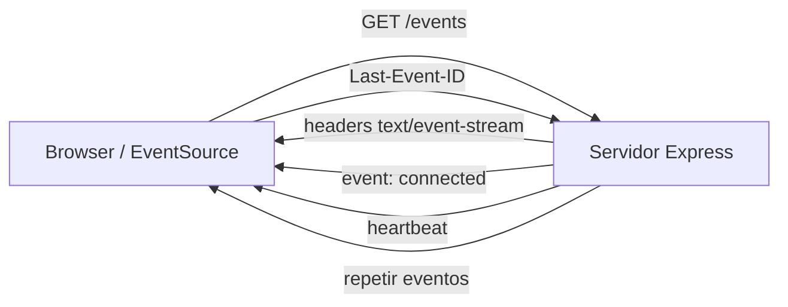

## Visión General

Server-Sent Events (SSE) permite que el servidor envíe eventos de texto al
browser a través de una conexión HTTP persistente. Es un canal unidireccional
sobre HTTP plano, así que funciona con la autenticación, load balancers y
proxies que ya tengas.

Yo uso SSE cuando el tráfico es principalmente de servidor a cliente y no quiero
agregar infraestructura de WebSockets solo para empujar unas pocas
actualizaciones. En una app de Node.js y Express, la receta es corta: seteá los
headers correctos, mantené la respuesta abierta y escribí líneas en formato
`text/event-stream`. La API `EventSource` del browser maneja la reconexión
automáticamente y envía el header `Last-Event-ID` para que el servidor pueda
reanudar el stream.

Esta receta incluye un endpoint de Express, un cliente de browser, un helper de
broadcast que maneja backpressure y algunas notas de producción que Yo hubiera
querido tener cuando deployé SSE por primera vez detrás de nginx. El tipo de
notas que me habrían ahorrado un fin de semana de debugging de timeouts de proxy.
Si querés empezar por los conceptos del protocolo, mirá
[Server-Sent Events](/recipes/server-sent-events/); para chat bidireccional,
revisá [WebSocket Bidirectional Chat](/recipes/websocket-bidirectional-chat/).

## Cuándo Usar

Usá SSE en estos casos:

- Necesitás dashboards en vivo, feeds de actividad o notificaciones de servidor a
  cliente. Yo lo uso para barras de progreso de trabajos largos porque el browser
  solo escucha, así que Yo no necesito un setup completo de WebSocket.
- El tráfico fluye principalmente de servidor a cliente, y los clientes solo
  escuchan. Yo pienso en tickers de acciones, resultados deportivos o colas de logs —
  todos casos donde el cliente solo necesita recibir.
- Preferís reusar tu stack HTTP en lugar de agregar infraestructura de
  WebSockets. Yo prefiero SSE porque atraviesa la mayoría de proxies corporativos y CDNs sin
  upgrades de protocolo.
- Tus mensajes son chicos y de texto; no necesitás payloads binarios.

### Cuándo evitar

- El flujo es genuinamente bidireccional o binario. Usá WebSockets en su lugar.
- Los clientes necesitan enviar mensajes frecuentes al servidor. SSE es solo de
  servidor a cliente.
- Tu despliegue bloquea conexiones HTTP persistentes. Algunos proxies o firewalls
  cortan sockets inactivos a menos que mantengas heartbeats y timeouts
  alineados.

## Solución

### Endpoint SSE con Express

```typescript
// sse/server.ts
import express, { Request, Response } from 'express';
import { randomUUID } from 'crypto';

const app = express();

interface Client {
  id: string;
  response: Response;
}

const clients = new Map<string, Client>();

function addClient(res: Response): string {
  const id = randomUUID();

  res.writeHead(200, {
    'Content-Type': 'text/event-stream',
    'Cache-Control': 'no-cache',
    'Connection': 'keep-alive',
    'X-Accel-Buffering': 'no',
  });

  res.write(
    `event: connected\nid: ${id}\ndata: ${JSON.stringify({ clientId: id })}\n\n`
  );

  clients.set(id, { id, response: res });

  res.on('close', () => {
    clients.delete(id);
  });

  return id;
}

app.get('/events', (req: Request, res: Response) => {
  const lastEventId = req.headers['last-event-id'] as string | undefined;
  const clientId = addClient(res);

  if (lastEventId) {
    replayEvents(clientId, lastEventId);
  }
});

// Reemplazá esto por un buffer acotado o un store persistente
function replayEvents(clientId: string, lastEventId: string) {
  // Enviá los eventos que el cliente se perdió
}

const PORT = 3000;
app.listen(PORT, () => console.log(`SSE server on port ${PORT}`));
```

Los headers importan más de lo que parece. El header `Content-Type: text/event-stream`
le dice al browser que está viendo un stream de eventos. `Cache-Control: no-cache`
evita que los proxies hagan buffering de la respuesta, y `X-Accel-Buffering: no`
hace lo mismo para nginx. Yo también seteo `Connection: keep-alive`, aunque
HTTP/1.1 mantiene las conexiones abiertas por defecto; es un recordatorio útil
para quien lea el código después.

### Broadcast de eventos con backpressure

```typescript
function broadcast(event: string, data: unknown) {
  const payload = `event: ${event}\ndata: ${JSON.stringify(data)}\n\n`;

  clients.forEach((client) => {
    const flushed = client.response.write(payload);

    if (!flushed) {
      client.response.once('drain', () => {
        // el buffer se limpió; los writes pueden continuar
      });
    }
  });
}

// Heartbeat cada 30 segundos para mantener vivas las conexiones
setInterval(() => {
  broadcast('heartbeat', { ts: Date.now() });
}, 30000);
```

`response.write` devuelve `false` cuando el buffer interno de Node se llena. Esa
es la señal de backpressure. En el snippet de arriba Yo espero al evento `drain`,
pero en producción yo suelo desconectar clientes que se quedan atrás por mucho
tiempo, porque una cola de mensajes pendientes sin límite se come la memoria.

### Cliente con auto-reconexión

```typescript
// client/sse.ts
let attempts = 0;
let reconnectTimer: ReturnType<typeof setTimeout> | null = null;

function connect() {
  const source = new EventSource('/events');

  source.addEventListener('connected', (e) => {
    attempts = 0;
    const { clientId } = JSON.parse(e.data);
    console.log('connected as', clientId);
  });

  source.addEventListener('notification', (e) => {
    const data = JSON.parse(e.data);
    showToast(data.message);
  });

  source.onerror = () => {
    source.close();

    if (reconnectTimer) return;

    const delay = Math.min(1000 * 2 ** attempts, 30000);
    attempts += 1;

    reconnectTimer = setTimeout(() => {
      reconnectTimer = null;
      connect();
    }, delay);
  };
}

connect();
```

El browser ya reconecta automáticamente, pero el loop manual de retry te da
control sobre el tope del backoff y permite resetear el contador cuando llega
un evento `connected`. Yo pongo el tope en 30 segundos porque una mala conexión
no debería dejar al usuario esperando minutos entre intentos — sin el tope, el
backoff exponencial llega a 17 minutos en el intento 10, y nadie se va a quedar
esperando eso.

### Manejo de eventos con nombre y `retry`

Un cliente productivo suele escuchar más de un tipo de evento. Yo seteo un campo
`retry` por defecto en milisegundos para que el browser espere el tiempo
adecuado antes de reconectar. Acá está el helper que Yo uso:

```typescript
function sendNotification(res: Response, event: string, data: unknown, retry = 2000) {
  res.write(`event: ${event}\n`);
  res.write(`data: ${JSON.stringify(data)}\n`);
  res.write(`retry: ${retry}\n\n`);
}
```

Del lado del cliente, `addEventListener('order-update', ...)` solo se dispara
para mensajes cuyo campo `event:` coincide. A mí me resulta más limpio que
enterrar el tipo de evento adentro del payload JSON, porque así el browser hace
el filtrado por vos en lugar de tener que inspeccionar cada mensaje y rutearlo
a mano.

### Testear el stream con curl

Antes de cablear el browser, yo verifico el endpoint con curl:

```bash
curl -N -H "Accept: text/event-stream" http://localhost:3000/events
```

El flag `-N` desactiva el buffering de salida para que veas los eventos a
medida que llegan en lugar de recibir un chunk demorado. Si no ves el evento
`connected` enseguida, los headers o el formato de la respuesta están
probablemente mal — yo suelo chequear los headers de respuesta con `curl -I`
primero para confirmar que `Content-Type: text/event-stream` esté
efectivamente seteado antes de investigar algo más profundo.

### CORS y autenticación

`EventSource` no permite setear headers custom, así que no podés enviar un
token `Authorization` tipo bearer directo. En la práctica yo elijo una de tres
opciones.

Una cookie funciona cuando la página del browser y la API comparten el mismo
origen. Un query token es un valor de corta vida en la URL, pero puede filtrarse
en logs del servidor e historial del browser. Un `fetch` manual con
`ReadableStream` te da control total de los headers, aunque tenés que
re-implementar la reconexión. Yo solo voy por el camino de `fetch` cuando
necesito headers `Authorization` y las cookies no son una opción.

Para CORS, yo uso el middleware `cors` y permito el origen específico en Express:

```typescript
import cors from 'cors';

app.use(cors({ origin: 'https://app.example.com', credentials: true }));
```

Esa config deja que el browser se conecte desde otro origen manteniendo las
credentials habilitadas. Yo siempre fijo el origen en lugar de usar `*` — CORS
con wildcard y credentials es un agujero de seguridad.

### Despliegue detrás de nginx

Nginx es el lugar más común donde se rompe SSE. La configuración por defecto
intenta hacer buffering de la respuesta, lo que convierte un stream vivo en un
lote demorado. Yo siempre agrego esto al bloque `location`, y digo siempre —
Yo me la pasé horas debugueando "los eventos llegan en bloques" solo para
descubrir que `proxy_buffering` seguía activado.

```nginx
location /events {
  proxy_pass http://localhost:3000;
  proxy_http_version 1.1;
  proxy_set_header Connection '';
  proxy_buffering off;
  proxy_cache off;
  proxy_read_timeout 86400s;
  proxy_send_timeout 86400s;
}
```

Sin `proxy_buffering off`, el cliente no ve los eventos hasta que el buffer se
llena, lo cual medio derrota el propósito de un stream vivo. `proxy_read_timeout`
tiene que ser mayor que el intervalo de heartbeat, si no nginx cierra el socket
entre latidos y volvés a debuguear desconexiones silenciosas. Yo lo seteo en
86400s (24 horas) para que el socket se mantenga abierto durante toda la sesión
— cualquier cosa más corta y estás compitiendo contra tu propio heartbeat.

### Escalar más allá de un servidor

Cuando agregás un segundo proceso de Node, cada servidor solo conoce los
clientes que tiene conectados. Yo suelo poner un canal de pub/sub de Redis
adelante de la función de broadcast. Cada instancia de Node se subscribe al
canal y reenvía los mensajes a sus clientes locales. Yo recurro a este patrón
cuando el tráfico de SSE crece más allá de un solo proceso:

```typescript
import { createClient } from 'redis';

const redis = createClient({ url: process.env.REDIS_URL });
const subscriber = redis.duplicate();

subscriber.subscribe('sse:events', (message) => {
  const { event, data } = JSON.parse(message);
  broadcast(event, data);
});

async function publishEvent(event: string, data: unknown) {
  await redis.publish('sse:events', JSON.stringify({ event, data }));
}
```

Si corrés varias instancias detrás de un load balancer, usá sticky sessions para
que un cliente que reconecta caiga en el mismo servidor. Si no, el header
`Last-Event-ID` puede llegar a un nodo que no tiene el historial de ese
cliente, y vas a repetir o saltar eventos — lo cual es peor que perderlos,
porque los eventos duplicados son un bug real en código de UI que dedupea por
`id`.

## Explicación

SSE reutiliza una respuesta HTTP, y esa es la gracia — sin upgrade de
protocolo, sin infraestructura especial. El servidor la mantiene abierta y
escribe líneas en formato `text/event-stream`. Los eventos traen campos
`event:`, `data:`, `id:` y `retry:`. Los browsers lo manejan a través de la API
`EventSource`, que reconecta automáticamente y envía el header
`Last-Event-ID` para reanudar el stream sin perder nada.



El protocolo es solo texto, así que cualquier JSON que envíes se codifica dentro
del campo `data:` como string. Los heartbeats mantienen la conexión viva frente
a proxies que pueden cerrar sockets inactivos — yo vi firewalls corporativos
cortar conexiones después de 60 segundos de silencio. El header
`Last-Event-ID` permite reanudar desde donde el cliente se quedó.

El backpressure aparece cuando los clientes no pueden seguir el ritmo.
`response.write` devuelve `false` en cuanto el buffer interno de Node se llena.
Después podés esperar al evento `drain` antes de escribir de nuevo, o
 desconectar clientes que se quedan atrás. Yo suelo desconectar consumidores
lentos después de unos segundos de backpressure, porque mantenerlos en memoria
afecta al resto del cluster. La matemática es simple — un cliente trabado a
100 eventos/seg significa 6000 mensajes encolados después de un minuto.

El campo `id:` es opcional pero potente — yo lo agregaría incluso en streams
donde no creés que lo necesitás. El browser guarda el último `id:` que
recibió y lo envía como `Last-Event-ID` al reconectar. Eso significa que podés
reanudar el stream sin que el cliente pierda mensajes, siempre que el servidor
mantenga un historial acotado. Yo suelo guardar los últimos 100 a 500 eventos en
memoria o en Redis, según el tamaño de cada mensaje; cualquier cosa más grande
y conviene un log persistente.

## Variantes

| Enfoque | Ideal para | Notas |
| --- | --- | --- |
| `EventSource` nativo | Browsers modernos | Auto-reconexión, `Last-Event-ID`, sin polling |
| `fetch` + `ReadableStream` manual | Headers custom o auth POST | Más control, más código |
| Paquete `eventsource` de npm | Clientes Node o viejos browsers | Misma API, funciona fuera del browser |
| `better-sse` o `sse-channel` | Express productivo | Maneja rooms, heartbeat y limpieza |

Si necesitás que el mismo cliente reciba distintos tipos de eventos,
`better-sse` te da canales y rooms sin escribir el registro vos mismo. Para
streams simples uno a uno, el enfoque manual de esta receta alcanza — yo paso a
`better-sse` cuando tengo más de tres tipos de eventos o necesito filtrado
por room, porque en ese punto la versión hecha a mano crece hasta convertirse
en su propio mini-framework.

## Mejores Prácticas

- Seteá `X-Accel-Buffering: no` para que nginx u otros proxies no hagan
  buffering del stream. Yo también seteo `Cache-Control: no-cache` y desactivo
  `proxy_buffering` en nginx — juntas, estas tres cubren el 90% de los tickets
  de "SSE no funciona en producción".
- Enviá un heartbeat cada 15–30 segundos para evitar timeouts de proxies y
  firewalls. Yo uso un evento `heartbeat` simple con un payload vacío, con
  `data: {}` como contenido — anything más largo que 30s risks cortar firewalls corporativos.
- Usá `Last-Event-ID` para reanudar tras reconexiones; guardá un historial
  acotado. Un ring buffer de los últimos 100 eventos suele alcanzar para
  dashboards.
- Eliminá clientes en `close` o `error`; si no, quedan en memoria. Node no va a
  cerrar la respuesta por vos. Yo vi servidores en producción perder memoria
  durante días por esto.
- Limitá la cantidad de conexiones abiertas y el rate de mensajes por cliente.
  El rate limiting importa si los clientes pueden disparar muchos eventos.
- Usá las señales de backpressure de `res.write`; no acumules mensajes sin
  límite. Cuando el buffer del kernel está lleno, decidí entre esperar y
  desconectar.
- Testeá detrás de tu proxy real antes de salir a producción, porque un `curl`
  local puede mentir cuando no hay buffering. Yo siempre hago un test final a
  través de nginx antes de salir a producción.

## Errores Comunes

- Olvidar los heartbeats y luego preguntarse por qué las conexiones se caen en
  silencio. El timeout del proxy casi siempre es el culpable. Yo lo debugué dos
  horas una vez antes de darme cuenta de que el firewall corporativo tenía un
  timeout idle de 60s.
- Hacer broadcast de payloads grandes sin revisar lo que devuelve
  `response.write`. Así se llena el buffer de Node y se frena el event loop
  para todos.
- Guardar todo el historial de eventos en memoria en lugar de un buffer acotado
  o un log persistente. La memoria crece con cada cliente que reconecta hasta
  que el proceso se queda sin memoria.
- Abrir muchas instancias de `EventSource` por página. Los browsers limitan
  conexiones por origen, generalmente a seis por dominio en HTTP/1.1. Abrí una
  y hacé multiplexing.
- Enviar datos binarios o esperar que el cliente postee datos por la misma
  conexión. SSE es solo texto unidireccional; usá WebSockets para los otros
  casos.
- Reusar `Last-Event-ID` en dos o más servidores sin estado compartido. El
  cliente puede reconectar a un proceso diferente que no vio ese `id`, y vas a
  repetir o saltar eventos.

## Ver También

- [Server-Sent Events](/recipes/server-sent-events/) — el protocolo y la
  vista general multi-lenguaje.
- [WebSocket Bidirectional Chat](/recipes/websocket-bidirectional-chat/) — para
  comunicación en tiempo real bidireccional.
- [Publish-Subscribe Pattern](/patterns/publish-subscribe-pattern/) — el patrón
  arquitectónico detrás del fan-out.
- MDN [EventSource](https://developer.mozilla.org/en-US/docs/Web/API/EventSource).
- HTML Living Standard [Server-Sent Events](https://html.spec.whatwg.org/multipage/server-sent-events.html).
- Documentación de Node.js [http](https://nodejs.org/api/http.html) y
  [stream](https://nodejs.org/api/stream.html).
- [Companion repo ejecutable](https://mathiaspaulenko.github.io/stack-practices-resources/) —
  servidor Express + cliente browser listos para correr.

## Preguntas Frecuentes

### ¿Puedo enviar datos binarios por SSE?

No. SSE es solo texto, así que tendrías que codificar binarios como Base64 o
pasarte a WebSockets para streams binarios verdaderos. Base64 agrega un
overhead de aproximadamente un 33 %, lo cual está bien para íconos chicos pero
no para video. Yo lo aprendí por la mala tratando de pushear thumbnails por
SSE — el overhead de encoding duplicó el payload y el cliente tenía que
decodificar cada frame, lo cual mató todo el sentido de hacer streaming.

### ¿Cuántas conexiones SSE simultáneas maneja un proceso de Node.js?

Miles, limitado por memoria y file descriptors del SO. Cada conexión cuesta un
pequeño chunk de heap más un socket, y eso suma más rápido de lo que parece.
Usá clustering o un load balancer con sticky sessions para escalar
horizontalmente. El número exacto depende del tamaño del payload y la frecuencia
de heartbeats, pero un solo proceso suele sostener decenas de miles de
conexiones inactivas. Yo benchmarqué alrededor de 12k conexiones inactivas en
una VM de 1 GB antes de que la presión de memoria aparezca — más allá de eso,
conviene un cluster o un LB manejado adelante.

### ¿Funciona SSE a través de un load balancer?

Sí, siempre que el balancer soporte HTTP persistente y sticky sessions una vez
que escalás más allá de un servidor. Deshabilitá el buffering de respuestas y
seteá timeouts de inactividad lo suficientemente largos para que no se pisen
con tu intervalo de heartbeat. Sin sticky sessions, una reconexión puede caer
en un proceso diferente y perder eventos. Yo vi esto romper con AWS ALB en
modo round-robin — cambiar a least-outstanding-requests lo arregló, pero solo
después de que notamos eventos duplicados en los logs del cliente.

### ¿Cómo autentico clientes SSE?

Pasá un token por query string, una cookie, o usá `fetch` con stream manual para
poder enviar headers custom. `EventSource` plano no puede setear headers
`Authorization`, lo cual es molesto pero manejable. Yo uso cookies cuando la
página del browser y el servidor comparten origen; si no, estás limitado al
query token o al stream manual con `fetch`.

### ¿Qué pasa si el cliente se desconecta y reconecta?

Agregá campos `id:` a los eventos y leé el header `Last-Event-ID` en el
servidor. Repetí los eventos perdidos desde una cola en memoria acotada o un
store persistente como Redis. Mantené el historial acotado para que la memoria
no crezca cada vez que un cliente reconecta. Yo cappeo el buffer de replay en
500 eventos y evicto los más viejos primero — cualquier cosa más grande y
realmente estás construyendo un message broker, no un endpoint SSE.
