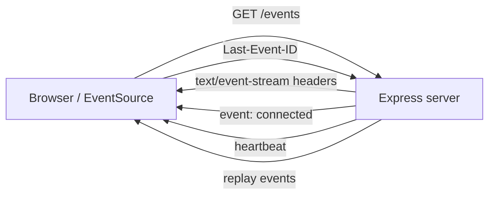

## Overview

Server-Sent Events (SSE) let the server push text events to the browser over one
long-lived HTTP connection. It's a one-way channel over plain HTTP, so it works
with whatever auth, load balancers, and proxies you already have running.

I reach for SSE when the traffic is mostly server → client and I don't want to
add WebSocket infrastructure just to push a few updates. In a Node.js and
Express app, the recipe is small: set the right headers, keep the socket open,
and write lines in `text/event-stream` format. The browser's `EventSource` API
handles reconnection automatically and sends the `Last-Event-ID` header so the
server can resume the stream.

This recipe gives you an Express endpoint, a browser client, a safe broadcast
helper that handles backpressure, and a few production notes I wish I had when I
first deployed SSE behind nginx. The kind of notes that would've saved me a
weekend of debugging proxy timeouts. If you want the protocol basics first, check
[Server-Sent Events](/recipes/server-sent-events/); for bidirectional chat, see
[WebSocket Bidirectional Chat](/recipes/websocket-bidirectional-chat/).

## When to Use

Reach for SSE when:

- You need live dashboards, activity feeds, or notifications from server to
  client. I use it for progress bars on long jobs — the browser just listens, so
  I don't need a full WebSocket setup.
- Traffic mostly flows from server to client and clients just listen. Think
  stock tickers, sports scores, or log tails.
- You'd rather reuse your HTTP stack than add WebSocket infrastructure. SSE
  passes through most corporate proxies and CDNs without protocol upgrades.
- Your messages are small and text-only, so binary payloads aren't needed.

### When to avoid

- The flow is genuinely bidirectional or binary. Use WebSockets
  instead.
- Clients need to send frequent messages back to the server. SSE is
  server-to-client only.
- Your deployment blocks long-lived HTTP connections. Some proxies or firewalls
  drop idle sockets unless heartbeats and timeouts are aligned.

## Solution

### Express SSE endpoint

```typescript
// sse/server.ts
import express, { Request, Response } from 'express';
import { randomUUID } from 'crypto';

const app = express();

interface Client {
  id: string;
  response: Response;
}

const clients = new Map<string, Client>();

function addClient(res: Response): string {
  const id = randomUUID();

  res.writeHead(200, {
    'Content-Type': 'text/event-stream',
    'Cache-Control': 'no-cache',
    'Connection': 'keep-alive',
    'X-Accel-Buffering': 'no',
  });

  res.write(
    `event: connected\nid: ${id}\ndata: ${JSON.stringify({ clientId: id })}\n\n`
  );

  clients.set(id, { id, response: res });

  res.on('close', () => {
    clients.delete(id);
  });

  return id;
}

app.get('/events', (req: Request, res: Response) => {
  const lastEventId = req.headers['last-event-id'] as string | undefined;
  const clientId = addClient(res);

  if (lastEventId) {
    replayEvents(clientId, lastEventId);
  }
});

// Replace this with a bounded buffer or persistent store
function replayEvents(clientId: string, lastEventId: string) {
  // Send missed events to the client
}

const PORT = 3000;
app.listen(PORT, () => console.log(`SSE server on port ${PORT}`));
```

The headers matter more than you'd think. `Content-Type: text/event-stream`
tells the browser the response is an event stream. `Cache-Control: no-cache`
stops proxies from buffering, and `X-Accel-Buffering: no` does the same for
nginx. I also set `Connection: keep-alive` as a reminder to the next person
reading the code, even though HTTP/1.1 keeps connections alive by default.
Skipping it won't break anything, but leaving it in saves a future engineer a
debugging session.

### Broadcasting events with backpressure

```typescript
function broadcast(event: string, data: unknown) {
  const payload = `event: ${event}\ndata: ${JSON.stringify(data)}\n\n`;

  clients.forEach((client) => {
    const flushed = client.response.write(payload);

    if (!flushed) {
      client.response.once('drain', () => {
        // buffer cleared; writes can continue
      });
    }
  });
}

// Heartbeat every 30 seconds to keep connections alive
setInterval(() => {
  broadcast('heartbeat', { ts: Date.now() });
}, 30000);
```

`response.write` returns `false` once Node's internal buffer is full. The
client is falling behind. In the snippet above I listen for `drain` and wait,
but in production I usually disconnect clients that stay behind for too long,
because an unbounded queue of pending messages will eat memory. A slow
consumer on a mobile connection can stall your whole broadcast loop if you
let it queue up.

### Client with auto-reconnect

```typescript
// client/sse.ts
let attempts = 0;
let reconnectTimer: ReturnType<typeof setTimeout> | null = null;

function connect() {
  const source = new EventSource('/events');

  source.addEventListener('connected', (e) => {
    attempts = 0;
    const { clientId } = JSON.parse(e.data);
    console.log('connected as', clientId);
  });

  source.addEventListener('notification', (e) => {
    const data = JSON.parse(e.data);
    showToast(data.message);
  });

  source.onerror = () => {
    source.close();

    if (reconnectTimer) return;

    const delay = Math.min(1000 * 2 ** attempts, 30000);
    attempts += 1;

    reconnectTimer = setTimeout(() => {
      reconnectTimer = null;
      connect();
    }, delay);
  };
}

connect();
```

The browser already reconnects automatically, but the manual retry loop gives
you control over the backoff cap and lets you reset the attempt counter on a
successful `connected` event. I cap the delay at 30 seconds because a bad
network shouldn't leave the user waiting minutes between retries — without the
cap, the exponential backoff hits 17 minutes by attempt 10, which nobody is
going to sit through.

### Handling named events and `retry`

Production clients usually listen to more than one event type. I set a `retry`
value in milliseconds so the browser pauses before reconnecting. Here is the
helper I use:

```typescript
function sendNotification(res: Response, event: string, data: unknown, retry = 2000) {
  res.write(`event: ${event}\n`);
  res.write(`data: ${JSON.stringify(data)}\n`);
  res.write(`retry: ${retry}\n\n`);
}
```

On the client, `addEventListener('order-update', ...)` only fires for messages
whose `event:` field matches. I find that cleaner than burying the event type
inside the JSON payload, because then the browser does the filtering for you
instead of your code having to inspect every message and route it by hand.

### Testing the stream with curl

Before wiring the browser, I verify the endpoint with curl:

```bash
curl -N -H "Accept: text/event-stream" http://localhost:3000/events
```

The `-N` flag disables output buffering so you see events as they arrive
instead of getting a delayed chunk. If you don't see the `connected` event
right away, the headers or the response format are probably wrong — I usually
check the response headers with `curl -I` first to confirm
`Content-Type: text/event-stream` is actually set before chasing anything
deeper.

### CORS and authentication

`EventSource` doesn't let you set custom headers, so you can't send a plain
`Authorization` bearer token. When I need to lock the stream down, I've got three
options.

Cookies work when the browser page and the API share the same origin. The
browser sends them on its own. A query token is a short-lived value in the
URL, but it can leak into server logs and browser history. A manual `fetch`
stream gives you full header control, though you've got to re-implement
reconnection yourself. I only go down the `fetch` path when I need
`Authorization` headers and cookies aren't an option.

For CORS, I use Express's `cors` middleware and allow the specific origin:

```typescript
import cors from 'cors';

app.use(cors({ origin: 'https://app.example.com', credentials: true }));
```

That config lets the browser connect from a different origin while keeping
credentials enabled. I always pin the origin rather than using `*` — wildcard
CORS with credentials is a security hole.

### Deployment behind nginx

Nginx is the most common place where SSE breaks. The default config tries to
buffer the response, which turns a live stream into a delayed batch. I always
add this to the location block, and I mean always — I've spent too many hours
debugging "events arrive in chunks" only to find `proxy_buffering` was still on.

```nginx
location /events {
  proxy_pass http://localhost:3000;
  proxy_http_version 1.1;
  proxy_set_header Connection '';
  proxy_buffering off;
  proxy_cache off;
  proxy_read_timeout 86400s;
  proxy_send_timeout 86400s;
}
```

Without `proxy_buffering off`, the client won't see events until the buffer
fills up, which kind of defeats the point of a live stream. `proxy_read_timeout`
must be larger than your heartbeat interval, or nginx closes the socket between
heartbeats and you're back to debugging silent disconnects. I set it to 86400s
(24 hours) so the socket stays open for the full session — anything shorter and
you're racing your own heartbeat.

### Scaling past one server

Add a second process and each server only sees the clients connected to it. I
usually put a Redis pub/sub channel in front of the broadcast function.
Each Node instance subscribes to the channel and forwards messages to its local
clients. This is the pattern I reach for once SSE traffic grows beyond a single
process.

```typescript
import { createClient } from 'redis';

const redis = createClient({ url: process.env.REDIS_URL });
const subscriber = redis.duplicate();

subscriber.subscribe('sse:events', (message) => {
  const { event, data } = JSON.parse(message);
  broadcast(event, data);
});

async function publishEvent(event: string, data: unknown) {
  await redis.publish('sse:events', JSON.stringify({ event, data }));
}
```

If you run two or more instances behind a load balancer, use sticky sessions so
a reconnecting client lands on the same server. Otherwise the `Last-Event-ID`
header may reach a node that doesn't have that client's history, and you'll
replay events the client already saw — which is worse than dropping them,
because duplicate events are a real bug in UI code that dedupes by `id`.

## Explanation

SSE reuses a normal HTTP response, which is the whole appeal — no protocol
upgrade, no special infrastructure. The server keeps the socket open and writes
lines in `text/event-stream` format. Events carry `event:`, `data:`, `id:`, and
`retry:` fields. The browser's `EventSource` API handles reconnection on its own
and sends back the `Last-Event-ID` header so you can resume the stream without
losing anything.



The protocol is text-only, so any JSON you send gets encoded inside the `data:`
field as a string. Heartbeats keep the connection alive so proxies don't close
idle sockets — I've seen corporate firewalls kill connections after 60 seconds
of silence. The `Last-Event-ID` header lets the server resume from where the
client left off, which is what makes SSE feel reliable even on flaky networks.

Backpressure shows up when a client falls behind the stream of events. `response.write` returns
`false` the moment Node's internal buffer is full. After that, wait for the
`drain` event before writing again, or disconnect clients that stay behind. I
tend to disconnect slow consumers after a few seconds of backpressure, because
keeping them in memory hurts the rest of the cluster. The math is simple — one
stalled client at 100 events/sec means 6000 queued messages after a minute.

The `id` field is optional, but it makes reconnections much easier — I'd add it
even on streams where you don't think you need it. The browser stores the last
`id` it received and sends it as `Last-Event-ID` on reconnect. That means you
can resume a stream without the client losing messages, as long as the server
keeps a bounded event history. I keep the last 100 to 500 events in memory or
in Redis, depending on payload size; anything bigger than that and you're
better off with a persistent log.

## Variants

| Approach | Best for | Notes |
| --- | --- | --- |
| Native `EventSource` | Modern browsers | Auto-reconnect, `Last-Event-ID`, no polling |
| Manual `fetch` + `ReadableStream` | Custom headers or POST auth | More control, more code |
| `eventsource` npm package | Node clients or older browsers | Same API, works outside the browser |
| `better-sse` or `sse-channel` | Production Express | Handles rooms, heartbeat, and cleanup |

If you need the same client to receive different event types, `better-sse` gives
you channels and rooms without writing the registry yourself. For simple
one-to-one streams, the manual approach in this recipe is enough — I'd reach
for `better-sse` once you've got more than three event types or need per-room
filtering, because at that point the hand-rolled version grows into its own
mini-framework anyway.

## Best Practices

- Set the `X-Accel-Buffering: no` header so nginx and other proxies don't buffer
  the stream. I also set `Cache-Control: no-cache` and turn off `proxy_buffering`
  in nginx — these three together cover 90% of "SSE doesn't work in production" tickets.
- Send a heartbeat every 15–30 seconds to avoid proxy and firewall timeouts. I
  emit a simple `heartbeat` event with an empty `data` field — anything longer
  than 30s risks getting cut off by corporate firewalls.
- Use `Last-Event-ID` to resume after reconnections; store a bounded event
  history. A ring buffer of the last 100 events is usually enough for dashboards.
- Remove clients on `close` or `error`; otherwise they leak memory. Node won't
  close the response for you. I've seen production servers bleed memory for days
  because of this.
- Limit open connections and the message rate for each client. Rate limiting
  matters if clients can trigger a lot of events.
- Use `res.write` backpressure signals; don't buffer unbounded messages. When
  the kernel buffer is full, decide between waiting and disconnecting.
- Test behind your real proxy before going live, because local `curl` can lie
  when there's no buffering. I always do a final test through nginx before
  shipping.

## Common Mistakes

- Forgetting heartbeats and then wondering why connections drop silently. The
  proxy timeout is almost always the culprit. I debugged this for two hours once
  before realizing the corporate firewall had a 60s idle timeout.
- Broadcasting big payloads without checking the return value of `response.write`.
  That's how you fill the Node buffer and slow down the event loop for everyone.
- Keeping the full event history in memory instead of a bounded buffer or
  persistent log. Memory grows with every reconnected client until the process
  OOMs.
- Opening many `EventSource` instances per page. Browsers cap connections per
  origin at about six per domain when using HTTP/1.1. Open one and multiplex.
- Sending binary data or expecting the client to post data back over the same
  connection. SSE is one-way text; use WebSockets for the other cases.
- Reusing `Last-Event-ID` across two or more servers without shared state. The
  client may reconnect to a different process that hasn't seen that `id`, and
  you'll either replay or skip events.

## See Also

- [Server-Sent Events](/recipes/server-sent-events/) — the protocol and
  multi-language overview.
- [WebSocket Bidirectional Chat](/recipes/websocket-bidirectional-chat/) — for
  two-way real-time communication.
- [Publish-Subscribe Pattern](/patterns/publish-subscribe-pattern/) — the
  architectural pattern behind fan-out.
- MDN [EventSource](https://developer.mozilla.org/en-US/docs/Web/API/EventSource)
  reference.
- HTML Living Standard [Server-Sent Events](https://html.spec.whatwg.org/multipage/server-sent-events.html).
- The Node.js [http](https://nodejs.org/api/http.html) and
  [stream](https://nodejs.org/api/stream.html) docs, for the underlying APIs.
- [Runnable companion repo](https://mathiaspaulenko.github.io/stack-practices-resources/) —
  Express server + browser client ready to run.

## FAQ

### Can I send binary data over SSE?

No. SSE is text-only, so you'd have to encode binary as Base64 or switch to
WebSockets for true binary streams. Base64 adds about a 33 % size overhead,
which is fine for small icons but not for video. I learned this the hard way
trying to push thumbnails over SSE — the encoding overhead doubled the payload
and the client had to decode every frame, which killed the whole point of
streaming.

### How many concurrent SSE connections can one Node.js process handle?

Thousands, limited by memory and OS file descriptors. Every connection costs a
small heap allocation plus one socket, and those add up faster than you'd
expect. Use clustering or a load balancer with sticky sessions for horizontal
scaling. The number depends on payload size and heartbeat cadence, but a single
process can usually hold tens of thousands of idle connections. I've
benchmarked around 12k idle connections on a 1 GB VM before memory pressure
kicked in — past that, you really want a cluster or a managed LB in front.

### Does SSE work through a load balancer?

Yes, provided the balancer supports long-lived HTTP and sticky sessions once
you scale past one server. Disable response buffering and set idle timeouts
high enough that they don't trip on your heartbeat interval. Without sticky
sessions, a reconnect may land on a different process and miss events. I've
seen this break with AWS ALB in round-robin mode — switching to
least-outstanding-requests fixed it, but only after we noticed duplicate
events in the client logs.

### How do I authenticate SSE clients?

Pass a token in the URL query, a cookie, or use `fetch` with manual stream
parsing so you can send custom headers. Plain `EventSource` can't set
`Authorization` headers, which is annoying but workable. Cookies work best when
the browser and the API share the same origin; otherwise you're stuck with the
query-token approach or the manual `fetch` stream.

### What if the client disconnects and reconnects?

Add `id:` fields to events and read the `Last-Event-ID` header on the server.
Replay missed events from a bounded in-memory queue or a persistent store like
Redis. Keep the history bounded, or memory will keep growing every time a
client reconnects. I cap the replay buffer at 500 events and evict oldest-first
— anything beyond that and you're really building a message broker, not an SSE
endpoint.
