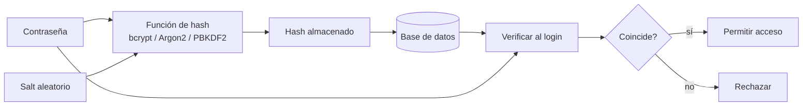

## Visión General

Las contraseñas son un riesgo desde el momento en que las almacenás. Si un
atacante consigue una copia de tu base de datos, el texto plano o hashes
rápidos como SHA-256 le permiten probar millones de intentos por segundo. Yo uso
hashing de contraseñas cada vez que armo un formulario de login o una API que
acepta credenciales de usuario, porque convierte la contraseña en una cadena
lenta e irreversible con un salt único. Así una base de datos filtrada sigue
siendo cara de romper.

El hashing de contraseñas no es lo mismo que la encriptación. La encriptación se
puede revertir si se filtra la clave, mientras que un hash debería ser una
función de un solo sentido. Los tres algoritmos que suelo elegir son bcrypt,
Argon2 y PBKDF2. Cada uno dificulta la fuerza bruta agregando un factor de
trabajo y un salt, pero obtienen esa lentitud de distintas maneras. Esa
diferencia importa cuando elijo hardware, paso una auditoría o migro un sistema
heredado.

Más abajo hay ejemplos para hashear y verificar contraseñas en Python,
JavaScript y Java con los tres algoritmos. También tengo un companion ejecutable
en el
[repositorio stack-practices-resources](https://github.com/MathiasPaulenko/stack-practices-resources/tree/main/resources/recipes/authentication/password-hashing)
por si querés hacer benchmark en tu propio hardware.

## Cuándo Usarlo

Usá hashing de contraseñas cuando:

- Almacenás credenciales de usuario con nombre de usuario y contraseña. Mirá
[Session Management](/recipes/session-management/) y
[JWT Authentication](/recipes/jwt-authentication/) para el flujo de sesiones y
tokens.
- Estás migrando desde MD5, SHA-1 o SHA-256 plano para almacenar contraseñas.
- Necesitás verificación de login o reset de contraseña en una web app, API o
herramienta CLI.
- Tu marco de compliance (PCI-DSS, SOC 2, GDPR, NIST) exige proteger
credenciales. Consultá el
[Checklist de Seguridad de APIs](/guides/api-security-checklist-guide/)
para controles relacionados.

### Cuándo evitarlo

- El sistema no tiene usuarios humanos (tráfico machine-to-machine). Las claves
de API u OAuth2 encajan mejor ahí.
- Solo necesitás un token de un solo uso, no un hash de contraseña almacenado.
- Te tentó armar tu propio esquema de hashing. Usá una biblioteca probada.

## Solución

### bcrypt

#### Python con bcrypt

```python
import bcrypt

password = b"supersecret"
salt = bcrypt.gensalt(rounds=12)
hashed = bcrypt.hashpw(password, salt)

if bcrypt.checkpw(password, hashed):
    print("ok")
```

#### JavaScript (Node.js) con bcrypt

```javascript
const bcrypt = require('bcrypt');

async function hashPassword(password) {
  return bcrypt.hash(password, 12);
}

async function verifyPassword(password, hash) {
  return bcrypt.compare(password, hash);
}

hashPassword('supersecret')
  .then(hash => verifyPassword('supersecret', hash))
  .then(ok => console.log(ok));
```

#### Java con BCryptPasswordEncoder

```java
import org.springframework.security.crypto.bcrypt.BCryptPasswordEncoder;

BCryptPasswordEncoder encoder = new BCryptPasswordEncoder(12);
String hashed = encoder.encode("supersecret");
boolean ok = encoder.matches("supersecret", hashed);
```

### Argon2

#### Python con Argon2

```python
from argon2 import PasswordHasher

ph = PasswordHasher(time_cost=3, memory_cost=65536, parallelism=1)
hash = ph.hash("supersecret")
ph.verify(hash, "supersecret")
```

#### JavaScript (Node.js) con Argon2

```javascript
const argon2 = require('argon2');

async function hashPassword(password) {
  return argon2.hash(password, {
    type: argon2.argon2id,
    memoryCost: 65536,
    timeCost: 3,
    parallelism: 1
  });
}

async function verifyPassword(hash, password) {
  return argon2.verify(hash, password);
}

hashPassword('supersecret')
  .then(hash => verifyPassword(hash, 'supersecret'))
  .then(ok => console.log(ok));
```

#### Java con argon2-jvm

```java
import de.mkammerer.argon2.Argon2;
import de.mkammerer.argon2.Argon2Factory;

public class Argon2Hash {
    public static void main(String[] args) {
        Argon2 argon2 = Argon2Factory.create(Argon2Factory.Argon2Types.ARGON2id);
        char[] password = "supersecret".toCharArray();
        String hash = argon2.hash(3, 65536, 1, password);
        System.out.println(argon2.verify(hash, password));
        argon2.wipeArray(password);
    }
}
```

### PBKDF2

#### Python con PBKDF2

```python
import hashlib, secrets, hmac

password = b"supersecret"
salt = secrets.token_bytes(16)
iterations = 600_000
key = hashlib.pbkdf2_hmac("sha256", password, salt, iterations, dklen=32)
stored = f"pbkdf2_sha256${iterations}${salt.hex()}${key.hex()}"

def verify(stored, password):
    _, iters, salt_hex, hash_hex = stored.split("$")
    salt = bytes.fromhex(salt_hex)
    expected = bytes.fromhex(hash_hex)
    derived = hashlib.pbkdf2_hmac(
        "sha256", password, salt, int(iters), dklen=len(expected)
    )
    return hmac.compare_digest(derived, expected)

print(verify(stored, password))
```

#### JavaScript (Node.js) con PBKDF2

```javascript
const crypto = require('crypto');

const ITERATIONS = 600_000;
const KEYLEN = 32;
const DIGEST = 'sha256';

function hashPassword(password) {
  const salt = crypto.randomBytes(16);
  const key = crypto.pbkdf2Sync(password, salt, ITERATIONS, KEYLEN, DIGEST);
  return `pbkdf2_sha256$${ITERATIONS}$${salt.toString('hex')}$${key.toString('hex')}`;
}

function verifyPassword(stored, password) {
  const [_, iters, saltHex, hashHex] = stored.split('$');
  const salt = Buffer.from(saltHex, 'hex');
  const expected = Buffer.from(hashHex, 'hex');
  const derived = crypto.pbkdf2Sync(password, salt, parseInt(iters, 10), expected.length, DIGEST);
  return crypto.timingSafeEqual(derived, expected);
}

const stored = hashPassword('supersecret');
console.log(verifyPassword(stored, 'supersecret'));
```

#### Java con PBKDF2

```java
import javax.crypto.SecretKeyFactory;
import javax.crypto.spec.PBEKeySpec;
import java.security.SecureRandom;
import java.security.spec.KeySpec;

public class PBKDF2Hash {
    public static void main(String[] args) throws Exception {
        String password = "supersecret";
        byte[] salt = new byte[16];
        new SecureRandom().nextBytes(salt);

        int iterations = 600_000;
        KeySpec spec = new PBEKeySpec(password.toCharArray(), salt, iterations, 256);
        SecretKeyFactory factory = SecretKeyFactory.getInstance("PBKDF2WithHmacSHA256");
        byte[] hash = factory.generateSecret(spec).getEncoded();

        String stored = "pbkdf2_sha256$" + iterations + "$" + base16(salt) + "$" + base16(hash);
        System.out.println(stored);
    }

    private static String base16(byte[] bytes) {
        StringBuilder sb = new StringBuilder();
        for (byte b : bytes) sb.append(String.format("%02x", b));
        return sb.toString();
    }
}
```

## Explicación



Pienso en el hashing de contraseñas como una puerta de un solo sentido
deliberadamente lenta. Los tres algoritmos que uso son lentos, pero obtienen esa
lentitud de distintas maneras. Esa diferencia importa cuando elijo hardware, paso
una auditoría o migro un sistema heredado.

### Cómo funciona bcrypt

bcrypt se construye sobre el cifrado Blowfish. Ejecuta el algoritmo de
configuración EksBlowfish con un salt de 128 bits y un factor de trabajo que es
una potencia de dos. El factor de trabajo indica cuántas rondas de
programación de claves ejecutar; un valor de 12 significa 2^12 = 4.096 rondas.
El output es un solo string que embebe el identificador de algoritmo, el costo,
el salt y el hash, usualmente empezando con `$2a$`, `$2b$`, `$2y$` o `$2id$`
según la implementación. Yo suelo empezar con costo 12 y hago benchmark en el
hardware de producción que voy a usar. En una CPU de servidor moderna eso da
unos 200–300 ms, lo cual está bien para una llamada de login.

El trade-off principal de bcrypt es que no es memory-hard. Las GPU y ASIC todavía
pueden atacarlo, pero cada intento es lo suficientemente caro como para que un
cracking offline sea mucho más lento que con un hash rápido. El límite de 72
bytes es real: si permitís passphrases más largas, bcrypt ignora todo lo que
esté después del byte 72. Yo evito eso limitando la longitud de la contraseña o
pre-hasheando con SHA-256 solo cuando no hay otra opción.

### Cómo funciona Argon2

Argon2 ganó el [Password Hashing Competition](https://password-hashing.net/) en
2015 y hoy es la recomendación de OWASP y NIST para sistemas nuevos. Es
memory-hard: llena una matriz de memoria grande y luego la reordena en función de
la contraseña. Un atacante necesita tanto tiempo de CPU como RAM para cada
intento, lo que encarece mucho las granjas de GPU y ASIC.

Argon2 tiene tres variantes. Argon2d es más rápido y resiste cracking con GPU,
pero es vulnerable a ataques de side-channel porque usa la contraseña para
indexar memoria. Argon2i es más lento pero resiste fugas de side-channel porque
usa direcciones independientes. Yo uso **Argon2id**, que mezcla ambos enfoques y
es el default actual de la
[OWASP Password Storage Cheat Sheet](https://cheatsheetseries.owasp.org/cheatsheets/Password_Storage_Cheat_Sheet.html).
Normalmente configuro `memoryCost` en 64 MB (65.536 KB), `timeCost` en 3 y
`parallelism` en 1. En mis máquinas de prueba eso da unos 100–250 ms por hash,
pero el número depende mucho de la RAM disponible.

El trade-off principal es el soporte de bibliotecas. En Python y Node.js las
bibliotecas son maduras, pero en Java necesitás argon2-jvm o una versión reciente
de Spring Security. Si no puedo controlar el classpath, prefiero volver a bcrypt
antes que inventar mi propio wrapper de Argon2.

### Cómo funciona PBKDF2

PBKDF2 es el más antiguo de los tres y el que uso cuando el compliance lo
exige. Es parte de la
[NIST SP 800-63B sección 5.1.1.2](https://pages.nist.gov/800-63-3/sp800-63b.html#memorizedsecret)
y suele encontrarse en módulos validados FIPS-140. Toma una contraseña, un salt,
una cantidad de iteraciones y una longitud de clave, y aplica HMAC-SHA-256 (u
otro PRF) repetidamente hasta alcanzar el trabajo deseado.
OWASP recomienda actualmente 600.000 iteraciones para PBKDF2-HMAC-SHA-256.

El trade-off es que PBKDF2 es CPU-bound, no memory-hard. Encaja bien en
ambientes con recursos limitados, pero un atacante puede ejecutar muchos intentos
en paralelo en GPUs baratas. Yo lo prefiero sobre Argon2 solo cuando un auditor
o un estándar lo pide explícitamente. Cuando lo uso, nunca almaceno el salt y el
hash por separado; guardo un solo string separado por `$` y verifico con una
comparación en tiempo constante.

### Factor de trabajo y benchmarks

El factor de trabajo es el dial que controla qué tan lento es el hash. Yo lo
ajusto para que un solo hash tarde 100–250 ms en la CPU de producción más lenta
que lo vaya a ejecutar. Para un login ese retraso es imperceptible para el
usuario, pero hace que un ataque de fuerza bruta offline sea millones de veces
más lento que SHA-256. Vuelvo a hacer benchmark una vez al año porque los CPUs
mejoran; lo que era seguro en 2023 puede ser demasiado barato de romper en 2026.

No uso los mismos parámetros para los tres algoritmos. Un costo de 12 para
bcrypt, un `memoryCost` de 64 MB con `timeCost` de 3 para Argon2id, y PBKDF2 con
600.000 iteraciones son los puntos de partida que uso. Los milisegundos exactos
dependen del hardware, el ancho de banda de memoria y la versión de la
biblioteca, así que siempre mido en el servidor de destino antes de publicar.

### Migración paso a paso

Si estás leyendo esto porque tu base de datos todavía tiene hashes MD5 o SHA-1,
este es el patrón de migración que uso:

1. **Etiquetá cada cuenta con su algoritmo actual.** Una columna como
`hash_algorithm` o un prefijo en el hash almacenado es suficiente.
2. **En el próximo login exitoso, verificá la contraseña contra el hash viejo.**
Si coincide, re-hasheá inmediatamente con el nuevo algoritmo y actualizá el
valor almacenado.
3. **Marcá la cuenta como migrada** para no volver a hashearla en el próximo
login.
4. **Devolvé éxito o fracaso genérico** sin importar el estado de migración. No
filtres si una cuenta usa el hash viejo o nuevo.
5. **Para cuentas que nunca loguean, forzá un reset de contraseña** y guardá el
nuevo hash después del reset.
6. **Eliminá el código viejo solo cuando la columna de migración muestre que
todas las cuentas activas se convirtieron.**

Este enfoque permite que los usuarios no reseteen todas sus contraseñas al mismo
tiempo, y evitás el riesgo de hashear dos veces o perder el salt.

## Variantes

Los tres algoritmos se diferencian en criterios prácticos que resume la tabla.

| Algoritmo | Cuándo elegirlo | Memoria típica | Tiempo orientativo | Compromiso | Cuándo migrar |
| --- | --- | --- | --- | --- | --- |
| bcrypt | Default, amplio soporte de bibliotecas | Unos pocos KB | ~200–300 ms con costo 12 (varía por CPU) | Uso moderado de memoria, no es memory-hard | Quédate salvo que necesites la resistencia memory-hard de Argon2id |
| Argon2id | Aplicaciones nuevas, máxima resistencia a ataques por GPU/ASIC | ~64 MB (65.536 KB) | ~100–250 ms con t=3, m=65.536, p=1 | Requiere biblioteca dedicada, es memory-hard | Migrá desde bcrypt/PBKDF2 al reescribir auth o si el compliance lo permite |
| PBKDF2 | Requisitos de compliance NIST/FIPS | Unos pocos KB | ~200–400 ms con 600.000 iteraciones SHA-256 | CPU-bound, favorece GPU por intento | Migrá a Argon2id si no hay mandato FIPS |

## Mejores Prácticas

- Hasheá del lado del servidor; nunca confíes en un hash enviado por el cliente.
El hashing cliente-servidor puede eludirse enviando un valor precomputado.
- Usá un salt aleatorio distinto para cada contraseña. Las bibliotecas lo hacen
automáticamente, pero verificá que no estés reutilizando ni hard-codeando un
salt.
- Elegí un factor de trabajo que tarde 100–250 ms en tu hardware de producción,
y volvé a hacer benchmark cada año. Lento es el objetivo.
- Almacená el string de hash completo, incluyendo el identificador de algoritmo,
costo, salt y hash. No lo dividas en columnas separadas.
- Re-hasheá en el login cuando el factor de trabajo o algoritmo esté
desactualizado. Marcá la cuenta como migrada para no hashear dos veces.
- Devolvé errores genéricos para usuario o contraseña inválidos. Si el tiempo o
el mensaje difieren, filtran si la cuenta existe.
- Usá una comparación en tiempo constante para verificar. No uses `==` sobre los
bytes crudos.

## Errores Comunes

- Usar SHA-256, MD5 o SHA-1 para hashear contraseñas. Están diseñados para ser
rápidos; una GPU moderna puede probar miles de millones por segundo.
- Almacenar contraseñas en texto plano o encriptación reversible. Una filtración
de clave expone todas las contraseñas.
- Hard-codear un salt en el código fuente. Es tan malo como no usar salt si el
repositorio se hace público.
- Reutilizar el mismo salt entre usuarios. Las contraseñas idénticas generan
hashes idénticos.
- Usar factores de trabajo menores a 10 para bcrypt o menos de 600.000
iteraciones para PBKDF2. Los atacantes pueden seguir el ritmo.
- Comparar hashes con `==` en lugar de la función verify de la biblioteca. Los
ataques de timing pueden filtrar prefijos del hash.
- Hashear después de normalizar con `lower()` o `trim()`. Algunas passphrases
dependen de mayúsculas y espacios.
- Dejar que bcrypt corte a 72 bytes. bcrypt ignora los bytes después de 72, así
que dos contraseñas largas con el mismo prefijo coincidirían. Pre-hasheá con
SHA-256 solo si realmente necesitás permitir contraseñas más largas.

## Preguntas Frecuentes

### ¿Debería usar SHA-256 para contraseñas?

No. SHA-256 es rápido y no está diseñado para resistir fuerza bruta. Usá bcrypt,
Argon2id o PBKDF2.

### ¿Cómo migro usuarios de hashes MD5 o SHA-1?

Re-hasheá el hash existente con bcrypt o Argon2id en el próximo login exitoso, y
luego reemplazá el valor almacenado. Marcá la cuenta para no volver a hashearla.
Para usuarios que nunca loguean, forzá un reset de contraseña. El paso a paso
está en la sección de migración de arriba.

### ¿Qué factor de costo de bcrypt debería usar?

Empezá con 12. Hacé benchmark en tu hardware de producción para que el hashing
tarde unos 250 ms. Vas a tener que volver a subir el costo a medida que los CPUs
mejoran.

### ¿Argon2 es mejor que bcrypt?

Para sistemas nuevos, sí. Argon2id es memory-hard, lo que encarece los ataques
con GPU y ASIC. bcrypt sigue siendo seguro y más ampliamente soportado. Yo
prefiero Argon2id si puedo usar una biblioteca moderna.

### ¿Puedo usar un hash de contraseña como token de API?

No. Los hashes de contraseña son lentos. Los tokens de API necesitan
verificación rápida, como HMAC-SHA-256.

### ¿Debería agregar un pepper a la contraseña?

Un pepper es un secreto del servidor que se agrega antes de hashear. Ayuda si la
base de datos se filtra sin el secreto de la aplicación, pero complica la
rotación y el manejo de claves. Es un extra opcional, no un reemplazo de un
algoritmo fuerte.

### ¿Cómo elijo entre bcrypt, Argon2id y PBKDF2?

Yo elijo bcrypt para llegar rápido a un default seguro, Argon2id cuando quiero
la mayor resistencia memory-hard y puedo manejar la dependencia, y PBKDF2 solo
cuando un estándar de compliance o un auditor lo exige.

## Ver También

- [Hash Passwords with Argon2](/recipes/hash-passwords-argon2/) — para cuando ya
decidiste usar Argon2id y necesitás afinar los parámetros.
- [Password Hashing in Production](/recipes/password-hashing-production/) — una
mirada más amplia a decisiones operativas como rate limiting, hashing como
servicio y threat modeling.
