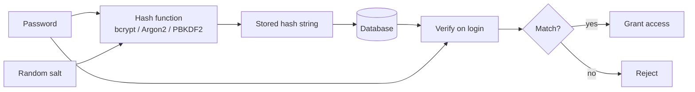

## Overview

Passwords become a liability the moment you store them. If an attacker gets a
copy of your database, plaintext or fast hashes like SHA-256 let them try
millions of guesses per second. I add password hashing whenever I build a login form or an API that accepts user
credentials, because it turns a password into a slow, irreversible string with a
unique salt. A leaked database is still
costly to crack.

Hashing and encryption are different things. Encryption can be reversed if
the key leaks, while a hash should be a one-way function. The three algorithms I
reach for are bcrypt, Argon2, and PBKDF2. Each one makes brute force harder by
adding a work factor and a salt, but they get that slowness from different
places. That difference matters when I pick hardware, pass an audit, or migrate a
legacy system.

I’ve put hash-and-verify examples in Python, JavaScript, and Java below,
using all three algorithms. I also keep a runnable companion in the
[stack-practices-resources repository](https://github.com/MathiasPaulenko/stack-practices-resources/tree/main/resources/recipes/authentication/password-hashing)
if you want to benchmark them on your own hardware.

## When to Use

I reach for password hashing in these cases:

- My users sign in with a username and a password. The surrounding session and
token flow is covered in [Session Management](/recipes/session-management/) and
[JWT Authentication](/recipes/jwt-authentication/).
- I’m migrating away from MD5, SHA-1, or plain SHA-256 password storage.
- I need login or password-reset verification in a web app, API, or CLI tool.
- My compliance framework (PCI-DSS, SOC 2, GDPR, NIST) requires protected
credentials. For broader controls, I keep the
[API Security Checklist](/guides/api-security-checklist-guide/) handy.

### When to avoid

- The system has no human users (machine-to-machine traffic), so I switch to API
keys or OAuth2 there.
- If you need a one-time token, a stored password hash is the wrong tool.
- You want to write your own hash function. Don’t do it. Use a library instead.

## Solution

### bcrypt

#### Python with bcrypt

```python
import bcrypt

password = b"supersecret"
salt = bcrypt.gensalt(rounds=12)
hashed = bcrypt.hashpw(password, salt)

if bcrypt.checkpw(password, hashed):
    print("ok")
```

#### JavaScript (Node.js) with bcrypt

```javascript
const bcrypt = require('bcrypt');

async function hashPassword(password) {
  return bcrypt.hash(password, 12);
}

async function verifyPassword(password, hash) {
  return bcrypt.compare(password, hash);
}

hashPassword('supersecret')
  .then(hash => verifyPassword('supersecret', hash))
  .then(ok => console.log(ok));
```

#### Java with BCryptPasswordEncoder

```java
import org.springframework.security.crypto.bcrypt.BCryptPasswordEncoder;

BCryptPasswordEncoder encoder = new BCryptPasswordEncoder(12);
String hashed = encoder.encode("supersecret");
boolean ok = encoder.matches("supersecret", hashed);
```

### Argon2

#### Python with Argon2

```python
from argon2 import PasswordHasher

ph = PasswordHasher(time_cost=3, memory_cost=65536, parallelism=1)
hash = ph.hash("supersecret")
ph.verify(hash, "supersecret")
```

#### JavaScript (Node.js) with Argon2

```javascript
const argon2 = require('argon2');

async function hashPassword(password) {
  return argon2.hash(password, {
    type: argon2.argon2id,
    memoryCost: 65536,
    timeCost: 3,
    parallelism: 1
  });
}

async function verifyPassword(hash, password) {
  return argon2.verify(hash, password);
}

hashPassword('supersecret')
  .then(hash => verifyPassword(hash, 'supersecret'))
  .then(ok => console.log(ok));
```

#### Java with argon2-jvm

```java
import de.mkammerer.argon2.Argon2;
import de.mkammerer.argon2.Argon2Factory;

public class Argon2Hash {
    public static void main(String[] args) {
        Argon2 argon2 = Argon2Factory.create(Argon2Factory.Argon2Types.ARGON2id);
        char[] password = "supersecret".toCharArray();
        String hash = argon2.hash(3, 65536, 1, password);
        System.out.println(argon2.verify(hash, password));
        argon2.wipeArray(password);
    }
}
```

### PBKDF2

#### Python with PBKDF2

```python
import hashlib, secrets, hmac

password = b"supersecret"
salt = secrets.token_bytes(16)
iterations = 600_000
key = hashlib.pbkdf2_hmac("sha256", password, salt, iterations, dklen=32)
stored = f"pbkdf2_sha256${iterations}${salt.hex()}${key.hex()}"

def verify(stored, password):
    _, iters, salt_hex, hash_hex = stored.split("$")
    salt = bytes.fromhex(salt_hex)
    expected = bytes.fromhex(hash_hex)
    derived = hashlib.pbkdf2_hmac(
        "sha256", password, salt, int(iters), dklen=len(expected)
    )
    return hmac.compare_digest(derived, expected)

print(verify(stored, password))
```

#### JavaScript (Node.js) with PBKDF2

```javascript
const crypto = require('crypto');

const ITERATIONS = 600_000;
const KEYLEN = 32;
const DIGEST = 'sha256';

function hashPassword(password) {
  const salt = crypto.randomBytes(16);
  const key = crypto.pbkdf2Sync(password, salt, ITERATIONS, KEYLEN, DIGEST);
  return `pbkdf2_sha256$${ITERATIONS}$${salt.toString('hex')}$${key.toString('hex')}`;
}

function verifyPassword(stored, password) {
  const [_, iters, saltHex, hashHex] = stored.split('$');
  const salt = Buffer.from(saltHex, 'hex');
  const expected = Buffer.from(hashHex, 'hex');
  const derived = crypto.pbkdf2Sync(password, salt, parseInt(iters, 10), expected.length, DIGEST);
  return crypto.timingSafeEqual(derived, expected);
}

const stored = hashPassword('supersecret');
console.log(verifyPassword(stored, 'supersecret'));
```

#### Java with PBKDF2

```java
import javax.crypto.SecretKeyFactory;
import javax.crypto.spec.PBEKeySpec;
import java.security.SecureRandom;
import java.security.spec.KeySpec;

public class PBKDF2Hash {
    public static void main(String[] args) throws Exception {
        String password = "supersecret";
        byte[] salt = new byte[16];
        new SecureRandom().nextBytes(salt);

        int iterations = 600_000;
        KeySpec spec = new PBEKeySpec(password.toCharArray(), salt, iterations, 256);
        SecretKeyFactory factory = SecretKeyFactory.getInstance("PBKDF2WithHmacSHA256");
        byte[] hash = factory.generateSecret(spec).getEncoded();

        String stored = "pbkdf2_sha256$" + iterations + "$" + base16(salt) + "$" + base16(hash);
        System.out.println(stored);
    }

    private static String base16(byte[] bytes) {
        StringBuilder sb = new StringBuilder();
        for (byte b : bytes) sb.append(String.format("%02x", b));
        return sb.toString();
    }
}
```

## Explanation



I think of password hashing as a deliberately slow one-way gate. The three
algorithms I use are all slow, but they get that slowness from different places.
That difference shows up when I choose hardware, pass an audit, or migrate a
legacy system.

### How bcrypt works

bcrypt is built around the Blowfish cipher. It runs the EksBlowfish setup
algorithm with a 128-bit salt and a cost factor that’s a power of two. The cost
factor says how many key-schedule rounds to run; a value of 12 means 2^12 =
4,096 rounds. The output is a single string that embeds the algorithm
identifier, the cost, the salt, and the hash, usually starting with `$2a$`,
`$2b$`, `$2y$`, or `$2id$` depending on the implementation. I usually start with
a cost of 12 and benchmark the result on the production hardware I will actually
use. On a modern server CPU that lands in the 200–300 ms range, which is fine
for a login call.

bcrypt’s main trade-off is that it isn’t memory-hard. GPUs and ASICs can
still attack it, but each guess is expensive enough that offline cracking is much
slower than with a fast hash. The 72-byte input limit is real: if you allow
passphrases longer than 72 bytes, anything after the 72nd byte is ignored. I
avoid that by either limiting password length or pre-hashing with SHA-256 only
when there’s no other choice.

### How Argon2 works

Argon2 won the [Password Hashing Competition](https://password-hashing.net/) in
2015 and is now the recommendation of OWASP and NIST for new systems. It’s
memory-hard: it fills a large memory matrix and then reorders it based on the
password. An attacker needs both CPU time and RAM for each guess, which makes
GPU and ASIC farms far more expensive.

Argon2 has three variants. Argon2d is faster and resists GPU cracking, but it’s
vulnerable to side-channel attacks because it uses the password to index memory.
Argon2i is slower but resists side-channel leaks because it picks memory
locations that don’t depend on the password. I use **Argon2id**, which mixes both approaches and is the current
default in the
[OWASP Password Storage Cheat Sheet](https://cheatsheetseries.owasp.org/cheatsheets/Password_Storage_Cheat_Sheet.html).
I normally set `memoryCost` to 64 MB (65,536 KB), `timeCost` to 3, and
`parallelism` to 1. On my test machines that lands at roughly 100–250 ms per
hash, though the number is very sensitive to available RAM.

The biggest trade-off is dependency support. In Python and Node.js the libraries are
mature, but in Java you need to pull in argon2-jvm or a recent Spring Security
release. If I can’t control the classpath, I fall back to bcrypt rather than
invent my own Argon2 wrapper.

### How PBKDF2 works

PBKDF2 is the oldest of the three and the one I use when compliance requires it.
It’s part of
[NIST SP 800-63B section 5.1.1.2](https://pages.nist.gov/800-63-3/sp800-63b.html#memorizedsecret)
and is often found in FIPS-140 validated modules. You give it a password, a salt,
an iteration count, and a key length, and it runs HMAC-SHA-256 in a loop until the
requested work is done.
I follow OWASP’s current guidance of 600,000 iterations for PBKDF2-HMAC-SHA-256.

PBKDF2’s trade-off is that it’s CPU-bound, not memory-hard. It fits well in
constrained environments, but an attacker can run many guesses in parallel on
cheap GPUs. I prefer it over Argon2 only when an auditor or a standard
specifically asks for it. When I do use it, I never store the salt and hash
separately; I keep one dollar-delimited string and verify with a constant-time
comparison.

### Work factor and benchmarks

I treat the work factor as a dial that sets how slow the hash is. I tune it so
that a single hash takes 100–250 ms on the slowest production CPU that will run
it. For login that delay is imperceptible to the user, but it makes an offline
brute-force attack millions of times slower than SHA-256. I re-benchmark once a
year because CPUs get faster; what was safe in 2023 may be too cheap to crack in
2026.

I don’t pick the same parameters for all three algorithms. A bcrypt cost of 12,
an Argon2id memory cost of 64 MB with time cost 3, and PBKDF2 with 600,000
iterations are the starting points I use. The exact time will vary with the hardware, memory bandwidth, and library version
I’m running on, so I always measure on the target server before going live.

### Step-by-step migration

If you’re reading this because your database still has MD5 or SHA-1 hashes,
here is the migration pattern I use:

1. **Tag every account with its current algorithm.** A column such as
`hash_algorithm` or a prefix on the stored hash is enough.
2. **On the next successful login, I verify the password against the old hash; if
it matches, I immediately re-hash with the new algorithm and update the stored
value.**
3. **Mark the account as migrated** right after the first re-hash, so the next
login doesn’t trigger another round of hashing.
4. **Return generic success or failure** regardless of the migration state. Do
not leak whether an account is using the old or new hash.
5. **For accounts that never log in, I force a password reset** and store the new
hash after the reset.
6. **I remove the old code path only after the migration column shows that every
active account has been converted.**

This way users don’t have to reset their passwords all at once, and I avoid the
risk of double-hashing or losing the salt.

## Variants

The table below summarizes the practical criteria that set the three algorithms
apart.

| Algorithm | When to choose | Typical memory | Typical time | Trade-off | When to migrate |
| --- | --- | --- | --- | --- | --- |
| bcrypt | Default, broad library support | A few KB | ~200–300 ms at cost 12 (varies by CPU) | Moderate memory, not memory-hard | Stay unless you need Argon2id's memory hardness |
| Argon2id | New applications, maximum resistance to GPU/ASIC attacks | ~64 MB (65,536 KB) | ~100–250 ms at t=3, m=65,536, p=1 | Needs a dedicated library; memory-hard | Migrate from bcrypt/PBKDF2 when rewriting auth or if compliance allows |
| PBKDF2 | NIST/FIPS compliance requirements | A few KB | ~200–400 ms at 600,000 SHA-256 iterations | CPU-bound, GPU-friendly per guess | Migrate to Argon2id if no FIPS mandate |

## Best Practices

- Hash server-side; I never trust a client-sent hash. Client-side hashing can be
bypassed by sending a pre-computed value.
- I give every password its own random salt. Libraries generate this
automatically, but verify that you aren’t reusing one or hard-coding it.
- Set the work factor so hashing takes 100–250ms on your production hardware, and
re-benchmark it once a year. Slow is the point.
- Keep the full hash string in one column. It already includes the algorithm,
cost, salt, and hash, so there’s no reason to split it.
- Re-hash on login when the work factor or algorithm is outdated. Mark the
account as migrated so you don’t double-hash.
- Return generic errors for invalid username or password. Different response times
or messages leak whether the account exists.
- I verify hashes with a constant-time comparison. Don’t use `==` or `===` on
the raw bytes.

## Common Mistakes

- Putting SHA-256, MD5, or SHA-1 in charge of password hashes. These functions
are built for speed; a modern GPU can test billions of them per second.
- Storing passwords in plaintext or reversible encryption. A key leak exposes
every password.
- Hard-coding a salt in source code. It’s as bad as no salt once the repository
is public.
- Reusing the same salt across users. Identical passwords then have identical
hashes.
- Using work factors below 10 for bcrypt or below 600,000 iterations for PBKDF2.
Attackers can keep up.
- Comparing hashes with `==` instead of the library’s constant-time verify
function. Timing attacks can leak hash prefixes.
- Hashing after normalization such as `lower()` or `trim()`. Mixed case and spaces
matter for some passphrases.
- Truncating bcrypt at 72 bytes. bcrypt ignores bytes after 72, so two long
passwords with the same prefix would match. Pre-hash with SHA-256 only if you
must allow longer passwords.

## FAQ

### Should I use SHA-256 for passwords?

No. SHA-256 is built for speed, so brute-force attacks tear through it. I use
bcrypt, Argon2id, or PBKDF2 — they’re designed to be slow.

### How do I migrate users from old MD5 or SHA-1 hashes?

Re-hash the existing hash with bcrypt or Argon2id on the next successful login,
then replace the stored value. I mark the account as migrated right away, so I
don’t re-hash it on the next login. If a user never logs in, I force a password
reset. I described the exact
steps in the migration section above.

### What bcrypt cost factor should I use?

Start with 12. Benchmark on your production hardware so hashing takes about
250ms. You’ll need to raise the cost factor again as CPUs get faster.

### Is Argon2 better than bcrypt?

For new systems, yes. Argon2id is memory-hard, which raises the cost of GPU and
ASIC attacks. bcrypt is still secure and has wider library support. I’ll pick
Argon2id whenever I can pull in a modern library and tune the memory cost.

### Can I use a password hash as an API token?

No. Password hashes are slow. API tokens need fast verification, such as
HMAC-SHA-256.

### Should I add a pepper to the password?

A pepper is a server-side secret added before hashing. It helps if the database
is leaked without the application secret, but it complicates rotation and key
management. I treat it as an optional extra, not a replacement for a strong
algorithm.

### How do I choose between bcrypt, Argon2id, and PBKDF2?

I choose bcrypt for the fastest path to a safe default, Argon2id when I want the
strongest memory-hard resistance and can manage the dependency, and PBKDF2 only
when a compliance standard or auditor requires it.

## See Also

- [Hash Passwords with Argon2](/recipes/hash-passwords-argon2/) — when you’ve
already decided on Argon2id and need parameter tuning details.
- [Password Hashing in Production](/recipes/password-hashing-production/) — for
operational decisions like rate limiting, hashing as a service, and threat
modeling.
