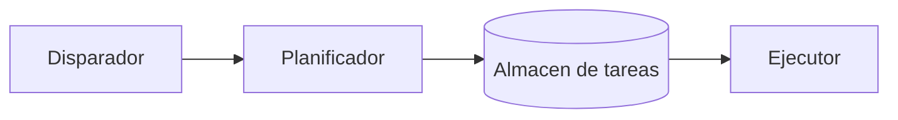

## Visión General

Podes ejecutar tareas tipo cron desde tu proceso Python con APScheduler, sin levantar cron, systemd ni un
broker como Celery. La librería maneja disparadores de intervalo, cron y fecha; puede persistir tareas en una
base de datos; y ejecuta tareas en segundo plano dentro del mismo proceso sin bloquear el hilo principal. Eso
la hace útil para trabajo pequeño o mediano tipo cron, pero no la trates como un planificador distribuido: es
la forma más rápida de terminar con la misma tarea corriendo dos veces.

Esta receta cubre los tres disparadores, almacenes de tareas con SQLAlchemy, planificación en segundo plano y
la configuración que evita que tareas lentas o perdidas se conviertan en problemas.

## Cuándo Usar

Usá APScheduler cuando:

- Necesitás ejecutar tareas a intervalos regulares o en horarios de calendario desde una app Python.
- Querés comportamiento tipo cron sin tocar el planificador del sistema operativo ni desplegar un servicio
  aparte.
- Tenés tareas diferidas puntuales, como enviar un recordatorio o ejecutar una exportación pospuesta.
- Hacés planificación in-process y no necesitás workers distribuidos ni entrega garantizada.

## Cuándo NO Usar

No uses APScheduler cuando:

- Necesitás colas de tareas distribuidas, reintentos o escalado de workers. Para esos casos, usá Celery o RQ.
- El planificador del sistema operativo es suficiente: el cron a nivel servidor suele ser más simple y
  confiable; consultá [cron jobs](/es/recipes/cron-jobs/) o systemd timers.
- Necesitás semánticas estrictas de exactamente-una-vez entre muchos procesos.
- Ejecutás muchas tareas con uso intensivo de CPU en un solo proceso sin un pool de procesos o una cola
  distribuida.

## Solución

### Instalar APScheduler

```bash
pip install APScheduler
```

### Disparador de intervalo - ejecutar cada N segundos/minutos/horas

```python
from apscheduler.schedulers.background import BackgroundScheduler
from datetime import datetime, timedelta
import time

def cleanup_temp_files():
    print("Cleaning up temp files...")

def refresh_cache():
    print("Refreshing cache...")

scheduler = BackgroundScheduler()

# Ejecutar cada 30 segundos
scheduler.add_job(cleanup_temp_files, "interval", seconds=30, id="cleanup")

# Ejecutar cada 5 minutos
scheduler.add_job(refresh_cache, "interval", minutes=5, id="cache_refresh")

# Ejecutar cada 2 horas, empezando 10 segundos desde ahora
scheduler.add_job(refresh_cache, "interval", hours=2, next_run_time=datetime.now() + timedelta(seconds=10))

scheduler.start()

try:
    while True:
        time.sleep(1)
except KeyboardInterrupt:
    scheduler.shutdown()
```

### Disparador cron - planificación estilo cron

```python
from apscheduler.schedulers.background import BackgroundScheduler

def send_daily_report():
    print("Sending daily report...")

def weekly_backup():
    print("Running weekly backup...")

scheduler = BackgroundScheduler()

# Todos los días a las 9:00 AM
scheduler.add_job(send_daily_report, "cron", hour=9, minute=0, id="daily_report")

# Todos los lunes a las 2:00 AM
scheduler.add_job(weekly_backup, "cron", day_of_week="mon", hour=2, id="weekly_backup")

# Todos los días de semana a las 6:00 PM
scheduler.add_job(send_daily_report, "cron", day_of_week="mon-fri", hour=18, id="weekday_report")

# Primer día de cada mes a medianoche
scheduler.add_job(weekly_backup, "cron", day=1, hour=0, id="monthly_backup")

# Cada 15 de enero y julio al mediodía
scheduler.add_job(weekly_backup, "cron", month="1,7", day=15, hour=12, id="biannual_backup")

scheduler.start()
```

### Disparador de fecha - tarea programada de una sola vez

```python
from apscheduler.schedulers.background import BackgroundScheduler
from datetime import datetime, timedelta

def send_reminder(email: str):
    print(f"Sending reminder to {email}")

scheduler = BackgroundScheduler()

# Programar 1 hora desde ahora
run_time = datetime.now() + timedelta(hours=1)
scheduler.add_job(send_reminder, "date", run_date=run_time, args=["reminder@stackpractices.com"], id="reminder_1")

scheduler.start()
```

### Pasar argumentos a tareas

```python
def process_order(order_id: int, priority: str = "normal"):
    print(f"Processing order {order_id} with priority {priority}")

# Argumentos posicionales
scheduler.add_job(process_order, "interval", minutes=10, args=[12345], id="order_12345")

# Argumentos con nombre
scheduler.add_job(
    process_order,
    "interval",
    minutes=10,
    kwargs={"order_id": 12345, "priority": "high"},
    id="order_high",
)
```

### Almacenes de tareas - planificación persistente con SQLAlchemy

```python
from apscheduler.schedulers.background import BackgroundScheduler
from apscheduler.jobstores.sqlalchemy import SQLAlchemyJobStore
from apscheduler.executors.pool import ThreadPoolExecutor

jobstores = {
    "default": SQLAlchemyJobStore(url="sqlite:///jobs.sqlite"),
}

executors = {
    "default": ThreadPoolExecutor(20),
}

job_defaults = {
    "coalesce": True,       # Fusionar ejecuciones perdidas en una
    "max_instances": 1,     # Evitar tareas superpuestas del mismo trabajo
    "misfire_grace_time": 60,  # Permitir ejecución 60s tarde
}

scheduler = BackgroundScheduler(
    jobstores=jobstores,
    executors=executors,
    job_defaults=job_defaults,
)

scheduler.start()
# Las tareas sobreviven reinicios - almacenadas en SQLite
```

### Gestión dinámica de tareas

```python
def mi_funcion():
    pass

# Agregar una tarea
scheduler.add_job(mi_funcion, "interval", minutes=5, id="new_job")

# Obtener una tarea por ID
job = scheduler.get_job("daily_report")
if job:
    print(f"Next run: {job.next_run_time}")

# Pausar una tarea
scheduler.pause_job("daily_report")

# Reanudar una tarea
scheduler.resume_job("daily_report")

# Reprogramar una tarea
scheduler.reschedule_job("daily_report", trigger="cron", hour=10, minute=30)

# Remover una tarea
scheduler.remove_job("daily_report")

# Listar todas las tareas
for job in scheduler.get_jobs():
    print(f"{job.id}: next_run={job.next_run_time}")
```

### Ejecutar tareas con uso intensivo de CPU en un pool de procesos

```python
from apscheduler.executors.pool import ProcessPoolExecutor

executors = {
    "default": ProcessPoolExecutor(max_workers=4),
}
```

APScheduler despacha el trabajo al pool, así que el proceso principal se mantiene responsivo. Para tareas con
mucho I/O, un ejecutor de hilos suele ser la mejor opción; el ejemplo de arriba usa un pool de procesos para
tareas con uso intensivo de CPU.

### Manejo de errores y listeners

```python
from apscheduler.events import EVENT_JOB_ERROR, EVENT_JOB_MISSED, EVENT_JOB_EXECUTED

def job_listener(event):
    if event.exception:
        print(f"Job {event.job_id} failed: {event.exception}")
    elif event.code == EVENT_JOB_MISSED:
        print(f"Job {event.job_id} missed its run time")
    else:
        print(f"Job {event.job_id} executed successfully")

scheduler.add_listener(job_listener, EVENT_JOB_ERROR | EVENT_JOB_MISSED | EVENT_JOB_EXECUTED)
```

### AsyncScheduler con asyncio

```python
from apscheduler.schedulers.asyncio import AsyncIOScheduler
import asyncio

async def async_fetch_data():
    print("Fetching data asynchronously...")
    await asyncio.sleep(2)
    print("Data fetched")

async def main():
    scheduler = AsyncIOScheduler()
    scheduler.add_job(async_fetch_data, "interval", seconds=10, id="fetch")
    scheduler.start()

    try:
        while True:
            await asyncio.sleep(1)
    except asyncio.CancelledError:
        scheduler.shutdown()

asyncio.run(main())
```

### Integración con Flask

```python
from flask import Flask
from apscheduler.schedulers.background import BackgroundScheduler
import atexit

app = Flask(__name__)
scheduler = BackgroundScheduler()

def health_check():
    print(f"Scheduler running: {scheduler.running}")

scheduler.add_job(health_check, "interval", seconds=60, id="health_check")
scheduler.start()
atexit.register(scheduler.shutdown)

@app.route("/health")
def health():
    return {"status": "healthy" if scheduler.running else "unhealthy"}, 200

if __name__ == "__main__":
    app.run(host="0.0.0.0", port=5000)
```

Arrancá el planificador cuando la app de Flask inicia, así ya está corriendo antes de que llegue el primer
request. Mantener el inicio del planificador fuera de los manejadores de requests evita instancias duplicadas.

## Explicación

APScheduler separa tres responsabilidades: cuándo corre una tarea, dónde vive su definición y cómo se ejecuta.
El disparador decide el horario, el almacén de tareas guarda la definición y el ejecutor la corre.



El disparador de intervalo espera N segundos, minutos, horas o días y vuelve a disparar. El disparador cron es
lo que querés para reglas de calendario; usa los mismos campos del cron de Unix, así que day_of_week, hour y
minute se comportan como esperarías. El disparador de fecha es para ejecuciones puntuales en un datetime
específico, como un recordatorio diferido o una exportación única.

Tres opciones deciden qué pasa cuando una tarea se atrasa o todavía está corriendo desde la ronda anterior.
Coalesce True colapsa varias ejecuciones perdidas en una, así el planificador no descarga una ráfaga de trabajo
al inicio. Un max_instances de 1 evita que una tarea lenta se solape consigo misma. Y misfire_grace_time es la
ventana de tardanza: si una tarea está apenas atrasada, todavía corre; si está demasiado tarde, se saltea.

Podés mezclar planificadores, almacenes de tareas y ejecutores para ajustarlos a la carga. BackgroundScheduler
corre en un hilo de fondo, así que no bloquea el manejo de requests y encaja dentro de una web app. El
planificador bloqueante mantiene el proceso vivo y funciona bien para scripts independientes, mientras que
AsyncIOScheduler está hecho para el bucle de eventos de asyncio y ejecuta tareas async como coroutines. Un
almacén en memoria es rápido pero pierde todo al reiniciar, mientras que uno respaldado por SQLAlchemy sobrevive
a los reinicios y puede compartirse si un solo planificador activo lo consulta. Un pool de hilos sirve para
trabajo con mucho I/O, un pool de procesos ayuda para tareas con uso intensivo de CPU y un ejecutor async va
con el planificador async.

## Variantes

| Herramienta | Tipo | Requiere Broker | Mejor para |
|------|------|----------------|----------|
| APScheduler | In-process | No | Tareas periódicas simples |
| Celery | Distribuido | Sí (Redis/RabbitMQ) | Tareas distribuidas pesadas |
| RQ | Distribuido | Sí (Redis) | Tareas distribuidas simples |
| systemd timers | OS-level | No | Cron a nivel servidor |
| cron | OS-level | No | Cron simple de servidor |

## Buenas Prácticas

- Elegí el planificador adecuado para tu runtime: BackgroundScheduler para web apps, BlockingScheduler para
  scripts independientes y AsyncIOScheduler para asyncio.
- Para tareas largas, establecé max_instances en 1 para que no se solapen. También establecé coalesce en True,
  que colapsa varias ejecuciones perdidas en una y previene una tormenta al reinicio.
- Usá un almacén de tareas persistente cuando el horario deba sobrevivir a los reinicios. SQLite alcanza para
  una instancia sola, pero buscá una base de datos real si varios procesos comparten el almacén.
- Agregá un listener para EVENT_JOB_ERROR. Una tarea que falla no derrumba el planificador, así que un log
  visible es la única forma de saber que se rompió.
- Elegí un misfire_grace_time que se ajuste a la tarea. Sesenta segundos suelen ser suficientes para tareas de
  limpieza; un reporte horario puede tolerar unos pocos minutos.
- Ajustá el ejecutor al trabajo. ThreadPoolExecutor funciona para tareas con mucho I/O, ProcessPoolExecutor
  ayuda para tareas con uso intensivo de CPU y AsyncIOExecutor va con el planificador async.
- Siempre llamá scheduler.shutdown() al salir, y usá IDs de tarea únicos. IDs duplicados pueden crear tareas
  duplicadas, especialmente cuando el planificador reinicia con un almacén en memoria.

## Errores Comunes

- Un planificador en segundo plano no corre tareas hasta que llamás start(). En Flask, iniciarlo una vez al
  arrancar la app; no en cada request.
- El proceso no termina limpiamente: los threads daemon huérfanos pueden impedir que el proceso termine o seguir
  corriendo sin querer. Siempre terminá el planificador al salir.
- Una tarea lenta que dispara cada 30 segundos puede acumularse. Establecé max_instances en 1 para evitar
  ejecuciones superpuestas.
- Usar un almacén en memoria para tareas críticas es riesgoso porque las tareas se pierden al reiniciar. Usá un
  almacén respaldado por SQLAlchemy si el horario debe sobrevivir a los reinicios.
- Una tarea que falla loguea un evento de error pero sigue adelante, así que agregá un listener y manejá los
  errores de forma explícita. No los dejes pasar desapercibidos.
- Un planificador bloqueante no encaja en una web app porque bloquea el manejo de requests. Usá BackgroundScheduler
  o AsyncIOScheduler en su lugar.
- Si te olvidás de misfire_grace_time, las tareas que perdieron su ventana pueden ejecutarse inmediatamente al
  inicio y sobrecargar el sistema.
- IDs de tarea duplicados al reiniciar son otro gotcha. Sin un almacén persistente, el planificador agrega las
  mismas tareas de nuevo y crea duplicados.

## Notas de Producción

El planificador usa su zona horaria. Si pasás objetos datetime naive o el servidor cambia de zona, las tareas
pueden dispararse en momentos inesperados. Instalá pytz (o usá zoneinfo en Python 3.9+) y pasá datetimes con
zona horaria, especialmente para disparadores cron.

BackgroundScheduler usa threads daemon. No mantienen vivo el proceso principal y se matan abruptamente al salir.
Llamá shutdown() con un timeout para darles tiempo a las tareas activas a terminar.

Por defecto, la salida de la tarea va a stdout y APScheduler loguea a WARNING. En producción, conectá un logger
y un listener para saber cuándo las tareas fallan o se disparan fuera de tiempo.

Cuando usás un almacén SQLAlchemy compartido, solo debe haber un proceso planificador activo. Varios
planificadores leyendo el mismo almacén pueden competir y ejecutar la misma tarea dos veces. Usá un lock de
proceso o hacé que el planificador sea un despliegue de una sola instancia.

Si el planificador es crítico, exponé un endpoint de salud que verifique el estado del planificador, las
ejecuciones recientes y el stream de eventos del listener. Consultá [Docker health check
configuration](/es/recipes/docker-health-check-configuration/) para un patrón concreto.

El argumento next_run_time espera un datetime, no un timestamp de Unix, así que pasá datetime.now() + timedelta(...)
o un datetime con zona horaria.

Con varios workers de gunicorn podés terminar con varios planificadores corriendo la misma tarea dos veces. Usá
un lock de proceso o corré el planificador en un proceso dedicado.

## Preguntas Frecuentes

### ¿Puede APScheduler reemplazar Celery?

Para tareas periódicas simples, sí. APScheduler es más liviano y no necesita un broker. Para trabajo
distribuido pesado con reintentos, routing de tareas y escalado de workers, Celery es la mejor opción.

### ¿Cómo prevengo ejecuciones superpuestas de tareas?

Establecé max_instances en 1 en los defaults de la tarea o en la tarea misma. Si la tarea todavía está corriendo
cuando llega el próximo horario, esa ejecución se saltea.

### ¿Qué pasa si el servidor está caído cuando una tarea está programada?

Si confiás en un almacén en memoria, la tarea desaparece cuando se detiene el proceso. Con un almacén SQLAlchemy,
la tarea se guarda y corre en el próximo inicio si todavía está dentro del tiempo de tolerancia. Establecé
coalesce en True para fusionar varias ejecuciones perdidas en una.

### ¿Puedo ejecutar funciones async con APScheduler?

Sí. Usá AsyncIOScheduler con AsyncIOExecutor. El planificador se integra con el bucle de eventos de asyncio y
 ejecuta tareas async como coroutines.

### ¿Cómo ejecuto diferentes tareas en diferentes procesos?

Un ProcessPoolExecutor maneja tareas con uso intensivo de CPU. La sección Solución tiene un ejemplo de
configuración con cuatro procesos workers.

### ¿Puedo agregar o eliminar tareas dinámicamente en runtime?

Sí. Podés gestionar tareas mientras el planificador está corriendo; el ejemplo "Gestión dinámica de tareas" en
la sección Solución muestra las llamadas.

## Puntos Clave

APScheduler es un planificador in-process para Python, no una cola de tareas distribuida. Soporta disparadores
de intervalo, cron y fecha, y es útil mientras elijas el planificador adecuado para el runtime.

Usá un planificador en segundo plano en web apps y un planificador bloqueante en scripts independientes.
Establecé max_instances en 1 y coalesce en True para que tareas lentas o perdidas no se acumulen. Almacená las
tareas en un almacén respaldado por SQLAlchemy si deben sobrevivir a los reinicios, y manejá errores con
listeners. Siempre terminá el planificador de forma limpia.

## Lecturas Adicionales

- [Documentación de APScheduler](https://apscheduler.readthedocs.io/en/stable/)
- [Guía APScheduler con Flask](https://apscheduler.readthedocs.io/en/stable/userguide.html#scheduling-background-jobs)
- [Almacenes APScheduler](https://apscheduler.readthedocs.io/en/stable/userguide.html#configuring-the-scheduler)
- Interno: [Cron Jobs](/es/recipes/cron-jobs/)
- Interno: [Docker health check configuration](/es/recipes/docker-health-check-configuration/)
- Interno: [Circuit breaker pattern](/es/patterns/circuit-breaker-pattern/)
- Interno: [Guía de producción de asyncio en Python](/es/guides/complete-guide-python-asyncio-production/)
