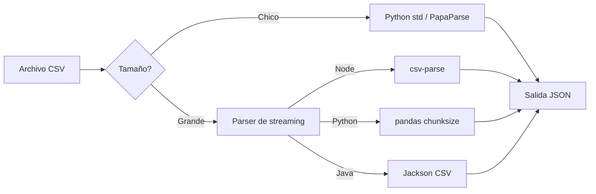

## Visión General

CSV es el formato de exportación por defecto de spreadsheets y bases de datos,
pero solo guarda texto plano. JSON te da números, booleanos, objetos anidados y
arrays — la forma que la mayoría de las APIs y document stores esperan.

Encontrarás ejemplos abajo para Python, JavaScript y Java. Yo uso la versión
rápida con librería estándar para archivos chicos, la versión con pandas cuando
necesito inferencia de tipos, y la versión con streaming para lo que no entra en
memoria. Si querés ir en el otro sentido, mirá
[Convertir JSON a CSV](/recipes/convert-json-to-csv/) y
[Serializar y Deserializar Datos](/recipes/serialize-deserialize-data/) para los
conceptos de estructura de datos que van alrededor.

## Cuándo Usar

Esta receta sirve cuando necesitás:

- Llevar exports de spreadsheets a una app web o API.
- Cargar datos planos en MongoDB, Elasticsearch u otro document store.
- Alimentar con datos CSV una librería de gráficos del lado del cliente.
- Procesar un CSV demasiado grande para caber en memoria como un solo objeto,
  una fila a la vez.

### Elegir un enfoque



## Cuándo No Usar

- Si los datos ya viven en una base de datos, consultala directamente con SQL en
  lugar de exportar a CSV y parsearlo de nuevo.
- El archivo es Parquet, Avro u ORC; usá la herramienta hecha para ese formato.
- Estás procesando un flujo en vivo de registros. Ahí la conversión por lotes de
  archivos no tiene sentido; usá un pipeline de streaming.
- El CSV contiene estructuras profundamente anidadas que se expresan más fácil
  en XML o JSON desde el origen.

## Solución

### Python (librería estándar)

```python
# csv + json de la librería estándar
import csv
import json

with open('data.csv', newline='', encoding='utf-8') as f:
    reader = csv.DictReader(f)
    rows = list(reader)

with open('data.json', 'w', encoding='utf-8') as f:
    json.dump(rows, f, indent=2)
```

### Python (pandas)

```python
# pip install pandas
import pandas as pd

df = pd.read_csv('data.csv')
df['date'] = pd.to_datetime(df['date'])
json_data = df.to_json(orient='records', date_format='iso')
print(json_data)
```

### JavaScript (Node con csv-parse)

```javascript
// npm install csv-parse
import { parse } from 'csv-parse';
import fs from 'fs';

const parser = fs.createReadStream('data.csv').pipe(
  parse({ columns: true, cast: true })
);

const rows = [];
for await (const row of parser) {
  rows.push(row);
}
console.log(JSON.stringify(rows, null, 2));
```

### JavaScript (browser con PapaParse)

```javascript
// npm install papaparse
import Papa from 'papaparse';

const csv = 'name,age\nAlice,30\nBob,25';
const result = Papa.parse(csv, { header: true });
console.log(JSON.stringify(result.data, null, 2));
```

### Java (Jackson)

```java
// Maven: com.fasterxml.jackson.dataformat:jackson-dataformat-csv
import java.io.File;
import java.util.List;
import java.util.Map;
import com.fasterxml.jackson.databind.ObjectMapper;
import com.fasterxml.jackson.dataformat.csv.CsvMapper;
import com.fasterxml.jackson.dataformat.csv.CsvSchema;

public class CsvToJson {
    public static void main(String[] args) throws Exception {
        CsvSchema schema = CsvSchema.builder()
            .setUseHeader(true)
            .build();
        CsvMapper csvMapper = new CsvMapper();
        ObjectMapper jsonMapper = new ObjectMapper();

        List<Map<String, String>> rows = csvMapper
            .readerFor(Map.class)
            .with(schema)
            .readValues(new File("data.csv"))
            .readAll();

        jsonMapper.writerWithDefaultPrettyPrinter()
            .writeValue(new File("data.json"), rows);
    }
}
```

### Java (Apache Commons CSV)

```java
// Maven: org.apache.commons:commons-csv:1.11.0
import java.io.FileReader;
import java.io.FileWriter;
import java.util.ArrayList;
import java.util.LinkedHashMap;
import java.util.List;
import java.util.Map;
import com.fasterxml.jackson.databind.ObjectMapper;
import org.apache.commons.csv.CSVFormat;
import org.apache.commons.csv.CSVRecord;

public class CsvToJsonCommons {
    public static void main(String[] args) throws Exception {
        List<Map<String, String>> rows = new ArrayList<>();
        try (FileReader fr = new FileReader("data.csv")) {
            Iterable<CSVRecord> records = CSVFormat.DEFAULT
                .withFirstRecordAsHeader()
                .parse(fr);
            for (CSVRecord record : records) {
                Map<String, String> row = new LinkedHashMap<>();
                record.toMap().forEach(row::put);
                rows.add(row);
            }
        }
        new ObjectMapper()
            .writerWithDefaultPrettyPrinter()
            .writeValue(new File("data.json"), rows);
    }
}
```

## Explicación

CSV solo guarda texto, así que no distingue números, booleanos ni fechas. JSON te
permite guardar números, booleanos, null, arrays y objetos; vos decidís cómo
mapea cada valor a un tipo JSON: `age` va a número, `active` a booleano, `tags` a array.
`csv.DictReader` de Python y `csv-parse` de Node devuelven strings por defecto,
así que casteás manualmente o definís un schema.

Un parser de streaming lee una fila a la vez, así que nunca guarda todo el archivo
en memoria. Si necesitás JSON anidado, usá nombres de columna con puntos como
`user.name` y una utilidad para aplanar, o armá el objeto en el código. Para ver
más a fondo ese patrón, mirá
[Aplanar y Desanidar Objetos](/recipes/flatten-unflatten-objects/).

Las comillas y los escapes son los lugares donde el `line.split(',')` rompe. Una
coma entre comillas o un salto de línea dentro de una celda son válidos en CSV, y
una comilla dentro de una celda se escapa con otra comilla. Por eso un parser
real gana siempre contra una regex o un split. Cuando exporto desde Excel, también
me fijo el BOM UTF-8 al principio del archivo, que puede corromper el primer
header y hacer que `DictReader` genere una clave como `\ufeffid`.

## Variantes

| Tecnología | Librería | Enfoque | Notas |
| --- | --- | --- | --- |
| Python | `csv` + `json` | `DictReader` + `json.dump` | Librería estándar, sin dependencias |
| Python | `pandas` | `read_csv` + `to_json` | Inferencia de tipos, maneja fechas, archivos grandes |
| JavaScript | `csv-parse` | `parse({ columns: true })` | Streaming, async iterables, enfocado en Node |
| JavaScript | `papaparse` | `Papa.parse(csv, { header: true })` | Browser + Node, tolera CSV malformado |
| Java | `Jackson CSV` | `CsvMapper` + `ObjectMapper` | Streaming, schema-driven |
| Java | `Apache Commons CSV` | `CSVFormat.DEFAULT.parse()` | Ligero, serialización JSON manual |

Yo uso `csv.DictReader` o `Papa.parse` cuando quiero código sin instalar nada.
`pandas` es mi primera opción cuando el CSV tiene fechas, tipos mezclados o
necesito una vista previa. Paso a `csv-parse` con async iteration o `CsvMapper`
con `readValues` cuando el archivo es demasiado grande para la memoria o cuando
quiero que las filas vayan directo a otro consumidor asíncrono.

## Herramientas y Ecosistema

La tabla de abajo lista las librerías que me cruzo más seguido en producción. Las
versiones cambian, así que las fijo en el companion repo o en un
`requirements.txt`/`package.json`.

| Herramienta / Librería | Rol | Referencia |
| --- | --- | --- |
| `csv` de Python | Lector/escritor de la librería estándar | [docs.python.org/library/csv](https://docs.python.org/3/library/csv.html) |
| `pandas` | Conversión de DataFrame e inferencia de tipos | [pandas.pydata.org/docs/reference/api/pandas.read_csv.html](https://pandas.pydata.org/docs/reference/api/pandas.read_csv.html) |
| `csv-parse` | Parser de streaming para Node | [csv.js.org](https://csv.js.org/) |
| `PapaParse` | Parser rápido para browser y Node | [www.papaparse.com](https://www.papaparse.com/) |
| Jackson CSV | Parser de streaming en Java, schema-driven | [github.com/FasterXML/jackson-dataformat-csv](https://github.com/FasterXML/jackson-dataformat-csv) |
| Apache Commons CSV | Parser ligero en Java | [commons.apache.org/proper/commons-csv/](https://commons.apache.org/proper/commons-csv/) |
| RFC 4180 | Especificación del formato CSV | [datatracker.ietf.org/doc/html/rfc4180](https://datatracker.ietf.org/doc/html/rfc4180) |

Si necesitás validar la forma de salida contra un contrato, combiná esta receta
con [Validar JSON Schema](/recipes/validate-json-schema/) después de la
conversión.

## Mejores Prácticas

- Mapeá los headers CSV a claves JSON con `columns: true` o `DictReader`; no
  confíes en las posiciones, porque pueden cambiar entre exports.
- Casteá los tipos de forma explícita. CSV no tiene booleanos ni fechas, así que
  definí un schema o post-procesá las filas. Yo suelo tener un `TYPE_MAP` chico
  por columna.
- Hacé streaming una vez que el archivo pasa los 100 MB. Escribí el JSON en
  pedazos, o cargalo directamente a una base de datos. Cargar un archivo de varios
  gigabytes en una lista casi siempre termina en out-of-memory.
- Validá el JSON de salida contra un schema cuando la estructura importe.
- Mantené el encoding UTF-8 explícito y manejá los BOM, especialmente con exports
  de Excel. Abrí archivos con `encoding='utf-8-sig'` cuando sé que el BOM es
  probable.

## Errores Comunes

- Cargar un CSV de varios gigabytes entero en memoria. Esa es la razón principal
  por la que me piden reescribir un script.
- Separar filas con `line.split(',')` y romper con comillas o saltos de línea. El
  CSV real puede tener saltos de línea dentro de celdas entre comillas siempre.
- Referenciar columnas por índice cuando los headers pueden cambiar; la primera
  columna de hoy puede no ser la primera de mañana.
- Ignorar un BOM UTF-8 que corrompe la primera clave del header. Si ves `` en
  tus claves, esa es la señal.
- Olvidar que JSON no tiene tipo date. Usá strings en formato ISO 8601 y dejá que
  el consumidor los vuelva a convertir cuando lo necesite.

## Ver También

- [Leer Archivos CSV](/recipes/parse-csv-files/) — los fundamentos de leer CSV
  desde cualquier lenguaje.
- [Convertir JSON a CSV](/recipes/convert-json-to-csv/) — la operación inversa
  cuando una herramienta downstream quiere salida de spreadsheet.
- [Aplanar y Desanidar Objetos](/recipes/flatten-unflatten-objects/) — cómo
  convertir nombres de columna con puntos como `user.name` en JSON anidado.
- [Validar JSON Schema](/recipes/validate-json-schema/) — mantené la salida
  convertida bajo un contrato.
- RFC 4180 — la especificación canónica de CSV en
  [datatracker.ietf.org/doc/html/rfc4180](https://datatracker.ietf.org/doc/html/rfc4180).
- [Código complementario ejecutable en GitHub](https://github.com/mathiaspaulenko/stack-practices-resources/tree/main/resources/recipes/data/convert-csv-to-json) —
  el repositorio companion de esta receta.

## Preguntas Frecuentes

### ¿Por qué todos los valores salen como strings?

CSV no almacena tipos. Usá un schema o funciones de casteo para convertir
números, booleanos y fechas a los tipos JSON correctos.

### ¿Puedo convertir un CSV sin cargarlo entero en memoria?

Sí. Usá `csv-parse` con async iteration en Node, la API de streaming de Jackson
en Java, o `pd.read_csv(chunksize=...)` en Python.

### ¿Cómo creo objetos JSON anidados desde columnas planas de CSV?

Usá nombres de columna con puntos como `user.name` y `user.email`, luego
expandilos en el código o con una librería como `flat` o `pandas.json_normalize`.

### ¿Qué hago si el CSV tiene un delimitador distinto?

Seteá la opción `delimiter` del parser para que coincida con el archivo.
`csv.Sniffer` en Python, la opción `delimiter` de `csv-parse` y el export "CSV
(punto y coma)" de Excel son soluciones comunes. RFC 4180 usa coma por defecto,
pero archivos delimitados por tabulación o punto y coma siguen siendo válidos.

### ¿Cómo manejo CSV malformado?

Usá un parser que no se rompa fácil, como `papaparse` con `skipEmptyLines` y
callbacks de `error`, o configurá `csv-parse` para saltar líneas vacías y seguir
con los registros buenos.

### ¿Puedo convertir CSV a JSON dentro del browser?

Sí. PapaParse funciona en el browser con un string o un input `File`. Podés
parsear un archivo que el usuario arrastra a la página y luego llamar
`JSON.stringify(result.data)`.

### ¿Qué es un BOM UTF-8 y por qué rompe mis headers?

Un BOM son unos bytes extra (`\ufeff`) que algunos editores y Excel agregan al
principio de un archivo UTF-8. Ese artefacto termina siendo parte del nombre de la primera columna. Abrí el archivo con `encoding='utf-8-sig'` en Python o sacá el BOM antes
de parsear.

### ¿Cómo preservo fechas y booleanos en la salida JSON?

CSV no tiene tipo date ni boolean, así que los tenés que castear. Yo convierto
las fechas a strings ISO 8601 y los booleanos desde strings como `"true"` o
`"false"` antes de llamar `json.dump` o `JSON.stringify`.
