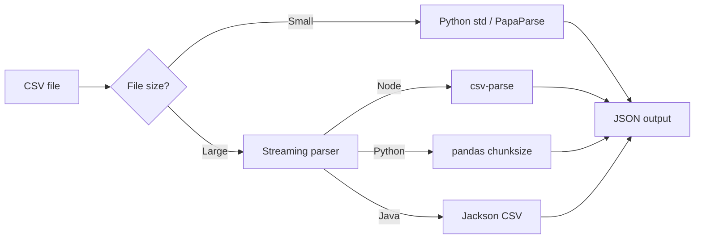

## Overview

CSV is the default export format for spreadsheets and databases, yet it only
stores flat text. JSON gives you numbers, booleans, nested objects, and arrays —
the shape that most APIs and document stores actually want.

I wrote the examples below in Python, JavaScript, and Java. I keep the quick
standard-library version for small files, the pandas version when I need type
inference, and the streaming versions for anything that won't fit in RAM. If you
want to go the other way, see [Convert JSON to CSV](/recipes/convert-json-to-csv/)
and [Serialize and Deserialize Data](/recipes/serialize-deserialize-data/) for
the surrounding data-shape concepts.

## When to Use

This recipe fits when you're:

- Bringing spreadsheet exports into a web app or API.
- Pushing flat data into MongoDB, Elasticsearch, or a similar document store.
- Feeding CSV data to a charting or visualization library on the client.
- Processing a CSV that's too big to load as a single object, one row at a time.

### Choosing an approach



## When Not to Use

- If the data is already in a database, query it directly with SQL instead of
  round-tripping through CSV.
- For Parquet, Avro, or ORC, use the parser built for that binary format.
- You need to process live records as they arrive. Then batch conversion by file
  doesn't make sense; use a streaming pipeline instead.
- The CSV contains deeply nested structures that are easier to express in XML or
  JSON from the start.

## Solution

### Python (standard library)

```python
# csv + json from the standard library
import csv
import json

with open('data.csv', newline='', encoding='utf-8') as f:
    reader = csv.DictReader(f)
    rows = list(reader)

with open('data.json', 'w', encoding='utf-8') as f:
    json.dump(rows, f, indent=2)
```

### Python (pandas)

```python
# pip install pandas
import pandas as pd

df = pd.read_csv('data.csv')
df['date'] = pd.to_datetime(df['date'])
json_data = df.to_json(orient='records', date_format='iso')
print(json_data)
```

### JavaScript (Node with csv-parse)

```javascript
// npm install csv-parse
import { parse } from 'csv-parse';
import fs from 'fs';

const parser = fs.createReadStream('data.csv').pipe(
  parse({ columns: true, cast: true })
);

const rows = [];
for await (const row of parser) {
  rows.push(row);
}
console.log(JSON.stringify(rows, null, 2));
```

### JavaScript (browser with PapaParse)

```javascript
// npm install papaparse
import Papa from 'papaparse';

const csv = 'name,age\nAlice,30\nBob,25';
const result = Papa.parse(csv, { header: true });
console.log(JSON.stringify(result.data, null, 2));
```

### Java (Jackson)

```java
// Maven: com.fasterxml.jackson.dataformat:jackson-dataformat-csv
import java.io.File;
import java.util.List;
import java.util.Map;
import com.fasterxml.jackson.databind.ObjectMapper;
import com.fasterxml.jackson.dataformat.csv.CsvMapper;
import com.fasterxml.jackson.dataformat.csv.CsvSchema;

public class CsvToJson {
    public static void main(String[] args) throws Exception {
        CsvSchema schema = CsvSchema.builder()
            .setUseHeader(true)
            .build();
        CsvMapper csvMapper = new CsvMapper();
        ObjectMapper jsonMapper = new ObjectMapper();

        List<Map<String, String>> rows = csvMapper
            .readerFor(Map.class)
            .with(schema)
            .readValues(new File("data.csv"))
            .readAll();

        jsonMapper.writerWithDefaultPrettyPrinter()
            .writeValue(new File("data.json"), rows);
    }
}
```

### Java (Apache Commons CSV)

```java
// Maven: org.apache.commons:commons-csv:1.11.0
import java.io.FileReader;
import java.io.FileWriter;
import java.util.ArrayList;
import java.util.LinkedHashMap;
import java.util.List;
import java.util.Map;
import com.fasterxml.jackson.databind.ObjectMapper;
import org.apache.commons.csv.CSVFormat;
import org.apache.commons.csv.CSVRecord;

public class CsvToJsonCommons {
    public static void main(String[] args) throws Exception {
        List<Map<String, String>> rows = new ArrayList<>();
        try (FileReader fr = new FileReader("data.csv")) {
            Iterable<CSVRecord> records = CSVFormat.DEFAULT
                .withFirstRecordAsHeader()
                .parse(fr);
            for (CSVRecord record : records) {
                Map<String, String> row = new LinkedHashMap<>();
                record.toMap().forEach(row::put);
                rows.add(row);
            }
        }
        new ObjectMapper()
            .writerWithDefaultPrettyPrinter()
            .writeValue(new File("data.json"), rows);
    }
}
```

## Explanation

CSV only stores text, so it's got no idea whether a value is a number, a
boolean, or a date. JSON handles numbers, booleans, null, arrays, and objects;
CSV doesn't. You're the one deciding how each value maps to a JSON type:
`age` becomes a number, `active` a boolean, `tags` an array. Python's
`csv.DictReader` and Node's `csv-parse` return strings by default, so you either
cast manually or define a schema.

A streaming parser reads one row at a time, so the whole file never has to live
in memory. If you need nested JSON, use dotted column names like `user.name` and
a flattening utility, or build the object in code. For a deeper look at that
pattern, see [Flatten and Unflatten Nested Objects](/recipes/flatten-unflatten-objects/).

Quoting and escaping are where a naive `line.split(',')` breaks. A quoted comma
or newline is legal in CSV, and a quoted quote is escaped with another quote.
That's why a real parser beats a regex or a split every time. When I export from
Excel, I also watch for a UTF-8 BOM at the start of the file, which can corrupt
the first header and make `DictReader` produce a key like `\ufeffid`.

## Variants

| Technology | Library | Approach | Notes |
| --- | --- | --- | --- |
| Python | `csv` + `json` | `DictReader` + `json.dump` | Standard library, no dependencies |
| Python | `pandas` | `read_csv` + `to_json` | Type inference, handles dates, large files |
| JavaScript | `csv-parse` | `parse({ columns: true })` | Streaming, async iterables, Node focused |
| JavaScript | `papaparse` | `Papa.parse(csv, { header: true })` | Browser + Node, forgiving with malformed CSV |
| Java | `Jackson CSV` | `CsvMapper` + `ObjectMapper` | Streaming, schema-driven |
| Java | `Apache Commons CSV` | `CSVFormat.DEFAULT.parse()` | Lightweight, manual JSON serialization |

I reach for `csv.DictReader` or `Papa.parse` when I want zero-install code.
`pandas` is my first choice when the CSV has dates, mixed types, or needs a
preview. I switch to `csv-parse` with async iteration or `CsvMapper` with
`readValues` once the file is too large for the heap, or when I want rows to flow
straight into another async consumer.

## Tooling and Ecosystem

I put the libraries I use most often in production into the table below. Versions
change, so I pin them in the companion repo or in a `requirements.txt`/`package.json`.

| Library / Tool | Role | Reference |
| --- | --- | --- |
| Python `csv` | Standard-library reader/writer | [docs.python.org/library/csv](https://docs.python.org/3/library/csv.html) |
| `pandas` | DataFrame conversion and type inference | [pandas.pydata.org/docs/reference/api/pandas.read_csv.html](https://pandas.pydata.org/docs/reference/api/pandas.read_csv.html) |
| `csv-parse` | Node streaming parser | [csv.js.org](https://csv.js.org/) |
| `PapaParse` | Fast in-browser and Node parser | [www.papaparse.com](https://www.papaparse.com/) |
| Jackson CSV | Java streaming and schema-driven parsing | [github.com/FasterXML/jackson-dataformat-csv](https://github.com/FasterXML/jackson-dataformat-csv) |
| Apache Commons CSV | Lightweight Java parser | [commons.apache.org/proper/commons-csv/](https://commons.apache.org/proper/commons-csv/) |
| RFC 4180 | The CSV format specification | [datatracker.ietf.org/doc/html/rfc4180](https://datatracker.ietf.org/doc/html/rfc4180) |

If you need to validate the output shape against a contract, combine this recipe
with [Validate JSON Schema](/recipes/validate-json-schema/) after conversion.

## Best Practices

- Map CSV headers to JSON keys with `columns: true` or `DictReader`; don't rely
  on positions, because they can change between exports.
- Cast types explicitly. CSV has no booleans or dates, so either define a schema
  or post-process rows. I usually keep a small `TYPE_MAP` per column.
- For files over 100 MB, stream the conversion. Write JSON in chunks, or pipe rows
  straight into a database. Loading a multi-gigabyte file into a list almost always
  triggers an out-of-memory error.
- Check the JSON against a schema when the output structure has to be exact.
- Keep UTF-8 encoding explicit and handle BOMs, especially with Excel exports.
  I open files with `encoding='utf-8-sig'` when a BOM is likely.

## Common Mistakes

- Loading a multi-gigabyte CSV entirely into memory. That mistake usually
  triggers a rewrite request.
- A quoted comma or newline will trip up any `line.split(',')` shortcut, every
  time. Real CSV can have newlines inside quoted cells.
- Referencing columns by index when headers can change; the first column today
  may not be the first column tomorrow.
- Ignoring a UTF-8 BOM that corrupts the first header. If `` shows up in your
  keys, the BOM is the culprit.
- Forgetting that JSON has no native date type. Use ISO 8601 strings and let the
  consumer cast them back when needed.

## See Also

- [Parse CSV Files](/recipes/parse-csv-files/) — the basics of reading CSV from
  any language.
- [Convert JSON to CSV](/recipes/convert-json-to-csv/) — the reverse operation
  when a downstream tool wants spreadsheet output.
- [Flatten and Unflatten Nested Objects](/recipes/flatten-unflatten-objects/) —
  how to turn dotted column names like `user.name` into nested JSON.
- [Validate JSON Schema](/recipes/validate-json-schema/) — keep the converted
  output under a contract.
- RFC 4180 — the canonical CSV format spec at
  [datatracker.ietf.org/doc/html/rfc4180](https://datatracker.ietf.org/doc/html/rfc4180).
- [Runnable companion on GitHub][companion] —
  the companion repo for this recipe.

[companion]: https://github.com/mathiaspaulenko/stack-practices-resources/tree/main/resources/recipes/data/convert-csv-to-json

## FAQ

### Why do all values come out as strings?

CSV doesn't store types. Add a small schema or cast each value manually, so numbers,
booleans, and dates end up as the right JSON types.

### Can I convert a CSV without loading it all into memory?

Yes. Use `csv-parse` with async iteration in Node, Jackson's streaming reader in
Java, or `pd.read_csv(chunksize=...)` in Python.

### How do I create nested JSON objects from flat CSV columns?

Use dotted column names like `user.name` and `user.email`, then expand them in
code or with a library like `flat` or `pandas.json_normalize`.

### What should I do if the CSV has a different delimiter?

Set the parser to the delimiter the file actually uses. `csv.Sniffer` in Python,
`csv-parse`'s `delimiter` option, and Excel's "CSV (semicolon)" export are common
fixes. RFC 4180 uses a comma by default, but tab- and semicolon-delimited files
are still valid.

### How do I handle malformed CSV?

Use a forgiving parser like `papaparse` with `skipEmptyLines` and `error`
callbacks, or configure `csv-parse` to skip blank lines and continue on bad
records.

### Can I convert CSV to JSON inside the browser?

Yes. PapaParse runs in the browser with a string or a `File` input. You can parse
a file the user drops onto the page and then call `JSON.stringify(result.data)`.

### What is a UTF-8 BOM and why does it break my headers?

A BOM is a handful of extra bytes (`\ufeff`) that some editors and Excel prepend
to a UTF-8 file. That prefix usually pollutes the first column name. Open the
file with `encoding='utf-8-sig'` in Python or strip the BOM before parsing.

### How do I preserve dates and booleans in the JSON output?

CSV has no date or boolean type, so you must cast them. I cast dates to ISO 8601
strings and booleans from strings like `"true"` or `"false"` before the final
`json.dump` or `JSON.stringify`.
