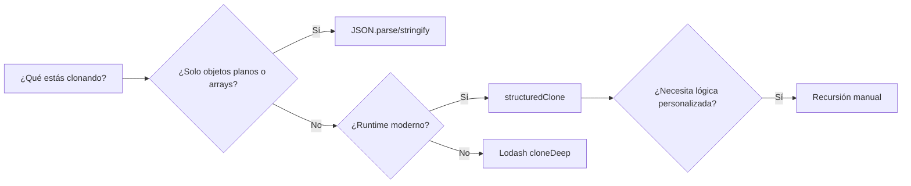

## Visión General

Una clonación profunda copia un objeto o array y todo lo que contiene, así que el clon es completamente independiente.
Los objetos anidados, arrays y tipos especiales se duplican en vez de compartirse por referencia. En JavaScript, `=`
solo copia la referencia, así que cambios en una "copia" también afectan al original. Esta receta compara métodos de
clonación profunda en JavaScript, Python y Java: `structuredClone`, `JSON.parse/stringify`, Lodash y una implementación
recursiva manual. Mirá la matriz de decisión en [Variantes](#variantes) para elegir un enfoque. Si querés un recorrido
paso a paso solo en JavaScript, consultá [Deep Clone Structured](/recipes/deep-clone-structured/). También muestra cómo
volver a una alternativa segura cuando `structuredClone` no esté disponible, para elegir la herramienta correcta sin
cambiar de librería a mitad del proyecto.

## Cuándo Usar

- Editá una copia de estado anidado sin tocar el original, como en reducers de Redux o manejo de formularios.
- Estás serializando objetos para pasarlos por `postMessage`, IndexedDB o Web Workers.
- Estás construyendo stacks de undo/redo y necesitás snapshots inmutables.
- Necesitás una copia defensiva de argumentos de funciones o respuestas de API antes de transformarlas. Consultá
  [Llamar REST API](/recipes/call-rest-api/) para patrones relacionados.
- Compará los trade-offs de `JSON.parse` antes de copiar un payload. Los casos edge de `JSON.parse` están en
  [Parse JSON](/recipes/parse-json/).
- Necesitás un modelo mental que se traslade al backend en Python o Java, así todo el stack usa las mismas reglas de
  clonación.

## Solución

### `structuredClone` (recomendado)

```javascript
const original = {
  name: "Alice",
  dates: [new Date("2024-01-01"), new Date("2024-06-01")],
  map: new Map([["key", "value"]]),
  set: new Set([1, 2, 3]),
  buffer: new Uint8Array([1, 2, 3]),
  nested: { a: 1, b: { c: 2 } },
};

const clone = structuredClone(original);

// Las mutaciones no afectan el original
clone.nested.b.c = 999;
clone.dates[0] = new Date("2025-01-01");
console.log(original.nested.b.c); // 2
console.log(original.dates[0]); // 2024-01-01

// Las referencias circulares también funcionan
const circular = { name: "self" };
circular.self = circular;
const circularClone = structuredClone(circular);
```

### `JSON.parse` (rápido pero limitado)

```javascript
function jsonClone(obj) {
  return JSON.parse(JSON.stringify(obj));
}

// Funciona para: objetos planos, arrays, strings, números, booleans, null
// Pierde: Dates (se convierten a strings), Functions, undefined, Maps, Sets,
// RegExp, referencias circulares y arrays tipados
const limited = jsonClone({ a: 1, b: [2, 3], c: { d: 4 } });
```

### Clonación recursiva manual con soporte para referencias circulares

```javascript
function deepClone(obj, cache = new WeakMap()) {
  // Primitivos y funciones se devuelven tal cual
  if (obj === null || typeof obj !== "object") return obj;

  // Referencia circular
  if (cache.has(obj)) return cache.get(obj);

  // Date
  if (obj instanceof Date) return new Date(obj.getTime());

  // RegExp
  if (obj instanceof RegExp) return new RegExp(obj.source, obj.flags);

  // Map
  if (obj instanceof Map) {
    const copy = new Map();
    cache.set(obj, copy);
    obj.forEach((v, k) => copy.set(deepClone(k, cache), deepClone(v, cache)));
    return copy;
  }

  // Set
  if (obj instanceof Set) {
    const copy = new Set();
    cache.set(obj, copy);
    obj.forEach((v) => copy.add(deepClone(v, cache)));
    return copy;
  }

  // Arrays tipados
  if (ArrayBuffer.isView(obj)) {
    const Constructor = obj.constructor;
    return new Constructor(obj);
  }

  // Array
  if (Array.isArray(obj)) {
    const copy = [];
    cache.set(obj, copy);
    obj.forEach((v, i) => (copy[i] = deepClone(v, cache)));
    return copy;
  }

  // Plain object (preserva prototipo)
  const copy = Object.create(Object.getPrototypeOf(obj));
  cache.set(obj, copy);
  Object.keys(obj).forEach((k) => (copy[k] = deepClone(obj[k], cache)));
  Object.getOwnPropertySymbols(obj).forEach((s) => (copy[s] = deepClone(obj[s], cache)));

  return copy;
}

// Uso
const obj = {
  a: 1,
  b: { c: 2 },
  d: new Date("2024-01-01"),
  e: new Map([["x", { y: 3 }]]),
  f: [1, 2, { z: 4 }],
};
obj.circular = obj;

const cloned = deepClone(obj);
console.log(cloned.b === obj.b); // false
console.log(cloned.circular === obj); // false
console.log(cloned.circular === cloned); // true
```

### Lodash

```javascript
import cloneDeep from "lodash/cloneDeep.js";

const obj = {
  a: 1,
  b: { c: 2 },
  d: new Date(),
  e: new Map([["key", "value"]]),
  f: new Uint8Array([1, 2, 3]),
};

const cloned = cloneDeep(obj);
// Maneja referencias circulares, Dates, Maps, Sets, arrays tipados, RegExp,
// objetos planos y arrays
```

### Equivalente en Python

```python
import copy
from datetime import datetime

original = {
    "name": "Alice",
    "dates": [datetime(2024, 1, 1), datetime(2024, 6, 1)],
    "nested": {"a": 1, "b": {"c": 2}}
}

cloned = copy.deepcopy(original)

cloned["nested"]["b"]["c"] = 999
print(original["nested"]["b"]["c"])  # 2

class Person:
    def __init__(self, name):
        self.name = name
        self.friend = None

alice = Person("Alice")
bob = Person("Bob")
alice.friend = bob

cloned_alice = copy.deepcopy(alice)
print(cloned_alice.friend is bob)  # False
print(cloned_alice.friend.name)    # "Bob"
```

### Equivalente en Java

```java
import java.io.*;
import java.util.*;

public class DeepCopyUtil {
  @SuppressWarnings("unchecked")
  public static <T extends Serializable> T deepCopy(T obj) {
    try {
      ByteArrayOutputStream baos = new ByteArrayOutputStream();
      ObjectOutputStream oos = new ObjectOutputStream(baos);
      oos.writeObject(obj);
      oos.close();

      ByteArrayInputStream bais = new ByteArrayInputStream(baos.toByteArray());
      ObjectInputStream ois = new ObjectInputStream(bais);
      T copy = (T) ois.readObject();
      ois.close();
      return copy;
    } catch (IOException | ClassNotFoundException e) {
      throw new RuntimeException("Deep copy failed", e);
    }
  }
}

public record Person(String name, List<Date> dates, Map<String, Object> metadata)
  implements Serializable {}

Person original = new Person(
  "Alice",
  List.of(new Date(1704067200000L)),
  new HashMap<>(Map.of("role", "admin"))
);

Person cloned = DeepCopyUtil.deepCopy(original);
// cloned es completamente independiente; las mutaciones no afectan el original
```

## Explicación

- Elegí `structuredClone` cuando tu runtime sea moderno. Es nativo en navegadores, Node 17+, Deno y Bun, y maneja
  referencias circulares, `Date`, `Map`, `Set`, arrays tipados y la mayoría de tipos built-in. Lanza `DataCloneError`
  con funciones, nodos DOM y objetos con cadenas de prototipo. MDN documenta
  [`structuredClone`](https://developer.mozilla.org/en-US/docs/Web/API/structuredClone) con los tipos soportados y los
  detalles de `DataCloneError`.
- `JSON.parse(JSON.stringify(obj))` es la forma más rápida de clonar datos planos, pero pierde `undefined`, funciones,
  `Map`, `Set`, `RegExp`, arrays tipados y referencias circulares. Deja valores `Date` como strings ISO. Reservalo solo
  para objetos planos y arrays. Los casos edge de `JSON.parse` están en [Parse JSON](/recipes/parse-json/).
- Un `WeakMap` usado como cache te da control total. Vos decidís cómo clonar cada tipo, incluyendo instancias de clases
  reconstruidas con `new MyClass(...)`. Usá `WeakMap`, no `Map`, así los objetos en cache pueden ser garbage collected
  una vez que el original se libera.
- Lodash `cloneDeep` es la alternativa más segura cuando `structuredClone` no está disponible o cuando necesitás clonar
  funciones y accessors. El trade-off es el tamaño del bundle: unos 17 KB gzipped para toda Lodash o unos 4 KB para
  `lodash.cloneDeep` solo. Ver la [documentación de Lodash](https://lodash.com/docs/4.17.15#cloneDeep).
- La serialización en Java y `copy.deepcopy` en Python siguen el mismo patrón: recorren el grafo de objetos, crean
  nuevas instancias y apuntan los objetos ya copiados a la misma nueva instancia para mantener las referencias
  circulares.

### Dónde encaja esta receta

La clonación profunda parece simple hasta que aparece un `Date`, un `Map` o un nodo DOM en el payload. Esta página
mantiene la comparación portable entre JavaScript, Python y Java, con un árbol de decisión para elegir un método. El
ángulo multi-lenguaje ayuda cuando tu equipo tiene una API en Node y un pipeline de datos en Python y necesita las
mismas reglas de clonación en ambos. Si solo te interesa JavaScript,
[Deep Clone Structured](/recipes/deep-clone-structured/) es la guía más profunda, paso a paso. Usá esa cuando quieras
construir el clon a mano; usá esta cuando necesites el mismo modelo mental en un stack políglota.

### Árbol de decisión



## Variantes

| Enfoque                | Referencias circulares | Tipos especiales                        | Rendimiento | Entorno                                   |
| ---------------------- | ---------------------- | --------------------------------------- | ----------- | ----------------------------------------- |
| `structuredClone`      | Sí                     | Dates, Maps, Sets, arrays tipados       | Rápido      | Navegadores modernos, Node 17+            |
| `JSON.parse/stringify` | No                     | Ninguno (Dates se convierten a strings) | Más rápido  | Todos los entornos                        |
| Recursión manual       | Sí                     | Configurable                            | Media       | Todos los entornos                        |
| Lodash `cloneDeep`     | Sí                     | Dates, Maps, Sets, RegExp, etc.         | Media       | Todos los entornos (requiere dependencia) |
| Serialización Java     | Sí                     | Todos los tipos `Serializable`          | Lenta       | Java JVM                                  |
| `copy.deepcopy` Python | Sí                     | La mayoría de tipos built-in            | Media       | Python                                    |

El entorno importa tanto como la velocidad. `structuredClone` no sirve en un navegador viejo, y Lodash es excesivo para
un objeto de configuración plano. Elegí el método según el runtime y la forma de los datos. Si el payload es chico y el
runtime es moderno, `structuredClone` suele ser la opción menos sorprendente. Raramente necesitás todos a la vez.

## Mejores Prácticas

- Preferí `structuredClone` en entornos modernos. Es nativo, evita dependencias extras y cubre referencias circulares y
  la mayoría de tipos especiales.
- Usá Lodash 4.x `cloneDeep` cuando todavía necesités soportar navegadores o versiones de Node donde `structuredClone`
  no esté disponible.
- Mantené `JSON.parse/stringify` lejos de objetos complejos; corrompe silenciosamente `Date`, funciones, `undefined`,
  `Map`, `Set` y referencias circulares.
- Cloná defensivamente antes de mutar datos de una API o un store de estado, así evitás efectos secundarios. Consultá
  [Llamar REST API](/recipes/call-rest-api/) para patrones sobre respuestas externas.
- Con árboles inmutables muy grandes, librerías como Immer usan structural sharing en lugar de copiar todo el árbol en
  cada actualización.
- Escribí una pequeña prueba que mute el clon y verifique que el original sigue intacto. Si pasás de
  `JSON.parse/stringify` a `structuredClone`, los tipos soportados cambian, y una prueba lo atrapa antes de que llegue a
  producción.
- Revisá tu estrategia de clonación cuando actualices Node o tu bundler. Lo que el año pasado necesitaba Lodash hoy
  puede ser nativo, y sacar esa dependencia achica el bundle.

## Errores Comunes

- Usar spread (`{...obj}`) u `Object.assign` esperando una clonación profunda. El primer nivel es nuevo, pero los
  objetos anidados siguen apuntando al original.
- Clonar valores `Date` con `JSON.parse/stringify` devuelve strings ISO en vez de objetos `Date`.
- Escribir una clonación profunda manual sin cache y caer en recursión infinita o en un stack overflow con referencias
  circulares.
- Llamar `structuredClone` sobre funciones o nodos DOM. Las funciones y nodos DOM disparan un `DataCloneError`.
- Clonar un objeto enorme en cada render ralentiza la UI. Usá memoización o structural sharing en su lugar.
- Tratar un clon como inmutable. `structuredClone` te da un snapshot, pero la referencia original puede seguir viva en
  otro lugar, así que ambas copias pueden divergir de formas confusas.

## Preguntas Frecuentes

### ¿Por qué `{...obj}` no crea una clonación profunda?

El spread produce una copia superficial: el primer nivel es nuevo, pero lo anidado sigue apuntando a los valores
originales. Usá `structuredClone`, Lodash o recursión manual para una clonación profunda verdadera.

### ¿`structuredClone` preserva instancias de clases?

No. Elimina las cadenas de prototipo, así que instancias de clases personalizadas se convierten en objetos planos. Si
necesitás el comportamiento de clase, reconstruí instancias con `new MyClass(...)` o usá una función personalizada de
Lodash. Consultá [Prototype Pattern Cloning](/patterns/prototype-pattern-cloning/) para conservar el comportamiento de
clase.

### ¿Cómo hago una clonación profunda en Node.js sin dependencias?

Node 17.0 y versiones posteriores exponen `structuredClone` como global. En versiones anteriores, usá
`v8.deserialize(v8.serialize(obj))`, que aprovecha el structured clone de Node. Usá `JSON.parse/stringify` solo con
objetos planos simples. Ver [Node.js V8 serialization](https://nodejs.org/api/v8.html#serialization-api).

### ¿Cómo clono objetos con getters y setters?

Ni `structuredClone` ni `JSON.parse/stringify` mantienen getters y setters. Evalúan el getter y copian el valor
resultante. Usá `Object.getOwnPropertyDescriptors` con `Object.create` para conservar los descriptores de propiedad y
reconstruir la cadena de prototipo. Lodash `cloneDeep` preserva accessors por defecto.

### ¿Por qué `JSON.parse(stringify(obj))` pierde los objetos `Date`?

`JSON.stringify` no sabe qué es un `Date`. Ve un número, lo convierte en un string ISO 8601, y para cuando `JSON.parse`
lo lee la información de tipo ya desapareció. El parser solo ve el string, así que eso es lo que devuelve. Por eso esta
receta reserva `JSON.parse/stringify` para objetos planos y arrays.

## Referencias

- [MDN `structuredClone`](https://developer.mozilla.org/en-US/docs/Web/API/structuredClone): tipos soportados y
  `DataCloneError`.
- [Node.js `structuredClone` global](https://nodejs.org/api/globals.html#structuredclonevalue-options): referencia para
  Node 17+.
- [Node.js V8 serialization](https://nodejs.org/api/v8.html#serialization-api): `v8.serialize` y `v8.deserialize`.
- [Lodash `cloneDeep`](https://lodash.com/docs/4.17.15#cloneDeep): documentación y opciones.
- Más recetas de datos en el tópico [Data](/topics/data/).
