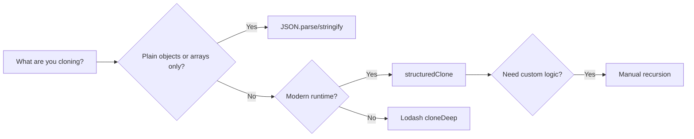

## Overview

A deep clone copies an object or array and everything it contains, so the clone is fully independent. Nested objects,
arrays and special types are cloned, not shared, so the copy doesn't reference the original. In JavaScript, `=` only
copies the reference, so changes to a "copy" also change the original. This recipe compares deep clone methods in
JavaScript, Python and Java, including `structuredClone`, `JSON.parse/stringify`, Lodash and a manual recursive
implementation. Check the decision matrix in [Variants](#variants) to choose an approach. If you want a step-by-step
JavaScript-only walkthrough, see [Deep Clone Structured](/recipes/deep-clone-structured/).

## When to Use

- Edit a nested state copy without touching the original, like in Redux reducers or form handling.
- You're serializing objects to pass through `postMessage`, IndexedDB, or Web Workers.
- You're building undo/redo stacks and need immutable snapshots.
- You want a defensive copy of function arguments or API responses before transforming them. See
  [Call REST API](/recipes/call-rest-api/) for related patterns.
- Weigh JSON parsing trade-offs before copying a payload. See [Parse JSON](/recipes/parse-json/) for `JSON.parse` edge
  cases.

## Solution

### `structuredClone` (recommended)

```javascript
const original = {
  name: "Alice",
  dates: [new Date("2024-01-01"), new Date("2024-06-01")],
  map: new Map([["key", "value"]]),
  set: new Set([1, 2, 3]),
  buffer: new Uint8Array([1, 2, 3]),
  nested: { a: 1, b: { c: 2 } },
};

const clone = structuredClone(original);

// Mutations don't affect the original
clone.nested.b.c = 999;
clone.dates[0] = new Date("2025-01-01");
console.log(original.nested.b.c); // 2
console.log(original.dates[0]); // 2024-01-01

// Circular references also work
const circular = { name: "self" };
circular.self = circular;
const circularClone = structuredClone(circular);
```

### `JSON.parse` (quick but limited)

```javascript
function jsonClone(obj) {
  return JSON.parse(JSON.stringify(obj));
}

// Works for: plain objects, arrays, strings, numbers, booleans, null
// Loses: Dates (become strings), Functions, undefined, Maps, Sets, RegExp,
// circular references, and typed arrays
const limited = jsonClone({ a: 1, b: [2, 3], c: { d: 4 } });
```

### Manual recursive clone with circular reference support

```javascript
function deepClone(obj, cache = new WeakMap()) {
  // Primitives and functions return as-is
  if (obj === null || typeof obj !== "object") return obj;

  // Circular reference
  if (cache.has(obj)) return cache.get(obj);

  // Date
  if (obj instanceof Date) return new Date(obj.getTime());

  // RegExp
  if (obj instanceof RegExp) return new RegExp(obj.source, obj.flags);

  // Map
  if (obj instanceof Map) {
    const copy = new Map();
    cache.set(obj, copy);
    obj.forEach((v, k) => copy.set(deepClone(k, cache), deepClone(v, cache)));
    return copy;
  }

  // Set
  if (obj instanceof Set) {
    const copy = new Set();
    cache.set(obj, copy);
    obj.forEach((v) => copy.add(deepClone(v, cache)));
    return copy;
  }

  // Typed arrays
  if (ArrayBuffer.isView(obj)) {
    const Constructor = obj.constructor;
    return new Constructor(obj);
  }

  // Array
  if (Array.isArray(obj)) {
    const copy = [];
    cache.set(obj, copy);
    obj.forEach((v, i) => (copy[i] = deepClone(v, cache)));
    return copy;
  }

  // Plain object (preserves prototype)
  const copy = Object.create(Object.getPrototypeOf(obj));
  cache.set(obj, copy);
  Object.keys(obj).forEach((k) => (copy[k] = deepClone(obj[k], cache)));
  Object.getOwnPropertySymbols(obj).forEach((s) => (copy[s] = deepClone(obj[s], cache)));

  return copy;
}

// Usage
const obj = {
  a: 1,
  b: { c: 2 },
  d: new Date("2024-01-01"),
  e: new Map([["x", { y: 3 }]]),
  f: [1, 2, { z: 4 }],
};
obj.circular = obj;

const cloned = deepClone(obj);
console.log(cloned.b === obj.b); // false
console.log(cloned.circular === obj); // false
console.log(cloned.circular === cloned); // true
```

### Lodash

```javascript
import cloneDeep from "lodash/cloneDeep.js";

const obj = {
  a: 1,
  b: { c: 2 },
  d: new Date(),
  e: new Map([["key", "value"]]),
  f: new Uint8Array([1, 2, 3]),
};

const cloned = cloneDeep(obj);
// Handles circular refs, Dates, Maps, Sets, typed arrays, RegExp, plain objects, arrays
```

### Python equivalent

```python
import copy
from datetime import datetime

original = {
    "name": "Alice",
    "dates": [datetime(2024, 1, 1), datetime(2024, 6, 1)],
    "nested": {"a": 1, "b": {"c": 2}}
}

cloned = copy.deepcopy(original)

cloned["nested"]["b"]["c"] = 999
print(original["nested"]["b"]["c"])  # 2

class Person:
    def __init__(self, name):
        self.name = name
        self.friend = None

alice = Person("Alice")
bob = Person("Bob")
alice.friend = bob

cloned_alice = copy.deepcopy(alice)
print(cloned_alice.friend is bob)  # False
print(cloned_alice.friend.name)    # "Bob"
```

### Java equivalent

```java
import java.io.*;
import java.util.*;

public class DeepCopyUtil {
  @SuppressWarnings("unchecked")
  public static <T extends Serializable> T deepCopy(T obj) {
    try {
      ByteArrayOutputStream baos = new ByteArrayOutputStream();
      ObjectOutputStream oos = new ObjectOutputStream(baos);
      oos.writeObject(obj);
      oos.close();

      ByteArrayInputStream bais = new ByteArrayInputStream(baos.toByteArray());
      ObjectInputStream ois = new ObjectInputStream(bais);
      T copy = (T) ois.readObject();
      ois.close();
      return copy;
    } catch (IOException | ClassNotFoundException e) {
      throw new RuntimeException("Deep copy failed", e);
    }
  }
}

public record Person(String name, List<Date> dates, Map<String, Object> metadata)
  implements Serializable {}

Person original = new Person(
  "Alice",
  List.of(new Date(1704067200000L)),
  new HashMap<>(Map.of("role", "admin"))
);

Person cloned = DeepCopyUtil.deepCopy(original);
// cloned is fully independent; mutations don't affect original
```

## Explanation

- Choose `structuredClone` when your runtime is modern. It's native to browsers, Node 17+, Deno and Bun, and it handles
  circular references, `Date`, `Map`, `Set`, typed arrays and most built-in types. It throws `DataCloneError` on
  functions, DOM nodes and objects with prototype chains. MDN lists the supported types and `DataCloneError` details for
  [`structuredClone`](https://developer.mozilla.org/en-US/docs/Web/API/structuredClone).
- `JSON.parse(JSON.stringify(obj))` is the fastest way to clone plain data, but it drops `undefined`, functions, `Map`,
  `Set`, `RegExp`, typed arrays and circular references. It leaves `Date` values as ISO strings. Reserve it for plain
  objects and arrays. See [Parse JSON](/recipes/parse-json/) for `JSON.parse` edge cases.
- A manual `WeakMap` cache gives you full control. You decide how to clone each type, including class instances rebuilt
  through `new MyClass(...)`. Use `WeakMap`, not `Map`, so cached objects can still be garbage collected once the
  original is released.
- Lodash `cloneDeep` is the safest fallback when `structuredClone` is missing or when you need to clone functions and
  accessors. The trade-off is bundle size: about 17 KB gzipped for all of Lodash or about 4 KB for `lodash.cloneDeep`
  alone. See the [Lodash docs](https://lodash.com/docs/4.17.15#cloneDeep).
- Java serialization and Python `copy.deepcopy` follow the same pattern: traverse the object graph, create new instances
  and point already-copied objects to the same new instance so circular references stay intact.

### Decision tree



## Variants

| Approach               | Circular refs | Special types                   | Performance | Environment                            |
| ---------------------- | ------------- | ------------------------------- | ----------- | -------------------------------------- |
| `structuredClone`      | Yes           | Dates, Maps, Sets, typed arrays | Fast        | Modern browsers, Node 17+              |
| `JSON.parse/stringify` | No            | None (Dates become strings)     | Fastest     | All environments                       |
| Manual recursion       | Yes           | Configurable                    | Medium      | All environments                       |
| Lodash `cloneDeep`     | Yes           | Dates, Maps, Sets, RegExp, etc. | Medium      | All environments (requires dependency) |
| Java serialization     | Yes           | All `Serializable` types        | Slow        | Java JVM                               |
| Python `copy.deepcopy` | Yes           | Most built-in types             | Medium      | Python                                 |

## Best Practices

- Prefer `structuredClone` in modern environments. It's native, avoids extra dependencies and covers circular references
  and most special types.
- Use Lodash 4.x `cloneDeep` when you still support older browsers or Node versions where `structuredClone` isn't
  available.
- Keep `JSON.parse/stringify` away from complex objects; it silently corrupts `Date`, functions, `undefined`, `Map`,
  `Set` and circular references.
- Clone defensively before mutating API or state-store data, so you don't introduce accidental side effects. See
  [Call REST API](/recipes/call-rest-api/) for patterns on handling external responses.
- With very large immutable trees, libraries like Immer use structural sharing instead of copying the whole tree on
  every update.

## Common Mistakes

- Using spread (`{...obj}`) or `Object.assign` and expecting a deep copy. Spread copies the top level, yet nested
  objects still point to the original.
- Cloning `Date` values with `JSON.parse/stringify` returns ISO strings instead of `Date` objects.
- Writing a manual deep clone without a cache and hitting infinite recursion or a stack overflow with circular
  references.
- Calling `structuredClone` on functions or DOM nodes. Functions and DOM nodes throw a `DataCloneError`.
- Running a deep clone on a huge object on every render. That slows performance; use memoization or structural sharing
  instead.

## FAQ

### Why does `{...obj}` not create a deep copy?

Spread syntax creates a shallow copy. It copies all enumerable own properties from `obj` into a new object, yet nested
objects and arrays still point to the original values. Use `structuredClone`, Lodash, or manual recursion for a true
deep copy.

### Does `structuredClone` preserve class instances?

No. It strips prototype chains, so custom class instances become plain objects. If you need class behavior, rebuild
instances with `new MyClass(...)` or use a Lodash customizer. See
[Prototype Pattern Cloning](/patterns/prototype-pattern-cloning/) for an approach that preserves class behavior.

### How do I deep clone in Node.js without dependencies?

Node 17.0 and later expose `structuredClone` globally. On older versions, `v8.deserialize(v8.serialize(obj))` uses
Node's internal algorithm. Only reach for `JSON.parse/stringify` with simple plain objects. See
[Node.js V8 serialization](https://nodejs.org/api/v8.html#serialization-api).

### How do I clone objects with getters and setters?

Neither `structuredClone` nor `JSON.parse/stringify` keeps getters and setters. They evaluate the getter and copy the
resulting value. Use `Object.getOwnPropertyDescriptors` with `Object.create` to keep property descriptors and rebuild
the prototype chain. Lodash `cloneDeep` preserves accessors by default.

## See Also

- [MDN `structuredClone`](https://developer.mozilla.org/en-US/docs/Web/API/structuredClone): supported types and
  `DataCloneError`.
- [Node.js `structuredClone` global](https://nodejs.org/api/globals.html#structuredclonevalue-options): reference for
  Node 17+.
- [Node.js V8 serialization](https://nodejs.org/api/v8.html#serialization-api): `v8.serialize` and `v8.deserialize`.
- [Lodash `cloneDeep`](https://lodash.com/docs/4.17.15#cloneDeep): documentation and options.
- More data recipes in the [Data topic](/topics/data/).
