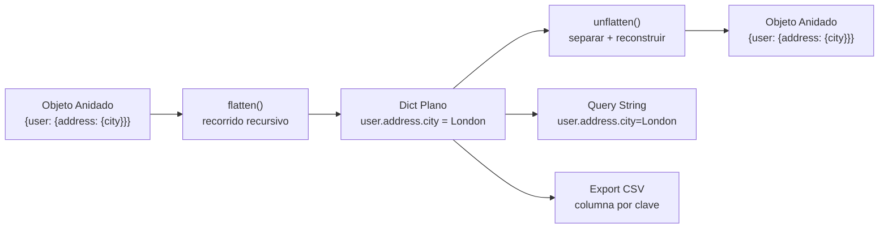

## Visión General

Aplanar convierte un objeto profundamente anidado en un diccionario de un solo nivel con claves como `user.address.city = "London"`. Reconstruir (unflatten) vuelve a armar la estructura original a partir de esas claves planas. Yo recurro a esto cuando necesito parchear un solo campo en un documento MongoDB, convertir datos de formulario en parámetros de query string, o pasar respuestas anidadas de APIs a un CSV plano para analytics. Los ejemplos de abajo muestran implementaciones recursivas en Python, JavaScript y Java, con separadores personalizados, manejo de índices de arrays y fidelidad en el ciclo de ida y vuelta. Recursos relacionados: [Formateo de Fechas](/recipes/date-formatting/) y [Manejo de Dinero y Moneda](/recipes/money-currency/).

## Cuándo Usar

Úsalo cuando:

- Conviertas datos de formularios anidados en pares clave-valor planos para [query strings HTTP](/recipes/url-encoding/) o exportación a CSV.
- Apliques parches solo en campos específicos profundamente anidados de documentos MongoDB o Elasticsearch.
- Normalices [respuestas de APIs JSON](/recipes/parse-json/) en estructuras relacionales planas para analytics.
- Construyas sistemas de configuración en vivo donde rutas con notación por puntos accedan a settings anidados.

## Solución

### Python

```python
import re
from typing import Any

def flatten(obj: Any, separator: str = ".", prefix: str = "") -> dict:
    result = {}
    if isinstance(obj, dict):
        for key, value in obj.items():
            new_key = f"{prefix}{separator}{key}" if prefix else key
            result.update(flatten(value, separator, new_key))
    elif isinstance(obj, list):
        for index, value in enumerate(obj):
            new_key = f"{prefix}[{index}]"
            result.update(flatten(value, separator, new_key))
    else:
        result[prefix] = obj
    return result

def _set(node, parts, value):
    for i, part in enumerate(parts[:-1]):
        next_is_index = parts[i + 1].isdigit()
        if isinstance(node, list):
            index = int(part)
            while len(node) <= index:
                node.append(None)
            if node[index] is None:
                node[index] = [] if next_is_index else {}
            node = node[index]
        else:
            if part not in node:
                node[part] = [] if next_is_index else {}
            node = node[part]

    last = parts[-1]
    if isinstance(node, list):
        index = int(last)
        while len(node) <= index:
            node.append(None)
        node[index] = value
    else:
        node[last] = value

def unflatten(flat: dict, separator: str = ".") -> Any:
    result = {}
    split_re = re.compile(re.escape(separator) + r"|\[|\]")
    for key, value in flat.items():
        parts = [p for p in split_re.split(key) if p]
        _set(result, parts, value)
    return result

# Uso
nested = {
    "user": {
        "name": "Alice",
        "address": {"city": "London", "zip": "SW1A"},
        "tags": ["admin", "active"]
    },
    "version": 1
}

flat = flatten(nested)
print(flat)
# {
#   "user.name": "Alice",
#   "user.address.city": "London",
#   "user.address.zip": "SW1A",
#   "user.tags[0]": "admin",
#   "user.tags[1]": "active",
#   "version": 1
# }

restored = unflatten(flat)
print(restored["user"]["address"]["city"])  # "London"
```

### JavaScript

```javascript
function flatten(obj, separator = ".", prefix = "") {
  const result = {};

  if (obj !== null && typeof obj === "object" && !Array.isArray(obj)) {
    for (const [key, value] of Object.entries(obj)) {
      const newKey = prefix ? `${prefix}${separator}${key}` : key;
      Object.assign(result, flatten(value, separator, newKey));
    }
  } else if (Array.isArray(obj)) {
    obj.forEach((value, index) => {
      const newKey = `${prefix}[${index}]`;
      Object.assign(result, flatten(value, separator, newKey));
    });
  } else {
    result[prefix] = obj;
  }

  return result;
}

function _set(node, parts, value) {
  for (let i = 0; i < parts.length - 1; i++) {
    const part = parts[i];
    const nextIsIndex = /^\d+$/.test(parts[i + 1]);
    if (Array.isArray(node)) {
      const index = Number(part);
      while (node.length <= index) node.push(null);
      if (node[index] === null) {
        node[index] = nextIsIndex ? [] : {};
      }
      node = node[index];
    } else {
      if (!(part in node)) {
        node[part] = nextIsIndex ? [] : {};
      }
      node = node[part];
    }
  }

  const last = parts[parts.length - 1];
  if (Array.isArray(node)) {
    const index = Number(last);
    while (node.length <= index) node.push(null);
    node[index] = value;
  } else {
    node[last] = value;
  }
}

function unflatten(flat, separator = ".") {
  const result = {};
  const esc = separator.replace(/[.*+?^${}()|[\]\\]/g, "\\$&");
  const splitRe = new RegExp(`${esc}|[\\[\\]]`, "g");

  for (const [key, value] of Object.entries(flat)) {
    const parts = key.split(splitRe).filter(Boolean);
    _set(result, parts, value);
  }

  return result;
}

// Uso
const nested = {
  user: {
    name: "Alice",
    address: { city: "London", zip: "SW1A" },
    tags: ["admin", "active"]
  },
  version: 1
};

const flat = flatten(nested);
console.log(flat["user.address.city"]); // "London"

const restored = unflatten(flat);
console.log(restored.user.address.city); // "London"
```

### Java

```java
import java.util.*;
import java.util.regex.Pattern;

public class FlattenUtil {

  public static Map<String, Object> flatten(Map<String, Object> map) {
    Map<String, Object> result = new LinkedHashMap<>();
    flattenHelper(map, ".", "", result);
    return result;
  }

  private static void flattenHelper(Object obj, String separator, String prefix, Map<String, Object> result) {
    if (obj instanceof Map) {
      Map<?, ?> map = (Map<?, ?>) obj;
      for (Map.Entry<?, ?> entry : map.entrySet()) {
        String key = prefix.isEmpty() ? entry.getKey().toString()
                                      : prefix + separator + entry.getKey();
        flattenHelper(entry.getValue(), separator, key, result);
      }
    } else if (obj instanceof List) {
      List<?> list = (List<?>) obj;
      for (int i = 0; i < list.size(); i++) {
        String key = prefix + "[" + i + "]";
        flattenHelper(list.get(i), separator, key, result);
      }
    } else {
      result.put(prefix, obj);
    }
  }

  public static Map<String, Object> unflatten(Map<String, Object> flat) {
    return unflatten(flat, ".");
  }

  public static Map<String, Object> unflatten(Map<String, Object> flat, String separator) {
    Map<String, Object> result = new LinkedHashMap<>();
    String splitRegex = Pattern.quote(separator) + "|\\[|\\]";

    for (Map.Entry<String, Object> entry : flat.entrySet()) {
      String[] rawParts = entry.getKey().split(splitRegex);
      List<String> parts = new ArrayList<>();
      for (String p : rawParts) {
        if (!p.isEmpty()) parts.add(p);
      }
      build(result, parts, 0, entry.getValue());
    }

    return result;
  }

  @SuppressWarnings("unchecked")
  private static void build(Object node, List<String> parts, int index, Object value) {
    if (index == parts.size() - 1) {
      String part = parts.get(index);
      if (node instanceof List) {
        int i = Integer.parseInt(part);
        List<Object> list = (List<Object>) node;
        while (list.size() <= i) list.add(null);
        list.set(i, value);
      } else {
        ((Map<String, Object>) node).put(part, value);
      }
      return;
    }

    String part = parts.get(index);
    boolean nextIsIndex = parts.get(index + 1).matches("\\d+");

    if (node instanceof List) {
      int i = Integer.parseInt(part);
      List<Object> list = (List<Object>) node;
      while (list.size() <= i) list.add(null);
      Object child = list.get(i);
      if (child == null) {
        child = nextIsIndex ? new ArrayList<>() : new LinkedHashMap<>();
        list.set(i, child);
      }
      build(child, parts, index + 1, value);
    } else {
      Map<String, Object> map = (Map<String, Object>) node;
      if (!map.containsKey(part)) {
        map.put(part, nextIsIndex ? new ArrayList<>() : new LinkedHashMap<>());
      }
      build(map.get(part), parts, index + 1, value);
    }
  }

  public static void main(String[] args) {
    Map<String, Object> nested = new LinkedHashMap<>();
    Map<String, Object> user = new LinkedHashMap<>();
    Map<String, Object> address = new LinkedHashMap<>();
    address.put("city", "London");
    address.put("zip", "SW1A");
    user.put("name", "Alice");
    user.put("address", address);
    user.put("tags", List.of("admin", "active"));
    nested.put("user", user);
    nested.put("version", 1);

    Map<String, Object> flat = flatten(nested);
    System.out.println(flat.get("user.address.city")); // London

    Map<String, Object> restored = unflatten(flat);
    Map<String, Object> restoredUser = (Map<String, Object>) restored.get("user");
    Map<String, Object> restoredAddress = (Map<String, Object>) restoredUser.get("address");
    System.out.println(restoredAddress.get("city")); // London
  }
}
```

## Explicación



La función recorre recursivamente cada par clave-valor de la estructura anidada. Para cada objeto anidado vuelve a llamarse con un prefijo actualizado. Para los arrays añade `[index]` para preservar la posición.

Las claves con notación por puntos (`parent.child.key`) se leen con facilidad y funcionan con la mayoría de parsers de query strings, con `get/set` de lodash y con la [notación de puntos de MongoDB](https://www.mongodb.com/docs/manual/core/document/#dot-notation). La sintaxis de corchetes para arrays (`tags[0]`) coincide con lo que produce [jQuery.param](https://api.jquery.com/jQuery.param/) y la mayoría de serializadores de formularios, así que la salida plana se integra directamente en peticiones HTTP sin conversión extra.

Al reconstruir, se separan las claves con notación por puntos y los índices entre corchetes, y se construyen los objetos anidados nivel por nivel. Detectar los índices de array (strings numéricos) permite reconstruir arrays en lugar de objetos con claves numéricas. La parte delicada es decidir si `"123"` es un índice de array o una clave de objeto — yo siempre verifico si la *siguiente* parte también es numérica, lo que me indica si el nivel actual debe ser una lista o un diccionario.

La fidelidad del ciclo completo se mantiene siempre que ninguna clave contenga el carácter separador. Si las claves contienen puntos (común con nombres de dominio o direcciones de email), usa un separador personalizado (`→`, `__`) o escapa el separador antes de aplanar y desescápalo al reconstruir.

### Casos límite que me siguen pillando

- **Arrays dispersos**: Si aplaneas `[1, , 3]` (nota el hueco en el índice 1), el dict plano contiene `0` y `2` pero no `1`. Al reconstruir obtienes `[1, null, 3]`, que es parecido pero no idéntico — el hueco se convierte en un `null` explícito.
- **Objetos con prototipo null**: `Object.create(null)` no tiene `hasOwnProperty`, así que la función `_set` de JavaScript que usa `part in node` funciona, pero las librerías que llaman `node.hasOwnProperty(part)` lanzarán un error.
- **Objetos Date**: Aplanar un `Date` produce su representación `.toString()`. Al reconstruir obtienes un string, no un `Date`. Si necesitas el tipo de vuelta, [serializa primero](/recipes/serialize-deserialize-data/) y aplana la forma serializada.
- **Claves mixtas array/objeto**: Un array con claves de string como `[{a: 1}, "texto"]` se aplana a `0.a` y `1`. Al reconstruir `0.a` se crea un objeto en el índice 0, pero `1` se convierte en un string en el índice 1 — el tipo mixto original se pierde.

## Variantes

| Enfoque | Separador | Manejo de Arrays | Mejor Para |
| --- | --- | --- | --- |
| Notación por puntos | `.` | Sufijo `[index]` | MongoDB, lodash, query strings |
| Notación por corchetes | `.` | `.0`, `.1` | Datos de formularios estilo PHP |
| Separador personalizado | `__` | `__0` | Claves que contienen puntos |
| Lodash `_.set` | `.` | Auto-detección | One-liners rápidos con dependencia |
| JSON Pointer | `/` | `/0` | JSON Patch, cumplimiento [RFC 6901](https://datatracker.ietf.org/doc/html/rfc6901) |

En la práctica, yo empiezo con notación por puntos para la mayoría de los casos porque es lo que esperan MongoDB, lodash y la mayoría de librerías de formularios. Solo cambio a notación por corchetes cuando trabajo con datos de formulario estilo PHP. Los separadores personalizados valen la pena cuando las claves contienen puntos (nombres de dominio, direcciones de email). JSON Pointer es la opción correcta solo cuando necesitas cumplimiento [RFC 6901](https://datatracker.ietf.org/doc/html/rfc6901) para operaciones [JSON Patch](https://datatracker.ietf.org/doc/html/rfc6902) — es excesivo para ciclos simples de aplanar/reconstruir.

## Mejores Prácticas

Trata el separador como un carácter reservado. Si tus claves pueden contener puntos (por ejemplo `example.com`), yo lo cambio por `__` o una flecha Unicode para que la ruta no choque con el nombre de la clave. Esto me pilló una vez al aplanar registros DNS — las claves con notación por puntos eran indistinguibles de los nombres de dominio en los valores.

Siempre conserva los índices del array en la clave aplanada (`tags[0]`). Si los quitas, al reconstruir el objeto el array se convierte en un objeto cuyas claves son strings numéricos y el ciclo se rompe silenciosamente. He visto este bug en producción en handlers de formulario donde el backend recibía `{tags: {"0": "admin"}}` en lugar de `{tags: ["admin"]}`.

Deja los valores `null` tal cual y decide de antemano si conservar o descartar los objetos vacíos. El ciclo aplanar/reconstruir no sabe lo que tu aplicación espera, así que conviene dejar la regla explícita en las opciones de tu función flatten.

Al aplanar se pierde la información de tipos como Date, Map, Set o typed arrays. Si necesitas recuperarlos, [serialízalos primero](/recipes/serialize-deserialize-data/) y reconstruye alrededor de la representación en string. Yo suelo convertir Dates a strings ISO 8601 antes de aplanar y parsearlos de vuelta con una función reviver.

Cuando el input no sea confiable, limita la profundidad de recursión y lleva un `WeakSet` con los objetos visitados para evitar que un payload malicioso desborde la pila o entre en un bucle infinito. Un límite de profundidad de 20 es suficiente para la mayoría de datos reales; cualquier cosa más profunda es casi con seguridad un payload malicioso o un bug en la fuente de datos.

## Errores Comunes

1. Usar notación por puntos cuando las claves de datos mismas contienen puntos, causando rutas ambiguas o incorrectas.
2. Aplanar arrays sin preservar índices, por lo que no puedes reconstruir la estructura original.
3. No manejar referencias circulares, que causan recursión infinita. Usa un cache `WeakSet` para detectar ciclos.
4. Intentar reconstruir claves con separadores inconsistentes (mezclando `.` y `_`), produciendo una salida malformada.
5. Tratar todas las claves de string numéricas como índices de arrays, convirtiendo claves de objetos como `"123"` en arrays inesperadamente.

## Cuándo No Usar Este Enfoque

Aplanar no es la herramienta adecuada para todo problema de datos anidados. Yo lo evito cuando:

- **Los datos tienen tipos mixtos que importan.** Dates, Maps, Sets, typed arrays e instancias de clases personalizadas pierden su tipo al aplanar. Si el consumidor de los datos planos necesita llamar métodos sobre los valores, aplanar destruye esa capacidad.
- **La estructura es extremadamente profunda (50+ niveles).** El aplanado recursivo desborda la pila con payloads profundamente anidados. Una versión iterativa con una pila explícita evita esto, pero a esa profundidad las claves planas se vuelven ilegibles (`a.b.c.d.e.f...`) y la representación plana es más difícil de manejar que la original.
- **Necesitas consultar los datos frecuentemente.** Si vas a hacer lookups repetidos sobre los mismos datos, guárdalos en una base de datos que soporte JSON nativamente (PostgreSQL `jsonb`, MongoDB) y usa consultas [JSON Path](https://www.postgresql.org/docs/current/functions-json.html) o de notación por puntos en lugar de aplanar en la capa de aplicación.
- **Los datos ya son tabulares.** Si el input es una lista de objetos planos, aplanar no hace nada útil y añade overhead. Usa [parsing CSV](/recipes/parse-csv-files/) o `pandas.DataFrame` directamente.

## Herramientas y Ecosistema

| Lenguaje | Librería | Qué hace |
| --- | --- | --- |
| JavaScript | [`flat`](https://www.npmjs.com/package/flat) | Aplanar/reconstruir con separadores personalizados, límites de profundidad, manejo seguro de claves |
| JavaScript | [lodash `_.get`/`_.set`](https://lodash.com/docs/4.17.15#get) | Acceso por ruta sin aplanar completamente; útil para actualizaciones puntuales |
| Python | [`flatten-dict`](https://pypi.org/project/flatten-dict/) | Aplanar/reconstruir con splitters y joiners personalizados |
| Python | [`pandas.json_normalize`](https://pandas.pydata.org/docs/reference/api/pandas.json_normalize.html) | Aplana JSON semi-estructurado en un DataFrame para analytics |
| Java | [Jackson `JsonPointer`](https://www.javadoc.io/doc/com.fasterxml.jackson.core/jackson-databinder/latest/com/fasterxml/jackson/databind/JsonPointer.html) | Acceso a árboles JSON con punteros RFC 6901 |
| Java | [Gson `JsonObject` traversal](https://www.javadoc.io/doc/com.google.code.gson/gson/latest/com/google/gson/JsonObject.html) | Recorrido recursivo manual para lógica de aplanado personalizada |
| Cualquiera | [RFC 6901 JSON Pointer](https://datatracker.ietf.org/doc/html/rfc6901) | Sintaxis estandarizada de rutas para nodos JSON |
| Cualquiera | [RFC 6902 JSON Patch](https://datatracker.ietf.org/doc/html/rfc6902) | Formato de patch que usa rutas JSON Pointer |

Yo uso `flat` en JavaScript y `flatten-dict` en Python para la mayoría del trabajo en producción. Manejan casos límite (referencias circulares, separadores personalizados, límites de profundidad) que una función hecha a mano no cubre. Para pipelines de analytics, `pandas.json_normalize` es la herramienta correcta porque produce un DataFrame directamente, saltándose el paso intermedio del dict plano.

## Notas de Rendimiento

Aplanar es O(n) en el número de pares clave-valor — visita cada hoja una vez. El factor constante depende del lenguaje: las operaciones de dict en Python son más lentas que el acceso a propiedades de objetos en V8 de JavaScript, y el `LinkedHashMap` de Java añade overhead por el boxing de `Map.Entry` genérico.

Para payloads grandes (100k+ claves), el cuello de botella suele ser la concatenación de strings para las claves de prefijo, no la recursión en sí. En JavaScript, usar un array de segmentos de ruta y unir al final (`parts.join(separator)`) es más rápido que construir el string incrementalmente (`prefix + separator + key`) porque V8 optimiza los joins de arrays.

La profundidad de recursión es el riesgo real. El límite de recursión por defecto de Python es 1000, que suena generoso pero es fácil de alcanzar con input adversarial. Los motores de JavaScript varían pero típicamente permiten 10k+ frames. El tamaño de pila de Java es configurable via `-Xss`. Para input no confiable, siempre limita la profundidad — yo uso 20 como default razonable y rechazo cualquier cosa más profunda.

## Puntos Clave

- Aplanar convierte objetos anidados en claves con notación por puntos; reconstruir lo revierte. El ciclo es lossless para JSON plano pero lossy para Dates, Maps, Sets y arrays dispersos.
- Siempre conserva los índices de array (`tags[0]`) en las claves planas. Quitarlos convierte silenciosamente arrays en objetos con claves numéricas de string.
- Elige un separador que no pueda aparecer en tus claves. Si las claves contienen puntos, usa `__` o un carácter Unicode.
- Limita la profundidad de recursión para input no confiable. Un límite de 20 es suficiente para datos reales y previene ataques de stack overflow.
- Usa librerías establecidas (`flat`, `flatten-dict`, `pandas.json_normalize`) en producción. Manejan casos límite que las funciones hechas a mano no cubren.

## Ver También

- [RFC 6901 — JSON Pointer](https://datatracker.ietf.org/doc/html/rfc6901) — Sintaxis estandarizada de rutas para nodos JSON
- [RFC 6902 — JSON Patch](https://datatracker.ietf.org/doc/html/rfc6902) — Formato de patch usando rutas JSON Pointer
- [flat (npm)](https://www.npmjs.com/package/flat) — Librería JavaScript de aplanar/reconstruir
- [flatten-dict (PyPI)](https://pypi.org/project/flatten-dict/) — Librería Python de aplanar/reconstruir
- [pandas.json_normalize](https://pandas.pydata.org/docs/reference/api/pandas.json_normalize.html) — Aplanar JSON en DataFrames
- [Jackson JsonPointer](https://www.javadoc.io/doc/com.fasterxml.jackson.core/jackson-databinder/latest/com/fasterxml/jackson/databind/JsonPointer.html) — Recorrido de punteros JSON en Java
- [Parse JSON](/recipes/parse-json/) — Parsear strings JSON a objetos
- [Serializar y Deserializar Datos](/recipes/serialize-deserialize-data/) — Preservar tipos a través de la serialización
- [Codificación de URL](/recipes/url-encoding/) — Codificar pares clave-valor planos para query strings

## Preguntas Frecuentes

### ¿Puedo aplanar solo hasta una profundidad específica?

Sí. Agrega un parámetro `maxDepth` y detén la recursión cuando `currentDepth >= maxDepth`. Todo lo que quede por debajo se conserva anidado bajo el prefijo actual. Es útil para actualizaciones superficiales en las que solo te importan los primeros dos niveles.

### ¿Cómo manejo claves que contienen el carácter separador?

Escapa el separador en las claves antes de aplanar (por ejemplo, reemplaza `.` por `\.`) y desescápalo al reconstruir. O elige un separador que no pueda aparecer en tus datos, como `→` u otro carácter Unicode. La mayoría de librerías, incluida `flat`, permiten usar un separador personalizado.

### ¿El ciclo aplanar → reconstruir siempre produce el mismo resultado?

No. Arrays con índices dispersos, objetos con prototipos `null` y tipos especiales como Date, RegExp o Map pueden cambiar después del ciclo. Si necesitas fidelidad estricta, guarda metadata de los tipos originales junto con los datos aplanados, o usa un formato como JSON Pointer que conserve la información estructural.

### ¿Por qué mi reconstrucción convierte claves de objeto como "123" en arrays?

Porque la función de reconstrucción verifica si una clave es numérica para decidir entre crear un array o un objeto en ese nivel. Si tus datos tienen claves de objeto legítimas que son strings numéricos (códigos postales, IDs), la función las confunde con índices de array. Para arreglarlo, usa un separador que distinga explícitamente claves de objeto de índices de array, o añade un flag para desactivar la conversión de claves numéricas a arrays.

### ¿Cómo aplaneo objetos con referencias circulares?

Lleva un `WeakSet` con los objetos visitados. Cuando la recursión encuentre un objeto que ya está en el conjunto, reemplázalo por un marcador como `[Circular]` u omite la clave. La referencia circular no sobrevive al reconstruir, así que si necesitas conservarla, usa una librería como `flatted` o `circular-json` que codifica los ciclos como rutas indexadas.

### ¿Qué librerías manejan aplanar/reconstruir en producción?

En JavaScript, `flat` es muy usada y soporta separadores personalizados, límites de profundidad y manejo seguro de claves. En Python, `flatten-dict` y `pandas.json_normalize` cubren la mayoría de los casos. En Java, `JsonPointer` de Jackson y el recorrido de `JsonObject` de Gson pueden aplanar árboles JSON. Para trabajo específico de base de datos, como `jsonb_path_query` en PostgreSQL, usa las funciones JSON nativas de la base de datos en vez de hacerlo en la aplicación.

### ¿Cómo aplaneo objetos TypeScript preservando información de tipos?

Define un tipo genérico `Flatten<T>` que construya recursivamente claves como ``${Prefix}.${Key}``. En runtime la función sigue produciendo claves de string, pero el tipo le indica al compilador qué claves esperar. Usa aserciones `as const` sobre el resultado aplanado y valida los datos no confiables con Zod.

