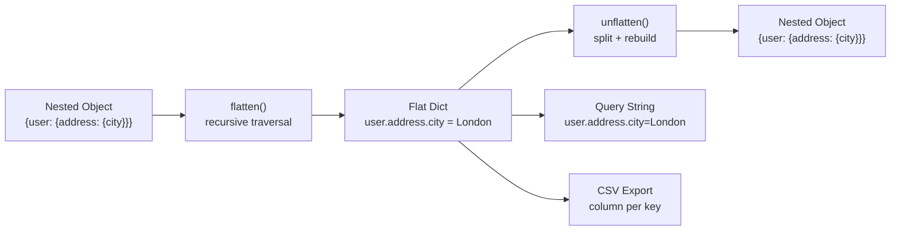

## Overview

Flattening turns a deeply nested object into a single-level dictionary with dot-notation keys like `user.address.city = "London"`. Unflattening rebuilds the original structure from those flat keys. I reach for this when I need to patch a single field in a MongoDB document, convert form data into query string parameters, or feed nested API responses into a flat CSV for analytics. The examples below run in Python, JavaScript, and Java, and cover custom separators, bracketed array indices, and round-trip fidelity. Related recipes: [Date Formatting](/recipes/date-formatting/) and [Money and Currency Handling](/recipes/money-currency/).

## When to Use

Reach for this when:

- Converting nested form data into flat key-value pairs for [HTTP query strings](/recipes/url-encoding/) or CSV export.
- Patching only specific deeply nested fields in a MongoDB or Elasticsearch document.
- Normalizing [JSON API responses](/recipes/parse-json/) into a flat relational structure for analytics.
- Building live configuration systems where dot-notation paths access nested settings.

## Solution

### Python

```python
import re
from typing import Any

def flatten(obj: Any, separator: str = ".", prefix: str = "") -> dict:
    result = {}
    if isinstance(obj, dict):
        for key, value in obj.items():
            new_key = f"{prefix}{separator}{key}" if prefix else key
            result.update(flatten(value, separator, new_key))
    elif isinstance(obj, list):
        for index, value in enumerate(obj):
            new_key = f"{prefix}[{index}]"
            result.update(flatten(value, separator, new_key))
    else:
        result[prefix] = obj
    return result

def _set(node, parts, value):
    for i, part in enumerate(parts[:-1]):
        next_is_index = parts[i + 1].isdigit()
        if isinstance(node, list):
            index = int(part)
            while len(node) <= index:
                node.append(None)
            if node[index] is None:
                node[index] = [] if next_is_index else {}
            node = node[index]
        else:
            if part not in node:
                node[part] = [] if next_is_index else {}
            node = node[part]

    last = parts[-1]
    if isinstance(node, list):
        index = int(last)
        while len(node) <= index:
            node.append(None)
        node[index] = value
    else:
        node[last] = value

def unflatten(flat: dict, separator: str = ".") -> Any:
    result = {}
    split_re = re.compile(re.escape(separator) + r"|\[|\]")
    for key, value in flat.items():
        parts = [p for p in split_re.split(key) if p]
        _set(result, parts, value)
    return result

# Usage
nested = {
    "user": {
        "name": "Alice",
        "address": {"city": "London", "zip": "SW1A"},
        "tags": ["admin", "active"]
    },
    "version": 1
}

flat = flatten(nested)
print(flat)
# {
#   "user.name": "Alice",
#   "user.address.city": "London",
#   "user.address.zip": "SW1A",
#   "user.tags[0]": "admin",
#   "user.tags[1]": "active",
#   "version": 1
# }

restored = unflatten(flat)
print(restored["user"]["address"]["city"])  # "London"
```

### JavaScript

```javascript
function flatten(obj, separator = ".", prefix = "") {
  const result = {};

  if (obj !== null && typeof obj === "object" && !Array.isArray(obj)) {
    for (const [key, value] of Object.entries(obj)) {
      const newKey = prefix ? `${prefix}${separator}${key}` : key;
      Object.assign(result, flatten(value, separator, newKey));
    }
  } else if (Array.isArray(obj)) {
    obj.forEach((value, index) => {
      const newKey = `${prefix}[${index}]`;
      Object.assign(result, flatten(value, separator, newKey));
    });
  } else {
    result[prefix] = obj;
  }

  return result;
}

function _set(node, parts, value) {
  for (let i = 0; i < parts.length - 1; i++) {
    const part = parts[i];
    const nextIsIndex = /^\d+$/.test(parts[i + 1]);
    if (Array.isArray(node)) {
      const index = Number(part);
      while (node.length <= index) node.push(null);
      if (node[index] === null) {
        node[index] = nextIsIndex ? [] : {};
      }
      node = node[index];
    } else {
      if (!(part in node)) {
        node[part] = nextIsIndex ? [] : {};
      }
      node = node[part];
    }
  }

  const last = parts[parts.length - 1];
  if (Array.isArray(node)) {
    const index = Number(last);
    while (node.length <= index) node.push(null);
    node[index] = value;
  } else {
    node[last] = value;
  }
}

function unflatten(flat, separator = ".") {
  const result = {};
  const esc = separator.replace(/[.*+?^${}()|[\]\\]/g, "\\$&");
  const splitRe = new RegExp(`${esc}|[\\[\\]]`, "g");

  for (const [key, value] of Object.entries(flat)) {
    const parts = key.split(splitRe).filter(Boolean);
    _set(result, parts, value);
  }

  return result;
}

// Usage
const nested = {
  user: {
    name: "Alice",
    address: { city: "London", zip: "SW1A" },
    tags: ["admin", "active"]
  },
  version: 1
};

const flat = flatten(nested);
console.log(flat["user.address.city"]); // "London"

const restored = unflatten(flat);
console.log(restored.user.address.city); // "London"
```

### Java

```java
import java.util.*;
import java.util.regex.Pattern;

public class FlattenUtil {

  public static Map<String, Object> flatten(Map<String, Object> map) {
    Map<String, Object> result = new LinkedHashMap<>();
    flattenHelper(map, ".", "", result);
    return result;
  }

  private static void flattenHelper(Object obj, String separator, String prefix, Map<String, Object> result) {
    if (obj instanceof Map) {
      Map<?, ?> map = (Map<?, ?>) obj;
      for (Map.Entry<?, ?> entry : map.entrySet()) {
        String key = prefix.isEmpty() ? entry.getKey().toString()
                                      : prefix + separator + entry.getKey();
        flattenHelper(entry.getValue(), separator, key, result);
      }
    } else if (obj instanceof List) {
      List<?> list = (List<?>) obj;
      for (int i = 0; i < list.size(); i++) {
        String key = prefix + "[" + i + "]";
        flattenHelper(list.get(i), separator, key, result);
      }
    } else {
      result.put(prefix, obj);
    }
  }

  public static Map<String, Object> unflatten(Map<String, Object> flat) {
    return unflatten(flat, ".");
  }

  public static Map<String, Object> unflatten(Map<String, Object> flat, String separator) {
    Map<String, Object> result = new LinkedHashMap<>();
    String splitRegex = Pattern.quote(separator) + "|\\[|\\]";

    for (Map.Entry<String, Object> entry : flat.entrySet()) {
      String[] rawParts = entry.getKey().split(splitRegex);
      List<String> parts = new ArrayList<>();
      for (String p : rawParts) {
        if (!p.isEmpty()) parts.add(p);
      }
      build(result, parts, 0, entry.getValue());
    }

    return result;
  }

  @SuppressWarnings("unchecked")
  private static void build(Object node, List<String> parts, int index, Object value) {
    if (index == parts.size() - 1) {
      String part = parts.get(index);
      if (node instanceof List) {
        int i = Integer.parseInt(part);
        List<Object> list = (List<Object>) node;
        while (list.size() <= i) list.add(null);
        list.set(i, value);
      } else {
        ((Map<String, Object>) node).put(part, value);
      }
      return;
    }

    String part = parts.get(index);
    boolean nextIsIndex = parts.get(index + 1).matches("\\d+");

    if (node instanceof List) {
      int i = Integer.parseInt(part);
      List<Object> list = (List<Object>) node;
      while (list.size() <= i) list.add(null);
      Object child = list.get(i);
      if (child == null) {
        child = nextIsIndex ? new ArrayList<>() : new LinkedHashMap<>();
        list.set(i, child);
      }
      build(child, parts, index + 1, value);
    } else {
      Map<String, Object> map = (Map<String, Object>) node;
      if (!map.containsKey(part)) {
        map.put(part, nextIsIndex ? new ArrayList<>() : new LinkedHashMap<>());
      }
      build(map.get(part), parts, index + 1, value);
    }
  }

  public static void main(String[] args) {
    Map<String, Object> nested = new LinkedHashMap<>();
    Map<String, Object> user = new LinkedHashMap<>();
    Map<String, Object> address = new LinkedHashMap<>();
    address.put("city", "London");
    address.put("zip", "SW1A");
    user.put("name", "Alice");
    user.put("address", address);
    user.put("tags", List.of("admin", "active"));
    nested.put("user", user);
    nested.put("version", 1);

    Map<String, Object> flat = flatten(nested);
    System.out.println(flat.get("user.address.city")); // London

    Map<String, Object> restored = unflatten(flat);
    Map<String, Object> restoredUser = (Map<String, Object>) restored.get("user");
    Map<String, Object> restoredAddress = (Map<String, Object>) restoredUser.get("address");
    System.out.println(restoredAddress.get("city")); // London
  }
}
```

## Explanation



Recursive traversal walks every key-value pair in the nested structure. Each nested object triggers another call with an updated prefix. For arrays, the function appends `[index]` to preserve positional data.

Dot-notation keys (`parent.child.key`) are human-readable and compatible with most query string parsers, lodash `get/set`, and MongoDB [dot notation](https://www.mongodb.com/docs/manual/core/document/#dot-notation). The bracket syntax for arrays (`tags[0]`) matches what [jQuery.param](https://api.jquery.com/jQuery.param/) and most form serializers produce, so the flat output drops directly into HTTP requests without extra conversion.

Unflattening splits dot-notation and bracket-index keys and builds nested objects level by level. Detecting array indices (numeric strings) lets it reconstruct arrays instead of objects with numeric keys. The tricky part is deciding whether `"123"` is an array index or an object key — I always check whether the *next* part is also numeric, which tells me the current level should be a list, not a dict.

Round-trip fidelity holds as long as no key contains the separator. If keys contain dots (common with domain names or email values), I switch to a custom separator like `→` or `__`, or escape the separator before flattening and unescape it after unflattening.

### Edge cases I keep hitting

- **Sparse arrays**: If you flatten `[1, , 3]` (note the hole at index 1), the flat dict contains `0` and `2` but not `1`. Unflattening produces `[1, null, 3]`, which is close but not identical — the hole becomes an explicit `null`.
- **Null prototype objects**: `Object.create(null)` has no `hasOwnProperty`, so the JavaScript `_set` function using `part in node` works, but libraries that call `node.hasOwnProperty(part)` will throw.
- **Date objects**: Flattening a `Date` produces its `.toString()` representation. Unflattening gives you a string, not a `Date`. If you need the type back, [serialize first](/recipes/serialize-deserialize-data/) and flatten the serialized form.
- **Mixed array/object keys**: An array with string keys like `[{a: 1}, "text"]` flattens to `0.a` and `1`. Unflattening `0.a` creates an object at index 0, but `1` becomes a string at index 1 — the original mixed type is lost.

## Variants

| Approach | Separator | Array Handling | Best For |
| --- | --- | --- | --- |
| Dot-notation | `.` | `[index]` suffix | MongoDB, lodash, query strings |
| Bracket-notation | `.` | `.0`, `.1` | PHP-style form data |
| Custom separator | `__` | `__0` | Keys that contain dots |
| Lodash `_.set` | `.` | Auto-detection | Quick one-liners with library dependency |
| JSON Pointer | `/` | `/0` | JSON Patch, [RFC 6901](https://datatracker.ietf.org/doc/html/rfc6901) compliance |

In practice, I start with dot-notation for most cases because it's what MongoDB, lodash, and most form libraries expect. I only switch to bracket-notation when I'm dealing with PHP-style form data. Custom separators are worth it when keys contain dots (domain names, email values like `user@example.com`). JSON Pointer is the right choice only when you need [RFC 6901](https://datatracker.ietf.org/doc/html/rfc6901) compliance for [JSON Patch](https://datatracker.ietf.org/doc/html/rfc6902) operations — it's overkill for simple flatten/unflatten round-trips.

## Best Practices

The safest approach is to treat the separator as a reserved character. If your data might contain dots (for example, domain names like `example.com`), I switch to a double underscore or an arrow symbol so the separator never clashes with the key itself. This bit me once when flattening DNS records — the dot-notation keys were indistinguishable from the domain names in the values.

Always keep array indices in the flat key (`tags[0]`). If you drop them, unflatten turns the array into an object whose keys are numeric strings, which breaks the round-trip silently. I've seen this bug in production form handlers where the backend received `{tags: {"0": "admin"}}` instead of `{tags: ["admin"]}`.

Leave `null` values intact, and decide up front whether to keep or drop empty objects. The round-trip won't know what your application expected, so make the rule explicit in your flatten function's options.

Flattening can't preserve Dates, Maps, Sets, or typed arrays. If you need those types back, [serialize them first](/recipes/serialize-deserialize-data/) and unflatten around the string representation. I usually convert Dates to ISO 8601 strings before flattening and parse them back with a reviver function.

For untrusted input, cap the recursion depth and track visited objects with a `WeakSet` so a malicious payload can't blow the stack or loop forever. A depth limit of 20 is enough for most real-world data; anything deeper is almost certainly a malicious payload or a bug in the upstream data source.

## Common Mistakes

1. Using dots as separators when the keys themselves contain dots, which produces ambiguous paths.
2. Flattening arrays without preserving their indices means you can't reconstruct the original structure.
3. Not handling circular references, which cause infinite recursion. Track visited objects with a `WeakSet`.
4. Trying to unflatten keys that mix dots and underscore characters produces malformed output.
5. Treating all numeric string keys as array indices, which turns object keys like `"123"` into arrays unexpectedly.

## When Not to Use This Approach

Flattening isn't the right tool for every nested-data problem. I avoid it when:

- **The data has mixed types that matter.** Dates, Maps, Sets, typed arrays, and custom class instances lose their type during flatten. If the consumer of the flat data needs to call methods on the values, flattening destroys that capability.
- **The structure is extremely deep (50+ levels).** Recursive flatten blows the stack on deeply nested payloads. An iterative version with an explicit stack avoids this, but at that depth the flat keys become unreadable (`a.b.c.d.e.f...`) and the flat representation is harder to work with than the original.
- **You need to query the data frequently.** If you're running repeated lookups on the same data, store it in a database that supports JSON natively (PostgreSQL `jsonb`, MongoDB) and use [JSON Path](https://www.postgresql.org/docs/current/functions-json.html) or dot-notation queries instead of flattening in the application layer.
- **The data is already tabular.** If the input is a list of flat objects, flattening does nothing useful and adds overhead. Use [CSV parsing](/recipes/parse-csv-files/) or `pandas.DataFrame` directly.

## Tooling and Ecosystem

| Language | Library | What it does |
| --- | --- | --- |
| JavaScript | [`flat`](https://www.npmjs.com/package/flat) | Flatten/unflatten with custom separators, depth limits, safe key handling |
| JavaScript | [lodash `_.get`/`_.set`](https://lodash.com/docs/4.17.15#get) | Path-based access without full flatten; useful for one-off field updates |
| Python | [`flatten-dict`](https://pypi.org/project/flatten-dict/) | Flatten/unflatten with custom splitters and key joiners |
| Python | [`pandas.json_normalize`](https://pandas.pydata.org/docs/reference/api/pandas.json_normalize.html) | Flatten semi-structured JSON into a DataFrame for analytics |
| Java | [Jackson `JsonPointer`](https://www.javadoc.io/doc/com.fasterxml.jackson.core/jackson-databinder/latest/com/fasterxml/jackson/databind/JsonPointer.html) | RFC 6901 pointer-based access to JSON trees |
| Java | [Gson `JsonObject` traversal](https://www.javadoc.io/doc/com.google.code.gson/gson/latest/com/google/gson/JsonObject.html) | Manual recursive traversal for custom flatten logic |
| Any | [RFC 6901 JSON Pointer](https://datatracker.ietf.org/doc/html/rfc6901) | Standardized path syntax for JSON nodes |
| Any | [RFC 6902 JSON Patch](https://datatracker.ietf.org/doc/html/rfc6902) | Patch format that uses JSON Pointer paths |

I use `flat` in JavaScript and `flatten-dict` in Python for most production work. They handle edge cases (circular references, custom separators, depth limits) that a hand-rolled function misses. For analytics pipelines, `pandas.json_normalize` is the right tool because it produces a DataFrame directly, skipping the intermediate flat-dict step.

## Performance Notes

Flattening is O(n) in the number of key-value pairs — it visits every leaf once. The constant factor depends on the language: Python's dict operations are slower than JavaScript's V8 object property access, and Java's `LinkedHashMap` adds overhead from the generic `Map.Entry` boxing.

For large payloads (100k+ keys), the bottleneck is usually string concatenation for the prefix keys, not the recursion itself. In JavaScript, using an array of path segments and joining at the end (`parts.join(separator)`) is faster than building the string incrementally (`prefix + separator + key`) because V8 speeds up array joins.

Recursion depth is the real risk. Python's default recursion limit is 1000, which sounds generous but is easy to hit with adversarial input. JavaScript engines vary but typically allow 10k+ frames. Java's stack size is configurable via `-Xss`. For untrusted input, always cap the depth — I use 20 as a sane default and reject anything deeper.

## Key Takeaways

- Flatten converts nested objects to dot-notation keys; unflatten reverses it. The round-trip is lossless for plain JSON but lossy for Dates, Maps, Sets, and sparse arrays.
- Always preserve array indices (`tags[0]`) in flat keys. Dropping them silently converts arrays to objects with numeric string keys.
- Choose a separator that can't appear in your keys. If keys contain dots, use `__` or a Unicode character instead.
- Cap recursion depth for untrusted input. A depth limit of 20 is enough for real-world data and prevents stack overflow attacks.
- Use established libraries (`flat`, `flatten-dict`, `pandas.json_normalize`) in production. They handle edge cases that hand-rolled functions miss.

## See Also

- [RFC 6901 — JSON Pointer](https://datatracker.ietf.org/doc/html/rfc6901) — Standardized path syntax for JSON nodes
- [RFC 6902 — JSON Patch](https://datatracker.ietf.org/doc/html/rfc6902) — Patch format using JSON Pointer paths
- [flat (npm)](https://www.npmjs.com/package/flat) — JavaScript flatten/unflatten library
- [flatten-dict (PyPI)](https://pypi.org/project/flatten-dict/) — Python flatten/unflatten library
- [pandas.json_normalize](https://pandas.pydata.org/docs/reference/api/pandas.json_normalize.html) — Flatten JSON into DataFrames
- [Jackson JsonPointer](https://www.javadoc.io/doc/com.fasterxml.jackson.core/jackson-databinder/latest/com/fasterxml/jackson/databind/JsonPointer.html) — Java JSON pointer traversal
- [Parse JSON](/recipes/parse-json/) — Parse JSON strings into objects
- [Serialize and Deserialize Data](/recipes/serialize-deserialize-data/) — Preserve types across serialization
- [URL Encoding](/recipes/url-encoding/) — Encode flat key-value pairs for query strings

## FAQ

### Can I flatten only to a specific depth?

Yes. Add a `maxDepth` parameter and stop recursing once `currentDepth >= maxDepth`. Everything below that depth stays nested under the current prefix. That works well for shallow updates where the first two levels are enough.

### How do I handle keys that contain the separator character?

Escape the separator in the keys before flattening (for example, replace `.` with `\.`), then unescape it during unflatten. Or choose a separator that can't show up in your data, like `→` or another Unicode character. Most libraries, including the flat package, let you set a custom separator.

### Does round-trip flatten → unflatten always produce identical output?

No. Sparse arrays, objects with a null prototype, and special types like Date, RegExp, and Map can change after a round-trip. If you need strict fidelity, store metadata about the original types alongside the flat data, or use a format like JSON Pointer that keeps structural information.

### Why does my unflatten turn object keys like "123" into arrays?

Because the unflatten function checks whether a key is numeric to decide between creating an array or an object at that level. If your data has legitimate object keys that are numeric strings (zip codes, IDs), the function mistakes them for array indices. To fix this, use a separator that distinguishes object keys from array indices explicitly, or add a flag to disable numeric-key-to-array conversion.

### How do I flatten objects with circular references?

Track visited objects with a `WeakSet`. When recursion finds a cycle, either drop the key or mark the object. If you want the reference to stay visible, use a placeholder such as `[Circular]`.

The circular link won't survive unflatten. If you need to keep it, use a library like `flatted` or `circular-json` that encodes cycles as indexed paths.

### What libraries handle flatten/unflatten in production?

In JavaScript, `flat` is widely used and supports custom separators, depth limits, and safe key handling. In Python, `flatten-dict` and `pandas.json_normalize` cover most cases. In Java, Jackson's `JsonPointer` and Gson's `JsonObject` traversal can flatten JSON trees. For database work, such as PostgreSQL JSON path queries, use the database's built-in functions instead of doing it in the application.

### How do I flatten TypeScript objects while preserving type information?

A generic type that builds keys recursively as ``${Prefix}.${Key}`` does the job. In TypeScript, that type is usually written as `Flatten<T>`. At runtime the function still produces plain string keys; the type only tells the compiler which keys to expect. Add `as const` assertions to the flattened output and validate untrusted input with a Zod schema.

