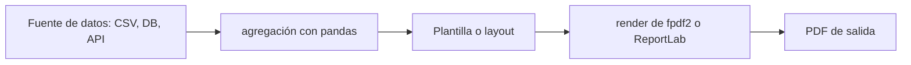

## Visión General

La mayoría de los equipos termina necesitando convertir datos en un PDF. Yo he
construido facturas para un procesador de pagos, resúmenes semanales de ventas
para un marketplace y certificados para una plataforma de cursos online, y Python
ha sido mi herramienta por defecto en todos. Las dos librerías a las que recurro
son ReportLab y fpdf2.

fpdf2 es pequeña, rápida de aprender e ideal para documentos con mucho texto donde
solo necesitás una página, algunas celdas y una ruta de salida. ReportLab es más
grande y más potente: te da un motor de layout completo con tablas, estilos de
párrafo, imágenes, encabezados, pies de página y plantillas de página
personalizadas. Armo ejemplos funcionales para ambas librerías que podés copiar,
adaptar y ejecutar con tus propios datos.

## Cuándo Usar

Usá estas librerías cuando necesites:

- Generar facturas, recibos o reportes financieros a partir de filas de base de
  datos.
- Construir pipelines de reportes automatizados, como resúmenes diarios o
  semanales enviados por email.
- Exportar tablas de datos con formato a PDF desde un dashboard web o una
  herramienta de línea de comandos.
- Crear certificados, etiquetas o documentos imprimibles a partir de plantillas.
- Producir reportes por lote para cientos de clientes sin abrir un procesador de
  texto.

Usé fpdf2 para un generador de certificados simple y ReportLab para un dashboard
de ventas de varias páginas que necesitaba tablas con estilo y gráficos
embebidos. Elegir la librería correcta para el trabajo mantiene el código chico y
la salida predecible.

## Solución

### PDF básico con fpdf2

```python
from fpdf import FPDF

pdf = FPDF()
pdf.add_page()
pdf.set_font("Helvetica", size=12)

pdf.cell(200, 10, txt="Sales Report", new_x="LMARGIN", new_y="NEXT", align="C")
pdf.ln(10)

pdf.cell(200, 10, txt="Total Revenue: $15,430", new_x="LMARGIN", new_y="NEXT")
pdf.cell(200, 10, txt="Orders: 247", new_x="LMARGIN", new_y="NEXT")

pdf.output("report.pdf")
```

### PDF con estilos usando ReportLab

```python
from reportlab.lib.pagesizes import A4
from reportlab.lib.styles import getSampleStyleSheet, ParagraphStyle
from reportlab.lib.units import cm
from reportlab.platypus import SimpleDocTemplate, Paragraph, Spacer, Table
from reportlab.lib import colors

doc = SimpleDocTemplate(
    "report.pdf",
    pagesize=A4,
    topMargin=2 * cm,
    bottomMargin=2 * cm
)

styles = getSampleStyleSheet()
title_style = ParagraphStyle(
    "CustomTitle",
    parent=styles["Title"],
    fontSize=18,
    textColor=colors.HexColor("#1a56db")
)
body_style = ParagraphStyle(
    "CustomBody",
    parent=styles["Normal"],
    fontSize=10,
    leading=14
)

elements = [
    Paragraph("Monthly Sales Report", title_style),
    Spacer(1, 0.5 * cm),
    Paragraph("Generated on 2026-07-01", body_style),
    Spacer(1, 1 * cm),
]

data = [
    ["Region", "Orders", "Revenue"],
    ["North", "82", "$5,210"],
    ["South", "65", "$4,180"],
    ["East", "100", "$6,040"],
]

table = Table(data, colWidths=[5 * cm, 3 * cm, 4 * cm])
table.setStyle([
    ("BACKGROUND", (0, 0), (-1, 0), colors.HexColor("#1a56db")),
    ("TEXTCOLOR", (0, 0), (-1, 0), colors.white),
    ("FONTNAME", (0, 0), (-1, 0), "Helvetica-Bold"),
    ("FONTSIZE", (0, 0), (-1, -1), 10),
    ("GRID", (0, 0), (-1, -1), 0.5, colors.grey),
    ("ROWBACKGROUNDS", (0, 1), (-1, -1), [colors.white, colors.HexColor("#f1f5f9")]),
])

elements.append(table)
doc.build(elements)
```

### PDF desde un DataFrame de pandas

```python
import pandas as pd
from reportlab.lib.pagesizes import A4
from reportlab.platypus import SimpleDocTemplate, Table, TableStyle
from reportlab.lib import colors

df = pd.read_csv("sales.csv")
df_summary = df.groupby("region")[["orders", "revenue"]].sum().reset_index()

# Convertir DataFrame a lista de listas para ReportLab
table_data = [df_summary.columns.tolist()] + df_summary.values.tolist()

doc = SimpleDocTemplate("sales_summary.pdf", pagesize=A4)
table = Table(table_data)
table.setStyle(TableStyle([
    ("BACKGROUND", (0, 0), (-1, 0), colors.HexColor("#1a56db")),
    ("TEXTCOLOR", (0, 0), (-1, 0), colors.white),
    ("GRID", (0, 0), (-1, -1), 0.5, colors.grey),
]))
doc.build([table])
```

### Agregar encabezado y pie de página

```python
from reportlab.lib.pagesizes import A4
from reportlab.platypus import SimpleDocTemplate, Paragraph
from reportlab.lib.styles import getSampleStyleSheet
from reportlab.lib.units import cm

def add_header_footer(canvas, doc):
    canvas.saveState()
    canvas.setFont("Helvetica", 8)
    canvas.drawString(2 * cm, 1 * cm, "StackPractices Report")
    canvas.drawRightString(
        A4[0] - 2 * cm,
        1 * cm,
        f"Page {doc.page}"
    )
    canvas.restoreState()

doc = SimpleDocTemplate("report.pdf", pagesize=A4)
content = Paragraph("Content here", getSampleStyleSheet()["Normal"])
doc.build(
    [content],
    onFirstPage=add_header_footer,
    onLaterPages=add_header_footer
)
```

### Agregar un gráfico

```python
import matplotlib.pyplot as plt
from reportlab.lib.pagesizes import A4
from reportlab.platypus import SimpleDocTemplate, Image, Spacer
from reportlab.lib.units import cm

# Renderizar el gráfico a un archivo PNG
fig, ax = plt.subplots(figsize=(6, 3))
ax.bar(["North", "South", "East"], [5210, 4180, 6040])
ax.set_title("Revenue by Region")
fig.savefig("chart.png", format="png", bbox_inches="tight")
plt.close(fig)

doc = SimpleDocTemplate("report_with_chart.pdf", pagesize=A4)
img = Image("chart.png", width=15 * cm, height=7 * cm)
doc.build([img, Spacer(1, 1 * cm)])
```

### Generación de reportes por lote

```python
import pandas as pd
from fpdf import FPDF

invoices = [
    {"customer": "Acme", "amount": 1200, "id": 101},
    {"customer": "Globex", "amount": 850, "id": 102},
    {"customer": "Soylent", "amount": 2300, "id": 103},
]

for inv in invoices:
    pdf = FPDF()
    pdf.add_page()
    pdf.set_font("Helvetica", size=12)
    pdf.cell(200, 10, txt=f"Invoice #{inv['id']}", new_x="LMARGIN", new_y="NEXT", align="C")
    pdf.ln(10)
    pdf.cell(200, 10, txt=f"Customer: {inv['customer']}", new_x="LMARGIN", new_y="NEXT")
    pdf.cell(200, 10, txt=f"Amount: ${inv['amount']}", new_x="LMARGIN", new_y="NEXT")
    pdf.output(f"invoice_{inv['id']}.pdf")
```

## Explicación

El diagrama de abajo muestra el flujo típico que sigo cuando construyo un reporte
PDF. Empieza con una fuente de datos, prepara y a veces agrega los datos, elige
una plantilla o layout, renderiza el documento y finalmente escribe el archivo.



fpdf2 funciona como una grilla de celdas: agregás páginas, definís una fuente y
ubicás texto en posiciones x e y específicas, lo que hace fácil controlar
exactamente dónde aparece cada línea. La encuentro perfecta para documentos
simples, pero no maneja wrapping automático ni tablas multi-página bien.

ReportLab usa un sistema basado en flowables, así que construís una lista de
elementos, como Paragraphs, Tables, Spacers e Images, y el motor se encarga de
saltos de página, wrapping y layout. Ese poder extra también hace que la curva de
aprendizaje sea más pronunciada, así que lo reservo para reportes que necesitan
tablas, estilos personalizados o varias páginas.

Para reportes basados en datos, el patrón habitual es: cargar datos con pandas,
agregarlos, convertirlos a una lista de listas y alimentar un Table de ReportLab.
Si los datos vienen de una hoja de cálculo, consultá
[Python Excel Read Write](/recipes/python-excel-read-write/) para la etapa de
extracción. Para reportes con muchos gráficos, renderizá el gráfico con
matplotlib y embebelo como imagen en el PDF. Para reportes HTML primero,
WeasyPrint renderiza la página directamente.

## Cuándo No Usar

- Evito estas librerías cuando el documento deba ser editado colaborativamente
  después de generarlo. En ese caso, genero un DOCX o mantengo el reporte en HTML.
- No uso ReportLab para un recibo de una página con texto plano; fpdf2 o incluso
  una herramienta simple de HTML a PDF es más rápida para eso.
- No embebo fotos de alta resolución sin redimensionarlas primero. ReportLab y
  fpdf2 no optimizan imágenes para el tamaño del PDF, así que PNGs grandes pueden
  crear archivos de varios megabytes.
- Evito fpdf2 para layouts complejos de tablas porque no tiene un motor de estilo
  de tablas incorporado y calcular alturas de fila manualmente es propenso a
  errores.

## Variantes

Elijo la librería según la complejidad del documento y cuánto control de layout
necesito. Para facturas o texto de una sola página, fpdf2 suele ser suficiente.
Para tablas, encabezados, pies de página o reportes multi-página con estilo,
recurro a ReportLab. Para embeber gráficos renderizados con matplotlib, combino
las dos. Si el reporte ya está armado como HTML y CSS, uso WeasyPrint para
renderizarlo directamente a PDF. Para formularios PDF con campos completables,
uso pikepdf o una librería dedicada a formularios.

## Mejores Prácticas

- Uso fpdf2 para facturas simples o reportes de texto porque necesita menos código
  y menos dependencias que ReportLab cuando la salida es mayormente etiquetas y
  párrafos cortos.
- Recurro a ReportLab tan pronto como un reporte necesita tablas, encabezados,
  pies de página o layouts de varias páginas, especialmente cuando necesita un
  encabezado con estilo o colores alternados en las filas.
- Convierto los DataFrames a listas simples antes de pasarlos a un `Table`, porque
  ReportLab no entiende objetos de pandas de forma nativa.
- Defino siempre tamaños de fuente y márgenes explícitos, porque los márgenes
  default de ReportLab me resultan ajustados y la fuente default puede parecer
  demasiado pequeña para reportes orientados a clientes.
- Empiezo con `SimpleDocTemplate` en la mayoría de los casos y solo recurro a
  `BaseDocTemplate` cuando necesito plantillas de página personalizadas o layouts
  de varias columnas.
- Embebo gráficos como imágenes cuando necesito visualizaciones, porque renderizar
  directamente en el canvas del PDF es más difícil de mantener y más fácil de
  romper cuando cambian los datos.
- Agrego números de página y fechas a los reportes orientados a clientes para que
  el documento se vea terminado y el lector pueda rastrear versiones.
- Pruebo el PDF generado en la plataforma de destino porque las fuentes, tamaños
  de página y manejo de imágenes pueden diferir entre visualizadores.

## Errores Comunes

- Siempre llamo a `pdf.output()` o `doc.build()` antes de terminar, porque no se
  escribe nada hasta que lo haga. Pasé más de una sesión de debugging persiguiendo
  una llamada faltante a `build()`.
- Usar fpdf2 para tablas complejas. Le falta estilo de tablas; cambiá a
  ReportLab cuando las filas necesiten colores, bordes o wrapping automático.
- Me aseguro de manejar Unicode antes de imprimir. fpdf2 necesita una fuente que
  contenga los caracteres que uso, así que para texto no latino cargo una fuente
  TrueType a través de `pdf.add_font()` y luego la activo con `pdf.set_font()`.
- Hardcodear datos en lugar de leer desde una fuente. Construí reportes desde
  archivos de datos o APIs para que el mismo script funcione mañana.
- Ignorar el tamaño de página. A4 y Letter tienen dimensiones distintas; elegí
  uno explícitamente y probalo con impresoras reales.
- Olvidar cerrar o hacer `seek` del buffer de matplotlib antes de embeber la
  imagen. Guardá en un archivo o en un BytesIO, luego rebobinalo antes de pasarlo
  a ReportLab.
- Incluir strings HTML crudos en la salida de fpdf2. No interpreta HTML; usá
  `pdf.write_html()` solo en el modo limitado que fpdf2 soporta.
- Siempre agrego un timestamp o versión a los reportes generados, porque un PDF
  desactualizado puede llevar a discusiones sobre qué datos representa.

## Preguntas Frecuentes

### ¿Cuál es la mejor forma de embeber imágenes en un PDF?

En ReportLab, importo `Image` y agrego `Image("chart.png", width=15*cm,
height=8*cm)` a la lista de elementos. En fpdf2, llamo a `pdf.image("chart.png",
x=10, y=20, w=100)` para colocar la imagen. Siempre redimensiono las imágenes
antes de embeberlas, porque ReportLab no las optimiza para el tamaño del PDF.

### ¿Es HTML una buena fuente para generar PDFs en Python?

Sí. WeasyPrint convierte HTML y CSS a PDF con buena fidelidad. Es más pesado que
fpdf2 pero maneja layouts complejos bien, así que lo uso cuando el reporte ya
existe como una página web con estilos.

### ¿Cómo funcionan los números de página en ReportLab?

El atributo `doc.page` da el número de página actual, y lo imprimo en el pie
mediante los callbacks `onFirstPage` y `onLaterPages` de `doc.build()`. El
ejemplo de encabezado y pie de página de arriba muestra el patrón exacto.

### ¿Cuándo necesito un layout de varias columnas en ReportLab?

ReportLab soporta frames y templates a través de `BaseDocTemplate`. Defino varios
frames en una página y asigno flowables a cada uno cuando necesito un layout
estilo revista. Solo lo necesité una vez, para un catálogo de productos.

### ¿Qué formato de fuente necesito para Unicode en fpdf2?

Sí. Descargo un archivo TTF, llamo a `pdf.add_font("DejaVu", "",
"DejaVuSans.ttf")` para registrarla y luego `pdf.set_font("DejaVu", size=12)` para
activarla antes de escribir. Esta es la forma más simple que encontré para
soportar Unicode y scripts no latinos en fpdf2. Mantengo una carpeta de TTFs en
mis plantillas de proyecto.

### ¿Cómo hago para que el mismo encabezado aparezca en cada página?

Dibujo el encabezado en el callback `onPage` de `doc.build()` usando un
`PageTemplate` con un `Frame`. Alternativamente, uso `SimpleDocTemplate` con
`onFirstPage` y `onLaterPages` como una solución liviana.

### ¿Cómo genero cientos de PDFs a partir de una hoja de cálculo?

Cargo los datos con pandas, recorro las filas en un loop y renderizo un PDF por
registro con fpdf2 o una plantilla predefinida de ReportLab. Normalmente renderizo
en una carpeta temporal, luego comprimo los resultados o los adjunto a un email.

## Ver También

- [fpdf2 Documentation](https://py-pdf.github.io/fpdf2/): mantengo los docs
  oficiales abiertos cuando necesito consultar un método u opción específica.
- [ReportLab User Guide](https://www.reportlab.com/docs/reportlab-userguide.pdf):
  la referencia completa que consulto cuando necesito un detalle de bajo nivel.
- [pandas to_html](https://pandas.pydata.org/docs/reference/api/pandas.DataFrame.to_html.html):
  una ruta alternativa que uso para reportes HTML primero.
- [matplotlib savefig](https://matplotlib.org/stable/api/_as_gen/matplotlib.pyplot.savefig.html):
  cómo renderizo los gráficos antes de embeberlos en un reporte.
- [WeasyPrint](https://weasyprint.org/): una librería que renderiza HTML y CSS a
  PDF con buena fidelidad.
- [Python Excel Read Write](/recipes/python-excel-read-write/): cómo leo datos de
  hojas de cálculo antes de convertirlos a PDF.
- [Parse CSV with pandas](/recipes/parse-csv-python-pandas/): cómo preparo datos
  para tablas de ReportLab.
