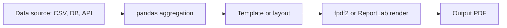

## Overview

Most teams eventually need to turn data into a PDF. I have built invoices for a
payment processor, weekly sales summaries for a marketplace, and certificates for
an online course platform, and Python has been my default tool for all of them.
The two libraries I reach for are ReportLab and fpdf2.

fpdf2 is small and quick to learn. I reach for it when I just need a page, some
cells, and an output path for a text-heavy document. ReportLab is larger and more
powerful: it gives you a full layout engine with tables, paragraph styles,
images, headers, footers, and custom page templates. I put together working
examples for both libraries that you can copy, adapt, and run with your own data.

## When to Use

I use these libraries when I need to:

- generate invoices, receipts, or financial reports from database rows;
- build automated reporting pipelines, such as daily or weekly summaries I send by
  email;
- export formatted data tables to PDF from a web dashboard or CLI tool;
- create printable certificates, labels, or documents from templates;
- produce batch reports for hundreds of customers without opening a word
  processor.

I used fpdf2 for a simple certificate generator and ReportLab for a multi-page
sales dashboard that needed styled tables and embedded charts. I keep the code
small and the output predictable by picking the right library for the job.

## Solution

### Basic PDF with fpdf2

```python
from fpdf import FPDF

pdf = FPDF()
pdf.add_page()
pdf.set_font("Helvetica", size=12)

pdf.cell(200, 10, txt="Sales Report", new_x="LMARGIN", new_y="NEXT", align="C")
pdf.ln(10)

pdf.cell(200, 10, txt="Total Revenue: $15,430", new_x="LMARGIN", new_y="NEXT")
pdf.cell(200, 10, txt="Orders: 247", new_x="LMARGIN", new_y="NEXT")

pdf.output("report.pdf")
```

### Styled PDF with ReportLab

```python
from reportlab.lib.pagesizes import A4
from reportlab.lib.styles import getSampleStyleSheet, ParagraphStyle
from reportlab.lib.units import cm
from reportlab.platypus import SimpleDocTemplate, Paragraph, Spacer, Table
from reportlab.lib import colors

doc = SimpleDocTemplate(
    "report.pdf",
    pagesize=A4,
    topMargin=2 * cm,
    bottomMargin=2 * cm
)

styles = getSampleStyleSheet()
title_style = ParagraphStyle(
    "CustomTitle",
    parent=styles["Title"],
    fontSize=18,
    textColor=colors.HexColor("#1a56db")
)
body_style = ParagraphStyle(
    "CustomBody",
    parent=styles["Normal"],
    fontSize=10,
    leading=14
)

elements = [
    Paragraph("Monthly Sales Report", title_style),
    Spacer(1, 0.5 * cm),
    Paragraph("Generated on 2026-07-01", body_style),
    Spacer(1, 1 * cm),
]

data = [
    ["Region", "Orders", "Revenue"],
    ["North", "82", "$5,210"],
    ["South", "65", "$4,180"],
    ["East", "100", "$6,040"],
]

table = Table(data, colWidths=[5 * cm, 3 * cm, 4 * cm])
table.setStyle([
    ("BACKGROUND", (0, 0), (-1, 0), colors.HexColor("#1a56db")),
    ("TEXTCOLOR", (0, 0), (-1, 0), colors.white),
    ("FONTNAME", (0, 0), (-1, 0), "Helvetica-Bold"),
    ("FONTSIZE", (0, 0), (-1, -1), 10),
    ("GRID", (0, 0), (-1, -1), 0.5, colors.grey),
    ("ROWBACKGROUNDS", (0, 1), (-1, -1), [colors.white, colors.HexColor("#f1f5f9")]),
])

elements.append(table)
doc.build(elements)
```

### PDF from a pandas DataFrame

```python
import pandas as pd
from reportlab.lib.pagesizes import A4
from reportlab.platypus import SimpleDocTemplate, Table, TableStyle
from reportlab.lib import colors

df = pd.read_csv("sales.csv")
df_summary = df.groupby("region")[["orders", "revenue"]].sum().reset_index()

# Convert DataFrame to a list of lists for ReportLab
table_data = [df_summary.columns.tolist()] + df_summary.values.tolist()

doc = SimpleDocTemplate("sales_summary.pdf", pagesize=A4)
table = Table(table_data)
table.setStyle(TableStyle([
    ("BACKGROUND", (0, 0), (-1, 0), colors.HexColor("#1a56db")),
    ("TEXTCOLOR", (0, 0), (-1, 0), colors.white),
    ("GRID", (0, 0), (-1, -1), 0.5, colors.grey),
]))
doc.build([table])
```

### Adding headers and footers

```python
from reportlab.lib.pagesizes import A4
from reportlab.platypus import SimpleDocTemplate, Paragraph
from reportlab.lib.styles import getSampleStyleSheet
from reportlab.lib.units import cm

def add_header_footer(canvas, doc):
    canvas.saveState()
    canvas.setFont("Helvetica", 8)
    canvas.drawString(2 * cm, 1 * cm, "StackPractices Report")
    canvas.drawRightString(
        A4[0] - 2 * cm,
        1 * cm,
        f"Page {doc.page}"
    )
    canvas.restoreState()

doc = SimpleDocTemplate("report.pdf", pagesize=A4)
content = Paragraph("Content here", getSampleStyleSheet()["Normal"])
doc.build(
    [content],
    onFirstPage=add_header_footer,
    onLaterPages=add_header_footer
)
```

### Adding a chart

```python
import matplotlib.pyplot as plt
from reportlab.lib.pagesizes import A4
from reportlab.platypus import SimpleDocTemplate, Image, Spacer
from reportlab.lib.units import cm

# Render the chart to a PNG file
fig, ax = plt.subplots(figsize=(6, 3))
ax.bar(["North", "South", "East"], [5210, 4180, 6040])
ax.set_title("Revenue by Region")
fig.savefig("chart.png", format="png", bbox_inches="tight")
plt.close(fig)

doc = SimpleDocTemplate("report_with_chart.pdf", pagesize=A4)
img = Image("chart.png", width=15 * cm, height=7 * cm)
doc.build([img, Spacer(1, 1 * cm)])
```

### Batch report generation

```python
import pandas as pd
from fpdf import FPDF

invoices = [
    {"customer": "Acme", "amount": 1200, "id": 101},
    {"customer": "Globex", "amount": 850, "id": 102},
    {"customer": "Soylent", "amount": 2300, "id": 103},
]

for inv in invoices:
    pdf = FPDF()
    pdf.add_page()
    pdf.set_font("Helvetica", size=12)
    pdf.cell(200, 10, txt=f"Invoice #{inv['id']}", new_x="LMARGIN", new_y="NEXT", align="C")
    pdf.ln(10)
    pdf.cell(200, 10, txt=f"Customer: {inv['customer']}", new_x="LMARGIN", new_y="NEXT")
    pdf.cell(200, 10, txt=f"Amount: ${inv['amount']}", new_x="LMARGIN", new_y="NEXT")
    pdf.output(f"invoice_{inv['id']}.pdf")
```

## Explanation

The diagram below shows the steps I take when I build a PDF report. It starts
from a data source, prepares and sometimes aggregates the data, picks a template
or layout, renders the document, and finally writes the file.



I think of fpdf2 as a typewriter on a grid. Placing text means adding a page,
setting the font, and dropping the text at specific x and y coordinates, which
gives me direct control over where every line appears. I find it perfect for
simple documents, but it doesn't handle automatic wrapping or multi-page tables
well.

ReportLab uses a flowable-based system, so you build a list of elements, such as
Paragraphs, Tables, Spacers, and Images, and the engine handles page breaks,
wrapping, and layout. That extra power also makes the learning curve steeper, so I
reserve it for reports that need tables, custom styles, or several pages.

For data-driven reports, the pattern is usually: load data with pandas, aggregate
it, convert it to a list of lists, and feed it into a ReportLab Table. If the
source data comes from a spreadsheet, see
[Python Excel Read Write](/recipes/python-excel-read-write/) for the extraction
step. For chart-heavy reports, render the chart with matplotlib and embed the
image into the PDF. For HTML-first reports, WeasyPrint renders the page directly.

## When Not to Use

- I avoid these libraries when the document must be collaboratively edited after
  generation. In that case, I generate a DOCX or keep the report in HTML.
- I skip ReportLab for a one-page receipt with plain text. fpdf2 or even a simple
  HTML to PDF tool is faster for that.
- I don't embed high-resolution photos without resizing them first. ReportLab and
  fpdf2 don't optimize images for PDF size, so large PNGs can create
  multi-megabyte files.
- I avoid fpdf2 for complex table layouts because it's got no built-in table styling
  engine, and calculating row heights manually is error-prone.

## Variants

I pick the library based on how complex the document is and how much layout
control I need. For invoices or single-page text, fpdf2 is usually enough. For
tables, headers, footers, or styled multi-page reports, I reach for ReportLab. To
embed charts rendered with matplotlib, I combine the two. If the report is already
built as HTML and CSS, I use WeasyPrint to render it directly. For PDF forms with
fillable fields, I use pikepdf or a dedicated forms library.

## Best Practices

- I use fpdf2 for simple invoices or text reports because it needs less code and
  fewer dependencies than ReportLab when the output is mostly labels and short
  paragraphs.
- I reach for ReportLab as soon as a report needs tables, headers, footers, or
  multi-page layouts, especially when it needs a styled header or alternating row
  colors.
- I convert DataFrames to plain lists before passing them to a `Table`, because
  ReportLab doesn't understand pandas objects natively.
- I always set explicit font sizes and margins, because the default ReportLab
  margins feel tight and the default font can look too small for client-facing
  reports.
- I start with `SimpleDocTemplate` in most cases and only reach for
  `BaseDocTemplate` when I need custom page templates or multi-column layouts.
- I embed charts as images when I need visualizations, because rendering directly
  on the PDF canvas is harder to maintain and easier to break when the data
  changes.
- I add page numbers and dates to client-facing reports so the document looks
  finished and the reader can track versions.
- I test the generated PDF on the target platform because fonts, page sizes, and
  image handling can differ between viewers.

## Common Mistakes

- I always call `pdf.output()` or `doc.build()` before finishing, because nothing
  is written until I do. I have spent more than one debugging session chasing a
  missing `build()` call in my ReportLab code.
- I avoid using fpdf2 for tables that need styling or automatic wrapping. It lacks
  a real table engine, so I switch to ReportLab when rows need colors, borders, or
  multi-line cells.
- I make sure to handle Unicode before printing. fpdf2 needs a font that contains
  the characters I use, so for non-Latin text I load a TrueType font through
  `pdf.add_font()` and then activate it with `pdf.set_font()`.
- Hardcoding data instead of reading from a source. I build reports from data files
  or APIs so the same script works tomorrow.
- Ignoring page size. A4 and Letter have different dimensions; pick one
  explicitly and test with real printers.
- Forgetting to close or seek the matplotlib buffer before embedding the image.
  Save to a file or a BytesIO, then rewind it before passing it to ReportLab.
- Including raw HTML strings in fpdf2 output. It doesn't interpret HTML; use
  `pdf.write_html()` only in the limited mode that fpdf2 supports.
- I always add a timestamp or version to generated reports, because a stale PDF can
  lead to arguments about which data version it reflects.

## FAQ

### What is the best way to embed images in a PDF?

In ReportLab, I import `Image` and append `Image("chart.png", width=15*cm,
height=8*cm)` to the elements list. In fpdf2, I call `pdf.image("chart.png",
x=10, y=20, w=100)` to place the image. I always resize images before embedding,
because ReportLab doesn't optimize them for PDF size.

### Is HTML a good source for PDFs in Python?

Yes. WeasyPrint renders HTML and CSS directly to PDF with good fidelity. It's
heavier than fpdf2 but handles complex layouts well, so I reach for it when the
report already exists as a styled web page.

### How do page numbers work in ReportLab?

The `doc.page` attribute gives the current page number, and I print it in the
footer through the `onFirstPage` and `onLaterPages` callbacks in `doc.build()`. The
header-and-footer example above shows how I wire this together.

### When do I need a multi-column layout in ReportLab?

ReportLab supports frames and templates through `BaseDocTemplate`. I define two or
more frames on a page and assign flowables to each when I need a magazine-style
layout. I only needed this once, for a product catalog.

### Which font format do I need for Unicode in fpdf2?

Yes. I download a TTF file, call `pdf.add_font("DejaVu", "", "DejaVuSans.ttf")`
to register it, and then `pdf.set_font("DejaVu", size=12)` to switch to it before
writing. This is the simplest way I've found to support Unicode and non-Latin
scripts in fpdf2. I keep a folder of TTFs in my project templates.

### How can the same header appear on every page?

I draw the header in the `onPage` callback of `doc.build()` using a `PageTemplate`
with a `Frame`. Alternatively, I use `SimpleDocTemplate` with `onFirstPage` and
`onLaterPages` as a lightweight solution.

### How do I generate hundreds of PDFs from a spreadsheet?

I load the data with pandas, loop over the rows, and render one PDF per record
with fpdf2 or a pre-defined ReportLab template. I usually render to a temporary
folder, then zip the results or attach them to an email.

## See Also

- [fpdf2 Documentation](https://py-pdf.github.io/fpdf2/): I keep the official docs
  open when I need to check a specific method or option.
- [ReportLab User Guide](https://www.reportlab.com/docs/reportlab-userguide.pdf):
  the full reference I consult when I need a low-level detail.
- [pandas to_html](https://pandas.pydata.org/docs/reference/api/pandas.DataFrame.to_html.html):
  an alternative route I use for HTML-first PDFs.
- [matplotlib savefig](https://matplotlib.org/stable/api/_as_gen/matplotlib.pyplot.savefig.html):
  how I render charts before embedding them into a report.
- [WeasyPrint](https://weasyprint.org/): a library that renders HTML and CSS to
  PDF with good fidelity.
- [Python Excel Read Write](/recipes/python-excel-read-write/): how I read
  spreadsheet data before turning it into a PDF.
- [Parse CSV with pandas](/recipes/parse-csv-python-pandas/): how I prepare data
  for ReportLab tables.
