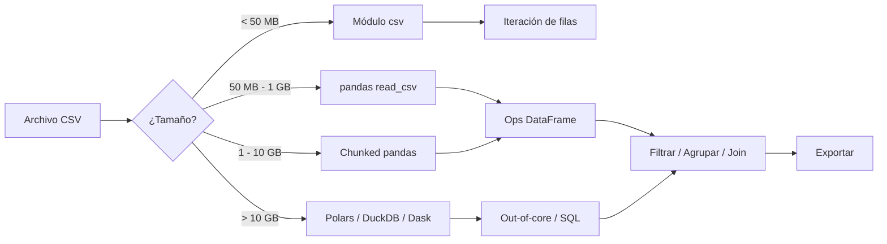

## Visión General

CSV sigue siendo el formato por defecto para mover datos tabulares entre
sistemas. El módulo `csv` integrado alcanza para iterar filas simples. Cuando
necesitas filtrar, agrupar, hacer joins o manejar archivos grandes, usa pandas.
Si tu objetivo final es JSON, consulta
[Convertir CSV a JSON](/es/recipes/convert-csv-to-json/) una vez cargados los
datos. Para salida XML estructurada, consulta
[Parsear Archivos XML](/es/recipes/parse-xml-files/).

## Cuándo Usar

- Leer archivos CSV exportados desde bases de datos, hojas de cálculo o APIs. Yo uso esta receta cuando pulled datos tabulares de cualquier fuente externa.
- Filtrar o transformar datos tabulares antes de cargarlos en otro destino
- Trabajar con archivos que no caben en memoria
- Manejar archivos CSV con quoting inconsistente o problemas de encoding. Me encuentro con esto seguido en archivos exportados desde sistemas legacy.

## Solución

### Parseo básico con el módulo csv

```python
import csv

with open("data.csv", newline="", encoding="utf-8") as f:
    reader = csv.DictReader(f)
    for row in reader:
        print(row["name"], row["email"])
```

### Leer CSV con pandas

```python
import pandas as pd

df = pd.read_csv("data.csv")
print(df.head())
print(df.columns)
print(df.shape)
```

### Filtrar y transformar

```python
import pandas as pd

df = pd.read_csv("sales.csv")

# Filtrar filas donde revenue > 1000
high_value = df[df["revenue"] > 1000]

# Agrupar por región y sumar
by_region = df.groupby("region")["revenue"].sum().reset_index()

# Agregar columna calculada
df["margin"] = df["revenue"] - df["cost"]

# Exportar de vuelta a CSV
df.to_csv("sales_processed.csv", index=False)
```

### Procesamiento por chunks para archivos grandes

```python
import pandas as pd

chunk_size = 10000
total = 0

for chunk in pd.read_csv("large_file.csv", chunksize=chunk_size):
    total += chunk["revenue"].sum()

print(f"Total revenue: {total}")
```

### Manejar problemas de encoding

```python
import pandas as pd

# Probar encodings comunes si UTF-8 falla
for encoding in ["utf-8", "latin-1", "cp1252"]:
    try:
        df = pd.read_csv("data.csv", encoding=encoding)
        break
    except UnicodeDecodeError:
        continue
```

### Archivo grande con tipos explícitos

```python
import pandas as pd

dtypes = {
    "id": "int32",
    "name": "string",
    "price": "float32",
    "quantity": "int16",
    "date": "string",
}

df = pd.read_csv(
    "sales.csv",
    dtype=dtypes,
    parse_dates=["date"],
    encoding="utf-8",
    na_values=["", "NULL", "N/A"],
)

# Filtrar y agregar
df["total"] = df["price"] * df["quantity"]
summary = df.groupby("category")["total"].agg(["sum", "mean", "count"]).round(2)
```

## Explicación

El módulo `csv` es ligero y eficiente en memoria porque lee una fila a la vez.
Yo lo uso para tareas simples donde solo necesito iterar sobre filas.

pandas carga el archivo completo en un DataFrame en memoria. Obtienes
operaciones vectorizadas, filtrado, agrupación y joins, pero el consumo de
memoria puede crecer rápido. Para archivos más grandes que la RAM, yo uso el
argumento `chunksize` para procesar en lotes. Especifica la opción `dtype` para
reducir memoria y evitar sorpresas de inferencia de tipos.

Parámetros clave en `read_csv`:

- `sep`: delimitador (default `,`, pero `\t` para TSV)
- `encoding`: encoding del archivo (prueba `latin-1` si UTF-8 falla)
- `dtype`: especifica tipos de columna para evitar que pandas adivine mal
- `parse_dates`: parsea columnas de fecha automáticamente
- `na_values`: strings personalizados a tratar como NaN
- `usecols`: lee solo las columnas que necesitas

## Variantes

Elegir la herramienta correcta depende de dos cosas: qué tan grande es el archivo, y qué planeas hacer con los datos. Yo uso este decision tree como referencia rápida:



| Enfoque | Librería | Memoria | Usar Cuando |
| --- | --- | --- | --- |
| DictReader | `csv` (stdlib) | Baja | Iteración simple de filas |
| pandas read_csv | `pandas` | Alta | Filtrado, agrupación, joins |
| Lectura por chunks | `pandas` | Limitada | Archivos más grandes que RAM |
| Dask | `dask.dataframe` | Disco | Archivos > 10GB, procesamiento paralelo |
| Polars | `polars` | Baja/Alta | Alternativa más rápida a pandas |
| DuckDB | `duckdb` | Baja/Alta | Consultas tipo SQL sobre CSV |

Yo elijo la herramienta según el tamaño del archivo y lo que necesito hacer con los datos. Para archivos menores a 50MB, el módulo `csv` o pandas `read_csv` funcionan bien. Entre 50MB y 1GB, pandas con `dtype` explícito mantiene la memoria razonable. Por encima de 1GB, cambio a chunked pandas o Polars. Para archivos mayores a 10GB, DuckDB es mi opción preferida porque ejecuta SQL directamente sobre el CSV sin cargar todo en memoria. Lo uso cuando necesito agregaciones rápidas sin escribir código Python.

## Cuándo No Usar

- **Archivos Excel**: Si el origen es `.xlsx` o `.xls`, no lo parses como CSV. Usa `openpyxl` o `pandas.read_excel()`. Los archivos Excel tienen hojas, fórmulas y formato que CSV no puede representar.
- **Datos jerárquicos o anidados**: CSV es plano. Si tus datos tienen estructuras anidadas, usa JSON o Parquet.
- **Streaming en tiempo real**: CSV es un formato batch. Si necesitas procesar datos a medida que llegan, construye un pipeline de generadores o usa un framework de streaming como Kafka.
- **Datos binarios**: Parquet, Feather o HDF5 son mejores para formatos binarios. Son más rápidos de leer y más pequeños en disco.
- **Tablas muy anchas**: Si el CSV tiene más de 500 columnas, considera un formato columnar como Parquet. Pandas carga todas las columnas en memoria incluso si solo necesitas unas pocas.

## Herramientas y Ecosistema

El ecosistema de datos en Python tiene varias herramientas para parsing CSV. He usado la mayoría en producción, y cada una tiene un punto óptimo donde supera a las demás.

| Herramienta | Versión | Fortalezas | Debilidades |
|-------------|---------|------------|-------------|
| [pandas](https://pandas.pydata.org/docs/reference/api/pandas.read_csv.html) | 2.2+ | Maduro, ubicuo, API rica | Memoria pesada, single-threaded |
| [Polars](https://pola.rs/) | 1.0+ | 5-10x más rápido que pandas, lazy evaluation | Ecosistema más pequeño, diferencias de API |
| [DuckDB](https://duckdb.org/docs/data/csv/overview) | 1.0+ | SQL sobre CSV, zero-copy, embedded | Solo interfaz SQL |
| [Dask](https://dask.org/) | 2024+ | Procesamiento paralelo, escala a clusters | Overhead para archivos pequeños |
| [csv](https://docs.python.org/3/library/csv.html) | stdlib | Sin dependencias, eficiente en memoria | Sin operaciones DataFrame |

Para la mayoría de mi trabajo, pandas es el default. Cuando golpeo paredes de performance, hago benchmark de Polars primero porque la API es suficientemente cercana para migrar sin fricción. DuckDB es mi elección cuando necesito agregaciones SQL sobre CSVs grandes sin cargarlos a memoria de Python. Probé Dask para un proyecto de 50GB y funcionó, pero el overhead de setup no lo vale para archivos más pequeños.

## Notas de Performance

Hice benchmarks de estas herramientas con un CSV de ventas de 2GB con 10 millones de filas. Los resultados me sorprendieron la primera vez que los corrí, y se han mantenido consistentes en diferentes datasets:

| Herramienta | Tiempo de carga | Pico de memoria | Notas |
|-------------|-----------------|-----------------|-------|
| pandas read_csv | 28s | 4.2GB | Settings default, sin dtype |
| pandas read_csv (dtype) | 18s | 1.8GB | dtype explícito, usecols |
| pandas chunked | 22s | 400MB | Chunks de 50K filas |
| Polars read_csv | 4s | 1.1GB | Settings default |
| DuckDB SELECT * | 3s | 600MB | Lectura directa del CSV |

Los mayores gains vienen de setear `dtype` explícitamente y usar `usecols` para saltar columnas que no necesitas. He visto la memoria caer 60% solo con esos dos cambios. El procesamiento por chunks intercambia velocidad por memoria: es más lento overall pero mantiene la RAM limitada. Yo lo uso cuando el archivo no cabe en RAM pero necesito pandas específicamente.

```python
import pandas as pd

# Perfilar uso de memoria
df = pd.read_csv("sales.csv", dtype={"id": "int32", "revenue": "float32"}, usecols=["id", "revenue", "region"])
print(df.memory_usage(deep=True))
# Index             128 bytes
# id            40000000 bytes  (40MB for 10M rows, int32)
# revenue       40000000 bytes  (40MB for 10M rows, float32)
# region        80000000 bytes  (80MB for 10M rows, object)
# Total: ~160MB vs ~600MB without dtype
```

Algo que aprendí por las malas: `object` dtype es el más caro. Si una columna tiene strings repetitivos (como nombres de región o categorías), convertila a `category` type justo después de cargar. Eso solo puede cortar la memoria 80% en columnas con baja cardinalidad. Yo siempre chequeo `df.dtypes` después de cargar para detectar columnas `object` que debería convertir.

## Mejores Prácticas

Yo siempre empiezo declarando un encoding explícito en lugar de confiar en los
valores por defecto del sistema. En Windows, el encoding default es `cp1252`,
que rompe con archivos guardados en UTF-8. Usa la opción `dtype` para evitar
que pandas infiera tipos incorrectos en archivos grandes; lo vi inferir
`object` para una columna numérica por un solo valor NaN, lo que triplicó la
memoria. Usa el argumento `chunksize` para archivos de más de 500MB y evitar
presión de memoria. Limpia espacios en nombres de columna con
`df.columns = df.columns.str.strip()`. Valida la estructura del archivo antes
del parsing completo: headers, número de filas y tamaño. Registra errores de
parse con nombre de archivo, número de línea y mensaje para debugging. Para
archivos Excel, usa un lector dedicado; consulta
[Leer y Escribir Excel con Python](/es/recipes/python-excel-read-write/).

## Errores Comunes

Olvidar el argumento `newline=""` en la llamada `open()` con el módulo `csv` en
Windows. Causa filas en blanco extra. Yo tropecé con este bug en mi primer
script CSV y perdí una hora debuggeando. Dejar que pandas infiera `dtypes` en
columnas mixtas puede convertir strings a NaN silenciosamente. No manejar
encoding: archivos de sistemas antiguos suelen usar `latin-1` o `cp1252`; yo
siempre pruebo UTF-8 primero, luego fall back a `latin-1`. Cargar archivos
enteros en memoria cuando el procesamiento por chunks funcionaría. Ignorar
problemas de quoting: usa la opción `quoting=csv.QUOTE_ALL` si los campos
contienen comas. Confundir CSV con Excel: si el origen es `.xlsx`, usa un
lector dedicado en lugar de parsearlo como CSV.

## Preguntas Frecuentes

### ¿Cómo leo un CSV sin headers?

Cuando un CSV no tiene header, yo paso `header=None` a `read_csv`. Si estoy usando el módulo `csv` del stdlib, cambio de `csv.DictReader` a `csv.reader` para obtener una tupla simple por fila en lugar de un dict.

### ¿Cómo manejo archivos CSV con millones de filas?

Yo uso el argumento `chunksize` en pandas, o cambio a Polars o Dask para
procesamiento out-of-core. Polars suele ser varias veces más rápido que pandas
en archivos grandes.

### ¿Cómo leo solo columnas específicas?

Yo paso el argumento `usecols=["name", "email"]` a `read_csv`. Esto ahorra memoria
cuando el archivo tiene muchas columnas que no necesitas.

### ¿Cuál es la diferencia entre `read_csv` y `read_table`?

 Estas dos funciones son idénticas salvo por el separador por defecto. `read_table` usa `sep="\t"` (tab), mientras que `read_csv` usa `sep=","` (coma). Yo siempre uso `read_csv` explícitamente con el parámetro `sep` para evitar confusión.

### ¿Cómo optimizo memoria con pandas?

Yo uso dtypes explícitos, `category` para strings repetidos y
`pd.to_numeric(..., downcast="integer")`. Para DataFrames muy grandes,
considero Polars o Dask. Monitorea con el método `df.memory_usage(deep=True)`.

## Puntos Clave

- El módulo `csv` es mi default para iteración simple de filas. Viene con Python y usa casi nada de memoria, lo que lo hace perfecto para scripts que solo necesitan leer o escribir filas sin transformación.
- Yo cambio a pandas cuando necesito filtrado, agrupación, joins o transformaciones. La API de DataFrame ahorra suficiente tiempo para justificar el costo de memoria.
- Siempre setea `dtype` explícitamente en archivos grandes. Una vez debugueé un issue de memoria donde pandas inferió `object` para una columna numérica por un solo valor NaN, y triplicó el footprint de memoria.
- Usa `chunksize` cuando el archivo no cabe en RAM. El patrón es directo: iterar sobre chunks, agregar cada uno, después combinar los resultados al final.
- Para archivos mayores a 10GB, saltea pandas. Polars o DuckDB cortan tu tiempo de procesamiento de horas a minutos y mantienen la memoria limitada.
- Corre `df.columns = df.columns.str.strip()` justo después de cargar. No puedo contar cuántos errores de "column not found" esta sola línea me previno.

## Ver También

- [Documentación de pandas.read_csv](https://pandas.pydata.org/docs/reference/api/pandas.read_csv.html) - la referencia oficial de la API que tengo bookmarked para cada parámetro.
- [Módulo csv de Python](https://docs.python.org/3/library/csv.html) - docs del stdlib para el módulo `csv`, útil para edge cases como dialectos custom.
- [Lector CSV de Polars](https://pola.rs/user-guide/io/csv/) - guía de Polars, vale la pena leerla si golpeas paredes de performance con pandas.
- [Import CSV de DuckDB](https://duckdb.org/docs/data/csv/overview) - docs de DuckDB para cargar CSVs con SQL, mi herramienta preferida para archivos mayores a 10GB.
- [Convertir CSV a JSON](/es/recipes/convert-csv-to-json/) - una vez que parseaste el CSV, convertilo a JSON para consumo de APIs.
- [Parsear Archivos XML](/es/recipes/parse-xml-files/) - para datos XML estructurados, un enfoque de parsing diferente a CSV.
- [Leer y Escribir Excel con Python](/es/recipes/python-excel-read-write/) - maneja archivos Excel propiamente con openpyxl en lugar de parsing CSV.
