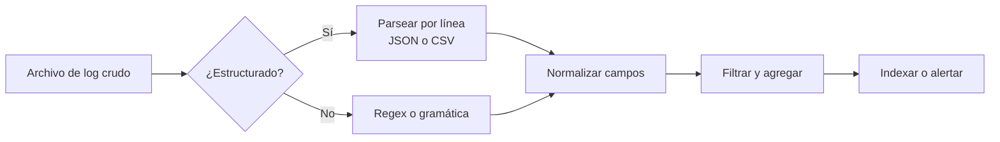

## Visión General

Los logs de servidor son un registro de lo que ocurre en una máquina: requests, errores y eventos en segundo plano. Analizarlos convierte ese texto crudo en datos que puedes buscar, agrupar y graficar. Esta receta cubre el análisis con regex de logs de acceso de Apache y Nginx, registros en JSON Lines y mensajes syslog usando Python, Java y JavaScript. Si tus datos ya son tabulares, las mismas habilidades aplican en [Analizar Archivos CSV](/recipes/parse-csv-files/); para datos jerárquicos o con marcas, consulta [Analizar Archivos XML](/recipes/parse-xml-files/) y [Validar JSON Schema](/recipes/validate-json-schema/).

## Cuándo Usar

Usa este enfoque cuando:

- Investigas picos de 4xx/5xx o requests lentos en logs de servidores web.
- Quieres dashboards o alertas basados en el volumen de logs de aplicación.
- Necesitas auditar patrones de acceso, direcciones IP sospechosas o agentes de usuario.
- Vas a alimentar logs a un SIEM, un almacén de logs o una plataforma de observabilidad.

## Solución

### Python

```python
import re
from collections import Counter

log_pattern = re.compile(
    r'(?P<ip>\S+) \S+ \S+ \[(?P<time>[^\]]+)\] '
    r'"(?P<method>\S+) (?P<path>\S+) (?P<proto>[^"]+)" '
    r'(?P<status>\d{3}) (?P<bytes>\S+)'
)

status_counts = Counter()
with open('access.log', 'r', encoding='utf-8') as f:
    for line in f:
        match = log_pattern.match(line)
        if match:
            status_counts[match.group('status')] += 1

print(status_counts)
```

### JavaScript

```javascript
const fs = require('fs');
const readline = require('readline');

const logPattern = /^(\S+) \S+ \S+ \[([^\]]+)\] "(\S+) (\S+) ([^"]+)" (\d{3}) (\S+)/;

async function parseLogFile(filePath) {
    const stream = fs.createReadStream(filePath);
    const rl = readline.createInterface({ input: stream });
    const statusCounts = {};

    for await (const line of rl) {
        const match = logPattern.exec(line);
        if (match) {
            const [, ip, time, method, requestPath, proto, status] = match;
            statusCounts[status] = (statusCounts[status] || 0) + 1;
        }
    }
    return statusCounts;
}
```

### Java

```java
import java.io.BufferedReader;
import java.io.FileReader;
import java.io.IOException;
import java.util.regex.Matcher;
import java.util.regex.Pattern;

public class LogParser {
    private static final Pattern LOG_PATTERN = Pattern.compile(
        "^(\\S+) \\S+ \\S+ \\[(\\d{2}/\\w{3}/\\d{4}:\\d{2}:\\d{2}:\\d{2} [+-]\\d{4})\\] " +
        "\\\"(\\S+) (\\S+) ([^\"]+)\\\" (\\d{3}) (\\S+)"
    );

    public static void main(String[] args) throws IOException {
        try (BufferedReader br = new BufferedReader(new FileReader("access.log"))) {
            String line;
            while ((line = br.readLine()) != null) {
                Matcher m = LOG_PATTERN.matcher(line);
                if (m.find()) {
                    System.out.println(m.group(1) + " " + m.group(6));
                }
            }
        }
    }
}
```

## Explicación

Los ejemplos anteriores leen el archivo línea por línea y hacen coincidir una regex con el formato combinado de Apache/Nginx. Una línea típica se ve así:

```text
127.0.0.1 - - [10/Oct/2023:13:55:36 +0000] "GET /index.html HTTP/1.1" 200 1234
```

La regex captura la IP, la marca de tiempo, el método HTTP, la ruta, el protocolo, el código de estado y el tamaño de la respuesta. Si un campo puede contener espacios o comillas, como un agente de usuario, el patrón debe ser más defensivo.

Los logs en producción pueden crecer hasta gigabytes rápidamente, así que es mejor procesar el archivo como un flujo en lugar de cargarlo en memoria. El pipeline completo de parseo se ve así:



Para logs estructurados, cada línea es su propio objeto JSON, así que puedes decodificar cada una con [`JSON.parse()`](https://developer.mozilla.org/en-US/docs/Web/JavaScript/Reference/Global_Objects/JSON/parse) o el equivalente en tu lenguaje. Después, filtra por campos como `level`, `service` o `trace_id`.

Los mensajes syslog siguen la [RFC 3164](https://datatracker.ietf.org/doc/html/rfc3164) o la [RFC 5424](https://datatracker.ietf.org/doc/html/rfc5424). Un parser simple en Python puede separar la prioridad, la marca de tiempo, el host y el mensaje usando una pequeña gramática o una librería. Si solo necesitas el cuerpo del mensaje, una regex que maneje el encabezado `<PRI>` y la marca de tiempo suele ser suficiente para tareas pequeñas.

Un parser robusto también lleva la cuenta de líneas malformadas. En producción, mantén un contador de errores de parseo por archivo y registra la línea cruda cuando la tasa supere el uno por ciento. Eso detecta cambios de formato, sorpresas de codificación o un proveedor que cambió el orden de los campos sin avisar.

## Variantes

### Logs de acceso de Apache y Nginx

Usa una regex con grupos nombrados para extraer los campos de las requests. Python `re`, Java `Pattern` y Node `readline` funcionan bien. Yo recurro a esto cuando el servidor ya emite el formato combinado común y no puedo cambiarlo.

### JSON Lines

Cada entrada de log es un objeto JSON autocontenido, así que basta con un `JSON.parse()` por línea. Usa el parser JSON nativo de tu lenguaje. Elige esto cuando la aplicación escriba los logs y tú controles el formato.

### Syslog

Los mensajes syslog usan la [RFC 3164](https://datatracker.ietf.org/doc/html/rfc3164) o la [RFC 5424](https://datatracker.ietf.org/doc/html/rfc5424), según el emisor. Puedes parsearlos con una gramática dedicada, una librería del lenguaje o con `rsyslog` y `syslog-ng` como receptores. Úsalo cuando los logs provengan de sistemas Unix, equipos de red o contenedores.

### Logs CSV

Si el log ya es tabular, usa un parser CSV estándar como `csv` de Python, `csv-parse` de Node o `OpenCSV` de Java. Es la elección correcta cuando el delimitador es conocido y el esquema es estable.

### Logs de aplicación custom

Algunos proveedores o sistemas legacy emiten un formato de texto fijo. En esos casos, usa grupos regex nombrados en el motor de regex de tu lenguaje. Solo elige esto cuando la fuente no pueda escribir un formato estructurado.

En la práctica, empiezo con el formato que la aplicación ya emite. Solo añado una regex custom cuando la fuente es un tercero o un sistema antiguo que no puedo cambiar.

### Ejemplo con JSON Lines (Python)

```python
import json
from datetime import datetime

def parse_jsonl(path):
    with open(path, 'r', encoding='utf-8') as f:
        for line in f:
            line = line.strip()
            if not line:
                continue
            try:
                record = json.loads(line)
                record['ts'] = datetime.fromisoformat(record['ts'])
                yield record
            except (json.JSONDecodeError, KeyError, ValueError) as e:
                print(f'malformed: {line!r} ({e})')
```

### Ejemplo con syslog (Python)

```python
import re

syslog_pattern = re.compile(
    r'<(?P<priority>\d+)>'
    r'(?P<timestamp>\w{3}\s+\d{1,2}\s+\d{2}:\d{2}:\d{2})\s+'
    r'(?P<host>\S+)\s+'
    r'(?P<message>.+)'
)

def parse_syslog(line):
    match = syslog_pattern.match(line)
    if match:
        return match.groupdict()
    return None
```

El ejemplo de syslog anterior coincide con la marca de tiempo estilo BSD de la RFC 3164. Para el formato más reciente de la RFC 5424, usa una marca de tiempo ISO 8601 y campos de datos estructurados; una librería dedicada te ahorra mantener la gramática tú mismo.

## Lo que Funciona

- Procesa archivos línea por línea en lugar de cargarlos en memoria.
- Usa grupos regex nombrados como `(?P<ip>\S+)` para parsers auto-documentados.
- Normaliza las marcas de tiempo a UTC tan pronto como las parseas; esto evita dolores cuando los logs llegan de múltiples zonas horarias o límites de horario de verano.
- Maneja líneas malformadas registrando el error y continuando, sin fallar. Mantén una métrica de tasa de errores de parseo y alerta cuando suba.
- Indexa resultados parseados en un [almacén de logs](/es/recipes/log-aggregation/) como Elasticsearch, Loki o ClickHouse.

## Errores Comunes

- Parsear stack traces multi-línea como entradas separadas. Mantén las líneas relacionadas juntas con un logger estructurado o una máquina de estados que haga buffer hasta que empiece la siguiente entrada.
- Olvidar escapar metacaracteres regex en rutas o agentes de usuario. Los agentes de usuario y las rutas URL pueden contener caracteres que la regex trata de forma especial; escápalos o usa un patrón literal.
- Hardcodear rutas de logs en lugar de aceptar [argumentos CLI o variables de entorno](/es/recipes/parse-command-line-arguments/).
- Ignorar rotación de logs; usa herramientas de seguimiento o envío continuo.
- Ejecutar regex sin límites sobre líneas muy largas; establece un límite de longitud. Un límite común es 16 KB por línea; trata cualquier cosa más larga como un registro malformado.

## Cuándo No Usar Este Enfoque

- Si los datos ya están en una base de datos, consultarlos allí suele ser más rápido que exportarlos primero a un archivo de log.
- Los formatos binarios como Parquet, Avro u ORC necesitan sus propias librerías; una regex solo corromperá los datos.
- Cuando solo necesitas unos pocos valores de un archivo de configuración pequeño, un parser de logs completo es excesivo; usa un parser de configuración.
- Para auditorías inalterables que cumplan requisitos normativos, confía en un pipeline de logging dedicado con almacenamiento inmutable.

## Tooling y Ecosistema

- `jq` — Úsalo como procesador de JSON en línea de comandos cuando necesites filtrar rápido sin escribir un script. Brilla con logs en JSON Lines.
- `pygtail` / Node `tail` — Úsalos para seguir archivos rotados en tiempo real. `pygtail` recuerda el último inodo y offset, así que sobrevive a la rotación.
- `Vector`, `Fluentd`, `Filebeat` — Úsalos como agentes para recolectar y enviar logs. `Filebeat` es común con Elasticsearch; `Vector` tiene menor huella y un lenguaje de transformación; `Fluentd` se usa mucho en Kubernetes.
- `rsyslog`, `syslog-ng` — Úsalos para recibir y reenviar mensajes syslog. La mayoría de las distribuciones Linux incluyen uno por defecto.
- `Elasticsearch`, `Grafana Loki`, `Splunk`, `Datadog` — Úsalos para almacenar, buscar y crear dashboards de logs. Cada uno soporta campos estructurados de forma distinta, así que normaliza el esquema antes de enviarlos.
- `pino` (Node), `structlog` (Python), `Logback JSON` (Java) — Úsalos como loggers estructurados para que tu aplicación emita JSON Lines directamente. Cuanto menos parseo hagas después, más rápido será tu pipeline.

## Monitoreo y Alertas

Después de parsear, vigila:

- Tasa de errores de parseo: alerta cuando supere tu línea base normal.
- Tasa de 5xx y el percentil 99 del tiempo de respuesta de logs de servidores web.
- Tasa de error por endpoint o servicio.
- Picos anómalos en volumen de logs o cantidad de IPs únicas.

Establece umbrales basados en tu línea base, no en números que se vean bien en un dashboard. La línea base debe venir de al menos una semana completa de tráfico normal.

## Consideraciones de Seguridad

- Enmascara o descarta datos personales, como emails, direcciones IP o tokens, antes de indexar. Un helper simple en Python reemplaza campos sensibles con un hash o un marcador:

```python
def mask_ip(ip):
    parts = ip.split('.')
    if len(parts) == 4:
        return f'{parts[0]}.{parts[1]}.x.x'
    return ip
```

- Valida que los archivos de log provengan de una fuente confiable; logs no confiables pueden ser envenenados.
- Evita `eval()` o `Function()` sobre campos parseados.
- Cuida la inyección de logs mediante nuevas líneas embebidas en input controlado por usuarios. OWASP describe este riesgo en su guía de [log injection](https://owasp.org/www-community/vulnerabilities/Log_Injection).
- Limita el tamaño descomprimido al aceptar logs comprimidos.

## Preguntas Frecuentes

### ¿Cuál es el mejor formato para logs de aplicación?

JSON Lines. Cada entrada de log es su propio objeto JSON, así que puedes decodificar cada línea con `JSON.parse()` y seguir adelante. Después puedes filtrar con `jq`, un motor SQL o las herramientas de búsqueda de tu plataforma de logs.

### ¿Cómo analizo logs en tiempo real?

Usa `tail -f`, librerías para seguir archivos específicas del lenguaje, o envía logs a una cola de mensajes como Kafka o Redis Streams y consúmelos con un worker.

### ¿Cómo detecto anomalías en logs?

Agrupa las líneas parseadas por código de estado, percentiles del tiempo de respuesta y cuántos errores lanza cada endpoint. Lanza una alerta cuando una métrica se salga del rango que has medido durante operación normal. Para análisis más profundo, alimenta datos parseados a un modelo de ML o usa la detección de anomalías de un stack ELK.

### ¿Cómo manejo entradas de log multi-línea?

Usa un logger estructurado o un collector que pueda reensamblar líneas relacionadas. Si debes parsear stack traces multi-línea, haz buffer de líneas hasta encontrar el inicio de la siguiente entrada.

### ¿Cómo parseo syslog en Python?

Para syslog BSD ([RFC 3164](https://datatracker.ietf.org/doc/html/rfc3164)), una pequeña regex con grupos nombrados puede extraer la prioridad, la marca de tiempo, el host y el mensaje. Para el formato más reciente [RFC 5424](https://datatracker.ietf.org/doc/html/rfc5424), usa una librería dedicada como `python-rsyslog` o `syslog-rfc5424-parser` para no tener que mantener la gramática tú mismo.

### ¿Cuándo elijo regex en lugar de un parser estructurado?

Usa regex cuando el formato es fijo y no puedes cambiar la fuente, como logs de acceso de terceros o salidas legacy de mainframes. Usa un parser estructurado cuando la aplicación pueda escribir JSON Lines, syslog o CSV, porque esos formatos traen nombres de campo y tipos y parsean mucho más rápido.

## Puntos Clave

- Parsea logs línea por línea y usa flujo para archivos grandes.
- Usa grupos regex nombrados o JSON estructurado para claridad.
- Haz seguimiento y envía logs con herramientas como `Vector`, `Fluentd` o `Filebeat`.
- Indexa logs parseados en un almacén buscable y construye alertas sobre él.
- Enmascara datos sensibles y valida la fuente antes de parsear.

## Ver También

- [RFC 3164 — El protocolo syslog BSD](https://datatracker.ietf.org/doc/html/rfc3164)
- [RFC 5424 — El protocolo syslog](https://datatracker.ietf.org/doc/html/rfc5424)
- [MDN `JSON.parse()`](https://developer.mozilla.org/en-US/docs/Web/JavaScript/Reference/Global_Objects/JSON/parse)
- [OWASP Log Injection](https://owasp.org/www-community/vulnerabilities/Log_Injection)
- [Documentación de Vector](https://vector.dev/docs/)
- [Manual de jq](https://jqlang.github.io/jq/manual/)
- [Código complementario ejecutable](https://github.com/MathiasPaulenko/stack-practices-resources/tree/main/resources/recipes/data/parse-log-files)
