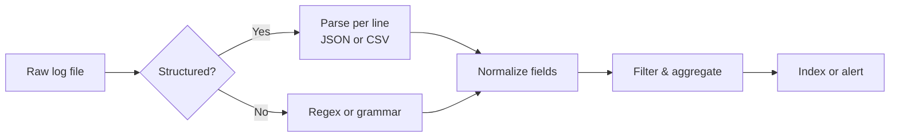

## Overview

Server logs record what happens on a machine: the requests it receives, the errors it hits, and the background events it generates. Parsing them turns that messy text into data you can search, group, and chart. In this recipe, you will parse Apache and Nginx access logs, JSON Lines records, and syslog messages with Python, Java, and JavaScript. If the data is already tabular, the same approach works as in [Parse CSV Files](/recipes/parse-csv-files/). For markup or hierarchical data, see [Parse XML Files](/recipes/parse-xml-files/) and [Validate JSON Schema](/recipes/validate-json-schema/).

## When to Use

Reach for this when:

- You're investigating 4xx/5xx spikes or slow requests in web server logs.
- You want dashboards or alerts driven by application log volume.
- You need to audit access patterns, flag suspicious client IPs, or group requests by user agent.
- You're feeding logs into a SIEM, a log store, or an observability platform.

## Solution

### Python

```python
import re
from collections import Counter

log_pattern = re.compile(
    r'(?P<ip>\S+) \S+ \S+ \[(?P<time>[^\]]+)\] '
    r'"(?P<method>\S+) (?P<path>\S+) (?P<proto>[^"]+)" '
    r'(?P<status>\d{3}) (?P<bytes>\S+)'
)

status_counts = Counter()
with open('access.log', 'r', encoding='utf-8') as f:
    for line in f:
        match = log_pattern.match(line)
        if match:
            status_counts[match.group('status')] += 1

print(status_counts)
```

### JavaScript

```javascript
const fs = require('fs');
const readline = require('readline');

const logPattern = /^(\S+) \S+ \S+ \[([^\]]+)\] "(\S+) (\S+) ([^"]+)" (\d{3}) (\S+)/;

async function parseLogFile(filePath) {
    const stream = fs.createReadStream(filePath);
    const rl = readline.createInterface({ input: stream });
    const statusCounts = {};

    for await (const line of rl) {
        const match = logPattern.exec(line);
        if (match) {
            const [, ip, time, method, requestPath, proto, status] = match;
            statusCounts[status] = (statusCounts[status] || 0) + 1;
        }
    }
    return statusCounts;
}
```

### Java

```java
import java.io.BufferedReader;
import java.io.FileReader;
import java.io.IOException;
import java.util.regex.Matcher;
import java.util.regex.Pattern;

public class LogParser {
    private static final Pattern LOG_PATTERN = Pattern.compile(
        "^(\\S+) \\S+ \\S+ \\[(\\d{2}/\\w{3}/\\d{4}:\\d{2}:\\d{2}:\\d{2} [+-]\\d{4})\\] " +
        "\\\"(\\S+) (\\S+) ([^\"]+)\\\" (\\d{3}) (\\S+)"
    );

    public static void main(String[] args) throws IOException {
        try (BufferedReader br = new BufferedReader(new FileReader("access.log"))) {
            String line;
            while ((line = br.readLine()) != null) {
                Matcher m = LOG_PATTERN.matcher(line);
                if (m.find()) {
                    System.out.println(m.group(1) + " " + m.group(6));
                }
            }
        }
    }
}
```

## Explanation

The examples above read one line at a time and match the Apache/Nginx combined format. A typical access log entry is shown below:

```text
127.0.0.1 - - [10/Oct/2023:13:55:36 +0000] "GET /index.html HTTP/1.1" 200 1234
```

The pattern pulls out the IP, timestamp, HTTP method, path, protocol, status code, and response size from that line. If a field might contain spaces or quotes, such as a user-agent string, the pattern needs to be more defensive.

Production logs grow to gigabytes quickly, so stream the file instead of loading it into memory. The full parsing pipeline is shown below:



Structured and free-form logs follow slightly different paths through the pipeline.

For structured logs, each line is its own JSON object, so you can decode each one with [`JSON.parse()`](https://developer.mozilla.org/en-US/docs/Web/JavaScript/Reference/Global_Objects/JSON/parse) or the equivalent in your language. After decoding, filter on fields like `level`, `service`, or `trace_id`.

Syslog messages use either [RFC 3164](https://datatracker.ietf.org/doc/html/rfc3164) or [RFC 5424](https://datatracker.ietf.org/doc/html/rfc5424), depending on the sender. A small Python parser can pull out the priority, timestamp, host, and message with a short grammar or a dedicated library. When you only need the message body, a regex that handles the `<PRI>` header and the timestamp is usually enough for small tasks.

In production, I also track malformed lines so I can spot format drift. Keep a counter of parse errors per file and log the raw line when the rate crosses one percent. That catches encoding surprises or a vendor that changed the field order without warning.

## Variants

### Apache and Nginx access logs

Use a regex with named groups to pull request fields out of access logs. Python's `re`, Java's `Pattern`, and Node's `readline` all work well. I reach for this when the server already emits the common combined format and I can't change it.

### JSON Lines

Each log entry is a self-contained JSON object, so one `JSON.parse()` per line is enough. Use the built-in JSON parser in your language. Pick this when the application writes the logs and you control the format.

### Syslog

Syslog messages use either [RFC 3164](https://datatracker.ietf.org/doc/html/rfc3164) or [RFC 5424](https://datatracker.ietf.org/doc/html/rfc5424), depending on the sender. You can parse them with a dedicated grammar, a language library, or with `rsyslog` and `syslog-ng` as receivers. Use this when logs come from Unix systems, network gear, or containers.

### CSV logs

If the log is already tabular, use a standard CSV parser such as Python `csv`, Node `csv-parse`, or Java `OpenCSV`. This is the right choice when the delimiter is known and the schema is stable.

### Custom application logs

Some vendors or legacy systems emit a fixed text format. In those cases, use named regex groups in the language's regex engine. Only pick this when the source can't write a structured format.

In practice, I start with the format the application already emits. I only add a custom regex when the source is a third party or an old system that can't change.

### JSON Lines example (Python)

```python
import json
from datetime import datetime

def parse_jsonl(path):
    with open(path, 'r', encoding='utf-8') as f:
        for line in f:
            line = line.strip()
            if not line:
                continue
            try:
                record = json.loads(line)
                record['ts'] = datetime.fromisoformat(record['ts'])
                yield record
            except (json.JSONDecodeError, KeyError, ValueError) as e:
                print(f'malformed: {line!r} ({e})')
```

### Syslog example (Python)

```python
import re

syslog_pattern = re.compile(
    r'<(?P<priority>\d+)>'
    r'(?P<timestamp>\w{3}\s+\d{1,2}\s+\d{2}:\d{2}:\d{2})\s+'
    r'(?P<host>\S+)\s+'
    r'(?P<message>.+)'
)

def parse_syslog(line):
    match = syslog_pattern.match(line)
    if match:
        return match.groupdict()
    return None
```

The syslog example above matches the BSD-style timestamp from RFC 3164. For the newer RFC 5424 format, use an ISO 8601 timestamp and structured data fields; a dedicated library saves you from maintaining the grammar.

## What Works

- Process files line by line instead of loading them into memory.
- Use named regex groups like `(?P<ip>\S+)` to make parsers self-documenting.
- Normalize timestamps to UTC as soon as you parse them; this avoids pain when logs arrive from several time zones or daylight saving time boundaries.
- Handle malformed lines by logging the error and continuing, not crashing. Keep a parse error rate metric and alert when it jumps.
- Index parsed results in a [log store](/recipes/log-aggregation/) such as Elasticsearch, Loki, or ClickHouse.

## Common Mistakes

- Parsing multi-line stack traces as separate log entries. Keep related lines together with a structured logger or a state machine that buffers until the next entry starts.
- Forgetting to escape regex metacharacters in URL paths or user-agent strings. User agents and URL paths can contain characters that regex treats specially; escape them or use a literal pattern.
- Hardcoding log paths instead of accepting [CLI args or environment variables](/recipes/parse-command-line-arguments/).
- Ignoring log rotation; use tailing tools or ship logs continuously.
- Running unbounded regex on very long lines; set a length limit. A common cap is 16 KB per line; treat anything longer as a malformed record.

## When Not to Use This Approach

- If the data lives in a database already, query it there instead of exporting it to a log file first.
- Binary formats such as Parquet, Avro, or ORC need their own libraries; regex will only corrupt the data.
- When you only need a few values from a small configuration file, a dedicated log parser is overkill; use a config parser instead.
- When you need tamper-proof audit trails for regulatory requirements, use a dedicated logging pipeline with immutable storage.

## Tooling and Ecosystem

- `jq` is a command-line JSON processor that's handy for quick filtering when you don't want to write a script. It works especially well with JSON Lines logs.
- `pygtail` and Node `tail` follow rotated log files in real time. `pygtail` remembers the last inode and offset, so it survives rotation.
- `Vector`, `Fluentd`, and `Filebeat` collect and ship logs. `Filebeat` is common with Elasticsearch; `Vector` has a smaller footprint and a transform language; `Fluentd` is widely used in Kubernetes.
- `rsyslog` and `syslog-ng` receive and forward syslog messages. You often find one of them preinstalled on Linux distributions.
- `Elasticsearch`, `Grafana Loki`, `Splunk`, and `Datadog` handle log storage, search, and dashboards. Each one supports structured fields differently, so normalize the schema before shipping.
- `pino` (Node), `structlog` (Python), and `Logback JSON` (Java) are structured loggers that make your application emit JSON Lines directly. The less parsing you do later, the faster your pipeline runs.

## Monitoring and Alerting

After parsing, watch:

- Parse error rate: alert when it exceeds your normal baseline.
- 5xx rates and the 99th percentile of response time in your web server logs.
- Error rates split by endpoint, service, or host.
- Anomaly spikes in log volume or unique IP count.

Set thresholds based on your baseline, not on numbers that look good in a dashboard. Base your thresholds on at least one full week of normal traffic.

## Security Considerations

- Mask or drop personal information, such as emails, client IPs, or tokens, before indexing. A simple Python helper replaces sensitive fields with a hash or a placeholder:

```python
def mask_ip(ip):
    parts = ip.split('.')
    if len(parts) == 4:
        return f'{parts[0]}.{parts[1]}.x.x'
    return ip
```

- Validate that log files come from a trusted source; untrusted logs can be poisoned.
- Avoid `eval()` or `Function()` on parsed log fields.
- Watch for log injection via embedded newlines in user-controlled input. OWASP describes this risk in its [log injection](https://owasp.org/www-community/vulnerabilities/Log_Injection) guidance.
- Limit decompressed size when accepting compressed logs.

## FAQ

### What is the best format for application logs?

JSON Lines. Each log entry is a self-contained JSON object, so you can decode each line with `JSON.parse()` and continue to the next. After decoding, filter with `jq`, a SQL engine, or the search tools in your log platform.

### How do I parse logs in real time?

Use `tail -f`, language-specific tail libraries, or ship logs to a message queue like Kafka or Redis Streams and consume them with a worker.

### How do I detect anomalies in logs?

Group parsed lines by status code, response time percentiles, and how many errors each endpoint throws. Alert when a metric leaves the range you've measured during normal operation. For deeper analysis, feed parsed data into an ML model or use the anomaly detection in an ELK stack.

### How do I handle multi-line log entries?

Use a structured logger or a collector that can reassemble related lines. If you must parse multi-line stack traces, buffer lines until you find the start of the next entry.

### How do I parse syslog in Python?

For BSD syslog ([RFC 3164](https://datatracker.ietf.org/doc/html/rfc3164)), a small named-group regex can extract the priority, timestamp, host, and message. For the newer [RFC 5424](https://datatracker.ietf.org/doc/html/rfc5424) format, use a dedicated library like `python-rsyslog` or `syslog-rfc5424-parser` so you don't have to maintain the grammar yourself.

### When should I pick regex over a structured parser?

Use regex when the format is fixed and you can't change the source, such as third-party access logs or legacy mainframe output. Use a structured parser when the application can write JSON Lines, syslog, or CSV, because those formats carry field names and types and parse far faster.

## Key Takeaways

- Parse logs line by line and stream large files.
- Use named regex groups or structured JSON for clarity.
- Tail and ship logs with tools like `Vector`, `Fluentd`, or `Filebeat`.
- Index parsed logs in a searchable store and build alerts on top.
- Mask sensitive data and validate the source before parsing.

## See Also

- [RFC 3164 — The BSD Syslog Protocol](https://datatracker.ietf.org/doc/html/rfc3164)
- [RFC 5424 — The Syslog Protocol](https://datatracker.ietf.org/doc/html/rfc5424)
- [MDN `JSON.parse()`](https://developer.mozilla.org/en-US/docs/Web/JavaScript/Reference/Global_Objects/JSON/parse)
- [OWASP Log Injection](https://owasp.org/www-community/vulnerabilities/Log_Injection)
- [Vector documentation](https://vector.dev/docs/)
- [jq manual](https://jqlang.github.io/jq/manual/)
- [Runnable companion code](https://github.com/MathiasPaulenko/stack-practices-resources/tree/main/resources/recipes/data/parse-log-files)
