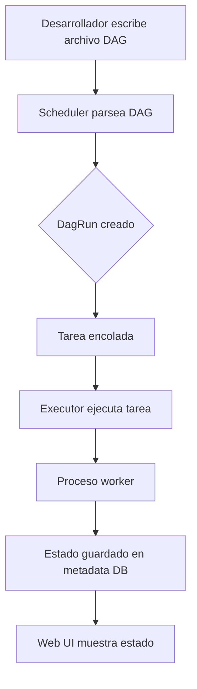

## Visión General

El año pasado moví nuestro ETL nocturno de un crontab a Airflow porque el script de
cron fallaba en silencio y nadie se daba cuenta hasta que el dashboard mostraba los
datos del día anterior. Airflow me dio un lugar para definir el pipeline, programarlo,
reintentar tareas fallidas y ver el estado de cada ejecución en una sola UI.

Un DAG es simplemente un archivo de Python que describe tareas y sus dependencias. El
scheduler de Airflow lee ese archivo, crea ejecuciones para cada intervalo y encola las
tareas. Un executor toma las tareas encoladas y las ejecuta. Una tarea puede ser una
función Python, una consulta SQL, un comando bash o un sensor que espera una condición
externa.

Esta receta muestra cómo construir DAGs de Airflow, programarlos, cablear dependencias de
tareas, usar sensors, compartir datos a través de XCom y escribir pipelines más limpios
con la TaskFlow API. Para una mirada más profunda a arquitectura y despliegue, consultá
[la guía completa de Apache Airflow](/es/guides/complete-guide-apache-airflow/) y la
[documentación oficial de Airflow](https://airflow.apache.org/docs/apache-airflow/stable/index.html).

## Cuándo Usar

Uso Airflow cuando el trabajo tiene más de un paso, los pasos dependen entre sí y quiero
observar después qué pasó.

- Uso Airflow para batch jobs con schedule tipo cron. Si el job necesita reintentos,
  alertas e historial de ejecuciones, Airflow le gana a un crontab simple. Todavía uso
  [cron jobs](/es/recipes/cron-jobs/) para scripts aislados sin dependencias.
- Uso Airflow para pipelines con branching condicional o sensors. Cuando una tarea
  necesita esperar un archivo, una API o un horario específico, los sensors de Airflow
  mantienen la lógica explícita.
- Uso Airflow cuando necesito monitoreo y alerting. La UI de Airflow muestra qué tarea
  falló, los logs y el estado de reintentos. Para colas de tareas muy livianas a veces
  prefiero [Celery](/es/recipes/python-celery-task-queue/), aunque pierdo la
  visualización del DAG.
- Uso Airflow cuando las tareas son idempotentes y reintentables. Si una tarea falla,
  Airflow la vuelve a correr para la misma fecha de ejecución y espera el mismo
  resultado. Eso se ajusta mucho mejor al trabajo batch que a procesos stateful de
  larga duración.

### Cuándo evitar

- Evito Airflow para pipelines real-time o streaming. Usá Flink, Spark Streaming o
  Kafka Streams; Airflow está hecho para intervalos batch.
- Evito Airflow para cron jobs simples sin dependencias. Una sola entrada de crontab es
  más simple y barata de operar.
- Evito Airflow para servicios long-running o daemons. Las tareas de Airflow se espera
  que terminen, no que permanezcan vivas para siempre.
- Evito Airflow para pipelines de CI/CD. GitHub Actions, Jenkins o GitLab CI suelen ser
  mejores porque se integran con repositorios y PRs.

## Solución

### Definición básica de DAG

```python
from datetime import datetime, timedelta
from airflow import DAG
from airflow.operators.python import PythonOperator

with DAG(
    dag_id="etl_daily_pipeline",
    default_args={
        "owner": "data-team",
        "depends_on_past": False,
        "email_on_failure": False,
        "email_on_retry": False,
        "retries": 3,
        "retry_delay": timedelta(minutes=5),
    },
    start_date=datetime(2025, 1, 1),
    schedule="0 2 * * *",  # diario a las 2 AM
    catchup=False,
    tags=["etl", "daily"],
) as dag:

    def extract(**kwargs):
        import pandas as pd
        df = pd.read_csv("/data/raw/orders.csv")
        kwargs["ti"].xcom_push("row_count", len(df))
        return df.to_json()

    def transform(**kwargs):
        import pandas as pd
        ti = kwargs["ti"]
        raw_json = ti.xcom_pull(task_ids="extract")
        df = pd.read_json(raw_json)
        df["order_date"] = pd.to_datetime(df["order_date"])
        df["amount"] = pd.to_numeric(df["amount"], errors="coerce")
        df = df.dropna(subset=["amount"])
        ti.xcom_push("row_count", len(df))
        return df.to_json()

    def load(**kwargs):
        import pandas as pd
        ti = kwargs["ti"]
        transformed_json = ti.xcom_pull(task_ids="transform")
        df = pd.read_json(transformed_json)
        df.to_parquet("/data/processed/orders.parquet", index=False)
        print(f"Loaded {len(df)} rows")

    extract_task = PythonOperator(task_id="extract", python_callable=extract)
    transform_task = PythonOperator(task_id="transform", python_callable=transform)
    load_task = PythonOperator(task_id="load", python_callable=load)

    extract_task >> transform_task >> load_task
```

El `dag_id` debe ser único en la instancia de Airflow. El `start_date` es una fecha fija
histórica, no `datetime.now()`; una fecha dinámica hace impredecible el comportamiento del
scheduler entre despliegues. `catchup=False` es el default más seguro porque evita que
Airflow ejecute todos los intervalos perdidos entre `start_date` y hoy, algo que puede
inundar un pipeline nuevo con cientos de backfills.

### Dependencias de tareas

Airflow usa operadores de bitshift de Python para establecer el orden de las tareas.
Me resultan legibles para cadenas lineales, pero `set_upstream` y `set_downstream` son
útiles cuando la dependencia no encaja visualmente en una flecha.

```python
# cadena lineal
extract_task >> transform_task >> load_task

# ramas paralelas
extract_task >> [transform_task, validate_task] >> load_task

# múltiples tareas upstream
[task_a, task_b] >> task_c

# set upstream o downstream de forma explícita
transform_task.set_upstream(extract_task)
transform_task.set_downstream(load_task)
```

Las dependencias no son flujo de datos. Solo dicen "la tarea B no puede empezar hasta que
la tarea A tenga éxito". Si la tarea A produce un DataFrame grande y la tarea B lo
necesita, igual tenés que usar XCom o un almacenamiento externo.

### Sensors para esperar condiciones

Los sensors hacen polling hasta que algo sucede. `mode="poke"` mantiene un slot de worker
mientras espera; `mode="reschedule"` libera el slot entre chequeos. Para esperas largas,
`reschedule` es casi siempre la opción correcta porque no consume un worker.

```python
from airflow.sensors.filesystem import FileSensor
from airflow.sensors.date_time import DateTimeSensor
from airflow.sensors.python import PythonSensor

wait_for_file = FileSensor(
    task_id="wait_for_file",
    filepath="/data/raw/orders.csv",
    poke_interval=60,  # revisa cada 60 segundos
    timeout=60 * 60,   # falla después de 1 hora
    mode="poke",
    dag=dag,
)

wait_until = DateTimeSensor(
    task_id="wait_until_3am",
    target_time="03:00",
    poke_interval=60,
    mode="reschedule",  # libera el slot de worker entre chequeos
    dag=dag,
)

def api_is_ready():
    import requests
    return requests.get("https://httpbin.org/get").ok

wait_for_api = PythonSensor(
    task_id="wait_for_api",
    python_callable=api_is_ready,
    poke_interval=30,
    timeout=300,
    mode="poke",
    dag=dag,
)

wait_for_file >> extract_task
```

Uso `poke` solo cuando la espera se espera que sea corta, porque mantiene un worker
ocupado. Para una espera de una hora sobre un archivo upstream paso a `reschedule`. El
parámetro `timeout` es importante: sin él, un archivo faltante puede dejar un sensor
corriendo para siempre.

### Branching condicional

`BranchPythonOperator` devuelve el `task_id` que debe ejecutar a continuación. Lo uso
cuando el siguiente paso depende del resultado de una tarea anterior, por ejemplo elegir
entre una transformación completa y una de muestra según la cantidad de filas.

```python
from airflow.operators.python import BranchPythonOperator

def choose_transform(**kwargs):
    row_count = kwargs["ti"].xcom_pull(task_ids="extract", key="row_count")
    return "transform_full" if row_count > 1000 else "transform_sample"

def transform_full_fn(**kwargs):
    import pandas as pd
    ti = kwargs["ti"]
    raw_json = ti.xcom_pull(task_ids="extract")
    df = pd.read_json(raw_json)
    df["amount"] = pd.to_numeric(df["amount"], errors="coerce")
    df = df.dropna(subset=["amount"])
    print(f"Full transform: {len(df)} rows")
    return df.to_json()

def transform_sample_fn(**kwargs):
    import pandas as pd
    ti = kwargs["ti"]
    raw_json = ti.xcom_pull(task_ids="extract")
    df = pd.read_json(raw_json)
    df["amount"] = pd.to_numeric(df["amount"], errors="coerce")
    df = df.dropna(subset=["amount"]).head(100)
    print(f"Sample transform: {len(df)} rows")
    return df.to_json()

transform_full = PythonOperator(
    task_id="transform_full",
    python_callable=transform_full_fn,
    dag=dag,
)

transform_sample = PythonOperator(
    task_id="transform_sample",
    python_callable=transform_sample_fn,
    dag=dag,
)

branch = BranchPythonOperator(
    task_id="choose_transform",
    python_callable=choose_transform,
    dag=dag,
)

extract_task >> branch
branch >> [transform_full, transform_sample]
```

Un branch que no está seguido por un `join` deja las ramas saltadas en estado
`skipped`. Si tareas downstream tienen que correr luego de cualquier rama, agregá una
tarea `join` dummy con reglas de trigger adecuadas.

### TaskFlow API

Desde Airflow 2.0, la TaskFlow API permite escribir tareas como funciones Python con
decoradores `@task`. Los valores de retorno se mueven por XCom automáticamente, así que el
código parece Python plano en lugar de cableado de operators.

```python
from airflow.decorators import dag, task

@dag(
    start_date=datetime(2025, 1, 1),
    schedule="0 2 * * *",
    catchup=False,
    default_args={"owner": "data-team", "retries": 2},
    tags=["etl"],
)
def etl_pipeline():

    @task
    def extract():
        import pandas as pd
        df = pd.read_csv("/data/raw/orders.csv")
        return df.to_dict("records")

    @task
    def transform(records):
        import pandas as pd
        df = pd.DataFrame(records)
        df["order_date"] = pd.to_datetime(df["order_date"])
        df["amount"] = pd.to_numeric(df["amount"], errors="coerce")
        return df.dropna(subset=["amount"]).to_dict("records")

    @task
    def load(records):
        import pandas as pd
        df = pd.DataFrame(records)
        df.to_parquet("/data/processed/orders.parquet", index=False)
        print(f"Loaded {len(df)} rows")

    load(transform(extract()))

etl_pipeline_dag = etl_pipeline()
```

TaskFlow es más limpia para DAGs nuevos, pero sigue usando XCom por debajo. Si tus tareas
pasan objetos grandes, la base de datos de metadatos puede crecer. Mantengo los valores de
retorno pequeños y escribo datos grandes en S3 o un path local, luego paso el path o URI.

### Dynamic task mapping

Introducido en Airflow 2.3, el dynamic task mapping crea una copia de una tarea por cada
ítem de un iterable. Lo uso cuando la cantidad de archivos de entrada es desconocida hasta
el momento de ejecución.

```python
from airflow.decorators import dag, task

@dag(start_date=datetime(2025, 1, 1), schedule="@daily", catchup=False)
def process_many_files():

    @task
    def list_files():
        from pathlib import Path
        return [str(f) for f in Path("/data/raw").glob("*.csv")]

    @task
    def process_file(filepath):
        import pandas as pd
        df = pd.read_csv(filepath)
        print(f"Processed {filepath}: {len(df)} rows")
        return filepath

    files = list_files()
    process_file.expand(filepath=files)

many_files_dag = process_many_files()
```

La llamada `expand()` crea una instancia de tarea por archivo. Tengo cuidado con el total
de tareas mapeadas; Airflow limita cuántas pueden correr en paralelo por defecto, pero
miles de archivos igual pueden ralentizar el scheduler. Suelo agregar un paso de `.zip()`
o filtro para limitar el tamaño del lote.

### Callbacks para éxito o falla

Airflow permite adjuntar `on_failure_callback` y `on_success_callback` a las tareas. Los uso
para enviar un mensaje a Slack o incrementar una métrica cuando una tarea crítica falla.

```python
from airflow import DAG
from airflow.operators.python import PythonOperator

def on_failure_callback(context):
    ti = context["task_instance"]
    print(f"Task {ti.task_id} failed: {context.get('exception')}")

def on_success_callback(context):
    ti = context["task_instance"]
    print(f"Task {ti.task_id} succeeded")

def _simple_task(**kwargs):
    print("Doing work")
    return "ok"

with DAG(
    "monitored_pipeline",
    default_args={
        "on_failure_callback": on_failure_callback,
        "on_success_callback": on_success_callback,
    },
    schedule="@daily",
    start_date=datetime(2025, 1, 1),
    catchup=False,
) as dag:
    task = PythonOperator(
        task_id="simple_task",
        python_callable=_simple_task,
    )
```

Los callbacks corren en el mismo proceso que el scheduler o worker, así que mantenlos
cortos. No pongas lógica pesada ni llamadas de red que puedan fallar y ocultar el error
original de la tarea.

## Explicación



Un DAG es una colección de tareas con dependencias dirigidas y sin ciclos. El scheduler
escanea continuamente los archivos de DAG, crea un `DagRun` para cada intervalo de schedule
y encola las tareas en el orden correcto. Un executor toma las tareas encoladas y las
ejecuta, ya sea en el mismo proceso, en un pool de workers o en Kubernetes. Todo el estado
vuelve a la base de datos de metadatos, y la web UI lee de ahí.

El flujo se siente simple hasta que escala. A bajo volumen, el `LocalExecutor` por defecto
ejecuta tareas como subprocesos. Cuando necesito correr muchas tareas en paralelo paso al
`CeleryExecutor` o `KubernetesExecutor`. El scheduler sigue decidiendo qué corre y cuándo,
pero los workers viven en otro lugar.

### XCom

XCom permite compartir pequeños datos entre tareas. Una tarea empuja un valor con
`xcom_push` o retornándolo; las tareas downstream lo leen con `xcom_pull`. Con TaskFlow, los
valores se mueven de una tarea a otra a través de los valores de retorno de Python. Para
datos grandes, escribí en un archivo o almacenamiento de objetos y pasá el path en lugar de
empujar todo el payload. La base de datos de metadatos no es un data store.

### Sensors

Los sensors hacen polling por una condición externa. `mode="poke"` mantiene un slot de
worker mientras revisa; `mode="reschedule"` libera el slot entre chequeos. Para esperas
largas, elegí `reschedule` para no consumir un worker por horas.

### Catchup y backfill

`catchup=True` hace que Airflow ejecute todos los intervalos perdidos entre `start_date` y
ahora; `catchup=False` arranca desde el presente. Pongo `catchup=False` en DAGs nuevos para
no hacerme backfill de meses de ejecuciones por accidente. Si quiero ejecuciones históricas, uso
`airflow dags backfill` desde el CLI así controlo el rango y el paralelismo.

La documentación oficial de Airflow recomienda usar `schedule` en lugar del antiguo
`schedule_interval`. `schedule` se introdujo como la forma preferida en Airflow 2.4 y
acepta expresiones cron, nombres predefinidos como `@daily` o timetables personalizados.

`max_active_runs` controla cuántos `DagRun` pueden correr al mismo tiempo. Lo seteo en 1
cuando un pipeline no puede solaparse consigo mismo, como agregaciones diarias que
dependen de la corrida anterior.

### Idempotencia

Una tarea debería producir el mismo resultado si corre dos veces para la misma fecha de
ejecución. Eso importa porque Airflow reintenta tareas. Si `load` agrega filas en lugar de
reemplazarlas, un retry duplicará los datos. Suelo escribir en una partición o sobreescribir
el target path usando la fecha de ejecución en el nombre del archivo.

La regla de idempotencia es también por qué prefiero `to_parquet(path, index=False)` con un
path fijo dentro de una carpeta fechada, o una partición `REPLACE` en la base de datos. La
receta de [pipeline ETL con pandas](/es/recipes/python-pandas-etl-pipeline/) muestra un
patrón similar para escribir archivos particionados por fecha.

## Variantes

El operator que elijo depende del trabajo. Por defecto uso `PythonOperator` para lógica
custom, pero los docs de Airflow también listan operators para bash, SQL, Docker,
Kubernetes y muchos cloud providers que reducen boilerplate para casos comunes.

| Operator | Caso de uso | Notas |
| --- | --- | --- |
| `PythonOperator` | Funciones Python | Ideal para lógica custom chica |
| `BashOperator` | Scripts o comandos shell | Pegamento rápido; cuidado con los códigos de salida |
| `DockerOperator` | Tareas en contenedores | Dependencias aisladas; necesita Docker en los workers |
| `KubernetesPodOperator` | Jobs en un cluster de Kubernetes | Escalable y con control de recursos |
| `BranchPythonOperator` | Branching condicional | Devuelve el `task_id` a ejecutar |
| `PythonSensor` | Esperar una condición Python | Usá `reschedule` para esperas largas |

La [referencia de operators y hooks de Airflow](https://airflow.apache.org/docs/apache-airflow/stable/operators-and-hooks-ref.html)
cubre muchos más, incluyendo proveedores cloud. Si solo necesitás correr Python, el
`PythonOperator` o la TaskFlow API mantienen el DAG autocontenido y más fácil de probar
fuera de Airflow.

## Mejores Prácticas

- Seteá `catchup=False` en DAGs nuevos para no hacerte backfill de meses de
  ejecuciones. Si necesitás historia, usá el CLI `airflow dags backfill` con un rango de
  fechas controlado.
- Usá `schedule` en lugar del deprecado `schedule_interval`. Airflow 2.2 y posteriores usan
  `schedule`, y acepta expresiones cron, `@daily`, `@hourly` u objetos `timedelta`.
- Usá `mode="reschedule"` en sensors con timeouts largos para liberar slots de worker.
- Mantené las tareas idempotentes. Re-ejecutar la misma fecha debería dar el mismo
  resultado, así que usá particiones o semántica de sobreescritura.
- Seteá `max_active_runs=1` para pipelines que no pueden solaparse, como agregaciones
  diarias que dependen de la corrida anterior. Yo lo seteo siempre que una corrida
  necesite la salida de la anterior.
- Empujá datos chicos por XCom; para datos grandes, escribí en un archivo o almacenamiento
  de objetos y pasá el path. Yo trato la base de datos de metadatos como estado, no como
  storage.
- Preferí la TaskFlow API para DAGs nuevos si estás en Airflow 2.0 o posterior. La
  sintaxis es más limpia y maneja el XCom plumbing, pero los valores de retorno
  todavía viajan por XCom detrás de escena.
- Etiquetá los DAGs para filtrarlos fácil en la UI. Tags como `etl`, `sales` y `critical`
  hacen la navegación más rápida en un despliegue grande.
- Seteá `retries` y `retry_delay` para fallas transitorias como timeouts de API. Empiezo con
  3 reintentos y 5 minutos de delay, luego ajusto desde los logs.
- Probalo con tu executor real antes de ir a producción. Las tareas que corren localmente
  bajo `SequentialExecutor` pueden comportarse distinto bajo `CeleryExecutor` o
  `KubernetesExecutor` por el ambiente del worker y el paralelismo.

## Errores Comunes

- Usar `@daily` sin `catchup=False`, lo que puede lanzar cientos de backfills en un DAG
  nuevo. El comportamiento por defecto sorprende a muchos equipos.
- Pasar DataFrames grandes por XCom. La metadata DB no es un data store; la base crece y la
  UI se ralentiza.
- Escribir tareas no idempotentes que agregan datos duplicados al reintentar. Las
  re-ejecuciones no deben crear filas o archivos duplicados.
- Usar `PythonOperator` para todo en lugar de operators especializados. Un `BashOperator` o
  `DockerOperator` suele ser mejor para scripts de shell o herramientas containerizadas, y
  me ahorra envolver todo en Python.
- Usar un `start_date` dinámico como `datetime.now()`. Airflow compara el `start_date`
  con el intervalo de schedule, y un `start_date` móvil produce corridas inesperadas.
  Yo lo mantengo estático y determinístico.
- Usar `depends_on_past=True` sin entender que una sola corrida pasada faltante o fallida
  bloquea la corrida actual. Yo solo lo habilito cuando la lógica de negocio genuinamente
  necesita la salida del intervalo anterior.
- Correr el scheduler y el web server en la misma máquina en producción sin separar la base
  de datos de metadatos. SQLite sirve para pruebas locales pero no sobrevive a procesos
  concurrentes de scheduler y web server.
- Olvidarse de setear `on_failure_callback` o una notificación en pipelines críticos. Si
  yo lo salteo, un DAG fallado puede quedar desapercibido hasta que el dashboard se vea
  desactualizado.

## Preguntas Frecuentes

### ¿Qué es un DAG en Airflow?

Un DAG es un conjunto de tareas unidas por dependencias, donde los datos fluyen en una
dirección y no hay ciclos. La [documentación oficial de Airflow](https://airflow.apache.org/docs/apache-airflow/stable/core-concepts/dags.html)
describe un DAG como una colección de todas las tareas que querés correr, organizadas de
manera que reflejen sus relaciones y dependencias. Cada DAG tiene su propio schedule, una
fecha de inicio fija y argumentos por defecto. El DAG en sí no corre; es un blueprint que
el scheduler usa para crear objetos `DagRun`.

### ¿Qué es XCom?

XCom es la abreviatura de cross-communication. La [documentación de XCom de Airflow](https://airflow.apache.org/docs/apache-airflow/stable/core-concepts/xcoms.html)
explica que las tareas empujan valores con `xcom_push` o retornándolos, y los leen con
`xcom_pull`. Con TaskFlow, los valores de retorno se mueven automáticamente sin código
extra. XCom se guarda en la base de datos de metadatos de Airflow, así que mantené los
valores chicos. Para payloads grandes, escribí en S3 u otro almacenamiento y pasá el path.

### ¿Debería usar `poke` o `reschedule` en sensors?

Usá `poke` para esperas cortas de pocos minutos. Para esperas largas, `reschedule` libera
el slot de worker entre chequeos. `poke` es más simple pero puede desperdiciar workers en
esperas largas, por eso casi siempre elijo `reschedule` para esperas de una hora.

### ¿Cómo manejo scheduling con zona horaria?

Uso `pendulum` para setear una fecha de inicio con zona horaria. La fecha de ejecución
va a estar en la zona correcta, lo cual importa cuando el schedule cruza la medianoche
o el horario de verano.

```python
import pendulum

with DAG(
    "tz_aware_dag",
    start_date=pendulum.datetime(2025, 1, 1, tz="America/New_York"),
    schedule="0 2 * * *",
    catchup=False,
) as dag:
    ...
```

La [documentación de pendulum](https://pendulum.eustace.io/docs/) tiene más ejemplos de
manejo de zonas horarias. Prefiero `pendulum` sobre `datetime` naive para cualquier DAG que
corre en más de una zona horaria.

### ¿Cuál es la diferencia entre `schedule` y `timetable`?

`schedule` acepta expresiones cron, `@daily`, `@hourly` o `timedelta`. Para schedules
complejos que no entran en una regla cron, Airflow 2.2 y posteriores permiten definir un
`timetable` custom. La mayoría de los DAGs no necesita un timetable custom, pero es útil
para calendarios de negocio que saltan feriados o usan calendarios fiscales. La
[documentación de Airflow sobre scheduling](https://airflow.apache.org/docs/apache-airflow/stable/core-concepts/dags.html#scheduling)
explica ambas opciones.

### ¿Por qué mi DAG no aparece en la UI de Airflow?

El scheduler tiene que parsear el archivo del DAG antes de que aparezca. Reviso tres
cosas primero: el archivo está en la carpeta `dags/` configurada por `dags_folder`,
el archivo Python no tiene errores de importación (corrí `python -c "import dags.your_file"`
para probarlo) y el scheduler está corriendo (`airflow scheduler`). Un DAG con
`start_date` en el futuro tampoco muestra corridas hasta que llegue esa fecha. Si el
archivo parsea pero el DAG está pausado, la UI lo muestra con un toggle de pausa —
despausálo desde la página de detalle o con `airflow dags unpause your_dag_id`.

### ¿Cómo evito que se solapen corridas del mismo DAG?

Seteo `max_active_runs=1` en el constructor del DAG. Eso le dice al scheduler que
solo un `DagRun` puede estar activo a la vez, así que si una corrida tarda más que
su intervalo de schedule la siguiente espera. Esto importa para pipelines donde cada
corrida depende de la salida de la anterior, como agregaciones diarias que leen la
partición de ayer. Sin eso, una corrida lenta y un schedule rápido pueden producir
corridas solapadas que corrompen los datos entre sí.

## Ver También

- [Apache Airflow: la guía completa](/es/guides/complete-guide-apache-airflow/) —
  arquitectura, despliegue y operators en profundidad.
- [Pipeline ETL con Python y Pandas](/es/recipes/python-pandas-etl-pipeline/) — un ejemplo
  enfocado de carga y transformación de datos con pandas.
- [Cola de tareas con Python Celery](/es/recipes/python-celery-task-queue/) — ejecución
  distribuida de tareas sin la abstracción del DAG.
- [Companion repo ejecutable](https://mathiaspaulenko.github.io/stack-practices-resources/) —
  los archivos DAG completos, sensors, branching y dynamic mapping listos para correr
  con Docker Compose.
- [Documentación oficial de Apache Airflow](https://airflow.apache.org/docs/apache-airflow/stable/index.html) —
  la referencia oficial para operators, sensors y la TaskFlow API.
- [Guía de Airflow de Astronomer](https://www.astronomer.io/guides/) — patrones de
  producción para executors, pools y autoría de DAGs a escala.
