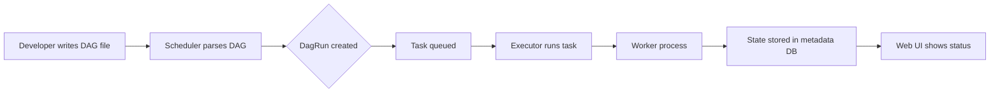

## Overview

I moved our nightly ETL from a crontab to Airflow last year because the cron script
was failing silently, and nobody noticed until the dashboard showed yesterday's data.
Airflow gave me a place to define the pipeline, schedule it, retry failed tasks,
and see the state of every run in one UI.

At its simplest, a DAG is a Python file that lists tasks and wires their
dependencies. Airflow's scheduler reads that file, creates a run for each
interval, and queues the tasks in the right order.
An executor picks up queued tasks and runs them. A task can be a Python function,
a SQL query, a bash command, or a sensor that waits for an external condition.

This recipe shows how to build Airflow DAGs, schedule them, wire task
dependencies, use sensors, share data through XCom, and write cleaner pipelines
with the TaskFlow API. For a deeper look at architecture and deployment, see the
[Apache Airflow guide](/guides/complete-guide-apache-airflow/) and the
[official Airflow documentation](https://airflow.apache.org/docs/apache-airflow/stable/index.html).

## When to Use

I reach for Airflow when the work has more than one step, the steps depend on each
other, and I want to observe what happened later.

- **Batch jobs on a cron-like schedule:** if the job needs retries, alerts, and a
  history of runs, Airflow beats a plain crontab. I still use
  [cron jobs](/recipes/cron-jobs/) for one-off scripts that don't need dependencies.
- **Pipelines with conditional branching or sensors:** when a task needs to wait for
  a file, an API, or a specific time, Airflow's sensors keep the logic explicit.
- **Monitoring and alerting are required:** the Airflow UI shows which task failed,
  the logs, and the retry state. For very light task queues I sometimes prefer
  [Celery](/recipes/python-celery-task-queue/), but I lose the DAG visualization.
- **Tasks are idempotent and can be retried:** if a task fails, Airflow reruns it
  for the same execution date and expects the same result. This fits batch work
  much better than long-lived stateful processes.

### When to avoid

- **Real-time or streaming pipelines:** use Flink, Spark Streaming, or Kafka Streams
  instead; Airflow is built for batch intervals.
- **Simple cron jobs without dependencies:** if the job is just one command on a
  schedule with no upstream or downstream steps, a crontab line is cheaper and
  easier to debug.
- **Long-running services or daemons:** Airflow tasks are expected to finish, not
  stay alive forever.
- **CI/CD pipelines:** for build and deploy workflows, GitHub Actions, Jenkins, or
  GitLab CI integrate with repositories and PRs, which is a better fit than Airflow.

## Solution

### Basic DAG definition

```python
from datetime import datetime, timedelta
from airflow import DAG
from airflow.operators.python import PythonOperator

with DAG(
    dag_id="etl_daily_pipeline",
    default_args={
        "owner": "data-team",
        "depends_on_past": False,
        "email_on_failure": False,
        "email_on_retry": False,
        "retries": 3,
        "retry_delay": timedelta(minutes=5),
    },
    start_date=datetime(2025, 1, 1),
    schedule="0 2 * * *",  # daily at 2 AM
    catchup=False,
    tags=["etl", "daily"],
) as dag:

    def extract(**kwargs):
        import pandas as pd
        df = pd.read_csv("/data/raw/orders.csv")
        kwargs["ti"].xcom_push("row_count", len(df))
        return df.to_json()

    def transform(**kwargs):
        import pandas as pd
        ti = kwargs["ti"]
        raw_json = ti.xcom_pull(task_ids="extract")
        df = pd.read_json(raw_json)
        df["order_date"] = pd.to_datetime(df["order_date"])
        df["amount"] = pd.to_numeric(df["amount"], errors="coerce")
        df = df.dropna(subset=["amount"])
        ti.xcom_push("row_count", len(df))
        return df.to_json()

    def load(**kwargs):
        import pandas as pd
        ti = kwargs["ti"]
        transformed_json = ti.xcom_pull(task_ids="transform")
        df = pd.read_json(transformed_json)
        df.to_parquet("/data/processed/orders.parquet", index=False)
        print(f"Loaded {len(df)} rows")

    extract_task = PythonOperator(task_id="extract", python_callable=extract)
    transform_task = PythonOperator(task_id="transform", python_callable=transform)
    load_task = PythonOperator(task_id="load", python_callable=load)

    extract_task >> transform_task >> load_task
```

The `dag_id` must be unique in the Airflow instance. `start_date` is a fixed
historical date, not `datetime.now()`; a dynamic start date makes the scheduler's
behavior unpredictable across deployments. `catchup=False` is the safest default
because it prevents Airflow from running every missed interval between `start_date`
and today, which can flood a new pipeline with hundreds of backfills.

### Task dependencies

Airflow uses bitshift operators to set task order. I find them readable for linear
chains, but `set_upstream` and `set_downstream` are useful when the dependency
doesn't fit the visual arrow.

```python
# linear chain
extract_task >> transform_task >> load_task

# parallel branches
extract_task >> [transform_task, validate_task] >> load_task

# multiple upstream tasks
[task_a, task_b] >> task_c

# set upstream or downstream explicitly
transform_task.set_upstream(extract_task)
transform_task.set_downstream(load_task)
```

Dependencies aren't data flow. They only say "task B can't start until task A
succeeds." Even if task A produces a DataFrame and task B needs it, the dependency
alone doesn't move the data; you still need XCom or an external store.

### Sensors for waiting on conditions

Sensors poll until something happens. `mode="poke"` holds a worker slot while
waiting; `mode="reschedule"` frees the slot between checks. For long waits,
`reschedule` is almost always the right choice because it doesn't consume a worker.

```python
from airflow.sensors.filesystem import FileSensor
from airflow.sensors.date_time import DateTimeSensor
from airflow.sensors.python import PythonSensor

wait_for_file = FileSensor(
    task_id="wait_for_file",
    filepath="/data/raw/orders.csv",
    poke_interval=60,  # check every 60 seconds
    timeout=60 * 60,   # fail after 1 hour
    mode="poke",
    dag=dag,
)

wait_until = DateTimeSensor(
    task_id="wait_until_3am",
    target_time="03:00",
    poke_interval=60,
    mode="reschedule",  # free the worker slot between pokes
    dag=dag,
)

def api_is_ready():
    import requests
    return requests.get("https://httpbin.org/get").ok

wait_for_api = PythonSensor(
    task_id="wait_for_api",
    python_callable=api_is_ready,
    poke_interval=30,
    timeout=300,
    mode="poke",
    dag=dag,
)

wait_for_file >> extract_task
```

I use `poke` only when the wait is expected to be short, because it keeps a worker
busy. If a sensor has to wait an hour for a file, I switch its mode to `reschedule`
so it doesn't tie up a worker slot. The `timeout` parameter is important: without
it, a missing file can leave a sensor
running forever.

### Conditional branching

A `BranchPythonOperator` looks at the return value of its `python_callable` and
picks the `task_id` to run next. I use it when the next step depends on the result
of a previous task, such as choosing between a full transform and a sample
transform based on row count.

```python
from airflow.operators.python import BranchPythonOperator

def choose_transform(**kwargs):
    row_count = kwargs["ti"].xcom_pull(task_ids="extract", key="row_count")
    return "transform_full" if row_count > 1000 else "transform_sample"

def transform_full_fn(**kwargs):
    import pandas as pd
    ti = kwargs["ti"]
    raw_json = ti.xcom_pull(task_ids="extract")
    df = pd.read_json(raw_json)
    df["amount"] = pd.to_numeric(df["amount"], errors="coerce")
    df = df.dropna(subset=["amount"])
    print(f"Full transform: {len(df)} rows")
    return df.to_json()

def transform_sample_fn(**kwargs):
    import pandas as pd
    ti = kwargs["ti"]
    raw_json = ti.xcom_pull(task_ids="extract")
    df = pd.read_json(raw_json)
    df["amount"] = pd.to_numeric(df["amount"], errors="coerce")
    df = df.dropna(subset=["amount"]).head(100)
    print(f"Sample transform: {len(df)} rows")
    return df.to_json()

transform_full = PythonOperator(
    task_id="transform_full",
    python_callable=transform_full_fn,
    dag=dag,
)

transform_sample = PythonOperator(
    task_id="transform_sample",
    python_callable=transform_sample_fn,
    dag=dag,
)

branch = BranchPythonOperator(
    task_id="choose_transform",
    python_callable=choose_transform,
    dag=dag,
)

extract_task >> branch
branch >> [transform_full, transform_sample]
```

When a branch isn't followed by a `join` task, the branches that were not chosen
end with a `skipped` status, so any downstream task with the default
`all_success` trigger doesn't run. If downstream tasks must run after either
branch, add a dummy `join` task with the right trigger rules.

### TaskFlow API

Since Airflow 2.0, the TaskFlow API lets you write tasks as Python functions with
`@task` decorators. Return values move through XCom automatically, so the code looks
like plain Python instead of operator wiring.

```python
from airflow.decorators import dag, task

@dag(
    start_date=datetime(2025, 1, 1),
    schedule="0 2 * * *",
    catchup=False,
    default_args={"owner": "data-team", "retries": 2},
    tags=["etl"],
)
def etl_pipeline():

    @task
    def extract():
        import pandas as pd
        df = pd.read_csv("/data/raw/orders.csv")
        return df.to_dict("records")

    @task
    def transform(records):
        import pandas as pd
        df = pd.DataFrame(records)
        df["order_date"] = pd.to_datetime(df["order_date"])
        df["amount"] = pd.to_numeric(df["amount"], errors="coerce")
        return df.dropna(subset=["amount"]).to_dict("records")

    @task
    def load(records):
        import pandas as pd
        df = pd.DataFrame(records)
        df.to_parquet("/data/processed/orders.parquet", index=False)
        print(f"Loaded {len(df)} rows")

    load(transform(extract()))

etl_pipeline_dag = etl_pipeline()
```

TaskFlow is cleaner for new DAGs, but it still uses XCom under the hood. If your
tasks pass big objects, the metadata database can grow. I keep return values small
and write large data to S3 or a local path, then pass the path or URI.

### Dynamic task mapping

Introduced in Airflow 2.3, dynamic task mapping creates a copy of a task for each
item in an iterable. I reach for `expand()` when the file list only exists at
runtime, such as a directory that gets a new CSV each hour.

```python
from airflow.decorators import dag, task

@dag(start_date=datetime(2025, 1, 1), schedule="@daily", catchup=False)
def process_many_files():

    @task
    def list_files():
        from pathlib import Path
        return [str(f) for f in Path("/data/raw").glob("*.csv")]

    @task
    def process_file(filepath):
        import pandas as pd
        df = pd.read_csv(filepath)
        print(f"Processed {filepath}: {len(df)} rows")
        return filepath

    files = list_files()
    process_file.expand(filepath=files)

many_files_dag = process_many_files()
```

`expand()` spins up one task instance for each item in the iterable. Be careful
with the total number of mapped tasks; by default Airflow limits how many can run
in parallel, but thousands of files can still slow down the scheduler. I usually
add a `.zip()` or filter step to cap the batch size.

### Callbacks for success or failure

Airflow lets you attach `on_failure_callback` and `on_success_callback` to tasks.
I use them to send a Slack message or increment a metric when a critical task fails.

```python
from airflow import DAG
from airflow.operators.python import PythonOperator

def on_failure_callback(context):
    ti = context["task_instance"]
    print(f"Task {ti.task_id} failed: {context.get('exception')}")

def on_success_callback(context):
    ti = context["task_instance"]
    print(f"Task {ti.task_id} succeeded")

def _simple_task(**kwargs):
    print("Doing work")
    return "ok"

with DAG(
    "monitored_pipeline",
    default_args={
        "on_failure_callback": on_failure_callback,
        "on_success_callback": on_success_callback,
    },
    schedule="@daily",
    start_date=datetime(2025, 1, 1),
    catchup=False,
) as dag:
    task = PythonOperator(
        task_id="simple_task",
        python_callable=_simple_task,
    )
```

Because callbacks execute in the same process as the scheduler or worker, I keep
them short and failure-tolerant. A callback that fails or hangs can mask the
original task failure and make the logs harder to read.

## Explanation



A DAG is a collection of tasks with directed dependencies and no cycles. The
scheduler continuously scans the DAG files, creates a `DagRun` for each schedule
interval, and queues the tasks in the right order. An executor picks up queued tasks
and runs them, either in the same process, in a pool of workers, or on Kubernetes.
All state goes back to the metadata database, and the web UI reads from there.

The flow feels simple until you scale. At low volume, the default `LocalExecutor`
just runs each task as a subprocess. Once that becomes the bottleneck, I move to the
`CeleryExecutor` or `KubernetesExecutor` so tasks can run on more than one worker
or pod. The scheduler is still the one that decides what runs and when; the workers are
just the muscle elsewhere.

### XCom

XCom lets tasks share small pieces of data. A task pushes a value with `xcom_push`
or by returning it; downstream tasks pull it with `xcom_pull`. With TaskFlow, the
return values move between tasks through plain Python returns. For large data,
write to a file or object storage and pass the path instead of pushing the whole
payload. I keep the metadata database for scheduler state; it isn't the place to park large datasets or pass big DataFrames between tasks.

### Sensors

Sensors poll for an external condition. `mode="poke"` holds a worker slot while
checking; `mode="reschedule"` frees the slot between checks. For long waits, pick
`reschedule` mode to avoid consuming a worker for hours.

### Catchup and backfill

`catchup=True` makes Airflow run every missed interval between `start_date` and
now; `catchup=False` starts from the present. I set `catchup=False` for new DAGs so
I don't accidentally backfill months of runs. If I do want historical runs, I use
`airflow dags backfill` from the CLI so I can control the range and parallelism.

`max_active_runs` controls how many `DagRun` objects can run at the same time. I set
it to 1 when a pipeline must not overlap with itself, such as daily aggregations
that depend on the previous run.

### Idempotency

When Airflow retries a task, I expect the same execution date to produce the same output, so I design each step to overwrite or partition rather than append.
This matters because Airflow retries tasks. If `load` appends rows instead of
replacing them, a retry will double the data. I usually write to a partition or overwrite the target path with the execution
date in the filename.

The `idempotency` rule is also why I prefer `to_parquet(path, index=False)` with a
fixed path inside a dated folder, or a `REPLACE` partition in the database. The
[pandas ETL pipeline recipe](/recipes/python-pandas-etl-pipeline/) shows a similar
pattern for writing date-partitioned files.

## Variants

The operator you pick depends on the actual work. I default to `PythonOperator`
for custom logic, but specialized operators reduce boilerplate for common cases.

| Operator | Use case | Notes |
| --- | --- | --- |
| `PythonOperator` | Python functions | Best for small, custom logic |
| `BashOperator` | Shell scripts or commands | Quick glue code; watch for exit codes |
| `DockerOperator` | Containerized tasks | Isolated dependencies; needs Docker on workers |
| `KubernetesPodOperator` | Jobs on a Kubernetes cluster | Scalable and resource-managed |
| `BranchPythonOperator` | Conditional branching | Returns the `task_id` to run next |
| `PythonSensor` | Wait for a Python condition | Use `reschedule` mode for long waits |

The [Airflow operators and hooks reference](https://airflow.apache.org/docs/apache-airflow/stable/operators-and-hooks-ref.html)
covers many more, including cloud providers. If the work is pure Python, the
`PythonOperator` or the TaskFlow API keeps the DAG self-contained and easier to
test outside Airflow.

## Best Practices

- Set `catchup=False` for new DAGs so you don't accidentally backfill months of
  runs. If you need history, use the CLI `airflow dags backfill` with a controlled
  date range.
- Prefer `schedule` over the deprecated `schedule_interval`. Airflow 2.2 and later
  use `schedule`, and it accepts cron expressions, `@daily`, `@hourly`, or
  `timedelta` objects.
- Pick `mode="reschedule"` for sensors with long timeouts to free worker slots.
- Keep tasks idempotent. Re-running a task for the same date should give the same
  result, so use partitions or overwrite semantics.
- Set `max_active_runs=1` for pipelines that can't overlap, like daily
  aggregations where the current run needs the previous run's output.
- Push small data via XCom; for large data, write to a file or object storage and
  pass the path. I treat the metadata database as state, not as a storage layer.
- Prefer the TaskFlow API for new DAGs if you're on Airflow 2.0 or later. It's
  cleaner and handles XCom for you, but it's still using XCom under the hood.
- Tag DAGs so filtering them in the UI is easier. Tags like `etl`, `sales`, and
  `critical` make navigation faster in a large deployment.
- Set `retries` and `retry_delay` for transient failures like API timeouts. I start
  with 3 retries and a 5-minute delay, then tune from the logs.
- Test behind your real executor before going live. Tasks that run locally under the
  `SequentialExecutor` may behave differently under `CeleryExecutor` or
  `KubernetesExecutor` because of worker environment and parallelism.

## Common Mistakes

- Running `@daily` without `catchup=False` can launch hundreds of backfill runs on a
  new DAG. The default behavior catches many teams by surprise.
- Pushing large DataFrames via XCom. Don't push large data into the Airflow metadata
  database; it's for state, not storage. The database grows and the UI slows down.
- Writing non-idempotent tasks that append duplicate data on retry. Re-runs should
  not create duplicate rows or files.
- Reaching for `PythonOperator` for everything instead of specialized operators.
  If the work is already a shell script or a container, the `BashOperator` or
  `DockerOperator` saves me from wrapping it in Python.
- Writing `start_date=datetime.now()` or any other dynamic value; keep it static.
  Airflow compares the start date to the schedule interval, and a moving start date
  produces unexpected runs.
- Using `depends_on_past=True` without understanding that a single missing or
  failed past run blocks the current run. I only enable this when the business
  logic genuinely needs the previous interval's output.
- Running the scheduler and web server on the same machine in production without
  separating the metadata database. The default SQLite setup is fine for local
  testing but won't survive concurrent scheduler and web server processes.
- Forgetting to set `on_failure_callback` or a notification on critical pipelines.
  If I skip this, a failed DAG can sit for hours before the dashboard makes it
  obvious.

## FAQ

### What is a DAG in Airflow?

A DAG is a set of tasks tied together by dependencies, where data flows one way and
there are no cycles. Every DAG carries its own schedule, a fixed start date, and
default arguments. The DAG itself doesn't run; it's a blueprint that the scheduler
uses to create `DagRun` objects.

### What is XCom?

Cross-communication. Tasks push values with `xcom_push` or by returning them, and
pull values with `xcom_pull`. With TaskFlow, return values move automatically
without extra code. XCom is stored in the Airflow metadata database, so keep values
small. For large payloads, write to S3 or another store and pass the path.

### Should I use `poke` or `reschedule` mode for sensors?

Use `poke` for waits under a few minutes. For long waits, `reschedule` mode frees
the worker slot between checks. `poke` is simpler but can waste workers during long
waits, which is why I almost always choose `reschedule` for hour-long waits.

### How do I handle timezone-aware scheduling?

Use `pendulum` to set a timezone-aware start date. Then the execution date stays
in the right time zone, which matters when the schedule crosses midnight or
changes for daylight saving.

```python
import pendulum

with DAG(
    "tz_aware_dag",
    start_date=pendulum.datetime(2025, 1, 1, tz="America/New_York"),
    schedule="0 2 * * *",
    catchup=False,
) as dag:
    ...
```

The [pendulum documentation](https://pendulum.eustace.io/docs/) has more examples
of timezone handling. I prefer `pendulum` over naive `datetime` for any DAG that
runs in more than one time zone.

### What is the difference between `schedule` and `timetable`?

`schedule` accepts cron expressions, `@daily`, `@hourly`, or `timedelta`. For
schedules too complex for a cron expression, Airflow 2.2 and later lets you define
a custom `timetable`. Most DAGs don't need a custom timetable, but it's useful for
business schedules that skip holidays or use fiscal calendars. The
[Airflow docs on DAG scheduling](https://airflow.apache.org/docs/apache-airflow/stable/core-concepts/dags.html#scheduling)
explain both options.

## See Also

- [Apache Airflow: the complete guide](/guides/complete-guide-apache-airflow/) —
  architecture, deployment, and operators in depth.
- [Python Pandas ETL pipeline](/recipes/python-pandas-etl-pipeline/) — a focused
  example of loading and transforming data with pandas.
- [Cron jobs](/recipes/cron-jobs/) — when a single scheduled script is enough.
- [Python Celery task queue](/recipes/python-celery-task-queue/) — distributed
  task execution without the DAG abstraction.
- [Apache Airflow documentation](https://airflow.apache.org/docs/apache-airflow/stable/index.html) —
  the official reference for operators, sensors, and the TaskFlow API.
