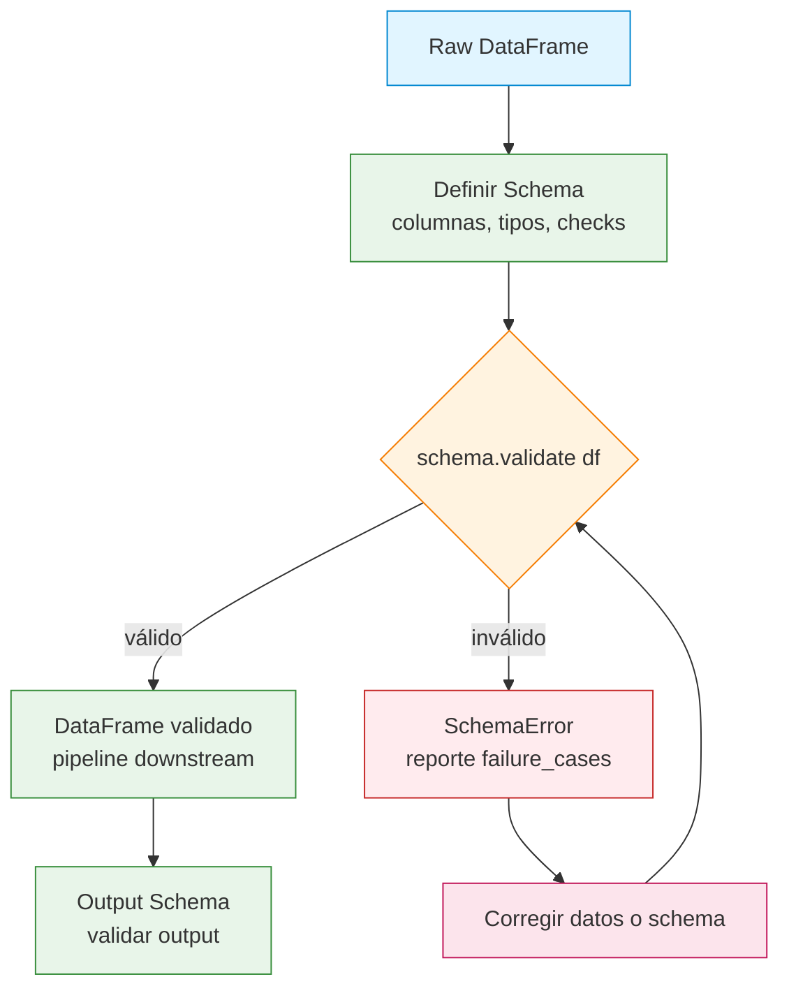

## Resumen

Pandera es una librería de validación de datos para DataFrames de pandas y Polars.
Definís un schema que especifica nombres de columnas, tipos de datos y constraints
como rangos de valores, nullability y unicidad. Pandera valida el DataFrame contra el
schema y lanza errores claros cuando los datos no coinciden. Así detectás problemas de
calidad de datos antes de que lleguen a consumidores o modelos en producción.

Llegué a Pandera después de que un pipeline del trabajo empezó a corromper
silenciosamente inputs para un modelo de recomendación. Un equipo upstream cambió
una columna de `int64` a `float64` sin avisarle a nadie, y el modelo entrenó con
basura durante una semana antes de que alguien lo notara. Después de añadir schemas
de Pandera en cada límite del pipeline, el mismo cambio se habría detectado en
segundos, no días.



## Cuándo Usar

- [Pipelines ETL](/recipes/python-pandas-etl-pipeline/) donde la calidad de los datos upstream es incierta.
- Feature engineering de ML: validar las columnas de entrada antes de entrenar un modelo.
- Ingesta de datos desde APIs externas, archivos o bases de datos.
- Testear transformaciones y asegurar que el output cumpla el schema esperado.
- Cualquier pipeline donde la corrupción silenciosa de datos cause problemas.

## Cuándo NO Usar

- Análisis exploratorio puntual: usá `df.dtypes` y `df.describe()`.
- Cuando necesitás profiling completo: usá Great Expectations o ydata-profiling.
- Validación en tiempo real con latencia estricta: Pandera agrega overhead.
- Cuando el schema cambia constantemente y el costo de mantenimiento es alto.

## Solución

### Validación básica de schema

```python
import pandas as pd
import pandera as pa
from pandera import Column, DataFrameSchema, Check

schema = DataFrameSchema({
    "order_id": Column(int, checks=Check.gt(0)),
    "customer_id": Column(int, nullable=False),
    "order_date": Column(pa.DateTime),
    "amount": Column(float, checks=[Check.ge(0), Check.le(100000)]),
    "status": Column(str, checks=Check.isin(["pending", "completed", "cancelled"])),
})

df = pd.DataFrame({
    "order_id": [1, 2, 3],
    "customer_id": [101, 102, 103],
    "order_date": pd.to_datetime(["2025-01-01", "2025-01-02", "2025-01-03"]),
    "amount": [100.0, 250.0, 75.5],
    "status": ["completed", "pending", "cancelled"],
})

# Validar: lanza SchemaError si es inválido
validated_df = schema.validate(df)
print("Validation passed!")
```

### Schema con sintaxis basada en clases

```python
import pandas as pd
import pandera as pa
from pandera import Field
from pandera.typing import Series

class OrderSchema(pa.DataFrameModel):
    order_id: Series[int] = Field(gt=0, description="Unique order identifier")
    customer_id: Series[int] = Field(nullable=False)
    order_date: Series[pa.DateTime] = Field(le="2025-12-31")
    amount: Series[float] = Field(ge=0, le=100000)
    status: Series[str] = Field(isin=["pending", "completed", "cancelled"])
    quantity: Series[int] = Field(ge=1, le=1000)

    class Config:
        strict = True  # Rechazar columnas extra
        coerce = True  # Auto-convertir tipos

df = pd.DataFrame({
    "order_id": [1, 2, 3],
    "customer_id": [101, 102, 103],
    "order_date": pd.to_datetime(["2025-01-01", "2025-01-02", "2025-01-03"]),
    "amount": [100.0, 250.0, 75.5],
    "status": ["completed", "pending", "cancelled"],
    "quantity": [2, 1, 5],
})

validated = OrderSchema.validate(df)
```

### Checks personalizados

```python
import re
import pandas as pd
import pandera as pa
from pandera import Column, Check, DataFrameSchema

def is_valid_email(series: pd.Series) -> pd.Series:
    """Verifica que todos los valores sean emails válidos."""
    pattern = r'^[\w.-]+@[\w.-]+\.\w+$'
    return series.str.match(pattern)

schema = DataFrameSchema({
    "email": Column(str, checks=Check(is_valid_email, element_wise=False)),
    "age": Column(int, checks=[
        Check.ge(18, error="Must be 18 or older"),
        Check.le(120, error="Age must be realistic"),
    ]),
    "phone": Column(str, checks=Check.str_matches(r'^\+?\d{10,15}$')),
})
```

### Checks a nivel de columna

```python
from pandera import Column, Check, DataFrameSchema

schema = DataFrameSchema({
    "id": Column(int, checks=[
        Check.unique(),  # Sin duplicados
        Check.gt(0),     # Positivo
    ]),
    "name": Column(str, checks=[
        Check.str_length(min_value=1, max_value=100),
        Check.not_nullable(),
    ]),
    "price": Column(float, checks=[
        Check.ge(0),
        Check.le(10000),
        Check(lambda s: s.std() < 1000, element_wise=False, error="Price variance too high"),
    ]),
    "category": Column(str, checks=[
        Check.isin(["electronics", "books", "clothing", "food"]),
    ], nullable=True),  # Puede ser null
})
```

### Checks a nivel de DataFrame

```python
import pandera as pa
from pandera import Column, Check, DataFrameSchema

schema = DataFrameSchema(
    columns={
        "start_date": Column(pa.DateTime),
        "end_date": Column(pa.DateTime),
    },
    checks=Check(
        lambda df: df["end_date"] > df["start_date"],
        element_wise=False,
        error="end_date must be after start_date",
    )
)
```

### Schema con coerción

```python
import pandas as pd
import pandera as pa
from pandera import Column, DataFrameSchema

schema = DataFrameSchema({
    "order_id": Column(int, coerce=True),
    "amount": Column(float, coerce=True),
    "order_date": Column(pa.DateTime, coerce=True),
}, coerce=True)  # Coerción global

# Pandera convierte tipos antes de validar
df = pd.DataFrame({
    "order_id": ["1", "2", "3"],       # Strings → int
    "amount": ["100.0", "250.0", "75.5"],  # Strings → float
    "order_date": ["2025-01-01", "2025-01-02", "2025-01-03"],  # Strings → DateTime
})

validated = schema.validate(df)
print(validated.dtypes)  # int64, float64, datetime64[ns]
```

### Manejo de errores de validación

```python
import pandera as pa
from pandera import Column, Check, DataFrameSchema

schema = DataFrameSchema({
    "amount": Column(float, checks=Check.ge(0)),
    "status": Column(str, checks=Check.isin(["pending", "completed", "cancelled"])),
})

try:
    validated = schema.validate(df, lazy=True)  # Acumula todos los errores
except pa.SchemaErrors as e:
    print(f"Found {len(e.failure_cases)} validation failures:")
    print(e.failure_cases[["column", "check", "failure_case", "index"]])
```

### Herencia de schemas

```python
import pandera as pa
from pandera import Field
from pandera.typing import Series

class BaseOrderSchema(pa.DataFrameModel):
    order_id: Series[int] = Field(gt=0)
    customer_id: Series[int] = Field(nullable=False)
    amount: Series[float] = Field(ge=0)

class ExtendedOrderSchema(BaseOrderSchema):
    status: Series[str] = Field(isin=["pending", "completed", "cancelled"])
    shipping_address: Series[str] = Field(nullable=True)

    class Config:
        strict = True
        coerce = True
```

### Validar DataFrames de Polars

Pandera también funciona con [Polars](/recipes/python-polars-fast-dataframe/), que
prefiero para datasets más grandes donde pandas se vuelve lento.

```python
import polars as pl
import pandera.polars as pa_pl
from pandera.typing.polars import Series
from pandera import Field

class OrderSchema(pa_pl.DataFrameModel):
    order_id: Series[int] = Field(gt=0)
    customer_id: Series[int] = Field(nullable=False)
    amount: Series[float] = Field(ge=0, le=100000)
    status: Series[str] = Field(isin=["pending", "completed", "cancelled"])

df = pl.DataFrame({
    "order_id": [1, 2, 3],
    "customer_id": [101, 102, 103],
    "amount": [100.0, 250.0, 75.5],
    "status": ["completed", "pending", "cancelled"],
})

validated = OrderSchema.validate(df)
```

### Uso de schema en un pipeline

```python
import pandas as pd
import pandera as pa
from pandera import Column, Check, DataFrameSchema

input_schema = DataFrameSchema({
    "order_id": Column(int, checks=Check.gt(0)),
    "amount": Column(float, checks=Check.ge(0)),
})

output_schema = DataFrameSchema({
    "order_id": Column(int, checks=Check.gt(0)),
    "amount": Column(float, checks=Check.ge(0)),
    "amount_with_tax": Column(float, checks=Check.ge(0)),
})

def process_orders(df: pd.DataFrame) -> pd.DataFrame:
    df = input_schema.validate(df)
    df["amount_with_tax"] = df["amount"] * 1.1
    return output_schema.validate(df)
```

## Variantes

### Integración con hypothesis testing

```python
import pandera as pa
from pandera import Column, Check, DataFrameSchema

schema = DataFrameSchema({
    "amount": Column(float, checks=[
        Check.in_range(min_value=0, max_value=10000),
        # Check estadístico: la media debería rondar los 500
        Check(lambda s: abs(s.mean() - 500) < 100, element_wise=False),
        # Check de desvío estándar
        Check(lambda s: s.std() < 500, element_wise=False),
    ]),
})
```

### Schema a partir de un DataFrame existente

```python
import pandas as pd
import pandera as pa

# Inferir schema desde un DataFrame
df = pd.read_csv("data/orders.csv")
schema = pa.infer_schema(df)
print(schema)

# Guardar schema para reutilizar
schema.to_yaml("schemas/orders_schema.yaml")

# Cargar después
schema = pa.DataFrameSchema.from_yaml("schemas/orders_schema.yaml")
```

### Validación con decoradores

```python
import pandas as pd
from pandera import check_input, check_output

# Reusar OrderSchema y ExtendedOrderSchema definidos antes
@check_input(OrderSchema)
@check_output(ExtendedOrderSchema)
def enrich_orders(df: pd.DataFrame) -> pd.DataFrame:
    df["status"] = df["status"].fillna("pending")
    df["shipping_address"] = df.get("shipping_address", "N/A")
    return df
```

## Buenas Prácticas

- Usá `lazy=True` para acumular todos los errores de una sola vez: el modo
  predeterminado se detiene en el primero.
- Usá `coerce=True` cuando los datos vienen de CSV (strings) y necesitás
  conversión de tipos.
- Seteá `strict=True` para rechazar columnas inesperadas y detectar schema drift.
- Definí schemas como clases (`pa.DataFrameModel`) para legibilidad y reutilización.
- Validá en los límites del pipeline: entrada y salida de cada etapa.
- Usá `nullable=True` para columnas opcionales; el default es no nullable.
- Guardá schemas en YAML para compartirlos entre equipos.
- Usá checks personalizados para lógica de negocio; los built-in cubren rangos y
  tipos.
- Versioná tus schemas. Cuando cambiás un schema, subí un número de versión para
  que los consumidores downstream sepan que el contrato cambió. Guardo las
  versiones en el nombre del YAML: `orders_schema_v3.yaml`.
- Logueá los failures de validación con contexto. Cuando un schema falla en
  producción, querés saber qué batch, qué fuente upstream y qué rows lo causaron.
  El DataFrame `failure_cases` de Pandera tiene todo lo que necesitás.

## Errores Comunes

- **No usar `lazy=True`**: el default se detiene en el primer error y se pierden
  los demás.
- **Olvidar `coerce=True`**: los datos de CSV vienen como strings. Sin coerción, los
  checks de tipo fallan.
- **No setear `strict=True`**: las columnas extra pasan sin aviso.
- **Validar solo al final**: los errores se propagan. Validar en cada etapa.
- **Usar checks element-wise para validaciones agregadas**: usá `element_wise=False`
  para checks sobre toda la serie (media, desvío, count).
- **No testear el schema mismo**: un schema con reglas incorrectas deja pasar datos
  malos silenciosamente. Escribí un test que alimente datos sabidamente malos y
  aserte que el schema los atrape. Una vez shippeé un schema con `Check.gt(0)`
  en vez de `Check.ge(0)` y rechazó rows válidas con valores cero.

## Explicación

### Cómo funciona la validación de Pandera

Pandera ejecuta checks en dos fases. Primero verifica la estructura del DataFrame:
nombres de columnas, tipos de datos, y si el modo `strict` rechaza columnas extra.
Después ejecuta tus checks: los built-in como `Check.gt(0)` y funciones custom que
pasás como callables. Si un check falla, obtenés un `SchemaError` con las rows,
columnas y failure cases en un DataFrame ordenado.

El flag `lazy=True` cambia este comportamiento. En vez de detenerse en el primer
error, Pandera acumula todos los errores y levanta una sola excepción
`SchemaErrors`. Siempre uso `lazy=True` en producción. Ver todos los errores a la
vez le gana a ir fixesándolos de a uno, especialmente cuando validás un batch de
10.000 rows con múltiples issues.

### DataFrameSchema vs DataFrameModel

Pandera ofrece dos sintaxis. `DataFrameSchema` es la API original basada en
diccionarios. `DataFrameModel` es la API basada en clases añadida después.
Prefiero `DataFrameModel` para cualquier cosa más allá de un script rápido. Las
clases son más fáciles de leer, heredar y reutilizar entre proyectos. La sintaxis
de diccionarios está bien para schemas one-off o cuando generás schemas
programáticamente.

Ambas sintaxis soportan las mismas capacidades: checks, coerción, strict mode,
nullability y herencia. Elegí una y mantenela dentro de un proyecto.

### Consideraciones de performance

La validación agrega overhead. En un DataFrame de 100.000 rows, un schema con 10
columnas y checks básicos corre en unos 50-100ms. Los checks custom con lambdas
son más lentos porque Pandera no los puede vectorizar. Si validás millones de
rows, considerá validar una muestra en vez del DataFrame completo, o usá el modo
Polars que es más rápido para datos grandes.

Una vez añadí validación de Pandera a un pipeline que procesaba 2M rows diarios.
La validación agregó 3 segundos a un pipeline de 45 segundos. Vale la pena por la
red de seguridad. Si la validación se vuelve un cuello de botella, validá una
muestra aleatoria del 1% en cada batch y hacé una validación completa semanal.

Otro truco: cacheá el objeto schema. Crear un `DataFrameSchema` desde un
diccionario tiene un costo chico, y si llamás `validate` en un loop ajustado, ese
costo se acumula. Definí el schema una vez a nivel módulo y reusalo. El schema
es stateless, así que compartirlo entre calls es seguro.

### Pandera vs Great Expectations

Usé ambos. Pandera es code-first y liviano: escribís schemas en Python, y viven
junto al código del pipeline. Great Expectations es config-first y más pesado:
escribís expectativas en YAML o JSON, y genera reportes HTML. Usá Pandera cuando
querés validación integrada al código del pipeline. Usá Great Expectations cuando
necesitás profiling de datos, audit trails o stakeholders no técnicos revisando
reportes de validación.

Para la mayoría del trabajo de pipelines, Pandera es el mejor punto de partida.
Es más rápido de setear, más fácil de versionar y se integra naturalmente con
pytest. Solo llego a Great Expectations cuando un cliente necesita reportes
audit-ready por compliance.

### Integración con pytest

Pandera se combina bien con pytest para data testing. Podés usar
`schema.validate(df)` como una aserción de pytest, o usar los decoradores
`@check_input` y `@check_output` para validar inputs y outputs de funciones
automáticamente durante los tests.

```python
import pytest
import pandas as pd
from pandera import Column, DataFrameSchema, Check

schema = DataFrameSchema({
    "id": Column(int, checks=Check.unique()),
    "value": Column(float, checks=Check.ge(0)),
})

def test_pipeline_output():
    df = pd.DataFrame({"id": [1, 2], "value": [10.0, 20.0]})
    schema.validate(df)  # Levanta error si es inválido
```

Esto convierte la calidad de datos en un gate de CI. Si una transformación rompe
el schema, tus tests fallan antes de que el código llegue a producción.

## See Also

- [Documentación de Pandera](https://pandera.readthedocs.io/):
  docs oficial cubriendo checks, coerción, schema inference,
  hypothesis testing y soporte para Polars.
- [Documentación de pandas](https://pandas.pydata.org/docs/):
  la librería de DataFrames que Pandera valida.
- [Documentación de Polars](https://pola.rs/):
  la librería de DataFrames rápida que Pandera también soporta.
- [Great Expectations](https://greatexpectations.io/):
  una alternativa más pesada para profiling y reportes de validación.
- [Recetas de validación de datos](/recipes/data-validation/):
  más enfoques para validación de datos en pipelines de Python.

## Preguntas Frecuentes

### ¿Cuál es la diferencia entre Pandera y Great Expectations?

Pandera es liviano y code-first: definís schemas en Python. Great Expectations es más
pesado y config-first: definís expectativas en JSON o YAML. Usá Pandera para
validación de pipelines; Great Expectations para profiling y reportes.

### ¿Puedo usar Pandera con Polars?

Sí. Usá el módulo `pandera.polars` y `pandera.typing.polars.Series`. La API es igual a
la versión de pandas.

### ¿Pandera soporta columnas nullable?

Sí. Seteá `nullable=True` en `Column()` o `Field()`. Por default, las columnas son no
nullable.

### ¿Cómo valido un subconjunto de columnas?

Usá `strict=False` (el default) y especificá solo las columnas que querés validar. Las
columnas extra se ignoran.

### ¿Puedo generar datos de prueba desde un schema?

Sí. Usá `schema.example(size=10)` para generar un DataFrame de ejemplo que pase la
validación:

```python
sample = OrderSchema.example(size=5)
print(sample)
```
