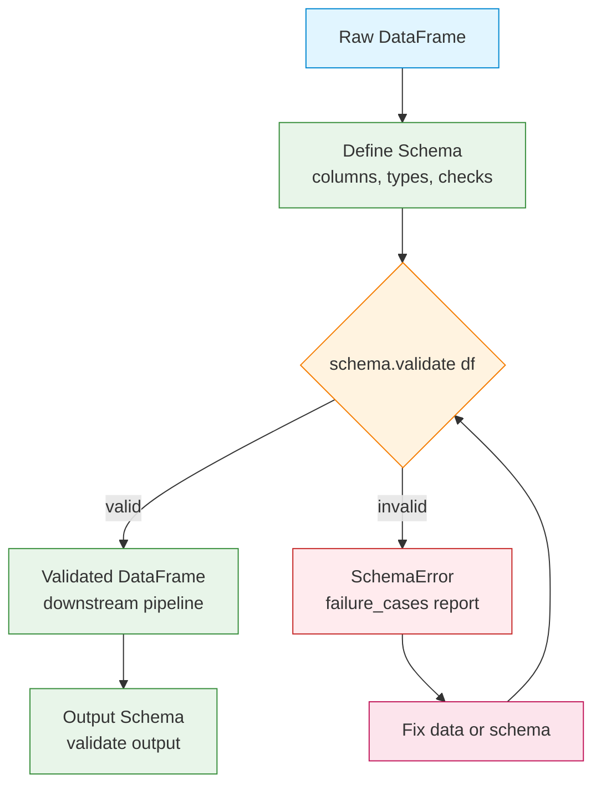

## Overview

Pandera lets you declare a schema for pandas and Polars DataFrames and then validate
real data against it. You pick the columns, the data types, and the rules: value
ranges, nullability, uniqueness. If the data breaks a rule, Pandera raises
a clear `SchemaError` instead of letting bad rows drift into downstream consumers or
production models. It's a small addition that prevents painful debugging later, and it pays for
itself the first time it catches a silent schema change upstream.

I first reached for Pandera after a pipeline at work started silently corrupting
inputs for a recommendation model. A upstream team changed a column from `int64`
to `float64` without telling anyone, and the model trained on garbage for a week
before anyone noticed. After adding Pandera schemas at each pipeline boundary, the
same change would have been caught in seconds, not days.



## When to Use

Reach for Pandera when data quality matters and the schema is stable:

- Your [ETL pipeline](/recipes/python-pandas-etl-pipeline/) gets unreliable upstream data.
- You're doing ML feature engineering and want to validate columns before training.
- You ingest data from external APIs, files, or databases.
- You test transformations and need to assert the output matches a known schema.
- Silent data corruption would break downstream consumers.

## When NOT to Use

Pandera isn't always worth the overhead:

- One-off notebooks: `df.dtypes` and `df.describe()` are enough.
- Full data profiling: use Great Expectations or ydata-profiling instead.
- Real-time paths with tight latency: each validation adds cost.
- Schemas that change every day: the maintenance load can outweigh the benefit.

## Solution

### Basic schema validation

```python
import pandas as pd
import pandera as pa
from pandera import Column, DataFrameSchema, Check

schema = DataFrameSchema({
    "order_id": Column(int, checks=Check.gt(0)),
    "customer_id": Column(int, nullable=False),
    "order_date": Column(pa.DateTime),
    "amount": Column(float, checks=[Check.ge(0), Check.le(100000)]),
    "status": Column(str, checks=Check.isin(["pending", "completed", "cancelled"])),
})

df = pd.DataFrame({
    "order_id": [1, 2, 3],
    "customer_id": [101, 102, 103],
    "order_date": pd.to_datetime(["2025-01-01", "2025-01-02", "2025-01-03"]),
    "amount": [100.0, 250.0, 75.5],
    "status": ["completed", "pending", "cancelled"],
})

# Validate: raises SchemaError if invalid
validated_df = schema.validate(df)
print("Validation passed!")
```

### Schema with class-based syntax

```python
import pandas as pd
import pandera as pa
from pandera import Field
from pandera.typing import Series

class OrderSchema(pa.DataFrameModel):
    order_id: Series[int] = Field(gt=0, description="Unique order identifier")
    customer_id: Series[int] = Field(nullable=False)
    order_date: Series[pa.DateTime] = Field(le="2025-12-31")
    amount: Series[float] = Field(ge=0, le=100000)
    status: Series[str] = Field(isin=["pending", "completed", "cancelled"])
    quantity: Series[int] = Field(ge=1, le=1000)

    class Config:
        strict = True  # Reject extra columns
        coerce = True  # Auto-convert types

df = pd.DataFrame({
    "order_id": [1, 2, 3],
    "customer_id": [101, 102, 103],
    "order_date": pd.to_datetime(["2025-01-01", "2025-01-02", "2025-01-03"]),
    "amount": [100.0, 250.0, 75.5],
    "status": ["completed", "pending", "cancelled"],
    "quantity": [2, 1, 5],
})

validated = OrderSchema.validate(df)
```

### Custom validation checks

```python
import re
import pandas as pd
import pandera as pa
from pandera import Column, Check, DataFrameSchema

def is_valid_email(series: pd.Series) -> pd.Series:
    """Check that all values match an email pattern."""
    pattern = r'^[\w.-]+@[\w.-]+\.\w+$'
    return series.str.match(pattern)

schema = DataFrameSchema({
    "email": Column(str, checks=Check(is_valid_email, element_wise=False)),
    "age": Column(int, checks=[
        Check.ge(18, error="Must be 18 or older"),
        Check.le(120, error="Age must be realistic"),
    ]),
    "phone": Column(str, checks=Check.str_matches(r'^\+?\d{10,15}$')),
})
```

### Column-level checks

```python
from pandera import Column, Check, DataFrameSchema

schema = DataFrameSchema({
    "id": Column(int, checks=[
        Check.unique(),  # No duplicates
        Check.gt(0),     # Positive
    ]),
    "name": Column(str, checks=[
        Check.str_length(min_value=1, max_value=100),
        Check.not_nullable(),
    ]),
    "price": Column(float, checks=[
        Check.ge(0),
        Check.le(10000),
        Check(lambda s: s.std() < 1000, element_wise=False, error="Price variance too high"),
    ]),
    "category": Column(str, checks=[
        Check.isin(["electronics", "books", "clothing", "food"]),
    ], nullable=True),  # Can be null
})
```

### DataFrame-level checks

```python
import pandera as pa
from pandera import Column, Check, DataFrameSchema

schema = DataFrameSchema(
    columns={
        "start_date": Column(pa.DateTime),
        "end_date": Column(pa.DateTime),
    },
    checks=Check(
        lambda df: df["end_date"] > df["start_date"],
        element_wise=False,
        error="end_date must be after start_date",
    )
)
```

### Schema with coercion

```python
import pandas as pd
import pandera as pa
from pandera import Column, DataFrameSchema

schema = DataFrameSchema({
    "order_id": Column(int, coerce=True),
    "amount": Column(float, coerce=True),
    "order_date": Column(pa.DateTime, coerce=True),
}, coerce=True)  # Global coercion

# Pandera converts types before validating
df = pd.DataFrame({
    "order_id": ["1", "2", "3"],       # Strings → int
    "amount": ["100.0", "250.0", "75.5"],  # Strings → float
    "order_date": ["2025-01-01", "2025-01-02", "2025-01-03"],  # Strings → DateTime
})

validated = schema.validate(df)
print(validated.dtypes)  # int64, float64, datetime64[ns]
```

### Handling validation errors

```python
import pandera as pa
from pandera import Column, Check, DataFrameSchema

schema = DataFrameSchema({
    "amount": Column(float, checks=Check.ge(0)),
    "status": Column(str, checks=Check.isin(["pending", "completed", "cancelled"])),
})

try:
    validated = schema.validate(df, lazy=True)  # Collect all errors
except pa.SchemaErrors as e:
    print(f"Found {len(e.failure_cases)} validation failures:")
    print(e.failure_cases[["column", "check", "failure_case", "index"]])
```

### Schema inheritance

```python
import pandera as pa
from pandera import Field
from pandera.typing import Series

class BaseOrderSchema(pa.DataFrameModel):
    order_id: Series[int] = Field(gt=0)
    customer_id: Series[int] = Field(nullable=False)
    amount: Series[float] = Field(ge=0)

class ExtendedOrderSchema(BaseOrderSchema):
    status: Series[str] = Field(isin=["pending", "completed", "cancelled"])
    shipping_address: Series[str] = Field(nullable=True)

    class Config:
        strict = True
        coerce = True
```

### Validating Polars DataFrames

Pandera also works with [Polars](/recipes/python-polars-fast-dataframe/), which I
prefer for larger datasets where pandas gets slow.

```python
import polars as pl
import pandera.polars as pa_pl
from pandera.typing.polars import Series
from pandera import Field

class OrderSchema(pa_pl.DataFrameModel):
    order_id: Series[int] = Field(gt=0)
    customer_id: Series[int] = Field(nullable=False)
    amount: Series[float] = Field(ge=0, le=100000)
    status: Series[str] = Field(isin=["pending", "completed", "cancelled"])

df = pl.DataFrame({
    "order_id": [1, 2, 3],
    "customer_id": [101, 102, 103],
    "amount": [100.0, 250.0, 75.5],
    "status": ["completed", "pending", "cancelled"],
})

validated = OrderSchema.validate(df)
```

### Using schema in a pipeline

```python
import pandas as pd
import pandera as pa
from pandera import Column, Check, DataFrameSchema

input_schema = DataFrameSchema({
    "order_id": Column(int, checks=Check.gt(0)),
    "amount": Column(float, checks=Check.ge(0)),
})

output_schema = DataFrameSchema({
    "order_id": Column(int, checks=Check.gt(0)),
    "amount": Column(float, checks=Check.ge(0)),
    "amount_with_tax": Column(float, checks=Check.ge(0)),
})

def process_orders(df: pd.DataFrame) -> pd.DataFrame:
    df = input_schema.validate(df)
    df["amount_with_tax"] = df["amount"] * 1.1
    return output_schema.validate(df)
```

## Variants

### Hypothesis testing integration

```python
import pandera as pa
from pandera import Column, Check, DataFrameSchema

schema = DataFrameSchema({
    "amount": Column(float, checks=[
        Check.in_range(min_value=0, max_value=10000),
        # Statistical check: mean should be around 500
        Check(lambda s: abs(s.mean() - 500) < 100, element_wise=False),
        # Standard deviation check
        Check(lambda s: s.std() < 500, element_wise=False),
    ]),
})
```

### Schema from existing DataFrame

```python
import pandas as pd
import pandera as pa

# Infer schema from a DataFrame
df = pd.read_csv("data/orders.csv")
schema = pa.infer_schema(df)
print(schema)

# Save schema for reuse
schema.to_yaml("schemas/orders_schema.yaml")

# Load later
schema = pa.DataFrameSchema.from_yaml("schemas/orders_schema.yaml")
```

### Decorator-based validation

```python
import pandas as pd
from pandera import check_input, check_output

# Reuse OrderSchema and ExtendedOrderSchema defined earlier
@check_input(OrderSchema)
@check_output(ExtendedOrderSchema)
def enrich_orders(df: pd.DataFrame) -> pd.DataFrame:
    df["status"] = df["status"].fillna("pending")
    df["shipping_address"] = df.get("shipping_address", "N/A")
    return df
```

## Best Practices

- Turn on `lazy=True` so you see every failure, not just the first.
- Turn on `coerce=True` when loading CSVs, since columns usually arrive as strings.
- Turn on `strict=True` to reject unexpected columns and catch schema drift early.
- Use `pa.DataFrameModel` classes. They read better and are easier to reuse.
- Validate at pipeline boundaries, both on the way in and on the way out.
- Mark optional columns with `nullable=True`; Pandera requires every column by default.
- Store schemas in YAML so your team can reuse them across projects.
- Prefer built-in checks for ranges and types; save custom checks for business rules.
- Version your schemas. When you change a schema, bump a version number so
  downstream consumers know the contract changed. I keep schema versions in the
  YAML filename: `orders_schema_v3.yaml`.
- Log validation failures with context. When a schema fails in production, you
  want to know which batch, which upstream source, and which rows caused it.
  Pandera's `failure_cases` DataFrame has everything you need.

## Common Mistakes

- **Skipping `lazy=True`**: the default stops at the first failure, hiding
  the rest.
- **Forgetting `coerce=True`**: CSV data arrives as strings. Without coercion, type
  checks fail.
- **Leaving `strict=True` off**: extra columns slip through without warning.
- **Validating only at the end**: errors propagate through the pipeline. Check at each
  stage boundary.
- **Using element-wise checks for aggregate rules**: pass `element_wise=False`
  when a check needs the whole series (mean, std, count).
- **Not testing the schema itself**: a schema with wrong rules passes bad data
  silently. Write a test that feeds known-bad data and asserts the schema
  catches it. I once shipped a schema with `Check.gt(0)` instead of `Check.ge(0)`
  and it rejected valid rows with zero values.

## Explanation

### How Pandera validation works

Pandera runs checks in two phases. First it verifies the DataFrame's structure:
column names, data types, and whether `strict` mode rejects extra columns. Then it
runs your checks: built-in ones like `Check.gt(0)` and custom functions you pass
as callables. If any check fails, you get a `SchemaError` with the offending rows,
columns, and failure cases in a tidy DataFrame.

The `lazy=True` flag changes this behavior. Instead of stopping at the first
failure, Pandera collects every error and raises a single `SchemaErrors`
exception. I always use `lazy=True` in production. Seeing all failures at once
beats fixing them one at a time, especially when you're validating a batch of
10,000 rows with three or four different issues.

### DataFrameSchema vs DataFrameModel

Pandera offers two syntaxes. `DataFrameSchema` came first: it's the dictionary-based
API. `DataFrameModel` arrived later as the class-based alternative. I reach for
`DataFrameModel` for anything beyond a quick script. Classes read better,
inherit cleanly, and travel well across projects. The dictionary syntax works
for one-off schemas or when you generate schemas programmatically.

Both syntaxes support the same capabilities: checks, coercion, strict mode,
nullability, and inheritance. Pick one and stick with it within a project.

### Performance considerations

Validation adds overhead. On a 100,000-row DataFrame, a schema with 10 columns
and basic checks runs in about 50-100ms. Custom checks with lambda functions are
slower because Pandera can't vectorize them. If you're validating millions of
rows, consider validating a sample instead of the full DataFrame, or use Polars
mode which is faster for large data.

I once added Pandera validation to a pipeline that processed 2M rows daily. The
validation added 3 seconds to a 45-second pipeline. Worth it for the safety net.
If validation becomes a bottleneck, validate a random 1% sample on every batch
and do a full validation weekly.

Another trick: cache the schema object. Creating a `DataFrameSchema` from a
dictionary has a small cost, and if you call `validate` in a tight loop, that
cost adds up. Define the schema once at module level and reuse it. The schema
itself is stateless, so sharing it across calls is safe.

### Pandera vs Great Expectations

I've used both. Pandera is code-first and lightweight: you write schemas in
Python, and they live next to your pipeline code. Great Expectations is
config-first and heavier: you write expectations in YAML or JSON, and it
generates HTML reports. Use Pandera when you want validation baked into your
pipeline code. Use Great Expectations when you need data profiling, audit
trails, or non-technical stakeholders reviewing validation reports.

For most pipeline work, Pandera is the better starting point. It's faster to
set up, easier to version control, and integrates naturally with pytest. I
only reach for Great Expectations when a client needs audit-ready reports for
compliance reasons.

### Integration with pytest

Pandera pairs well with pytest for data testing. You can use `schema.validate(df)`
as a pytest assertion, or use the `@check_input` and `@check_output` decorators
to validate function inputs and outputs automatically during tests.

```python
import pytest
import pandas as pd
from pandera import Column, DataFrameSchema, Check

schema = DataFrameSchema({
    "id": Column(int, checks=Check.unique()),
    "value": Column(float, checks=Check.ge(0)),
})

def test_pipeline_output():
    df = pd.DataFrame({"id": [1, 2], "value": [10.0, 20.0]})
    schema.validate(df)  # Raises if invalid
```

This turns data quality into a CI gate. If a transformation breaks the schema,
your tests fail before the code reaches production.

## See Also

- [Pandera Documentation](https://pandera.readthedocs.io/):
  official docs covering checks, coercion, schema inference, hypothesis
  testing, and Polars support.
- [pandas Documentation](https://pandas.pydata.org/docs/):
  the DataFrame library Pandera checks against.
- [Polars Documentation](https://pola.rs/):
  the fast DataFrame library that Pandera also supports.
- [Great Expectations](https://greatexpectations.io/):
  a heavier alternative for data profiling and validation reports.
- [Data Validation Recipes](/recipes/data-validation/):
  more approaches to data validation in Python pipelines.

## FAQ

### What is the difference between Pandera and Great Expectations?

Pandera is lightweight and code-first: you write the schema in Python. Great
Expectations is heavier and config-first: you write expectations in JSON or YAML. Use
Pandera to validate pipelines; use Great Expectations when you need data profiling and
reports.

### Can I use Pandera with Polars?

Yes. Import `pandera.polars` and `pandera.typing.polars.Series`. The API matches the
pandas version.

### Does Pandera support nullable columns?

Yes. Pass `nullable=True` in `Column()` or `Field()`. Every column defaults to
required.

### How do I validate a subset of columns?

Keep `strict=False` (the default) and list only the columns you care about. Pandera
ignores the rest.

### Can I generate test data from a schema?

Yes. Call `schema.example(size=10)` and it returns a sample DataFrame that
passes validation:

```python
sample = OrderSchema.example(size=5)
print(sample)
```
