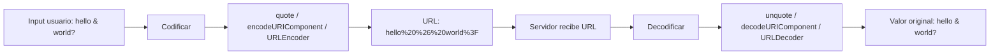

## Visión General

URL encoding, también llamado percent-encoding, convierte caracteres a un formato
que puede viajar de forma segura dentro de una URL. Reemplaza caracteres ASCII
inseguros con `%` seguido de dos dígitos hexadecimales. Por eso es esencial para
parámetros de query, segmentos de path y envíos de formularios.

No codificar el input del usuario antes de colocarlo en una URL puede generar
links rotos, vulnerabilidades de open redirect o ataques de inyección. Si estás
construyendo un cliente de API, combina esta receta con
[Input Validation](/recipes/input-validation/) y la
[API Security Checklist](/guides/api-security-checklist-guide/) para una defensa
más completa.

## Cuándo Usar

Usa esta receta cuando construyas o parses URLs con datos en vivo:

- Construir query strings con valores que vienen de
  [input de usuario](/recipes/input-validation/).
- Codificar nombres de archivo o IDs antes de colocarlos en paths de URL.
- Parsear URLs y extraer parámetros de query.
- Enviar datos de formulario vía requests GET.
- Manejar URLs de redirección que llevan parámetros.

## Solución

### Python

```python
from urllib.parse import quote, unquote, urlencode, parse_qs, urlparse

# Codificar un string para un path o valor de query
encoded = quote("hello world & friends")
print(encoded)  # hello%20world%20%26%20friends

# Construir un query string de forma segura
params = {"search": "python & java", "page": 2}
query = urlencode(params)
print(query)  # search=python+%26+java&page=2

# Parsear una URL
url = urlparse("https://api.example.com/search?query=hello%20world&limit=10")
print(url.query)           # query=hello%20world&limit=10
print(parse_qs(url.query)) # {'query': ['hello world'], 'limit': ['10']}

# Decodificar
original = unquote("hello%20world")
print(original)  # hello world
```

### JavaScript

```javascript
// Codificar un componente (valor de query o segmento de path)
const encoded = encodeURIComponent("hello world & friends");
console.log(encoded); // hello%20world%20%26%20friends

// Construir un query string
const params = new URLSearchParams({ search: "python & java", page: "2" });
console.log(params.toString()); // search=python+%26+java&page=2

// Parsear URL
const url = new URL("https://api.example.com/search?query=hello%20world&limit=10");
console.log(url.searchParams.get("query")); // hello world
console.log(url.searchParams.get("limit")); // 10

// Decodificar
const decoded = decodeURIComponent("hello%20world");
console.log(decoded); // hello world
```

### Java

```java
import java.net.*;
import java.nio.charset.StandardCharsets;

// Codificar un valor
String encoded = URLEncoder.encode("hello world & friends", StandardCharsets.UTF_8);
System.out.println(encoded); // hello+world+%26+friends

// Decodificar un valor
String decoded = URLDecoder.decode("hello%20world", StandardCharsets.UTF_8);
System.out.println(decoded); // hello world

// Construir un URI desde partes
String query = String.format("query=%s&limit=10",
    URLEncoder.encode("hello world", StandardCharsets.UTF_8));
String full = "https://api.example.com/search?" + query;
System.out.println(full); // https://api.example.com/search?query=hello+world&limit=10

// Parsear un URI
URI parsed = new URI("https://api.example.com/search?query=hello%20world&limit=10");
System.out.println(parsed.getQuery()); // query=hello%20world&limit=10
```

## Explicación

Una URL solo puede transportar un conjunto limitado de caracteres sin ambigüedad.
El conjunto no reservado (`A-Z`, `a-z`, `0-9`, `-`, `_`, `.`, `~`) puede aparecer
tal cual. Todo lo demás debe codificarse con percent-encoding usando la secuencia
UTF-8 del carácter.

Por ejemplo, el espacio se convierte en `%20` porque su byte UTF-8 es `0x20`. En
query strings, muchas librerías también aceptan `+` como espacio gracias a la
convención `application/x-www-form-urlencoded` de formularios HTML.

El riesgo clave es embeber input del usuario tal cual. Un `&` o `?` dentro de un
valor se leería como delimitador de query o path. Codificarlo convierte `&` en
`%26` y `?` en `%3F`, así el servidor recibe el valor intacto.

El diagrama de abajo muestra el round-trip desde el input del usuario hasta el
valor decodificado que ve el servidor. Lo uso en onboarding para explicar por
qué la codificación ocurre en el límite, no en todos lados.



Una vez debugueé un bug en producción donde una búsqueda con `&` truncaba
resultados silenciosamente. El fix fue un solo `encodeURIComponent` que debería
haber estado desde el inicio.

## Variantes

| Función | Codifica | Seguro para |
| --- | --- | --- |
| `encodeURIComponent` (JS) | Todo excepto `A-Z a-z 0-9 - _ . ! ~ * ' ( )` | Valores de query y segmentos de path |
| `encodeURI` (JS) | Igual, pero preserva `; , / ? : @ & = + $ #` | URLs completas |
| `quote` (Python) | Por defecto todos los no alfanuméricos | Paths, queries con override de `safe` |
| `urlencode` (Python) | Igual que `quote_plus` | Query strings (espacios → `+`) |
| `URLEncoder` (Java) | Todo excepto `a-z A-Z 0-9 - _ . *` | Query strings (espacios → `+`) |

Para una comparación más profunda de enfoques de parsing de strings, consulta
[Regular Expressions](/recipes/regular-expressions/).

## Cuándo No Usar

- **URLs ya codificadas**: Si un valor ya contiene `%20` o `%26`, codificarlo
  otra vez produce `%2520` o `%2526`. Decodifica primero y codifica una sola vez
  en el límite. He visto este bug de double-encoding en al menos tres codebases.
- **Base64 en segmentos de path**: Base64 usa `+` y `/`, que conflictúan con
  delimitadores de URL. Usa Base64URL (con `-` y `_`) en vez de recodificar el
  output de Base64.
- **Nombres de dominio internacionalizados (IDN)**: Los navegadores modernos y
  `new URL()` manejan la conversión IDN vía Punycode automáticamente. No
  codifiques los nombres de dominio manualmente; deja que la URL API lo haga.
- **URLs estáticas sin input de usuario**: Si cada parte de la URL es un string
  hardcoded, codificar agrega ruido sin beneficio. Codifica solo las partes que
  vienen de datos en vivo.
- **URLs en atributos HTML**: En atributos `href` de HTML, `&` debe codificarse
  como `&amp;` (entidad HTML), no como `%26` (URL encoding). El navegador
  maneja la conversión. Una vez perdí una hora persiguiendo un bug por mezclar
  estos dos.

## Mejores Prácticas

- Siempre codifica el input del usuario antes de embeberlo en una URL. Trato
  cualquier valor que no escribí yo como no confiable hasta que está codificado.
- Usa `encodeURIComponent` en JavaScript para valores de query, no `encodeURI`.
  He visto `encodeURI` romper búsquedas porque deja `&` sin tocar.
- Usa `urlencode` en Python para query strings completos y `quote` para segmentos
  de path.
- No codifiques la URL completa; solo codifica las partes vivas como valores y
  segmentos de path. Lo veo en code reviews seguido.
- Prefiere `URLSearchParams` en JavaScript moderno para construir queries de forma
  segura. Maneja la codificación automáticamente, así que no podés olvidarte.
- Maneja el `+` con cuidado: significa espacio en query strings, mientras que
  `%20` es la opción más segura para paths y specs modernas. Por defecto uso
  `%20` en todos lados y solo `+` cuando un servidor legacy lo requiere.
- Trata el input decodificado como no confiable y valídalo con una librería como
  [Data Validation](/recipes/data-validation/) o un validador de schemas.
  Decodificar no hace al input seguro; solo restaura los bytes originales.

## Errores Comunes

- Usar `encodeURI` para valores de query. No codifica `&`, `=` ni `?`, así que el
  query puede romperse. Es el bug de URL encoding más común que encuentro.
- Olvidar codificar el input del usuario, lo que causa URLs malformadas o
  inyección. Una vez vi un endpoint de búsqueda que devolvía resultados vacíos
  para cualquier query con espacio porque nadie codificaba el input.
- Doble-codificar valores que ya fueron codificados por otra capa. Pasa mucho en
  arquitecturas de microservicios donde cada servicio codifica "por las dudas".
- Confundir espacios codificados como `+` en query strings con `%20` en paths y
  specs más nuevas. Uso `%20` en todos lados salvo que un servidor legacy
  necesite `+`.
- Parsear URLs con split de strings en lugar de un parser de URI apropiado.
  El parsing de URL hecho a mano es una fuente recurrente de bugs de seguridad.
- Codificar una URL ya codificada. Double-encoding de `%20` produce `%2520`.
  Agregué un guard de "decode antes de encode" a nuestra utilidad compartida
  de URL después de que esto nos picó en producción.
- Pasar espacios o Unicode en bruto a `new URL()` sin codificar; el comportamiento
  no es consistente entre runtimes.

## Preguntas Frecuentes

### ¿Qué caracteres hay que codificar?

Cualquier carácter fuera del conjunto no reservado `A-Z a-z 0-9 - _ . ~` debe
codificarse antes de ir en una URL. Los caracteres reservados como `&`, `=`, `?`,
`#`, `/` y el espacio son especialmente importantes porque tienen significado
estructural.

### ¿Cuál es la diferencia entre `encodeURI` y `encodeURIComponent`?

`encodeURI` conserva los delimitadores que hacen funcionar a una URL (`:`, `/`,
`?`, `&`, etc.), así que sirve para URLs completas. `encodeURIComponent` codifica
casi todo, por lo que es la opción correcta para valores individuales de query y
segmentos de path.

### ¿Debo usar `+` o `%20` para los espacios?

En query strings, muchos servidores aceptan `+` por los formularios HTML, y
`urlencode` en Python emite `+` por defecto. En paths y APIs modernas, `%20` es
la opción más segura y estándar. Si dudas, usa `%20`.

### ¿Cómo manejo caracteres no ASCII?

Codifícalos como UTF-8 primero y luego aplica percent-encoding a cada byte. Las
APIs URL modernas hacen esto automáticamente. Por ejemplo, `café` se convierte
en `caf%C3%A9`.

### ¿Por qué obtengo `%2520`?

`%2520` es el resultado de double-encoding de `%20`. Significa que codificaste el
valor después de que ya estaba codificado. Decodifica el valor una vez antes de
volver a codificarlo, o codifica solo una vez en el límite donde el valor entra
en la URL.

### ¿Cómo decodifico un query string?

En JavaScript, usa `new URL(url).searchParams`. En Python, usa `parse_qs` o
`parse_qsl` de `urllib.parse`. En Java, usa `URLDecoder.decode` en cada valor por
separado, no en toda la URL.

## Puntos Clave

- Siempre codifica el input del usuario antes de colocarlo en una URL. El
  conjunto no reservado es `A-Z a-z 0-9 - _ . ~`; todo lo demás necesita
  codificación. Lo trato como innegociable en code reviews.
- Usa `encodeURIComponent` (no `encodeURI`) para valores de query en JavaScript.
  `encodeURI` deja `&`, `=` y `?` sin tocar, lo que rompe queries.
- Usa `%20` para paths y `+` para query strings legacy. En duda, `%20` es la
  opción más segura across specs modernas (RFC 3986).
- Evita double-encoding. Si un valor ya contiene `%XX`, decodificalo una vez
  antes de recodificar, o codifica solo en el límite donde entra en la URL.
- Prefiere `URLSearchParams` (JS), `urlencode` (Python) y `URLEncoder` (Java)
  para construir queries. Manejan la codificación automáticamente así no podés
  olvidarte.

## Ver También

- [RFC 3986: Uniform Resource Identifier](https://datatracker.ietf.org/doc/html/rfc3986):
  el estándar oficial que define percent-encoding y el conjunto no reservado.
- [MDN: encodeURIComponent](https://developer.mozilla.org/en-US/docs/Web/JavaScript/Reference/Global_Objects/encodeURIComponent):
  referencia de JavaScript con ejemplos y compatibilidad de navegadores.
- [Python urllib.parse](https://docs.python.org/3/library/urllib.parse.html):
  docs oficiales de Python para `quote`, `unquote`, `urlencode` y `parse_qs`.
- [Java URLEncoder](https://docs.oracle.com/javase/8/docs/api/java/net/URLEncoder.html):
  referencia de la API de Java para codificar valores de query.
- [WHATWG URL Standard](https://url.spec.whatwg.org/):
  el estándar vivo que los navegadores modernos siguen para parsing de URLs.
- [Input Validation](/recipes/input-validation/): valida el input decodificado
  antes de usarlo en tu aplicación.
- [Regular Expressions](/recipes/regular-expressions/): parsea y valida
  componentes de URL con regex.
