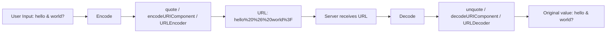

## Overview

URL encoding, or percent-encoding, converts characters into a format that a URL
can carry safely. It replaces unsafe ASCII characters with a `%` followed by two
hexadecimal digits, which is why it's essential for query parameters, path
segments, and form submissions.

If you skip encoding user input before placing it in a URL, you risk broken
links, open redirect vulnerabilities, and injection attacks. If you're building an API
client, combine this recipe with [Input Validation](/recipes/input-validation/)
and the [API Security Checklist](/guides/api-security-checklist-guide/) to cover
the rest of the attack surface.

## When to Use

Reach for this recipe when you're building or parsing URLs with live data:

- Building query strings with values that come from [user input](/recipes/input-validation/).
- Encoding file names or IDs before placing them in URL paths.
- Parsing URLs to extract their query parameters.
- Sending form data via GET requests.
- Handling redirect URLs that carry parameters.

## Solution

### Python

```python
from urllib.parse import quote, unquote, urlencode, parse_qs, urlparse

# Encode a string for a path or query value
encoded = quote("hello world & friends")
print(encoded)  # hello%20world%20%26%20friends

# Build a query string safely
params = {"search": "python & java", "page": 2}
query = urlencode(params)
print(query)  # search=python+%26+java&page=2

# Parse a URL
url = urlparse("https://api.example.com/search?query=hello%20world&limit=10")
print(url.query)           # query=hello%20world&limit=10
print(parse_qs(url.query)) # {'query': ['hello world'], 'limit': ['10']}

# Decode
original = unquote("hello%20world")
print(original)  # hello world
```

### JavaScript

```javascript
// Encode a single component (query value or path segment)
const encoded = encodeURIComponent("hello world & friends");
console.log(encoded); // hello%20world%20%26%20friends

// Build a query string
const params = new URLSearchParams({ search: "python & java", page: "2" });
console.log(params.toString()); // search=python+%26+java&page=2

// Parse URL
const url = new URL("https://api.example.com/search?query=hello%20world&limit=10");
console.log(url.searchParams.get("query")); // hello world
console.log(url.searchParams.get("limit")); // 10

// Decode
const decoded = decodeURIComponent("hello%20world");
console.log(decoded); // hello world
```

### Java

```java
import java.net.*;
import java.nio.charset.StandardCharsets;

// Encode a value
String encoded = URLEncoder.encode("hello world & friends", StandardCharsets.UTF_8);
System.out.println(encoded); // hello+world+%26+friends

// Decode a value
String decoded = URLDecoder.decode("hello%20world", StandardCharsets.UTF_8);
System.out.println(decoded); // hello world

// Build a URI from parts
String query = String.format("query=%s&limit=10",
    URLEncoder.encode("hello world", StandardCharsets.UTF_8));
String full = "https://api.example.com/search?" + query;
System.out.println(full); // https://api.example.com/search?query=hello+world&limit=10

// Parse a URI
URI parsed = new URI("https://api.example.com/search?query=hello%20world&limit=10");
System.out.println(parsed.getQuery()); // query=hello%20world&limit=10
```

## Explanation

A URL can only carry a limited set of characters before the meaning becomes
ambiguous, because many byte values would be read as delimiters. The unreserved
characters (`A-Z`, `a-z`, `0-9`, `-`, `_`, `.`, `~`)
can appear as-is; everything else must be percent-encoded using the UTF-8 byte
sequence of the character.

For example, the space character becomes `%20` because its UTF-8 byte is `0x20`.
In query strings, many libraries also accept `+` as a space because of the
`application/x-www-form-urlencoded` convention from HTML forms.

The key risk is embedding raw user input. A `&` or `?` in a value would be
misread as a query or path delimiter. Encoding turns `&` into `%26` and `?` into
`%3F`, so the server receives the value intact.

The diagram below shows the round-trip from user input to the decoded value the
server sees. I use this in onboarding to explain why encoding happens at the
boundary, not everywhere.



I once debugged a production bug where a search query with `&` in it was
silently truncating results. The fix was a single `encodeURIComponent` call
that should have been there from the start.

## Variants

The right function depends on the language and the part of the URL you're
building:

| Function | Encodes | Safe for |
| --- | --- | --- |
| `encodeURIComponent` (JS) | Everything except the unreserved set | Query values and path segments |
| `encodeURI` (JS) | Same, but keeps URL delimiters intact | Full URLs |
| `quote` (Python) | All non-alphanumerics by default | Paths and queries with a `safe` override |
| `urlencode` (Python) | Same as `quote_plus` | Query strings where spaces become `+` |
| `URLEncoder` (Java) | All except `a-z A-Z 0-9 - _ . *` | Query strings where spaces become `+` |

For a deeper comparison of string parsing approaches, see
[Regular Expressions](/recipes/regular-expressions/).

## When Not to Use

- **URLs already encoded**: If a value already contains `%20` or `%26`, encoding
  it again produces `%2520` or `%2526`. Decode first, then encode once at the
  boundary. I've seen this double-encoding bug in at least three codebases.
- **Base64 in path segments**: Base64 uses `+` and `/`, which conflict with URL
  delimiters. Use Base64URL (with `-` and `_`) instead of re-encoding Base64
  output.
- **Internationalized domain names (IDN)**: Modern browsers and `new URL()`
  handle IDN conversion via Punycode automatically. Don't manually encode
  domain names; let the URL API do it.
- **Static URLs without user input**: If every part of the URL is a hardcoded
  string, encoding adds noise without benefit. Encode only the parts that come
  from live data.
- **URLs in HTML attributes**: In HTML `href` attributes, `&` should be encoded
  as `&amp;` (HTML entity), not `%26` (URL encoding). The browser handles the
  conversion. I once spent an hour chasing a bug caused by mixing these two.

## Best Practices

- Always encode user input before embedding it in a URL. I treat any value I
  didn't write myself as untrusted until it's encoded.
- In JavaScript, reach for `encodeURIComponent` for query values, not `encodeURI`.
  I've seen `encodeURI` break search queries because it leaves `&` untouched.
- In Python, use `urlencode` for full query strings and `quote` for path segments.
- Encoding the whole URL instead of only the live parts, such as values and path
  segments, is a mistake I see in code reviews regularly.
- Prefer `URLSearchParams` in modern JavaScript for safe query construction. It
  handles encoding automatically, so you can't forget.
- Handle `+` carefully: it means space in query strings, while `%20` is the safer
  choice for paths and modern specs. I default to `%20` everywhere and only use
  `+` when a legacy server requires it.
- Treat decoded input as untrusted and validate it with a library such as
  [Data Validation](/recipes/data-validation/) or a schema validator. Decoding
  doesn't make input safe; it just restores the original bytes.

## Common Mistakes

- Using `encodeURI` for query values. `encodeURI` won't encode `&`, `=`, or `?`,
  so the query can break. This is the single most common URL encoding bug I
  encounter.
- Forgetting to encode user input and getting malformed URLs or injection. I
  once saw a search endpoint that returned empty results for any query
  containing a space because nobody encoded the input.
- Double-encoding values that were already encoded by another layer. This
  happens a lot in microservice architectures where each service encodes "just
  to be safe."
- Confusing spaces encoded as `+` in query strings with `%20` in paths and newer
  specs. I use `%20` everywhere unless a legacy server specifically needs `+`.
- Using `split()` on a URL string instead of a proper URI parser such as
  `urllib.parse` or `new URL()`. Hand-rolled URL parsing is a recurring source
  of security bugs.
- Encoding an already-encoded URL. You end up with `%2520` when you encode `%20`
  a second time. I added a "decode before encode" guard to our shared URL
  utility after this bit us in production.
- Passing raw spaces or Unicode into `new URL()` without encoding them. Some
  runtimes accept it, but the result isn't consistent across browsers.

## FAQ

### Which characters need to be encoded?

Any character outside the unreserved set `A-Z a-z 0-9 - _ . ~` should be encoded
before it goes into a URL. Reserved characters such as `&`, `=`, `?`, `#`, `/`,
and space are especially important because they carry structural meaning. I keep
a cheat sheet with this set taped to my monitor because I look it up constantly.

### What is the difference between `encodeURI` and `encodeURIComponent`?

`encodeURI` keeps the delimiters that make a URL work (`:`, `/`, `?`, `&`, etc.),
so it's meant for full URLs. `encodeURIComponent` encodes almost everything, so
it's the right choice for individual query values and path segments. I learned
this the hard way after `encodeURI` broke a search query with `&` in it.

### Should I use `+` or `%20` for spaces?

In query strings, many servers accept `+` because of HTML forms, and `urlencode`
in Python emits `+` by default. In paths and for modern APIs, `%20` is the safer
and more standard choice. When you aren't sure which to use, `%20` is the safer
option. I default to `%20` everywhere and only switch to `+` when a legacy server
complains.

### How do I handle non-ASCII characters?

Encode them as UTF-8 first, then percent-encode each byte. Modern URL APIs do
this automatically. For example, `café` becomes `caf%C3%A9`. I had to debug this
once for a Spanish search endpoint where `ñ` was silently dropped because the
server expected UTF-8 percent-encoding and got Latin-1.

### Why am I getting `%2520`?

You get `%2520` when you encode `%20` twice. It means you encoded the value after
it had already been encoded. Decode the value once before re-encoding it, or
encode only once at the boundary where the value enters the URL. I wrote a
`encodeOnce` helper at work that checks for existing `%XX` patterns before
encoding, and it's saved me from this bug more than once.

### How do I decode a query string?

In JavaScript, use `new URL(url).searchParams` to get a parsed map of values. In
Python, use `parse_qs` or `parse_qsl` from `urllib.parse`. In Java, call
`URLDecoder.decode` on each value, not on the full URL string. I once spent an
hour debugging a Java endpoint because someone called `URLDecoder.decode` on the
entire URL and it mangled the path separators.

## Key Takeaways

- Always encode user input before placing it in a URL. The unreserved set is
  `A-Z a-z 0-9 - _ . ~`; everything else needs encoding. I treat this as
  non-negotiable in code reviews.
- Use `encodeURIComponent` (not `encodeURI`) for query values in JavaScript.
  `encodeURI` leaves `&`, `=`, and `?` untouched, which breaks queries.
- Use `%20` for paths and `+` for legacy query strings. When in doubt, `%20` is
  the safer choice across modern specs (RFC 3986).
- Avoid double-encoding. If a value already contains `%XX`, decode it once
  before re-encoding, or encode only at the boundary where it enters the URL.
- Prefer `URLSearchParams` (JS), `urlencode` (Python), and `URLEncoder` (Java)
  for query construction. They handle encoding automatically so you can't
  forget.

## See Also

- [RFC 3986: Uniform Resource Identifier](https://datatracker.ietf.org/doc/html/rfc3986):
  the official standard that defines percent-encoding and the unreserved set.
- [MDN: encodeURIComponent](https://developer.mozilla.org/en-US/docs/Web/JavaScript/Reference/Global_Objects/encodeURIComponent):
  JavaScript reference with examples and browser compatibility.
- [Python urllib.parse](https://docs.python.org/3/library/urllib.parse.html):
  official Python docs for `quote`, `unquote`, `urlencode`, and `parse_qs`.
- [Java URLEncoder](https://docs.oracle.com/javase/8/docs/api/java/net/URLEncoder.html):
  Java API reference for encoding query values.
- [WHATWG URL Standard](https://url.spec.whatwg.org/):
  the living standard that modern browsers follow for URL parsing.
- [Input Validation](/recipes/input-validation/): validate decoded input
  before using it in your application.
- [Regular Expressions](/recipes/regular-expressions/): parse and validate
  URL components with regex.
