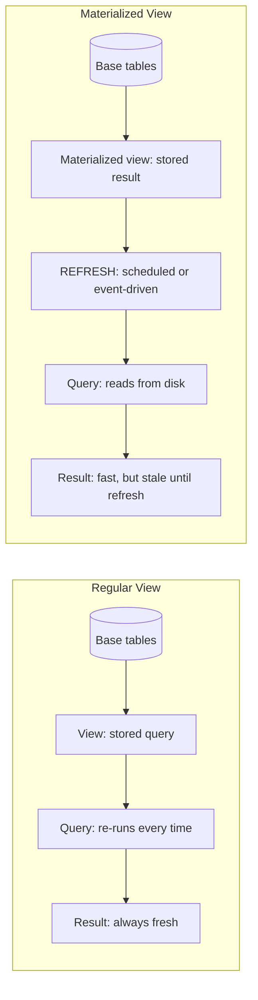

## Resumen

Una vista de base de datos es una consulta guardada que se ve como una tabla.
Simplifica joins complejos, limita la exposición de columnas para control de acceso y
mantiene la lógica de negocio en el esquema. Una vista materializada guarda el
resultado en disco: sacrifica algo de frescura y espacio para conseguir lecturas mucho
más rápidas.

Heredé una vez un dashboard que tardaba 14 segundos en cargar porque corría un join de
6 tablas con tres agregaciones en cada vista de página. Envolver esa consulta en una
vista materializada y refrescarla cada 15 minutos bajó el tiempo de carga a menos de
200 milisegundos. El equipo del dashboard estaba feliz, el ingeniero on-call dejó de
recibir tickets de "el dashboard está caído", y aprendí que las vistas materializadas
son una de las herramientas de mayor ROI en el toolkit de un ingeniero de base de datos.

Esta receta muestra cómo crear, refrescar e indexar ambos tipos en PostgreSQL, MySQL y
SQL Server. Los ejemplos usan la [documentación de PostgreSQL sobre vistas](https://www.postgresql.org/docs/current/sql-createview.html)
y [vistas materializadas](https://www.postgresql.org/docs/current/sql-creatematerializedview.html)
como referencia.

## Cuándo Usar

- Ejecutás repetidamente la misma agregación compleja y es lenta.
- Querés exponer solo algunas columnas para un acceso de mínimo privilegio.
- Necesitás joins o agregaciones precomputadas para dashboards.
- Querés abstraer cambios de esquema de los consumidores downstream.

## Cuándo NO Usar

- Para datos transaccionales en tiempo real donde resultados desfasados no son
  aceptables.
- Cuando las tablas base cambian constantemente y el costo de refrescar es muy alto.
- Como reemplazo de índices faltantes en las tablas base.

## Solución

### Vista y vista materializada en PostgreSQL

```sql
-- Vista normal: siempre fresca, ejecuta la consulta cada vez
CREATE OR REPLACE VIEW monthly_revenue AS
SELECT
    date_trunc('month', created_at) AS month,
    SUM(amount) AS total
FROM orders
WHERE status = 'completed'
GROUP BY 1;

-- Vista materializada: guardada en disco, hay que refrescarla
CREATE MATERIALIZED VIEW monthly_revenue_mat AS
SELECT
    date_trunc('month', created_at) AS month,
    SUM(amount) AS total
FROM orders
WHERE status = 'completed'
GROUP BY 1;

-- Índice único requerido para refresco CONCURRENTLY
CREATE UNIQUE INDEX idx_monthly_revenue_mat_month
ON monthly_revenue_mat (month);

-- Refresco bloqueante
REFRESH MATERIALIZED VIEW monthly_revenue_mat;

-- Refresco no bloqueante
REFRESH MATERIALIZED VIEW CONCURRENTLY monthly_revenue_mat;
```

### Vista indexada en SQL Server

```sql
-- Crear la vista con SCHEMABINDING
CREATE VIEW dbo.OrderTotals
WITH SCHEMABINDING
AS
SELECT
    o.customer_id,
    COUNT_BIG(*) AS order_count,
    SUM(o.total) AS total_spent
FROM dbo.orders o
WHERE o.status = 'completed'
GROUP BY o.customer_id;
GO

-- Índice clustered materializa la vista
CREATE UNIQUE CLUSTERED INDEX IX_OrderTotals_Customer
ON dbo.OrderTotals (customer_id);
GO

-- Consultar los datos materializados
SELECT * FROM dbo.OrderTotals WITH (NOEXPAND)
WHERE total_spent > 1000;
```

### Vista materializada simulada en MySQL

MySQL no tiene vistas materializadas nativas. Usá una tabla y triggers para mantenerla:

```sql
CREATE TABLE mv_daily_signups (
    day DATE PRIMARY KEY,
    signups INT NOT NULL DEFAULT 0
);

DELIMITER //

CREATE TRIGGER trg_user_insert
AFTER INSERT ON users
FOR EACH ROW
BEGIN
    INSERT INTO mv_daily_signups (day, signups)
    VALUES (DATE(NEW.created_at), 1)
    ON DUPLICATE KEY UPDATE signups = signups + 1;
END //

CREATE TRIGGER trg_user_delete
AFTER DELETE ON users
FOR EACH ROW
BEGIN
    UPDATE mv_daily_signups
    SET signups = signups - 1
    WHERE day = DATE(OLD.created_at);
END //

DELIMITER ;
```

### Programar refresco con pg_cron

```sql
-- PostgreSQL
CREATE EXTENSION IF NOT EXISTS pg_cron;

SELECT cron.schedule(
    'refresh_monthly_revenue',
    '0 2 * * *',
    'REFRESH MATERIALIZED VIEW CONCURRENTLY monthly_revenue_mat'
);
```

## Explicación

Una **vista** es solo una consulta almacenada. Cada lectura la ejecuta de nuevo, así
que los datos siempre son frescos, pero el rendimiento depende de las tablas base y sus
índices. Si tus consultas son lentas, revisá la [guía de tuning de SQL](/guides/sql-performance-tuning-guide/)
antes de llegar a una vista materializada — el cuello de botella suele ser un índice
faltante, no la vista en sí.

Una **vista materializada** guarda el resultado físicamente. Las lecturas son rápidas,
pero los datos están desfasados hasta que se refrescan. Es ideal para agregaciones
costosas usadas por dashboards o reportes. Las vistas que envuelven [SQL joins](/recipes/sql-joins/)
complejos son un punto de partida común — mantienen la lógica del join en un solo lugar
y dejan que los consumidores downstream consulten una abstracción limpia.

**Trade-offs:**

||Vista|Vista materializada|
|---|-----|-------------------|
|Frescura|Siempre fresca|Desfasada hasta refrescar|
|Almacenamiento|Sin espacio extra|Usa espacio en disco|
|Costo de lectura|Depende de tablas base|Como un scan de tabla|
|Costo de escritura|Ninguno (solo definición)|Costo de refresh en cada update|
|Ideal para|Simplificar queries, control de acceso|Dashboards, reportes, agregaciones costosas|

### Vista vs vista materializada vs CTE

Estas tres abstracciones se superponen, pero sirven para cosas diferentes. Un CTE
(`WITH`) es una herramienta de organización de un solo uso — existe solo durante una
consulta. Usalo cuando necesitás romper una query compleja en pasos legibles. Una vista
es un objeto persistente del esquema que cualquier consulta puede referenciar. Usala
cuando múltiples queries o aplicaciones necesitan la misma abstracción. Una vista
materializada es una vista cuyo resultado se guarda en disco. Usala cuando la consulta
subyacente es costosa y podés tolerar datos desfasados.

Vi equipos llegar a vistas materializadas cuando una vista simple bastaría. Si tu
consulta subyacente corre en 50ms, una vista normal está bien — solo estás pagando
planning, no ejecución. Las vistas materializadas se ganan su lugar cuando la consulta
toma segundos o minutos, no milisegundos.

### Estrategias de refresh

La estrategia de refresh depende de tu tolerancia a datos desfasados. Para dashboards
que no necesitan data en tiempo real, un refresh programado cada 15-60 minutos suele
alcanzar. Para índices de búsqueda o analítica near-real-time, podés refrescar cada 1-5
minutos — pero vigilá la carga en tu base de datos, porque `REFRESH MATERIALIZED VIEW`
es una operación costosa. En PostgreSQL, siempre usá `CONCURRENTLY` cuando tengas un
índice único, así los lectores no se bloquean durante el refresh. En SQL Server, el
optimizador usa automáticamente la vista indexada cuando especificás `NOEXPAND`.

Para refreshes event-driven, podés disparar un refresh después de que un pipeline ETL
completa en lugar de un schedule fijo. Esto evita refrescar cuando nada cambió y
asegura que la vista refleje la data más reciente inmediatamente después de una carga.

### Consideraciones de storage y mantenimiento

Las vistas materializadas consumen espacio en disco proporcional al result set. Una
vista que agrega 10 millones de filas en 1,000 grupos es chica; una vista que joinea
tres tablas grandes sin agregación puede ser más grande que las tablas base combinadas.
Monitoreá el uso de disco con `pg_total_relation_size('view_name')` en PostgreSQL.

Ejecutá `ANALYZE` sobre la vista materializada después de cada refresh para que el
query planner tenga estadísticas frescas. Sin esto, PostgreSQL puede elegir un plan
malo — una vez debugeé una query que era 10x más lenta después de un refresh porque el
planner usaba estadísticas viejas de antes de que la data cambiara.

### Cómo fluyen los datos a través de las vistas



El diagrama muestra la diferencia clave: una vista normal re-ejecuta la consulta en cada
lectura, mientras que una vista materializada lee desde un resultado precomputado en
disco. El paso de refresh es lo que intercambia frescura por velocidad.

## Variantes

|Base de datos|Vista nativa|Vista materializada|
|-------------|------------|-------------------|
|PostgreSQL|Sí|Sí, con `REFRESH MATERIALIZED VIEW`|
|SQL Server|Sí|Vistas indexadas (`SCHEMABINDING` + clustered index)|
|MySQL|Sí|Simular con tablas + triggers|
|Oracle|Sí|Sí, con `ON COMMIT` o `ON DEMAND`|
|SQLite|Sí|No soportado|

## Buenas Prácticas

- Creá un índice único antes de usar `REFRESH ... CONCURRENTLY` en PostgreSQL. Sin él,
  el refresh bloquea a todos los lectores — vi un refresh de 30 segundos bloquear un
  dashboard durante pico de tráfico.
- Usá `SCHEMABINDING` en SQL Server para que la tabla base no rompa la vista indexada.
  Previene cambios de esquema que invalidarían la vista silenciosamente.
- Refrescá después de ETL o en horarios de bajo tráfico, no en picos de lectura. Un
  refresh es una operación pesada — tratálo como un batch job, no como una tarea
  background.
- Usá `CONCURRENTLY` o `WITH (NOEXPAND)` para evitar bloquear lectores. En PostgreSQL,
  `CONCURRENTLY` requiere un índice único pero deja correr queries durante el refresh.
- Controlá el uso de disco; las vistas materializadas pueden crecer rápido. Una vista
  que joinea tres tablas grandes sin agregación puede ser más grande que las tablas
  base combinadas.
- Ejecutá `ANALYZE` sobre la vista luego de refrescar para actualizar estadísticas. Es
  el paso más olvidado — sin él, las queries pueden ser 10x más lentas.
- Nombrá tus vistas claramente. `monthly_revenue_mat` es mejor que `mv_1` — tu yo del
  futuro y tus compañeros te lo van a agradecer.
- Documentá el schedule de refresh en el comentario de la vista o en el runbook del
  equipo. Vi equipos olvidar qué vistas se refrescan en qué schedule, llevando a
  confusión cuando la data se ve desfasada.

## Errores Comunes

- **Olvidar refrescar**: los usuarios ven datos viejos hasta que corrás `REFRESH`. Una
  vez pasé una hora debugeando un dashboard "roto" antes de darme cuenta de que nadie
  había refrescado la vista materializada en tres días.
- **No tener índice único**: `REFRESH CONCURRENTLY` falla sin uno. Creá el índice
  justo después de crear la vista materializada, no después.
- **Escribir en vistas materializadas**: son de solo lectura; actualizá las tablas
  base. Si necesitás abstracciones actualizables, usá una vista normal con triggers
  `INSTEAD OF`.
- **Agrupación de alta cardinalidad**: vistas con demasiados grupos únicos pueden
  hinchar el almacenamiento. Agrupá por día, no por segundo; agrupá por user_id, no
  por session_id.
- **Saltear índices en tablas base**: una vista no arregla índices faltantes. Combiná
  vistas con indexing adecuado y [optimistic locking](/recipes/optimistic-locking/)
  para workloads de lectura intensa que igual necesitan corrección.
- **Refrescar demasiado seguido**: si la data base cambia cada hora, refrescar cada
  minuto desperdicia recursos. Matcheá el intervalo de refresh a la frecuencia de
  cambio de data.
- **Usar vistas materializadas para data en tiempo real**: si tu tolerancia a datos
  desfasados es cero, usá una vista normal o una read replica. Las vistas materializadas
  intercambian frescura por velocidad — no rompas ese contrato.

## Preguntas Frecuentes

### ¿Puedo actualizar datos a través de una vista?

A veces. Las vistas simples de una sola tabla suelen ser actualizables. Los joins entre
varias tablas, agregaciones o `DISTINCT` las vuelven de solo lectura. PostgreSQL
soporta triggers `INSTEAD OF` para casos complejos.

### ¿Con qué frecuencia refresco una vista materializada?

Depende de tu tolerancia a datos desfasados. Los dashboards pueden refrescar cada hora;
un índice de búsqueda cada cinco minutos. Usá `CONCURRENTLY` para evitar bloqueos de
lectura.

### ¿Cuál es la diferencia entre una vista y un CTE?

Un CTE (`WITH`) existe solo para una consulta. Una vista es un objeto persistente del
esquema que cualquier consulta puede referenciar. Usá CTEs para organizar consultas
puntuales; usá vistas para abstracciones reutilizables.

### ¿Las vistas materializadas reemplazan los índices?

No. Ayudan con agregaciones y joins costosos, pero no arreglan índices faltantes en las
tablas subyacentes.

## Ver También

- [PostgreSQL: CREATE VIEW](https://www.postgresql.org/docs/current/sql-createview.html)
  — docs oficiales para vistas regulares.
- [PostgreSQL: CREATE MATERIALIZED VIEW](https://www.postgresql.org/docs/current/sql-creatematerializedview.html)
  — docs oficiales para vistas materializadas y opciones de refresh.
- [SQL Server: Indexed Views](https://learn.microsoft.com/en-us/sql/relational-databases/views/indexed-views)
  — docs de Microsoft sobre SCHEMABINDING y clustered indexes.
- [MySQL: Triggers](https://dev.mysql.com/doc/refman/8.0/en/triggers.html) — cómo
  simular vistas materializadas con triggers.
- [Oracle: Materialized Views](https://docs.oracle.com/en/database/oracle/oracle-database/23/dwhsg/materialized-views.html)
  — opciones de refresh `ON COMMIT` y `ON DEMAND`.
