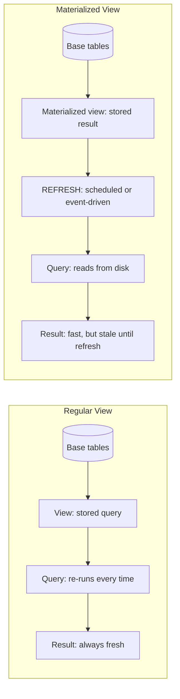

## Overview

A database view is a stored query that behaves like a table. It simplifies complex
joins, limits column exposure for access control, and keeps business logic in the
schema. A materialized view stores the query result on disk, giving up some freshness
and space for much faster reads.

I once inherited a dashboard that took 14 seconds to load because it ran a 6-table join
with three aggregations on every page view. Wrapping that query in a materialized view
and refreshing it every 15 minutes dropped the load time to under 200 milliseconds. The
dashboard team was happy, the on-call engineer stopped getting "dashboard is down"
tickets, and I learned that materialized views are one of the highest-ROI tools in a
database engineer's toolkit.

This recipe covers how to create, refresh, and index both kinds in PostgreSQL, MySQL,
and SQL Server. Examples use the [PostgreSQL docs on views](https://www.postgresql.org/docs/current/sql-createview.html)
and [materialized views](https://www.postgresql.org/docs/current/sql-creatematerializedview.html)
as reference.

## When to Use

- You run the same complex aggregation repeatedly and it's slow.
- You want to expose only selected columns for least-privilege access.
- You need precomputed joins or aggregations for dashboards.
- You want to abstract schema changes from downstream consumers.

## When NOT to Use

- For real-time transactional data where stale results are unacceptable.
- When the base tables change constantly and refresh cost is too high.
- As a replacement for missing indexes on base tables.

## Solution

### PostgreSQL view and materialized view

```sql
-- Regular view: always fresh, runs the query each time
CREATE OR REPLACE VIEW monthly_revenue AS
SELECT
    date_trunc('month', created_at) AS month,
    SUM(amount) AS total
FROM orders
WHERE status = 'completed'
GROUP BY 1;

-- Materialized view: stored on disk, you must refresh it manually
CREATE MATERIALIZED VIEW monthly_revenue_mat AS
SELECT
    date_trunc('month', created_at) AS month,
    SUM(amount) AS total
FROM orders
WHERE status = 'completed'
GROUP BY 1;

-- Unique index required for CONCURRENTLY refresh
CREATE UNIQUE INDEX idx_monthly_revenue_mat_month
ON monthly_revenue_mat (month);

-- Blocking refresh
REFRESH MATERIALIZED VIEW monthly_revenue_mat;

-- Non-blocking refresh
REFRESH MATERIALIZED VIEW CONCURRENTLY monthly_revenue_mat;
```

### SQL Server indexed view

```sql
-- Create the view with SCHEMABINDING
CREATE VIEW dbo.OrderTotals
WITH SCHEMABINDING
AS
SELECT
    o.customer_id,
    COUNT_BIG(*) AS order_count,
    SUM(o.total) AS total_spent
FROM dbo.orders o
WHERE o.status = 'completed'
GROUP BY o.customer_id;
GO

-- Clustered index materializes the view
CREATE UNIQUE CLUSTERED INDEX IX_OrderTotals_Customer
ON dbo.OrderTotals (customer_id);
GO

-- Query the materialized data
SELECT * FROM dbo.OrderTotals WITH (NOEXPAND)
WHERE total_spent > 1000;
```

### MySQL simulated materialized view

MySQL has no native materialized views. Use a table and triggers to keep it up to date:

```sql
CREATE TABLE mv_daily_signups (
    day DATE PRIMARY KEY,
    signups INT NOT NULL DEFAULT 0
);

DELIMITER //

CREATE TRIGGER trg_user_insert
AFTER INSERT ON users
FOR EACH ROW
BEGIN
    INSERT INTO mv_daily_signups (day, signups)
    VALUES (DATE(NEW.created_at), 1)
    ON DUPLICATE KEY UPDATE signups = signups + 1;
END //

CREATE TRIGGER trg_user_delete
AFTER DELETE ON users
FOR EACH ROW
BEGIN
    UPDATE mv_daily_signups
    SET signups = signups - 1
    WHERE day = DATE(OLD.created_at);
END //

DELIMITER ;
```

### Refresh schedule with pg_cron

```sql
-- PostgreSQL
CREATE EXTENSION IF NOT EXISTS pg_cron;

SELECT cron.schedule(
    'refresh_monthly_revenue',
    '0 2 * * *',
    'REFRESH MATERIALIZED VIEW CONCURRENTLY monthly_revenue_mat'
);
```

## Explanation

A **view** is just a stored query. Every read re-runs it, so the data is always fresh
but performance depends on the base tables and indexes. If your queries are slow, check
the [SQL performance tuning guide](/guides/sql-performance-tuning-guide/) before
reaching for a materialized view — the bottleneck is often a missing index, not the
view itself.

A **materialized view** stores the result physically. Reads are fast, but the data is
stale until refreshed. It's best for expensive aggregations used by dashboards or
reports. Views that wrap complex [SQL joins](/recipes/sql-joins/) are a common starting
point — they keep the join logic in one place and let downstream consumers query a
clean abstraction.

**Trade-offs:**

||View|Materialized view|
|---|----|-----------------|
|Freshness|Always fresh|Stale until refresh|
|Storage|No extra storage|Uses disk space|
|Read cost|Depends on base tables|Like a table scan|
|Write cost|None (just a query definition)|Refresh cost on each update|
|Best for|Simplifying queries, access control|Dashboards, reports, expensive aggregations|

### View vs materialized view vs CTE

These three abstractions overlap, but they serve different purposes. A CTE (`WITH`
clause) is a one-shot organization tool — it exists only for the duration of a single
query. Use it when you need to break a complex query into readable steps. A view is a
persistent schema object that any query can reference. Use it when two or more queries or
applications need the same abstraction. A materialized view is a view whose result lives
on disk. Use it when the underlying query is expensive and you can tolerate stale
data.

I've seen teams reach for materialized views when a simple view would do. If your
underlying query runs in 50ms, a regular view is fine — you're just paying for query
planning, not execution. Materialized views earn their keep when the query takes seconds
or minutes, not milliseconds.

### Refresh strategies

The refresh strategy depends on your data freshness tolerance. For dashboards that
don't need real-time data, a scheduled refresh every 15-60 minutes is usually enough.
For search indexes or near-real-time analytics, you might refresh every 1-5 minutes —
but watch the load on your database, because `REFRESH MATERIALIZED VIEW` is an expensive
operation. In PostgreSQL, always use `CONCURRENTLY` when you've got a unique index, so
readers aren't blocked during refresh. In SQL Server, the query optimizer automatically
uses the indexed view when you specify `NOEXPAND`.

For event-driven refreshes, you can trigger a refresh after an ETL pipeline completes
rather than on a fixed schedule. This avoids refreshing when nothing changed and
makes sure the view reflects the latest data immediately after a load.

### Storage and maintenance considerations

Materialized views consume disk space proportional to the result set. A view that
aggregates 10 million rows into 1,000 groups is small; a view that joins three large
tables without aggregation can be larger than the base tables combined. Monitor disk
usage with `pg_total_relation_size('view_name')` in PostgreSQL.

Run `ANALYZE` on the materialized view after each refresh so the query planner has
fresh statistics. Without it, PostgreSQL might choose a bad plan — I once debugged a
query that was 10x slower after a refresh because the planner was using stale
statistics from before the data changed.

### How data flows through views



The diagram shows the key difference: a regular view re-runs the query on every read,
while a materialized view reads from a precomputed result on disk. The refresh step is
what trades freshness for speed.

## Variants

|Database|Native view|Materialized view|
|--------|-----------|-----------------|
|PostgreSQL|Yes|Yes, with `REFRESH MATERIALIZED VIEW`|
|SQL Server|Yes|Indexed views (`SCHEMABINDING` + clustered index)|
|MySQL|Yes|Simulate with tables + triggers|
|Oracle|Yes|Yes, with `ON COMMIT` or `ON DEMAND`|
|SQLite|Yes|Not supported|

## Best Practices

- Create a unique index before using `REFRESH ... CONCURRENTLY` in PostgreSQL. Without
  it, the refresh blocks all readers — I've seen a 30-second refresh lock out a
  dashboard during peak traffic.
- Use `SCHEMABINDING` in SQL Server so the base table can't break the indexed view. It
  prevents schema changes that would silently invalidate the view.
- Refresh after ETL or during low-traffic windows, not during peak reads. A refresh is
  a heavy operation — treat it like a batch job, not a background task.
- Use `CONCURRENTLY` or `WITH (NOEXPAND)` to avoid locking readers. In PostgreSQL,
  `CONCURRENTLY` requires a unique index but lets queries run during refresh.
- Keep an eye on disk usage; materialized views can grow quickly. A view that joins
  three large tables without aggregation can be larger than the base tables combined.
- Run `ANALYZE` on the view after refresh so the planner uses fresh statistics. This is
  the most overlooked step — without it, queries can be 10x slower.
- Name your views clearly. `monthly_revenue_mat` is better than `mv_1` — your future
  self and your teammates will thank you.
- Document the refresh schedule in the view's comment or your team's runbook. I've
  seen teams forget which views refresh on what schedule, leading to confusion when
  data looks stale.

## Common Mistakes

- **Forgetting to refresh**: users see stale data until you run `REFRESH`. I once
  spent an hour debugging a "broken" dashboard before realizing nobody had refreshed
  the materialized view in three days.
- **No unique index**: `REFRESH CONCURRENTLY` fails without one. Create the index
  right after creating the materialized view, not later.
- **Writing to materialized views**: they're read-only; update the base tables. If you
  need updatable abstractions, use a regular view with `INSTEAD OF` triggers.
- **High-cardinality grouping**: views with too many unique groups can bloat storage.
  Group by day, not by second; group by user_id, not by session_id.
- **Skipping base-table indexes**: a view doesn't fix missing indexes on source tables.
  Pair views with proper indexing and [optimistic locking](/recipes/optimistic-locking/)
  for read-heavy workloads that still need correctness.
- **Refreshing too often**: if the base data changes every hour, refreshing every
  minute wastes resources. Match the refresh interval to the data change frequency.
- **Using materialized views for real-time data**: if your tolerance for stale data is
  zero, use a regular view or a read replica instead. Materialized views trade
  freshness for speed — don't break that contract.

## FAQ

### Can I update data through a view?

Sometimes. Simple single-table views are often updatable. Multi-table joins,
aggregations, or `DISTINCT` make a view read-only. PostgreSQL supports `INSTEAD OF`
triggers for complex cases.

### How often should I refresh a materialized view?

It depends on your tolerance for stale data. Dashboards may refresh hourly; a search
index may refresh every five minutes. Use `CONCURRENTLY` to avoid read locks.

### What is the difference between a view and a CTE?

A CTE (`WITH` clause) exists only for one query. A view is a persistent schema object
that any query can reference. Use CTEs for one-off organization; use views for reusable
abstractions.

### Do materialized views replace indexes?

No. They help with expensive aggregations and joins, but they don't fix missing indexes
on the underlying tables.

## See Also

- [PostgreSQL: CREATE VIEW](https://www.postgresql.org/docs/current/sql-createview.html)
  — official docs for regular views.
- [PostgreSQL: CREATE MATERIALIZED VIEW](https://www.postgresql.org/docs/current/sql-creatematerializedview.html)
  — official docs for materialized views and refresh options.
- [SQL Server: Indexed Views](https://learn.microsoft.com/en-us/sql/relational-databases/views/indexed-views)
  — Microsoft docs on SCHEMABINDING and clustered indexes.
- [MySQL: Triggers](https://dev.mysql.com/doc/refman/8.0/en/triggers.html) — how to
  simulate materialized views with triggers.
- [Oracle: Materialized Views](https://docs.oracle.com/en/database/oracle/oracle-database/23/dwhsg/materialized-views.html)
  — `ON COMMIT` and `ON DEMAND` refresh options.
