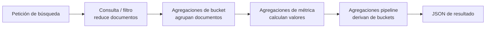

## Visión General

Cuando necesitás conteos, sumas o percentiles de un índice de Elasticsearch,
usás agregaciones. Se ejecutan directamente sobre el índice invertido, lo que
mantiene los conteos y métricas sobre millones de documentos lo suficientemente
rápidos para facetas y dashboards en vivo.

Una misma petición puede combinar agregaciones de bucket que dividen documentos
en grupos con agregaciones de métrica que calculan valores dentro de cada grupo.
Anidarlas te permite construir series temporales, percentiles y resúmenes
facetados sin tener que enviar datos a un job por lotes aparte.

He usado este patrón en catálogos de productos donde la misma petición devuelve
los productos coincidentes y los conteos de facetas por categoría, marca y rango
de precio. Sin agregaciones, necesitarías una segunda
consulta o un job por lotes, y las facetas quedarían obsoletas para cuando
lleguen a la UI.

La mayoría de los ejemplos apuntan a Elasticsearch 8.x. También funcionan en
7.10+, pero `date_histogram` cambió de `interval` a `calendar_interval` entre
versiones mayores. La documentación oficial mantiene
una referencia completa de agregaciones en
[Elasticsearch Aggregations](https://www.elastic.co/guide/en/elasticsearch/reference/current/search-aggregations.html).

El request cache y los global ordinals precargados pueden acelerar aún más las
agregaciones, pero solo ayudan cuando la consulta misma está bien estructurada.
Cubierto ambos en Mejores Prácticas.

## Cuándo Usar

- Estás armando búsqueda facetada con filtros de conteo a nivel de categoría. La
  parte de consultas está en [Full-Text Search](/recipes/full-text-search/).
- Tus dashboards en tiempo real necesitan números en menos de un segundo sobre grandes conjuntos de documentos.
- Querés agrupar series temporales y anidar estadísticas como suma, promedio o
  percentiles.
- Necesitás conteos únicos, los documentos más relevantes por bucket o métricas
  derivadas desde una sola petición.

### Cuándo evitar

- Tu consulta parece un join multi-tabla de SQL entre distintos índices.
- El campo que querés agregar no está indexado o es un campo `text` tokenizado
  sin un subcampo `.keyword`.
- Necesitás conteos exactos sobre campos de cardinalidad muy alta; preferí
  `composite` o ajustá `shard_size` en lugar de una agregación `terms` común.

## Solución

### Agregación de términos para búsqueda facetada

```json
GET /products/_search
{
  "size": 0,
  "aggs": {
    "categories": {
      "terms": {
        "field": "category.keyword",
        "size": 10
      }
    }
  }
}
```

### Búsqueda facetada con el cliente JavaScript

```typescript
// client/SearchClient.ts
async function getCategoryFacets(query: string) {
  const response = await client.search({
    index: 'products',
    size: 0,
    query: { match: { name: query } },
    aggs: {
      categories: {
        terms: { field: 'category.keyword', size: 20 }
      },
      brands: {
        terms: { field: 'brand.keyword', size: 20 }
      }
    }
  });

  return {
    categories: response.aggregations?.categories.buckets,
    brands: response.aggregations?.brands.buckets,
  };
}
```

### Histograma de fechas con métricas anidadas

```json
GET /orders/_search
{
  "size": 0,
  "aggs": {
    "sales_over_time": {
      "date_histogram": {
        "field": "created_at",
        "calendar_interval": "month"
      },
      "aggs": {
        "revenue": {
          "sum": { "field": "total_amount" }
        },
        "avg_order_value": {
          "avg": { "field": "total_amount" }
        }
      }
    }
  }
}
```

### Agregación de rango para niveles de precio

```json
GET /products/_search
{
  "size": 0,
  "aggs": {
    "price_ranges": {
      "range": {
        "field": "price",
        "ranges": [
          { "to": 50, "key": "budget" },
          { "from": 50, "to": 200, "key": "mid-range" },
          { "from": 200, "key": "premium" }
        ]
      }
    }
  }
}
```

### Agregación compuesta para paginación profunda

```json
GET /events/_search
{
  "size": 0,
  "aggs": {
    "events_by_region": {
      "composite": {
        "size": 100,
        "sources": [
          { "region": { "terms": { "field": "region.keyword" } } },
          { "day": { "date_histogram": { "field": "timestamp", "calendar_interval": "day" } } }
        ]
      }
    }
  }
}
```

```javascript
async function paginateAggregations(afterKey = null) {
  const body = {
    size: 0,
    aggs: {
      events_by_region: {
        composite: {
          size: 100,
          sources: [
            { region: { terms: { field: 'region.keyword' } } },
            { day: { date_histogram: { field: 'timestamp', calendar_interval: 'day' } } }
          ],
          ...(afterKey && { after: afterKey })
        }
      }
    }
  };

  const response = await client.search({ index: 'events', body });
  const { buckets, after_key } = response.aggregations.events_by_region;

  if (after_key) {
    console.log(`Obtenidos ${buckets.length} buckets, obteniendo siguiente página...`);
    return [...buckets, ...await paginateAggregations(after_key)];
  }
  return buckets;
}
```

### Cliente Python: términos, estadísticas y percentiles

```python
from elasticsearch import Elasticsearch

es = Elasticsearch("http://localhost:9200")

response = es.search(
    index="products",
    size=0,
    query={"match": {"name": "laptop"}},
    aggs={
        "categories": {
            "terms": {"field": "category.keyword", "size": 20}
        },
        "price_stats": {
            "stats": {"field": "price"}
        },
        "price_percentiles": {
            "percentiles": {"field": "price", "percents": [25, 50, 75, 95]}
        }
    }
)

print(response["aggregations"]["categories"]["buckets"])
print(response["aggregations"]["price_stats"])
```

### Agregación de bucket de filtro

```json
GET /products/_search
{
  "size": 0,
  "aggs": {
    "in_stock": {
      "filter": { "term": { "status": "in_stock" } },
      "aggs": {
        "avg_price": { "avg": { "field": "price" } }
      }
    },
    "out_of_stock": {
      "filter": { "term": { "status": "out_of_stock" } },
      "aggs": {
        "avg_price": { "avg": { "field": "price" } }
      }
    }
  }
}
```

### Cardinalidad para conteos únicos

```json
GET /orders/_search
{
  "size": 0,
  "aggs": {
    "unique_customers": {
      "cardinality": {
        "field": "customer_id",
        "precision_threshold": 40000
      }
    }
  }
}
```

La cardinalidad usa HyperLogLog++ para conteos aproximados de valores
distintos. El `precision_threshold` controla precisión versus memoria: valores
más altos son más precisos pero usan más heap. Con un `precision_threshold` de
40.000, Elasticsearch promete conteos dentro del 1% del valor real, suficiente
para la mayoría de los dashboards.

### Top hits por bucket

```json
GET /products/_search
{
  "size": 0,
  "aggs": {
    "by_category": {
      "terms": { "field": "category.keyword", "size": 10 },
      "aggs": {
        "top_products": {
          "top_hits": {
            "size": 3,
            "sort": [{ "popularity": "desc" }],
            "_source": ["name", "price", "rating"]
          }
        }
      }
    }
  }
}
```

### Agregaciones pipeline

```json
GET /orders/_search
{
  "size": 0,
  "aggs": {
    "monthly_sales": {
      "date_histogram": {
        "field": "created_at",
        "calendar_interval": "month"
      },
      "aggs": {
        "revenue": {
          "sum": { "field": "total_amount" }
        },
        "revenue_derivative": {
          "derivative": { "buckets_path": "revenue" }
        },
        "revenue_moving_avg": {
          "moving_avg": {
            "buckets_path": "revenue",
            "window": 3,
            "model": "holt"
          }
        }
      }
    }
  }
}
```

### Mapping para agregación por keyword

```json
PUT /products
{
  "mappings": {
    "properties": {
      "category": {
        "type": "text",
        "fields": {
          "keyword": { "type": "keyword" }
        }
      },
      "brand": {
        "type": "text",
        "fields": {
          "keyword": { "type": "keyword" }
        }
      }
    }
  }
}
```

Este mapping es el que hace funcionar los ejemplos con subcampo `.keyword`.
Elasticsearch analiza el campo `text` para búsqueda, pero almacena el hermano
`keyword` como un solo token para agrupar y ordenar.

## Explicación

Las agregaciones de bucket dividen documentos en grupos. `terms` y `range` son
agregaciones de bucket; `date_histogram` divide por tiempo. Las métricas como
`sum`, `avg`, `stats` y `percentiles` corren dentro de cada bucket.

Anidar agregaciones te permite responder preguntas de varios niveles: ingresos
mensuales por categoría, precio promedio por rango de precio, o percentiles de
latencia por región. Con `size: 0` le decís a Elasticsearch que ignore los hits de búsqueda y
devuelva solo los resultados de las agregaciones, lo que es más rápido cuando no
necesitás los documentos individuales.



Las agregaciones se ejecutan en dos fases principales: una fase a nivel de shard
y una fase de reduce. Durante la fase a nivel de shard, cada shard calcula un
resultado parcial sobre sus propios documentos. En la fase de reduce, el nodo coordinador une esos parciales en la
respuesta final. Por eso `size: 0` es tan efectivo: evitás el fetch y merge de
los hits reales y solo transportás los resultados compactos de las agregaciones.

La agregación `terms` es aproximada porque usa una cola de prioridad por shard.
Elasticsearch devuelve `doc_count_error_upper_bound` para que puedas juzgar cuánto
puede desviarse el conteo. Si los conteos exactos importan, aumentá `shard_size`
(el valor por defecto es igual a `size`) o pasá a `composite`, que recorre los
valores de documento en orden.

La agregación `composite` también es la forma más segura de paginar. Devuelve un
`after_key` que pasás en la siguiente petición. A diferencia de `terms` con
`from`, el `after_key` es estable mientras se indexan nuevos documentos. Para el lado de
documentos, mirá [Cursor-Based Pagination with PostgreSQL](/recipes/cursor-pagination-postgresql/).

Las métricas suelen ser exactas, pero `cardinality` no lo es. Usa HyperLogLog++
para estimar valores distintos con un `precision_threshold` configurable. Con
40.000, Elasticsearch mantiene el error menor al 1%, que normalmente alcanza para
métricas de dashboard. Si necesitás conteos únicos exactos, usá una agregación `terms` con
un `size` suficientemente grande, aunque consume más memoria.

Las agregaciones pipeline como `derivative` y `moving_avg` son poderosas pero
caras. Hacen una segunda pasada sobre la lista de buckets, así que aumentan el
uso de CPU y memoria en rangos de tiempo grandes. Yo las evito en dashboards con
cientos de buckets y prefiero calcular las tendencias en la capa de aplicación
cuando es posible.

Los campos de texto se analizan y tokenizan, así que no se pueden agregar
directamente. Para conteos, agrupaciones y filtros, usá el subcampo `.keyword`,
que se guarda como un solo token no analizado.

`post_filter` aplica filtros de búsqueda después de que las agregaciones se
computan. Usalo cuando querés que el usuario filtre resultados pero conserve los
conteos originales de las facetas.

## Variantes

|| Agregación | Caso de uso | Parámetros clave |
|| --- | --- | --- |
|| `terms` | Contar por categoría, marca o estado | `field`, `size`, `shard_size` |
|| `date_histogram` | Agrupación de series temporales | `field`, `calendar_interval` |
|| `range` | Bandas predefinidas como rangos de precio | `ranges` |
|| `composite` | Paginar sobre claves de alta cardinalidad | `sources`, `size`, `after` |
|| `cardinality` | Conteos únicos aproximados | `precision_threshold` |
|| `top_hits` | Mejor documento por bucket | `size`, `sort`, `_source` |
|| `filter` | Sub-agregaciones condicionales | consulta `filter` |

Usá esta tabla como referencia rápida, no como reemplazo de los ejemplos.
`terms` y `date_histogram` cubren la mayoría de los casos diarios, mientras que
`composite` es la elección correcta cuando necesitás stream de buckets en lugar
de devolver un top-N.

## Mejores Prácticas

- Poné `size: 0` cuando solo necesites agregaciones y no hits de búsqueda.
- Agregá sobre subcampos `keyword`, no sobre campos `text` analizados.
- Cambiá a `composite` cuando una agregación pueda devolver más de unos pocos
  miles de buckets.
- Habilitá `eager_global_ordinals` en campos que agregás frecuentemente,
  especialmente para `terms` de alta cardinalidad.
- Usá `post_filter` cuando querás filtros sobre los resultados pero no sobre
  los conteos de las agregaciones.
- Ajustá `precision_threshold` en `cardinality` para equilibrar memoria y
  precisión.
- Seteá un `shard_size` realista en `terms` cuando necesitás conteos más
  cercanos a exactos; yo empiezo con `5 * size` y mido.
- Usá `min_doc_count: 1` para evitar buckets vacíos salvo que los necesites
  explícitamente.
- Cacheá agregaciones costosas con el
  [request cache](https://www.elastic.co/guide/en/elasticsearch/reference/current/shard-request-cache.html)
  cuando los datos subyacentes no cambien seguido.

## Errores Comunes

- Agregar sobre un campo `text` en lugar de su subcampo `.keyword`.
- Pedir `size: 10000` en una agregación `terms` como si el clúster tuviera heap
  infinito.
- Paginar resultados grandes de `terms` sin `composite`.
- Olvidar que `terms` y `cardinality` devuelven conteos aproximados.
- Ejecutar agregaciones pipeline pesadas sobre rangos de tiempo muy grandes.
- Usar `from` en una agregación `terms` y obtener resultados inestables.
- Ignorar `doc_count_error_upper_bound` y tratar los conteos de `terms` como
  exactos.
- Ejecutar `top_hits` sin `sort`, lo que hace que el documento devuelto sea
  impredecible.

## Ver También

- [Full-Text Search](/recipes/full-text-search/) — para el lado de consultas del mismo caso de uso.
- [Complete Guide to Elasticsearch Cluster Setup](/guides/complete-guide-elasticsearch-cluster-setup/) —
  cuando estés listo para escalar de un nodo a producción.
- [Database Views and Materialized Views](/recipes/database-views-materialized/) —
  una alternativa a agregaciones en tiempo real cuando los resultados
  precomputados alcanzan.
- [Elasticsearch Aggregations](https://www.elastic.co/guide/en/elasticsearch/reference/current/search-aggregations.html) —
  referencia oficial.
- [Composite aggregation](https://www.elastic.co/guide/en/elasticsearch/reference/current/search-aggregations-bucket-composite-aggregation.html) —
  documentación oficial para paginación profunda.
- [Cardinality aggregation](https://www.elastic.co/guide/en/elasticsearch/reference/current/search-aggregations-metrics-cardinality-aggregation.html) —
  detalles de `precision_threshold`.

## Preguntas Frecuentes

### ¿Puedo combinar varias agregaciones en una sola consulta?

Sí. Podés colocar varias agregaciones de nivel superior y anidar agregaciones de
bucket y de métrica dentro de una misma petición.

### ¿Cómo filtro resultados sin cambiar los conteos de las agregaciones?

Usá `post_filter` para aplicar filtros de búsqueda después de que las
agregaciones se computen. Las agregaciones ven la consulta completa, mientras
que los hits devueltos son filtrados.

### ¿Las agregaciones de Elasticsearch son exactas en datasets grandes?

`terms` y `cardinality` son aproximadas, así que no las trates como conteos
exactos. Aumentá `shard_size`, usá `composite` para conteos más exactos, o subí
`precision_threshold` para mejorar la precisión de cardinalidad.

### ¿Por qué usar `composite` en lugar de `terms` para paginar?

`composite` devuelve un `after_key` estable y recorre el conjunto de resultados
en orden. La paginación de `terms` con `from` no es confiable porque el orden de
los buckets puede cambiar a medida que se indexan datos.

### ¿Qué diferencia hay entre `filter` y `post_filter`?

Una agregación `filter` agrega un bucket dentro del árbol de agregaciones.
`post_filter` se aplica solo a los hits de búsqueda, así que los valores de las
agregaciones no cambian.

### ¿Cómo debuggeo agregaciones lentas?

Empezá con la
[Profile API](https://www.elastic.co/guide/en/elasticsearch/reference/current/search-profile.html).
Divide cada fase de la agregación en `collect`, `build_aggregation` y `reduce`,
así podés ver si la lentitud está en el shard o en el reduce. También podés
habilitar `slow_log` para consultas que superen un umbral.
