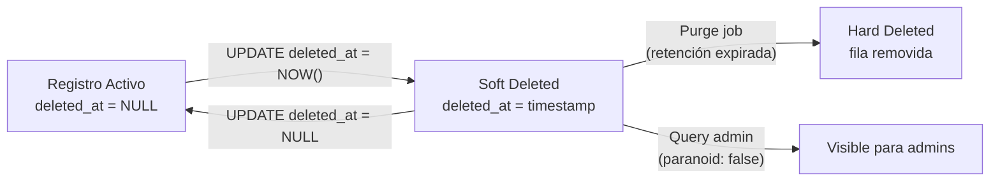

## Visión General

Los soft deletes marcan registros como eliminados sin removerlos realmente de la
base de datos. Esto mantiene los datos disponibles para auditoría, recuperación
e integridad referencial, mientras oculta los registros eliminados de las
consultas normales de la aplicación. Abajo cubrimos soft deletes con columnas
timestamp, consultas filtradas, índices únicos, purge jobs y flujos de
recuperación en Python, JavaScript y Java.

Para patrones relacionados, consultá [database-indexing](/recipes/database-indexing/)
para estrategias de índices parciales y
[repository-pattern](/patterns/repository-pattern/) para integrar soft deletes
en tu capa de acceso a datos.

## Cuándo Usar

- Los usuarios borran datos accidentalmente y necesitan recuperarlos. Consultá
  [Database Transactions](/recipes/database-transactions/) para patrones de
  rollback.
- Requerimientos de compliance (GDPR, HIPAA, SOC2) exigen audit trails.
- Las restricciones de clave foránea hacen que los hard deletes sean difíciles o
  riesgosos.
- Tu producto necesita una feature de papelera o reciclaje.

### Cuándo evitarlo

- El hard delete es requerido por ley o por solicitud del usuario. El soft delete
  solo no alcanza para el derecho de olvido del GDPR; necesitás purge o
  anonimización.
- Tablas con volumen de escritura muy alto donde las filas eliminadas inflarían
  el almacenamiento y los backups. Usá una ventana de retención corta y purgado
  agresivo.
- Datos sin necesidad de recuperación ni auditoría. Usá un `DELETE` real
  directamente.

## Solución

### Python (SQLAlchemy)

```python
from sqlalchemy import create_engine, Column, Integer, String, DateTime
from sqlalchemy.orm import declarative_base, Session
import datetime

Base = declarative_base()

class SoftDeleteMixin:
    deleted_at = Column(DateTime, nullable=True)

    @classmethod
    def query_visible(cls, session: Session):
        return session.query(cls).filter(cls.deleted_at.is_(None))

    def soft_delete(self):
        self.deleted_at = datetime.datetime.utcnow()

class User(Base, SoftDeleteMixin):
    __tablename__ = "users"
    id = Column(Integer, primary_key=True)
    email = Column(String, nullable=False)

engine = create_engine("sqlite:///app.db")
Base.metadata.create_all(engine)

with Session(engine) as session:
    user = User(email="alice@example.com")
    session.add(user)
    session.commit()

    # Soft delete
    user.soft_delete()
    session.commit()

    # Solo usuarios visibles
    visible = User.query_visible(session).all()
    print(visible)  # []
```

### JavaScript (Sequelize)

```javascript
const { Sequelize, DataTypes, Model, Op } = require("sequelize");
const sequelize = new Sequelize({ dialect: "sqlite", storage: "app.db" });

class User extends Model {}

User.init(
  {
    email: { type: DataTypes.STRING, allowNull: false },
    deletedAt: { type: DataTypes.DATE, allowNull: true },
  },
  {
    sequelize,
    modelName: "User",
    paranoid: true,
    deletedAt: "deletedAt",
  }
);

await sequelize.sync();

const user = await User.create({ email: "alice@example.com" });
await user.destroy(); // Soft delete porque paranoid: true

const visible = await User.findAll(); // Excluye soft-deleted por defecto
const deleted = await User.findAll({
  paranoid: false,
  where: { deletedAt: { [Op.ne]: null } },
});
```

### Java (JPA / Hibernate)

```java
import jakarta.persistence.*;
import java.time.Instant;
import java.util.List;

@Entity
@Table(name = "users")
@FilterDef(name = "softDeleteFilter", parameters = @ParamDef(name = "deleted", type = Boolean.class))
@Filter(name = "softDeleteFilter", condition = "deleted_at is null")
public class User {
    @Id @GeneratedValue
    private Long id;
    private String email;
    private Instant deletedAt;

    public void softDelete() {
        this.deletedAt = Instant.now();
    }

    // getters/setters omitidos
}

public List<User> findActiveUsers(EntityManager em) {
    em.unwrap(Session.class).enableFilter("softDeleteFilter").setParameter("deleted", false);
    return em.createQuery("SELECT u FROM User u", User.class).getResultList();
}
```

### Índice único parcial en PostgreSQL

```sql
-- Permitir recrear un registro con el mismo email después de un soft delete
CREATE UNIQUE INDEX idx_users_email_active
ON users (email)
WHERE deleted_at IS NULL;

-- Solo un usuario activo por email; múltiples soft-deleted están permitidos.
```

### Soft delete en cascada con CTE recursivo

```sql
WITH RECURSIVE user_posts AS (
    SELECT id FROM posts WHERE user_id = 42 AND deleted_at IS NULL
)
UPDATE posts SET deleted_at = NOW()
WHERE id IN (SELECT id FROM user_posts);

UPDATE users SET deleted_at = NOW() WHERE id = 42;
```

### Restaurar registros soft-deleted

```python
def restore_user(session, user_id):
    user = session.query(User).filter_by(id=user_id).first()
    if user and user.deleted_at is not None:
        user.deleted_at = None
        session.commit()
        # Restaurar posts relacionados
        session.query(Post).filter_by(user_id=user_id).update({"deleted_at": None})
        session.commit()
    return user
```

### Purge job programado para compliance GDPR

```python
import datetime
from sqlalchemy import text

def purge_old_soft_deletes(session, days=30):
    cutoff = datetime.datetime.utcnow() - datetime.timedelta(days=days)

    result = session.execute(text(
        "DELETE FROM users WHERE deleted_at IS NOT NULL AND deleted_at < :cutoff"
    ), {"cutoff": cutoff})

    session.execute(text(
        "DELETE FROM posts WHERE deleted_at IS NOT NULL AND deleted_at < :cutoff"
    ), {"cutoff": cutoff})

    session.commit()
    print(f"Purged {result.rowcount} users")
```

## Explicación

Los soft deletes agregan una columna `deleted_at` (o `is_deleted`). En vez de
`DELETE FROM`, ejecutás `UPDATE ... SET deleted_at = NOW()`. Las consultas
estándar agregan `WHERE deleted_at IS NULL` para excluir las filas soft-deleted.



Esto te da datos recuperables, claves foráneas preservadas y un audit trail
automático. El costo son tablas más grandes, índices únicos especiales y una
estrategia de purgado para eliminación real.

Para eliminación real, programá un purge job que ejecute `DELETE FROM` sobre
registros soft-deleted más allá del período de retención. Es requerido para el
GDPR y evita que el almacenamiento y backups crezcan sin control.

## Variantes

| Enfoque | Columna | Ideal para | Notas |
| --- | --- | --- | --- |
| Timestamp (`deleted_at`) | `DATETIME NULL` | Audit trails, ventanas de recuperación | Soporta queries "borrado antes de X fecha" |
| Boolean (`is_deleted`) | `BOOLEAN DEFAULT FALSE` | Lógica simple | Agregá `deleted_at` separado para auditoría |
| Tabla de archivo | Copia completa | Compliance, tablas grandes | Más complejo; triggers o a nivel app |
| Partición por estado | Nativo PG/MySQL | Tablas muy grandes | Particiones separadas para activos y borrados |

## Mejores Prácticas

- Filtrá filas eliminadas por defecto en tu ORM, repositorio o query builder.
- Incluí `deleted_at` en índices únicos para que un registro se pueda recrear
  después de un soft delete.
- Programá hard deletes periódicos después del período de retención. El derecho
  de olvido del GDPR requiere eliminación o anonimización real.
- Logueá hard deletes a una tabla de auditoría o event stream al purgar.
- Testeá el flujo de restauración. El soft delete solo vale la pena si los
  usuarios pueden recuperar desde una UI de papelera.
- Usá índices parciales sobre registros activos para mantenerlos chicos y rápidos:

```sql
CREATE INDEX idx_orders_active_user ON orders (user_id) WHERE deleted_at IS NULL;
```

- Ejecutá purge jobs en ventanas de bajo tráfico y hacé `VACUUM` después (PostgreSQL).
- Usá `EXPLAIN` para confirmar que las consultas activas usan el índice parcial.

## Errores Comunes

- Olvidar `WHERE deleted_at IS NULL` en queries raw y exponer datos borrados.
- Violaciones de constraints únicos al recrear un registro que fue soft-deleted.
- No tener estrategia de purgado, dejando datos soft-deleted acumularse para
  siempre.
- Aplicar soft delete en cascada de forma inconsistente. Si `posts` pertenecen a
  `users`, decidí si borrar un usuario también soft-deleta sus posts e
  implementalo de forma uniforme en la capa de servicio.
- Consultar registros borrados por defecto porque el ORM no está configurado para
  filtrarlos.
- Hacer soft delete de datos que deberían hard-deletearse inmediatamente, como
  datos de usuario bajo un pedido de olvido del GDPR.

## Estrategia de Testing

Los soft deletes necesitan tres categorías de tests: filtrado de visibilidad,
flujos de restauración y correctitud del purge. En mi experiencia, los equipos
testean el soft delete en sí pero saltan los tests de restore y purge — ahí
están los bugs reales.

### Filtrado de visibilidad

Verificá que los registros soft-deleted no aparezcan en consultas por defecto:

```python
def test_soft_deleted_user_excluded_from_visible(session):
    user = User(email="test@example.com")
    session.add(user)
    session.commit()

    user.soft_delete()
    session.commit()

    visible = User.query_visible(session).all()
    assert user not in visible
    assert len(visible) == 0
```

```javascript
test('soft-deleted user excluded from findAll', async () => {
  const user = await User.create({ email: 'test@example.com' });
  await user.destroy(); // paranoid soft delete

  const visible = await User.findAll();
  expect(visible).toHaveLength(0);
});
```

### Flujo de restauración

Testeá que restaurar un registro soft-deleted lo traiga de vuelta y maneje
registros relacionados:

```python
def test_restore_user_and_posts(session):
    user = User(email="test@example.com")
    session.add(user)
    session.commit()

    user.soft_delete()
    session.commit()

    # Restaurar
    restored = restore_user(session, user.id)
    assert restored.deleted_at is None
    assert User.query_visible(session).filter_by(id=user.id).one()
```

### Correctitud del purge

Verificá que los purge jobs solo remuevan registros más allá del período de
retención:

```python
def test_purge_only_old_records(session):
    old_user = User(email="old@example.com")
    old_user.deleted_at = datetime.datetime.utcnow() - datetime.timedelta(days=31)
    recent_user = User(email="recent@example.com")
    recent_user.deleted_at = datetime.datetime.utcnow() - datetime.timedelta(days=5)
    session.add_all([old_user, recent_user])
    session.commit()

    purge_old_soft_deletes(session, days=30)

    assert session.query(User).filter_by(email="old@example.com").first() is None
    assert session.query(User).filter_by(email="recent@example.com").first() is not None
```

## Consideraciones de Seguridad

- **Compliance GDPR**: el soft delete solo no satisface el derecho al olvido
  (Artículo 17). Necesitás un período de retención documentado y un purge job
  que hard-deletee o anonimice registros después de esa ventana. Una vez vi a
  una empresa fallar una auditoría GDPR porque sus filas soft-deleted
  permanecieron en producción 3 años sin ningún purge.
- **PII en filas soft-deleted**: los registros soft-deleted siguen teniendo
  datos personales. Aplicá los mismos controles de acceso a filas soft-deleted
  que a las activas. No asumas que "borrado" significa "invisible para admins".
- **Audit logging**: registrá quién soft-deleteó qué y cuándo. La columna
  `deleted_at` te dice cuándo, pero no quién lo hizo. Agregá una columna
  `deleted_by` o escribí a una tabla de auditoría separada.
- **Control de acceso**: restringí quién puede consultar registros soft-deleted
  (ej: `paranoid: false` en Sequelize, `session.query` sin filtro en
  SQLAlchemy). Solo admins o equipos de compliance deberían ver datos
  borrados.
- **Anonimización**: para el olvido GDPR, considerá anonimizar columnas PII al
  momento del soft delete en vez de mantenerlas hasta el purge. Así, si el
  purge job falla, los datos personales ya no están.

## Monitoreo

Trackeá estas métricas para que los soft deletes no degraden el performance:

| Métrica | Qué te dice | Threshold de alerta |
| --- | --- | --- |
| soft_deleted_rows_total | Cantidad de filas soft-deleted por tabla | > 20% del total |
| purge_job_success_rate | Si el purge job corrió exitosamente | < 100% |
| purge_job_duration | Cuánto tarda el purge job | > 30 min |
| query_latency_active | Latencia de queries sobre filas activas | p99 > 200ms |
| storage_growth_rate | Crecimiento mensual de datos soft-deleted | > 10% mes-a-mes |

En Python, instrumentá con `prometheus_client`:

```python
from prometheus_client import Gauge, Counter

soft_deleted_count = Gauge('soft_deleted_rows_total', 'Soft-deleted rows', ['table'])
purge_success = Counter('purge_job_total', 'Purge job runs', ['status'])

def monitored_purge(session, days=30):
    try:
        purged = purge_old_soft_deletes(session, days)
        soft_deleted_count.labels(table='users').dec(purged)
        purge_success.labels(status='success').inc()
    except Exception:
        purge_success.labels(status='failure').inc()
        raise
```

## See Also

- [Documentación de PostgreSQL partial indexes](https://www.postgresql.org/docs/current/indexes-partial.html)
- [SQLAlchemy ORM querying](https://docs.sqlalchemy.org/en/20/orm/queryguide/)
- [Sequelize paranoid models](https://sequelize.org/docs/v6/core-concepts/paranoid/)
- [Hibernate @Filter annotation](https://docs.jboss.org/hibernate/orm/current/userguide/html_single/Hibernate_User_Guide.html#pc-filter)
- [GDPR Artículo 17 — Derecho al olvido](https://gdpr-info.eu/art-17-gdpr/)
- [database-transactions](/recipes/database-transactions/)
- [database-migrations-safely](/recipes/database-migrations-safely/)

## FAQ

### ¿Cómo manejo constraints únicos con soft deletes?

Hacé el índice único parcial: `UNIQUE (email) WHERE deleted_at IS NULL` en
PostgreSQL, o `UNIQUE (email, deleted_at)` en MySQL/SQLite. Esto bloquea valores
activos duplicados pero permite múltiples filas soft-deleted.

### ¿El soft delete viola el GDPR?

El artículo 17 del GDPR otorga el derecho al olvido. El soft delete solo no es
suficiente. Debés hard deletear o anonimizar después de un período de retención
documentado.

### ¿Cómo soft-deleteo en cascada registros relacionados?

Implementalo en la capa de servicio o repositorio. Al soft-deletear un `User`,
iterá o hacé un batch update de los `Post` relacionados. Para árboles grandes,
usá un CTE recursivo o un paquete del ORM que soporte cascadas de soft delete.

### ¿Cuándo debería hard deletear en vez de soft deletear?

Cuando los datos no tienen valor de recuperación o auditoría, o cuando un usuario
o regulador solicita el olvido. También para datos de alta rotación y no
sensibles que inflarían las tablas.

### ¿Cómo restauro un registro soft-deleted?

Seteá `deleted_at` a `NULL` y commiteá. También restaurá registros relacionados si
la lógica de negocio lo requiere. Envolver todo en una transacción.

### ¿Cómo mantengo rápidas las consultas con soft deletes?

Agregá índices parciales sobre `deleted_at IS NULL` para las columnas más
consultadas. Mantené filas soft-deleted viejas en una tabla de archivo o
partición separada, y purgá agresivamente.
