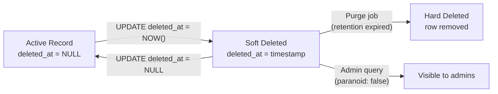

## Overview

Soft deletes mark records as deleted without actually removing them. This
preserves data for auditing, recovery, and referential integrity while keeping
deleted records invisible to normal application queries. The following shows
soft deletes with timestamp flags, filtered queries, unique indexes, purge jobs,
and restore flows in Python, JavaScript, and Java.

For related patterns, see [database-indexing](/recipes/database-indexing/) for
partial index strategies and [repository-pattern](/patterns/repository-pattern/)
for integrating soft deletes into your data access layer.

## When to Use

- Users need to recover accidentally deleted data. See
  [Database Transactions](/recipes/database-transactions/) for rollback patterns.
- You must maintain audit trails for compliance (GDPR, HIPAA, SOC2).
- Foreign key constraints make hard deletes difficult or risky.
- You want to show a "trash" or "recycle bin" UI.

### When to avoid

- Hard deletion is required by law or user request. Soft delete alone isn't
  enough for GDPR erasure; you still need a purge or anonymization step.
- Tables with extremely high write volume where deleted rows would bloat storage
  and backups. Use a short retention window and aggressive purging.
- Data without any recovery or audit requirement. A real `DELETE` is simpler and
  cheaper.

## Solution

### Python (SQLAlchemy)

```python
from sqlalchemy import create_engine, Column, Integer, String, DateTime
from sqlalchemy.orm import declarative_base, Session
import datetime

Base = declarative_base()

class SoftDeleteMixin:
    deleted_at = Column(DateTime, nullable=True)

    @classmethod
    def query_visible(cls, session: Session):
        return session.query(cls).filter(cls.deleted_at.is_(None))

    def soft_delete(self):
        self.deleted_at = datetime.datetime.utcnow()

class User(Base, SoftDeleteMixin):
    __tablename__ = "users"
    id = Column(Integer, primary_key=True)
    email = Column(String, nullable=False)

engine = create_engine("sqlite:///app.db")
Base.metadata.create_all(engine)

with Session(engine) as session:
    user = User(email="alice@example.com")
    session.add(user)
    session.commit()

    # Soft delete
    user.soft_delete()
    session.commit()

    # Only visible users
    visible = User.query_visible(session).all()
    print(visible)  # []
```

### JavaScript (Sequelize)

```javascript
const { Sequelize, DataTypes, Model, Op } = require("sequelize");
const sequelize = new Sequelize({ dialect: "sqlite", storage: "app.db" });

class User extends Model {}

User.init(
  {
    email: { type: DataTypes.STRING, allowNull: false },
    deletedAt: { type: DataTypes.DATE, allowNull: true },
  },
  {
    sequelize,
    modelName: "User",
    paranoid: true,
    deletedAt: "deletedAt",
  }
);

await sequelize.sync();

const user = await User.create({ email: "alice@example.com" });
await user.destroy(); // Soft delete because paranoid: true

const visible = await User.findAll(); // Excludes soft-deleted by default
const deleted = await User.findAll({
  paranoid: false,
  where: { deletedAt: { [Op.ne]: null } },
});
```

### Java (JPA / Hibernate)

```java
import jakarta.persistence.*;
import java.time.Instant;
import java.util.List;

@Entity
@Table(name = "users")
@FilterDef(name = "softDeleteFilter", parameters = @ParamDef(name = "deleted", type = Boolean.class))
@Filter(name = "softDeleteFilter", condition = "deleted_at is null")
public class User {
    @Id @GeneratedValue
    private Long id;
    private String email;
    private Instant deletedAt;

    public void softDelete() {
        this.deletedAt = Instant.now();
    }

    // getters/setters omitted
}

public List<User> findActiveUsers(EntityManager em) {
    em.unwrap(Session.class).enableFilter("softDeleteFilter").setParameter("deleted", false);
    return em.createQuery("SELECT u FROM User u", User.class).getResultList();
}
```

### PostgreSQL partial unique index

```sql
-- Allow re-creating a record with the same email after soft delete
CREATE UNIQUE INDEX idx_users_email_active
ON users (email)
WHERE deleted_at IS NULL;

-- Only one active user per email; multiple soft-deleted rows are allowed.
```

### Cascade soft delete with recursive CTE

```sql
WITH RECURSIVE user_posts AS (
    SELECT id FROM posts WHERE user_id = 42 AND deleted_at IS NULL
)
UPDATE posts SET deleted_at = NOW()
WHERE id IN (SELECT id FROM user_posts);

UPDATE users SET deleted_at = NOW() WHERE id = 42;
```

### Restore soft-deleted records

```python
def restore_user(session, user_id):
    user = session.query(User).filter_by(id=user_id).first()
    if user and user.deleted_at is not None:
        user.deleted_at = None
        session.commit()
        # Restore related posts
        session.query(Post).filter_by(user_id=user_id).update({"deleted_at": None})
        session.commit()
    return user
```

### Scheduled purge job for GDPR compliance

```python
import datetime
from sqlalchemy import text

def purge_old_soft_deletes(session, days=30):
    cutoff = datetime.datetime.utcnow() - datetime.timedelta(days=days)

    result = session.execute(text(
        "DELETE FROM users WHERE deleted_at IS NOT NULL AND deleted_at < :cutoff"
    ), {"cutoff": cutoff})

    session.execute(text(
        "DELETE FROM posts WHERE deleted_at IS NOT NULL AND deleted_at < :cutoff"
    ), {"cutoff": cutoff})

    session.commit()
    print(f"Purged {result.rowcount} users")
```

## Explanation

Soft deletes add a `deleted_at` (or `is_deleted`) column. Instead of `DELETE
FROM`, you run `UPDATE ... SET deleted_at = NOW()`. Standard queries add `WHERE
deleted_at IS NULL` to exclude soft-deleted rows.



This gives you recoverable data, preserved foreign keys, and an automatic audit
trail. The cost is bigger tables, special unique indexes, and a purge strategy
for true removal.

For real deletion, schedule a purge job that runs `DELETE FROM` on records
soft-deleted longer than your retention period. This is required for GDPR and
keeps storage and backups from growing forever.

## Variants

| Approach | Column | Best for | Notes |
| --- | --- | --- | --- |
| Timestamp (`deleted_at`) | `DATETIME NULL` | Audit trails, recovery windows | Supports "deleted before X date" queries |
| Boolean (`is_deleted`) | `BOOLEAN DEFAULT FALSE` | Simple logic | Add a separate `deleted_at` for audits |
| Archive table | Full copy | Compliance, large tables | More complex; triggers or app-level |
| Partition by deletion status | Native PG/MySQL | Very large tables | Separate partitions for active vs deleted |

## Best Practices

- Filter deleted rows by default in your ORM, repository, or query builder.
- Include `deleted_at` in unique indexes so a record can be re-created after
  soft delete.
- Schedule periodic hard deletes after your retention period. GDPR erasure
  requires actual deletion or anonymization.
- Log hard deletes to an audit table or event stream when you finally purge.
- Test the restore flow. A soft delete is only useful if users can recover from a
  trash UI.
- Use partial indexes on active records to keep indexes small and fast:

```sql
CREATE INDEX idx_orders_active_user ON orders (user_id) WHERE deleted_at IS NULL;
```

- Run purge jobs during low-traffic windows and `VACUUM` (PostgreSQL) afterward.
- Use `EXPLAIN` to confirm active queries use the partial index.

## Common Mistakes

- Forgetting `WHERE deleted_at IS NULL` in raw queries and exposing deleted data.
- Unique constraint violations when recreating a record that was soft-deleted.
- No purge strategy, letting soft-deleted data accumulate forever.
- Cascading soft deletes inconsistently. If `posts` belong to `users`, decide
  whether deleting a user also soft-deletes their posts, and implement it
  uniformly in the service layer.
- Querying deleted records by default because the ORM isn't configured to filter
  them.
- Running a soft delete on data that should be hard-deleted immediately, such as
  user data under a GDPR erasure request.

## Testing Strategy

Soft deletes need three categories of tests: visibility filtering, restore
flows, and purge correctness. I've found that teams often test the soft delete
itself but skip the restore and purge tests — those are where the real bugs
hide.

### Visibility filtering

Verify that soft-deleted records don't appear in default queries:

```python
def test_soft_deleted_user_excluded_from_visible(session):
    user = User(email="test@example.com")
    session.add(user)
    session.commit()

    user.soft_delete()
    session.commit()

    visible = User.query_visible(session).all()
    assert user not in visible
    assert len(visible) == 0
```

```javascript
test('soft-deleted user excluded from findAll', async () => {
  const user = await User.create({ email: 'test@example.com' });
  await user.destroy(); // paranoid soft delete

  const visible = await User.findAll();
  expect(visible).toHaveLength(0);
});
```

### Restore flow

Test that restoring a soft-deleted record brings it back and handles related
records:

```python
def test_restore_user_and_posts(session):
    user = User(email="test@example.com")
    session.add(user)
    session.commit()

    user.soft_delete()
    session.commit()

    # Restore
    restored = restore_user(session, user.id)
    assert restored.deleted_at is None
    assert User.query_visible(session).filter_by(id=user.id).one()
```

### Purge correctness

Verify that purge jobs only remove records past the retention window:

```python
def test_purge_only_old_records(session):
    old_user = User(email="old@example.com")
    old_user.deleted_at = datetime.datetime.utcnow() - datetime.timedelta(days=31)
    recent_user = User(email="recent@example.com")
    recent_user.deleted_at = datetime.datetime.utcnow() - datetime.timedelta(days=5)
    session.add_all([old_user, recent_user])
    session.commit()

    purge_old_soft_deletes(session, days=30)

    assert session.query(User).filter_by(email="old@example.com").first() is None
    assert session.query(User).filter_by(email="recent@example.com").first() is not None
```

## Security Considerations

- **GDPR compliance**: soft delete alone doesn't satisfy the right to erasure
  (Article 17). You need a documented retention period and a purge job that
  hard-deletes or anonymizes records after that window. I once saw a company
  fail a GDPR audit because their soft-deleted rows sat in production for 3
  years without any purge.
- **PII in soft-deleted rows**: soft-deleted records still contain personal
  data. Apply the same access controls to soft-deleted rows as active ones.
  Don't assume "deleted" means "invisible to admins."
- **Audit logging**: log who soft-deleted what and when. The `deleted_at`
  column tells you when, but not who. Add a `deleted_by` column or write to a
  separate audit table.
- **Access control**: restrict who can query soft-deleted records (e.g.,
  `paranoid: false` in Sequelize, `session.query` without filter in SQLAlchemy).
  Only admins or compliance teams should see deleted data.
- **Anonymization**: for GDPR erasure, consider anonymizing PII columns at
  soft-delete time instead of keeping them until purge. This reduces risk if
  the purge job fails.

## Monitoring

Track these metrics to keep soft deletes from degrading performance:

| Metric | What it tells you | Alert threshold |
| --- | --- | --- |
| soft_deleted_rows_total | Count of soft-deleted rows per table | > 20% of total rows |
| purge_job_success_rate | Whether the purge job ran successfully | < 100% |
| purge_job_duration | How long the purge job takes | > 30 min |
| query_latency_active | Query latency on active rows | p99 > 200ms |
| storage_growth_rate | Monthly growth of soft-deleted data | > 10% month-over-month |

In Python, instrument with `prometheus_client`:

```python
from prometheus_client import Gauge, Counter

soft_deleted_count = Gauge('soft_deleted_rows_total', 'Soft-deleted rows', ['table'])
purge_success = Counter('purge_job_total', 'Purge job runs', ['status'])

def monitored_purge(session, days=30):
    try:
        purged = purge_old_soft_deletes(session, days)
        soft_deleted_count.labels(table='users').dec(purged)
        purge_success.labels(status='success').inc()
    except Exception:
        purge_success.labels(status='failure').inc()
        raise
```

## See Also

- [PostgreSQL partial indexes documentation](https://www.postgresql.org/docs/current/indexes-partial.html)
- [SQLAlchemy ORM querying](https://docs.sqlalchemy.org/en/20/orm/queryguide/)
- [Sequelize paranoid models](https://sequelize.org/docs/v6/core-concepts/paranoid/)
- [Hibernate @Filter annotation](https://docs.jboss.org/hibernate/orm/current/userguide/html_single/Hibernate_User_Guide.html#pc-filter)
- [GDPR Article 17 — Right to erasure](https://gdpr-info.eu/art-17-gdpr/)
- [database-transactions](/recipes/database-transactions/)
- [database-migrations-safely](/recipes/database-migrations-safely/)

## FAQ

### How do I handle unique constraints with soft deletes?

Make the unique index partial: `UNIQUE (email) WHERE deleted_at IS NULL` in
PostgreSQL, or `UNIQUE (email, deleted_at)` in MySQL/SQLite. This blocks
duplicate active values but allows several soft-deleted rows.

### Does soft delete violate GDPR?

GDPR Article 17 grants the right to erasure. Soft delete alone isn't sufficient.
You must hard delete or anonymize after a documented retention period.

### How do I cascade soft deletes to related records?

Implement it in the service or repository layer. When soft-deleting a `User`,
loop through or batch-update related `Posts`. For large trees, use a recursive
CTE or an ORM package that supports soft-delete cascades.

### When should I hard delete instead of soft delete?

When the data has no recovery or audit value, or when a user or regulator
requests erasure. Also use hard delete for high-churn, non-sensitive data that
would bloat tables.

### How do I restore a soft-deleted record?

Set `deleted_at` to `NULL` and commit. Also restore related records if your
business logic requires it. Wrap the operation in a transaction.

### How do I keep queries fast with soft deletes?

Add partial indexes on `deleted_at IS NULL` for the columns you query most. Keep
soft-deleted rows in a separate archive table or partition when they become old,
and purge aggressively.
