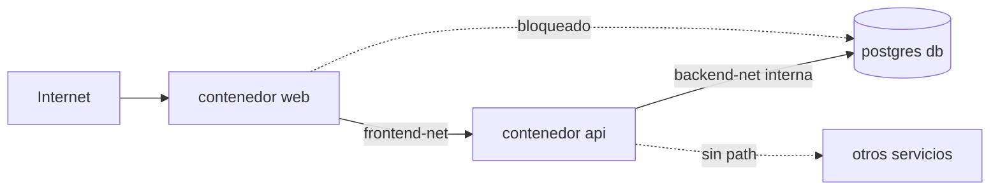

## Visión General

El aislamiento de red Docker es la práctica de segmentar contenedores en redes
virtuales separadas para controlar qué servicios pueden comunicarse entre sí.
Por defecto, Docker pone los contenedores en la
[red bridge](/es/recipes/docker-basics/) y les permite
comunicarse entre sí. Eso es un riesgo de seguridad: uno comprometido puede
sondear o atacar al resto en el mismo host. Esta receta muestra cómo aislar
servicios con redes personalizadas, redes internas y reglas de asignación de
puertos.

## Cuándo Usar

- Varias servicios corren en un host y querés limitar cómo se hablan entre sí.
- Un contenedor público (web) debe alcanzar una API, pero esa API también debe
  alcanzar una base de datos que debe permanecer privada.
- Querés segmentar servicios por nivel de confianza (frontend, backend, base de
  datos).
- Políticas de seguridad o compliance requieren segmentación de red.

### Cuándo evitarlo

- Solo hay un contenedor corriendo. Una red personalizada agrega complejidad sin
  una amenaza que mitigar.
- Ya usás Kubernetes o Docker Swarm con network policies que manejan la
  segmentación.
- Tu workload necesita la red del host para muy baja latencia y el aislamiento
  lo manejás en otro lugar.

## Solución

### Bridge por defecto vs bridge personalizado

```bash
# Bridge por defecto: los contenedores se comunican entre sí (inseguro)
docker run -d --name api --network bridge my-api
docker run -d --name db --network bridge my-db
# api puede alcanzar db y viceversa — sin aislamiento

# Bridge personalizado: los contenedores de esta red solo se hablan entre sí
docker network create --driver bridge frontend-net
docker network create --driver bridge backend-net

docker run -d --name api --network backend-net my-api
docker run -d --name db --network backend-net my-db
docker run -d --name web --network frontend-net my-web

# web no puede alcanzar db — red diferente
# api puede alcanzar db — misma red
```

### Red interna (sin acceso a internet)

```bash
# Crear una red interna — los contenedores no pueden alcanzar internet
docker network create --driver bridge --internal backend-internal

docker run -d --name db --network backend-internal my-db
# db no tiene acceso a internet, solo tráfico entre contenedores de esta red
```

### Contenedor multi-red

```bash
docker network create frontend-net
docker network create backend-net

# La API se une a ambas redes
docker run -d --name api --network frontend-net my-api
docker network connect backend-net api

docker run -d --name web --network frontend-net my-web
docker run -d --name db --network backend-net my-db

# web -> api (frontend-net) ✓
# api -> db (backend-net) ✓
# web -> db ✗ (redes diferentes)
```

### Docker Compose con aislamiento de red

Para un split dev/prod completo, ver la
[receta de docker-compose dev/prod split](/es/recipes/docker-compose-dev-prod-split/).
La
[documentación de networking de Docker Compose](https://docs.docker.com/compose/networking/)
cubre la sintaxis completa. Una versión runnable de este ejemplo está en el
[repositorio companion](https://mathiaspaulenko.github.io/stack-practices-resources/resources/recipes/devops/docker-network-isolation/).

```yaml
# docker-compose.yml
services:
  web:
    image: nginx:alpine
    ports:
      - "80:80"
    networks:
      - frontend
    depends_on:
      - api

  api:
    build: .
    networks:
      - frontend
      - backend
    depends_on:
      db:
        condition: service_healthy

  db:
    image: postgres:16-alpine
    networks:
      - backend
    environment:
      POSTGRES_PASSWORD: ${DB_PASSWORD}
    healthcheck:
      test: ["CMD", "pg_isready", "-U", "postgres"]
      interval: 10s
      timeout: 5s
      retries: 5

networks:
  frontend:
    driver: bridge
  backend:
    driver: bridge
    internal: true
```

### Asignar puertos a una interfaz específica

```bash
# Solo localhost — no accesible desde otras máquinas
docker run -d -p 127.0.0.1:5432:5432 --name db postgres:16-alpine

# Interfaz específica
docker run -d -p 10.0.0.5:80:80 --name web nginx:alpine

# Todas las interfaces — menos seguro, evitar para bases de datos
docker run -d -p 0.0.0.0:80:80 --name web nginx:alpine
```

### Inspeccionar y probar conectividad

Usá [health checks](/es/recipes/docker-health-check-configuration/) junto con
la inspección de redes para detectar problemas de conectividad temprano.

```bash
# Listar redes
docker network ls

# Inspeccionar una red
docker network inspect backend-net

# Probar de un contenedor a otro
docker exec api ping db
docker exec api curl -f http://db:5432

# Quitar un contenedor de una red
docker network disconnect backend-net api
```

### Red overlay con Docker Swarm

Cuando tus servicios se extienden a múltiples hosts, las redes bridge dejan de
funcionar. Necesitás una red overlay, que crea túneles VXLAN cifrados entre hosts.

```bash
# Inicializar Swarm en el nodo manager
docker swarm init --advertise-addr 10.0.0.10

# Unirse desde un nodo worker (copiá el token de la salida de swarm init)
docker swarm join --token SWMTKN-... 10.0.0.10:2377

# Crear una red overlay a través del cluster
docker network create --driver overlay --attachable my-overlay

# Correr un servicio en la red overlay
docker service create --name api --network my-overlay --replicas 3 my-api

# O correr un contenedor standalone en el overlay (Swarm 1.12+)
docker run -d --name debug --network my-overlay alpine sleep 3600
```

El flag `--attachable` permite que contenedores standalone se unan al overlay.
Sin eso, solo los servicios de Swarm pueden usar la red. El tráfico overlay entre
hosts se cifra por defecto con AES-GCM cuando pasás `--opt encrypted`.

### Debugging de resolución DNS

Cuando los contenedores no se alcanzan por nombre, el problema suele ser DNS.
Las redes bridge personalizadas tienen un DNS embebido, pero el bridge por
defecto no. Perdí horas en esto antes de aprender a revisar DNS primero.

```bash
# Verificar DNS desde dentro de un contenedor
docker exec -it api sh
/ # nslookup db
/ # getent hosts db

# Si DNS falla, verificar en qué redes está el contenedor
docker inspect api --format '{{json .NetworkSettings.Networks}}' | jq .

# Probar conectividad sin DNS
docker exec api ping <db-container-ip>

# Causas comunes:
# 1. Contenedores en redes diferentes (DNS no resuelve)
# 2. Contenedor en el bridge por defecto (sin DNS embebido)
# 3. Typo en un alias de red en docker-compose.yml
```

### Limpieza de redes

Las redes no usadas se acumulan rápido. Las limpio semanalmente en máquinas de
desarrollo y mensualmente en hosts de producción después de verificar que nada
depende de ellas.

```bash
# Listar todas las redes con sus contenedores
docker network ls
docker network ls --filter "dangling=true"

# Eliminar una sola red no usada
docker network rm backend-net

# Eliminar todas las redes no usadas (no referenciadas por ningún contenedor)
docker network prune -f

# En producción, sé explícito — nunca uses prune sin -f en scripts
docker network prune --filter "until=24h" -f
```

## Explicación

Las redes Docker aislan en la capa de enlace. Un contenedor en una red no puede
iniciar una conversación con otro en una red distinta. Docker tiene un DNS
embebido en las redes bridge personalizadas, así que los nombres solo se
resuelven ahí. Ver la
[documentación de networking de Docker](https://docs.docker.com/network/) para
la referencia completa.

**Tipos de red**:



El diagrama muestra una configuración típica de tres capas: el contenedor web
está en `frontend-net` y puede alcanzar la API. La API se une a ambas redes, así
que puede alcanzar la base de datos en `backend-net` (que es `internal: true`).
El contenedor web no puede alcanzar la base de datos directamente porque no
comparten ninguna red.

| Tipo | Alcance | Internet | Uso |
| --- | --- | --- | --- |
| **bridge** | Un host | Sí | Red por defecto/personalizada en un host |
| **internal** | Un host | No | Bases de datos y servicios privados |
| **overlay** | Multi-host | Sí | [Docker Swarm](https://docs.docker.com/network/overlay/) entre hosts |
| **host** | Un host | Sí | Alto performance, sin aislamiento |
| **macvlan** | Un host | Sí | IP directa en la red física |

Usá aliases para darle varios nombres a un contenedor en la misma red:

```yaml
services:
  db:
    image: postgres:16-alpine
    networks:
      backend:
        aliases:
          - database
          - postgres.internal

networks:
  backend:
    driver: bridge
    internal: true
```

Otros contenedores pueden alcanzarla como `database` o `postgres.internal`.

### Cómo Docker enforcea el aislamiento por debajo

Docker usa reglas de iptables en el host para enforcear los límites de red. Cada
red bridge personalizada obtiene su propia subred y una cadena de reglas de
filtro. Cuando creás una red con `--internal`, Docker elimina las reglas de la
cadena FORWARD que permiten el tráfico saliente de esa subred.

```bash
# Ver las reglas de iptables que Docker crea para una red
sudo iptables -L DOCKER-ISOLATION-STAGE-1 -n -v
sudo iptables -L DOCKER-ISOLATION-STAGE-2 -n -v

# Cada red personalizada obtiene una subred (default 172.18.0.0/16, 172.19.0.0/16, ...)
docker network inspect backend-net --format '{{range .IPAM.Config}}{{.Subnet}}{{end}}'
```

Las cadenas `DOCKER-ISOLATION-STAGE-1` y `STAGE-2` son lo que evita que los
contenedores en redes diferentes se hablen entre sí. Si alguna vez ves tráfico
cruzando redes inesperadamente, revisá estas cadenas primero. Una vez pasé un
día debuggeando "cómo está llegando el contenedor web a la base de datos" solo
para encontrar que alguien había agregado manualmente una regla ACCEPT de
iptables que bypassaba el aislamiento de Docker.

### Docker Compose profiles para aislamiento por entorno

Compose profiles te permite iniciar distintos conjuntos de servicios desde el
mismo `docker-compose.yml`. Es útil cuando querés un stack de debug y un stack
de producción con topologías de red diferentes.

```yaml
# docker-compose.yml
services:
  web:
    image: nginx:alpine
    profiles: ["prod", "debug"]
    networks: [frontend]

  api:
    build: .
    profiles: ["prod", "debug"]
    networks: [frontend, backend]

  db:
    image: postgres:16-alpine
    profiles: ["prod", "debug"]
    networks: [backend]

  debug-tools:
    image: nicolaka/netshoot
    profiles: ["debug"]
    networks: [frontend, backend]
    # Solo corre con --profile debug, puede alcanzar ambas redes

networks:
  frontend:
    driver: bridge
  backend:
    driver: bridge
    internal: true
```

```bash
# Iniciar stack de producción
docker compose --profile prod up -d

# Iniciar stack de debug (incluye el contenedor debug-tools)
docker compose --profile debug up -d
```

El contenedor `debug-tools` se une a ambas redes, así que podés correr
`nslookup`, `tcpdump` y `curl` desde adentro para diagnosticar problemas de
conectividad sin instalar herramientas en tus contenedores de producción.

## Variantes

| Enfoque | Ideal para | Compromiso |
| --- | --- | --- |
| Bridge personalizado | Un host, varios servicios | Más seguro que el bridge por defecto |
| Bridge interno | Bases de datos, workers sin internet | Mayor aislamiento, sin salida |
| Multi-red | Reverse proxy / API gateway | Un contenedor une dos segmentos |
| Overlay | Docker Swarm multi-host | VXLAN cifrado entre hosts |
| Red host | Muy alto throughput | Sin aislamiento |
| Macvlan | Contenedor necesita IP propia | Complejo, requiere red física |

## Mejores Prácticas

Seguí las
[mejores prácticas de seguridad de Docker](https://docs.docker.com/engine/security/)
junto con estas recomendaciones.

- No uses la red bridge por defecto en producción. Creá redes personalizadas.
- Usá `internal: true` para redes backend con bases de datos o servicios
  privados.
- Conectá contenedores solo a las redes que necesiten.
- Asigná puertos de base de datos solo a `127.0.0.1`. Nunca expongas bases de
  datos en `0.0.0.0`. Usá
  [gestión de secrets de Docker](/es/recipes/docker-secrets-management/) para
  contraseñas en lugar de variables de entorno cuando sea posible.
- Definí la segmentación en `docker-compose.yml` para poder versionarla.
- Inspeccioná redes regularmente con `docker network inspect` y eliminá redes no
  usadas.
- Usá overlay para clusters Swarm multi-host.

## Errores Comunes

- Usar el bridge por defecto en producción, donde cada contenedor puede
  alcanzar a los demás.
- Exponer puertos de base de datos en `0.0.0.0`.
- Poner todos los contenedores en una sola red. Un contenedor comprometido puede
  atacar al resto.
- No usar `internal: true` en redes backend. Las bases de datos pueden hacer
  conexiones salientes.
- Olvidar que el DNS solo resuelve dentro de una misma red.
- Conectar un contenedor a demasiadas redes, aumentando la superficie de ataque.

## FAQ

### ¿Pueden comunicarse contenedores en redes Docker diferentes?

No. Los contenedores en redes diferentes no se alcanzan directamente. Podés
conectar un mismo contenedor a ambas redes, o poner un reverse proxy en el
borde.

### ¿Cómo funciona la resolución DNS?

Docker tiene un DNS embebido en las redes bridge personalizadas. Los nombres se
resuelven solo dentro de esa red. El bridge por defecto no resuelve nombres de
contenedores.

### ¿Cuál es la diferencia entre red interna y no interna?

Las redes internas (`--internal` o `internal: true`) cortan el acceso a
internet. Los contenedores solo hablan con otros de la misma red. Las redes no
internas permiten salida a internet.

### ¿Cómo depuro conectividad?

Metete dentro del contenedor con `docker exec <contenedor> sh` y probá `ping`,
`curl` o `nc`. Usá `docker network inspect <red>` para ver qué contenedores están
conectados.

### ¿Debería usar overlay o bridge?

Usá bridge cuando todo corre en un host. Usá overlay cuando tu Swarm se extiende
a más de un host. Overlay usa túneles VXLAN y soporta cifrado.

### ¿Cuándo es correcto usar la red host?

Casi nunca para servicios que manejen tráfico no confiable. Usala solo para
workloads de confianza críticos en performance donde no podés pagar el overhead
NAT del bridge.

## Ver También

- [Documentación de networking de Docker](https://docs.docker.com/network/) —
  referencia oficial de bridge, overlay, macvlan y host networking.
- [Networking en Docker Compose](https://docs.docker.com/compose/networking/) —
  configuración de redes en `docker-compose.yml`.
- [Guía de seguridad de Docker](https://docs.docker.com/engine/security/) —
  seguridad del runtime, seccomp, AppArmor y capabilities.
- [CIS Docker Benchmark](https://www.cisecurity.org/benchmark/docker) —
  checklist de hardening estándar para despliegues Docker.
- [Redes overlay de Docker](https://docs.docker.com/network/overlay/) —
  networking multi-host con túneles VXLAN para clusters Swarm.
