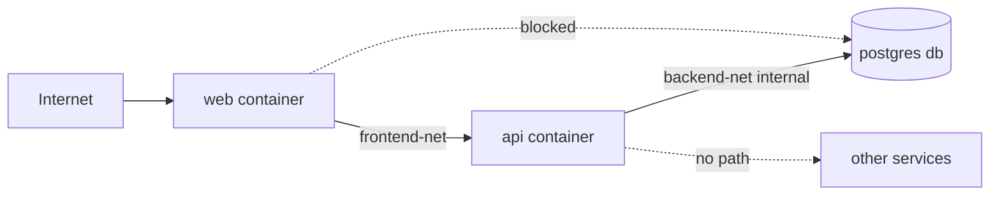

## Overview

Docker network isolation is the practice of segmenting containers into separate
virtual networks to control which services can communicate with each other. By
default, Docker puts containers on the [bridge network](/recipes/docker-basics/)
and lets them reach each other. That's a security risk: a compromised container
can probe or attack the others on the same host. This recipe shows how to
isolate services with custom networks, internal networks, and port binding rules.

## When to Use

- Several services run on the same host, and you want to limit how they talk to
  each other.
- A public-facing container (web) must reach an API, but that API must also
  reach a database that should stay private.
- You want to segment services by trust level (frontend, backend, database).
- Compliance or security policies require network segmentation.

### When to avoid

- There's just one container running. A custom network adds complexity without a
  threat to mitigate.
- You already use Kubernetes or Docker Swarm, and its network policies handle
  segmentation.
- Your workload needs the host network for very low latency and you handle
  isolation somewhere else.

## Solution

### Default bridge vs custom bridge

```bash
# Default bridge: containers can talk to each other (insecure)
docker run -d --name api --network bridge my-api
docker run -d --name db --network bridge my-db
# api can reach db and vice versa — no isolation

# Custom bridge: containers in this network can only talk to each other
docker network create --driver bridge frontend-net
docker network create --driver bridge backend-net

docker run -d --name api --network backend-net my-api
docker run -d --name db --network backend-net my-db
docker run -d --name web --network frontend-net my-web

# web cannot reach db — different network
# api can reach db — same network
```

### Internal network (no internet)

```bash
# Create an internal network — containers cannot reach the internet
docker network create --driver bridge --internal backend-internal

docker run -d --name db --network backend-internal my-db
# db has no internet access, only inter-container traffic on this network
```

### Multi-network container

```bash
docker network create frontend-net
docker network create backend-net

# API joins both networks
docker run -d --name api --network frontend-net my-api
docker network connect backend-net api

docker run -d --name web --network frontend-net my-web
docker run -d --name db --network backend-net my-db

# web -> api (frontend-net) ✓
# api -> db (backend-net) ✓
# web -> db ✗ (different networks)
```

### Docker Compose with network isolation

For a full dev/prod split, see the
[docker-compose dev/prod split recipe](/recipes/docker-compose-dev-prod-split/).
The [Docker Compose networking docs](https://docs.docker.com/compose/networking/)
cover the full syntax. A runnable version of this example is in the
[companion repository](https://mathiaspaulenko.github.io/stack-practices-resources/resources/recipes/devops/docker-network-isolation/).

```yaml

```yaml
# docker-compose.yml
services:
  web:
    image: nginx:alpine
    ports:
      - "80:80"
    networks:
      - frontend
    depends_on:
      - api

  api:
    build: .
    networks:
      - frontend
      - backend
    depends_on:
      db:
        condition: service_healthy

  db:
    image: postgres:16-alpine
    networks:
      - backend
    environment:
      POSTGRES_PASSWORD: ${DB_PASSWORD}
    # See the docker health check recipe for healthcheck details
    healthcheck:
      test: ["CMD", "pg_isready", "-U", "postgres"]
      interval: 10s
      timeout: 5s
      retries: 5

networks:
  frontend:
    driver: bridge
  backend:
    driver: bridge
    internal: true
```

### Bind ports to a specific interface

```bash
# Localhost only — not accessible from other machines
docker run -d -p 127.0.0.1:5432:5432 --name db postgres:16-alpine

# Specific interface
docker run -d -p 10.0.0.5:80:80 --name web nginx:alpine

# All interfaces — least secure, avoid for databases
docker run -d -p 0.0.0.0:80:80 --name web nginx:alpine
```

### Inspect and test connectivity

Use [health checks](/recipes/docker-health-check-configuration/) alongside
network inspection to catch connectivity issues early.

```bash
# List networks
docker network ls

# Inspect a network
docker network inspect backend-net

# Test from one container to another
docker exec api ping db
docker exec api curl -f http://db:5432

# Remove a container from a network
docker network disconnect backend-net api
```

### Overlay network with Docker Swarm

When your services span multiple hosts, bridge networks no longer work. You
need an overlay network, which creates encrypted VXLAN tunnels between hosts.

```bash
# Initialize Swarm on the manager node
docker swarm init --advertise-addr 10.0.0.10

# Join from a worker node (copy the token from swarm init output)
docker swarm join --token SWMTKN-... 10.0.0.10:2377

# Create an overlay network across the cluster
docker network create --driver overlay --attachable my-overlay

# Run a service on the overlay network
docker service create --name api --network my-overlay --replicas 3 my-api

# Or run a standalone container on the overlay (Swarm 1.12+)
docker run -d --name debug --network my-overlay alpine sleep 3600
```

The `--attachable` flag lets standalone containers join the overlay. Without it,
only Swarm services can use the network. Overlay traffic between hosts is
encrypted by default with AES-GCM when you pass `--opt encrypted`.

### Debugging DNS resolution

When containers can't reach each other by name, the problem is usually DNS.
Custom bridge networks have an embedded DNS server, but the default bridge does
not. I've wasted hours on this before learning to check DNS first.

```bash
# Check DNS from inside a container
docker exec -it api sh
/ # nslookup db
/ # getent hosts db

# If DNS fails, check which networks the container is on
docker inspect api --format '{{json .NetworkSettings.Networks}}' | jq .

# Test raw connectivity without DNS
docker exec api ping <db-container-ip>

# Common causes:
# 1. Containers on different networks (DNS won't resolve)
# 2. Container on the default bridge (no embedded DNS)
# 3. Network alias typo in docker-compose.yml
```

### Network pruning

Unused networks accumulate fast. I prune them weekly on dev machines and
monthly on production hosts after verifying nothing depends on them.

```bash
# List all networks with their containers
docker network ls
docker network ls --filter "dangling=true"

# Remove a single unused network
docker network rm backend-net

# Remove all unused networks (not referenced by any container)
docker network prune -f

# On production, be explicit — never use prune without -f in scripts
docker network prune --filter "until=24h" -f
```

## Explanation

Docker networks isolate at the data link layer. A container in one network can't
start a conversation with a container in another network. Docker embeds a DNS
server inside custom bridge networks, so names only resolve there. See the
[Docker networking documentation](https://docs.docker.com/network/) for the full
reference.

**Network types**:



The diagram shows a typical three-tier setup: the web container sits on
`frontend-net` and can reach the API. The API joins both networks, so it can
reach the database on `backend-net` (which is `internal: true`). The web
container cannot reach the database directly because they share no network.

| Type | Scope | Internet | Use for |
| --- | --- | --- | --- |
| **bridge** | Single host | Yes | Default/custom single-host networking |
| **internal** | Single host | No | Databases and private services |
| **overlay** | Multi-host | Yes | [Docker Swarm](https://docs.docker.com/network/overlay/) across hosts |
| **host** | Single host | Yes | Performance-critical, no isolation |
| **macvlan** | Single host | Yes | Direct IP on the physical network |

Use aliases to give a container several names on the same network:

```yaml
services:
  db:
    image: postgres:16-alpine
    networks:
      backend:
        aliases:
          - database
          - postgres.internal

networks:
  backend:
    driver: bridge
    internal: true
```

Other containers can then reach it as `database` or `postgres.internal`.

### How Docker enforces isolation under the hood

Docker uses iptables rules on the host to enforce network boundaries. Each
custom bridge network gets its own subnet and a chain of filter rules. When you
create a network with `--internal`, Docker drops the FORWARD chain rules that
allow outbound traffic from that subnet.

```bash
# See the iptables rules Docker creates for a network
sudo iptables -L DOCKER-ISOLATION-STAGE-1 -n -v
sudo iptables -L DOCKER-ISOLATION-STAGE-2 -n -v

# Each custom network gets a subnet (default 172.18.0.0/16, 172.19.0.0/16, ...)
docker network inspect backend-net --format '{{range .IPAM.Config}}{{.Subnet}}{{end}}'
```

The `DOCKER-ISOLATION-STAGE-1` and `STAGE-2` chains are what prevent containers
on different networks from talking to each other. If you ever see traffic
crossing networks unexpectedly, check these chains first. I once spent a day
debugging "how is the web container reaching the database" only to find that
someone had manually added an iptables ACCEPT rule that bypassed Docker's
isolation.

### Docker Compose profiles for environment isolation

Compose profiles let you start different sets of services from the same
`docker-compose.yml`. This is useful when you want a debug stack and a
production stack with different network topologies.

```yaml
# docker-compose.yml
services:
  web:
    image: nginx:alpine
    profiles: ["prod", "debug"]
    networks: [frontend]

  api:
    build: .
    profiles: ["prod", "debug"]
    networks: [frontend, backend]

  db:
    image: postgres:16-alpine
    profiles: ["prod", "debug"]
    networks: [backend]

  debug-tools:
    image: nicolaka/netshoot
    profiles: ["debug"]
    networks: [frontend, backend]
    # Only runs with --profile debug, can reach both networks

networks:
  frontend:
    driver: bridge
  backend:
    driver: bridge
    internal: true
```

```bash
# Start production stack
docker compose --profile prod up -d

# Start debug stack (includes debug-tools container)
docker compose --profile debug up -d
```

The `debug-tools` container joins both networks, so you can run `nslookup`,
`tcpdump`, and `curl` from inside it to diagnose connectivity issues without
installing tools in your production containers.

## Variants

| Approach | Use when | Trade-off |
| --- | --- | --- |
| Custom bridge | One host, several services | More secure than default bridge |
| Internal bridge | Databases, workers with no internet | Stronger isolation, no outbound |
| Multi-network | Reverse proxy / API gateway | One container joins two segments |
| Overlay | Docker Swarm multi-host | Encrypted VXLAN across hosts |
| Host network | Very high throughput | No isolation |
| Macvlan | Container needs its own IP | Complex, requires physical network |

## Best Practices

Follow [Docker's security best practices](https://docs.docker.com/engine/security/)
alongside these recommendations.

- Never use the default bridge network in production. I create custom networks
  for every project, even single-container ones.
- Use `internal: true` for backend networks with databases or private services.
- Connect containers to only the networks they need.
- Bind database ports to `127.0.0.1` only. Never expose databases on `0.0.0.0`.
  Use [Docker secrets management](/recipes/docker-secrets-management/) for
  passwords instead of environment variables when possible.
- Define segmentation in `docker-compose.yml` so you can version it.
- Inspect networks regularly with `docker network inspect` and prune unused
  networks.
- Use overlay networks when you've got a Docker Swarm cluster across hosts.

## Common Mistakes

- Using the default bridge in production, so every container can reach every
  other one.
- Exposing database ports to `0.0.0.0`.
- Putting every container on the same network. A compromised container can attack
  the rest.
- Not using `internal: true` for backend networks. Databases may make outbound
  internet connections.
- Forgetting that DNS only resolves within one network.
- Connecting a container to too many networks, which increases the attack
  surface.

## FAQ

### Can containers on different Docker networks communicate?

No. Containers on different networks won't reach each other directly. You can
connect a single container to both networks, or put a reverse proxy on the edge.

### How does DNS resolution work?

Docker has an embedded DNS server on custom bridge networks. Container names
resolve only inside that network. The default bridge won't resolve container
names for you.

### What is the difference between internal and non-internal networks?

Internal networks (`--internal` or `internal: true`) cut off internet access.
Containers can only talk to other containers on the same network. Non-internal
networks allow outbound internet.

### How do I debug connectivity?

Get a shell inside the container with `docker exec <container> sh`, then try
`ping`, `curl`, or `nc`. Use `docker network inspect <network>` to see which
containers are actually connected.

### Should I use overlay or bridge?

Use bridge when your stack stays on one host. Use overlay when your Swarm spans
more than one host. Overlay uses VXLAN tunnels and supports encryption.

### When is host network the right choice?

Almost never for services that handle untrusted traffic. Use it only for
performance-critical, trusted workloads where you can't pay the bridge NAT
overhead.

## See Also

- [Docker networking overview](https://docs.docker.com/network/) — official
  reference for bridge, overlay, macvlan and host networking.
- [Docker Compose networking](https://docs.docker.com/compose/networking/) —
  network configuration in `docker-compose.yml`.
- [Docker security guide](https://docs.docker.com/engine/security/) —
  container runtime security, seccomp, AppArmor and capabilities.
- [CIS Docker Benchmark](https://www.cisecurity.org/benchmark/docker) —
  industry-standard hardening checklist for Docker deployments.
- [Docker overlay networks](https://docs.docker.com/network/overlay/) —
  multi-host networking with VXLAN tunnels for Swarm clusters.
