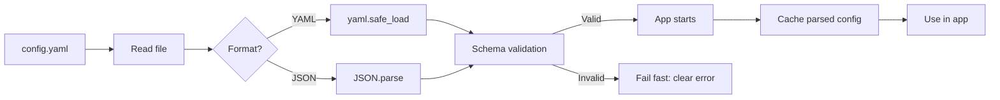

## Resumen

La mayoría de las aplicaciones necesitan configuración externa para adaptarse a
ambientes distintos sin cambiar código. YAML y JSON son los formatos más usados, pero
parsear no alcanza: una configuración inválida puede romper todo en runtime. Esta
receta muestra cómo leer archivos y validarlos antes de que la app arranque.

Una vez debugeé un outage en producción causado por dos puntos faltantes en un YAML —
el parser devolvió `null` silenciosamente para toda la sección de base de datos, y la
app se conectó a `localhost` con credenciales vacías. Ahí aprendí que parsear sin
validar es solo debugging postergado.

## Cuándo Usar

- Para cargar credenciales de base de datos, API keys o feature flags desde archivos.
- Para soportar múltiples ambientes con distintos valores.
- Para validar configuración provista por el usuario y fallar rápido al inicio.
- Para migrar constantes hardcodeadas a configuración basada en archivos.

## Cuándo NO Usar

- Para secretos que nunca deberían tocar disco: usá [variables de entorno](/recipes/environment-variables/)
  o un gestor de secretos.
- Cuando una sola variable de entorno alcanza; no agregues un archivo de config para un
  solo valor.

## Solución

### Python con Pydantic

```python
import json
import yaml
from pydantic import BaseModel, Field, ValidationError
from pathlib import Path

class DatabaseConfig(BaseModel):
    host: str
    port: int = Field(default=5432, ge=1, le=65535)
    username: str
    password: str

class AppConfig(BaseModel):
    app_name: str
    debug: bool = False
    database: DatabaseConfig

def load_config(path: str) -> AppConfig:
    file_path = Path(path)
    raw = file_path.read_text(encoding="utf-8")

    if file_path.suffix in (".yaml", ".yml"):
        data = yaml.safe_load(raw)
    elif file_path.suffix == ".json":
        data = json.loads(raw)
    else:
        raise ValueError(f"Unsupported config format: {file_path.suffix}")

    return AppConfig.model_validate(data)

try:
    config = load_config("config.yaml")
    print(config.database.host)
except ValidationError as e:
    print("Config validation failed:", e)
```

### JavaScript con Zod

```javascript
import { readFileSync } from "fs";
import { parse as parseYaml } from "yaml";
import { z } from "zod";

const dbSchema = z.object({
  host: z.string(),
  port: z.number().int().min(1).max(65535).default(5432),
  username: z.string(),
  password: z.string().min(8),
});

const appSchema = z.object({
  appName: z.string(),
  debug: z.boolean().default(false),
  database: dbSchema,
});

function loadConfig(path) {
  const raw = readFileSync(path, "utf-8");
  const ext = path.split(".").pop();
  const data = ext === "json" ? JSON.parse(raw) : parseYaml(raw);
  return appSchema.parse(data);
}

try {
  const config = loadConfig("config.yaml");
  console.log(config.database.host);
} catch (err) {
  console.error("Config validation failed:", err.errors);
}
```

### Java con Jackson y Jakarta Validation

```java
import com.fasterxml.jackson.databind.ObjectMapper;
import com.fasterxml.jackson.dataformat.yaml.YAMLFactory;
import jakarta.validation.*;
import jakarta.validation.constraints.*;
import java.io.File;
import java.util.Set;

public class ConfigLoader {

  public record DatabaseConfig(
    @NotBlank String host,
    @Min(1) @Max(65535) int port,
    @NotBlank String username,
    @NotBlank String password
  ) {}

  public record AppConfig(
    @NotBlank String appName,
    boolean debug,
    @NotNull @Valid DatabaseConfig database
  ) {}

  public static AppConfig load(String path) {
    ObjectMapper mapper = path.endsWith(".yaml") || path.endsWith(".yml")
      ? new ObjectMapper(new YAMLFactory())
      : new ObjectMapper();

    AppConfig config = mapper.readValue(new File(path), AppConfig.class);

    Validator validator = Validation.buildDefaultValidatorFactory().getValidator();
    Set<ConstraintViolation<AppConfig>> violations = validator.validate(config);
    if (!violations.isEmpty()) {
      throw new IllegalArgumentException("Config validation failed: " + violations);
    }
    return config;
  }
}
```

### Go

```go
package main

import (
    "encoding/json"
    "fmt"
    "os"
    "gopkg.in/yaml.v3"
)

type DatabaseConfig struct {
    Host     string `json:"host" yaml:"host"`
    Port     int    `json:"port" yaml:"port"`
    Username string `json:"username" yaml:"username"`
    Password string `json:"password" yaml:"password"`
}

type AppConfig struct {
    AppName  string         `json:"appName" yaml:"appName"`
    Debug    bool           `json:"debug" yaml:"debug"`
    Database DatabaseConfig `json:"database" yaml:"database"`
}

func loadConfig(path string) (*AppConfig, error) {
    data, err := os.ReadFile(path)
    if err != nil {
        return nil, fmt.Errorf("read file: %w", err)
    }

    var config AppConfig
    if path[len(path)-5:] == ".json" {
        err = json.Unmarshal(data, &config)
    } else {
        err = yaml.Unmarshal(data, &config)
    }
    if err != nil {
        return nil, fmt.Errorf("parse: %w", err)
    }

    if config.Database.Host == "" || config.Database.Port == 0 {
        return nil, fmt.Errorf("database.host and database.port are required")
    }
    return &config, nil
}
```

### Sustitución de variables de entorno

```yaml
app_name: "my-service"
debug: ${DEBUG:false}
database:
  host: ${DB_HOST:localhost}
  port: ${DB_PORT:5432}
  username: ${DB_USER:postgres}
  password: ${DB_PASSWORD}
```

```python
import os
import re
import yaml

def substitute_env_vars(content: str) -> str:
    pattern = re.compile(r'\$\{(\w+)(?::([^}]*))?\}')
    def replacer(match):
        var_name = match.group(1)
        default = match.group(2)
        return os.getenv(var_name, default if default is not None else "")
    return pattern.sub(replacer, content)

def load_config_with_env(path: str) -> dict:
    with open(path) as f:
        content = f.read()
    return yaml.safe_load(substitute_env_vars(content))
```

## Explicación

Cada ejemplo hace tres cosas:

1. Lee el archivo.
2. Lo parsea como YAML o JSON.
3. Valida la estructura y los valores contra un schema.

**Pydantic** (Python), **Zod** (JavaScript) y **Jakarta Validation** (Java) dan schemas
declarativos, seguros y con mensajes de error claros. En Go podés usar struct tags y
validación manual.

La idea clave es **fallar rápido**: validar al arranque para que las malas
configuraciones aparezcan inmediatamente, no en runtime.

### YAML vs JSON vs TOML: ¿qué formato?

YAML es el más legible para humanos y soporta comentarios, pero también es el más
peligroso — errores de indentación, coerción implícita de tipos (Noruega se convierte
en `false` porque YAML parsea `NO` como booleano), y la complejidad de anchors/aliases
pueden morderte. JSON es más simple y estrictamente tipado, pero sin comentarios es
doloroso para configs editados a mano. TOML es un buen punto intermedio: legible,
soporta comentarios y tiene un spec estricto, pero el tooling es menos maduro que YAML.

Prefiero YAML para configs que los humanos editan (settings de aplicación, docker-compose)
y JSON para configs que las máquinas generan (build outputs, respuestas de API). Para
proyectos nuevos donde controlo el stack, voy a TOML — evita los footguns de YAML
manteniendo la legibilidad.

### Merge de configs base con overrides por ambiente

La mayoría de las apps en producción necesitan una config base más overrides por
ambiente. El patrón es: cargar `config.base.yaml`, luego cargar `config.{env}.yaml`,
hacer un deep-merge de los dos (el ambiente gana), y después aplicar sustitución de
variables de entorno. Esto te da defaults sensatos sin duplicar toda la config por
ambiente.

No intentes mergear manualmente — usá una librería como `python-dotenv` con `deepupdate`,
`lodash.merge` en JS, o `@PropertySource` de Spring en Java. El deep merge es tricky
de hacer bien con objetos anidados y arrays, y un bug acá significa que tu config de
staging se filtra silenciosamente a producción.

### Consideraciones de seguridad

Los archivos de config suelen contener secretos — passwords de base de datos, API keys,
certificados TLS. Nunca los commitees a control de versiones. Usá variables de entorno
para secretos, guardá los archivos de config para settings no sensibles, e inyectá
secretos en runtime vía un gestor como [HashiCorp Vault](https://www.vaultproject.io/)
o AWS Secrets Manager.

Si tenés que guardar secretos en archivos, encriptalos at rest y desencriptalos en
runtime. Herramientas como `sops` (Secrets OPerationS) te permiten commitear YAML
encriptado a git de forma segura.

### Cómo funciona el loading de config



El diagrama muestra el patrón fail-fast: las configs inválidas frenan la app al arranque
con un mensaje de error claro, en lugar de causar errores crípticos en producción.

## Variantes

|Formato|Librería|Ideal para|
|-------|--------|----------|
|TOML|`toml` (Python), `@iarna/toml` (JS), `toml4j` (Java)|Configs estilo Rust/Cargo, más simples que YAML|
|INI|`configparser` (Python), `ini` (JS), `ini4j` (Java)|Configs simples clave-valor, estilo Windows|
|HOCON|`pyhocon` (Python), Lightbend Config (Java)|Configs complejos con includes y substitución|
|Variables de entorno|`python-dotenv`, `dotenv` (JS), Spring `@Value`|Secrets y overrides por ambiente sin archivos|

## Buenas Prácticas

- Validá al inicio; nunca uses config cruda sin un schema. Combiná esto con
  [validación de input](/recipes/input-validation/) para defense in depth.
- Guardá credenciales en variables de entorno o gestores de secretos, no en archivos de
  config. Vi equipos commitear passwords de base de datos a git — es un incidente de
  seguridad esperando a pasar.
- Proveé defaults sensatos para reducir la config obligatoria. Un dev nuevo debería
  poder clonar el repo y correr la app sin cambiar nada de config.
- Fallá con un mensaje claro que indique el path y el tipo esperado. "Config validation
  failed: database.port expected int, got string" es infinitamente mejor que "Error:
  invalid config".
- Versioná el schema de config y documentá cambios breaking. Cuando renombrás un campo,
  logeá un warning de deprecación si el campo viejo está presente, y fallá en el
  siguiente release.
- Cacheá la config parseada tras el inicio; no la parsees en cada request. Parsear YAML
  es costoso — una vez profillé una app que parseaba la config 200 veces por segundo
  porque alguien llamó `loadConfig()` en un hot path.
- Preferí JSON para configs generados por máquina; se parsea más rápido que YAML y no
  tiene los footguns de indentación.
- Usá `yaml.safe_load` en Python, nunca `yaml.load` — la versión insegura puede ejecutar
  código Python arbitrario vía custom tags.

## Errores Comunes

- Commitear secretos en archivos YAML/JSON en el control de versiones. Usá `git-secrets`
  o `trufflehog` para escanear credenciales filtradas antes de que lleguen al remoto.
- Ignorar errores de parseo y caer silenciosamente a valores vacíos o nulos. Así es como
  las apps terminan conectándose a `localhost` con credenciales vacías en producción.
- Usar YAML anidado complejo sin validación, generando errores crípticos en runtime. Si
  tu config tiene más de 3 niveles de anidamiento, considerá partirlo en dos o
  tres archivos.
- No recargar la config tras cambios de deployment, obligando a reiniciar. Si necesitás
  hot reload, observá el archivo y re-validá en cada cambio.
- Mezclar lógica de configuración con código de aplicación. Mantené el loading de config
  en un módulo separado para que sea fácil de encontrar y testear.
- Usar `yaml.load()` en vez de `yaml.safe_load()` en Python — la versión insegura puede
  ejecutar código arbitrario. Es una vulnerabilidad de seguridad conocida.
- Asumir que la coerción de tipos de YAML es intuitiva. `NO` se convierte en `false`,
  `3.10` se convierte en `3.1`, y `1:2:3` se convierte en un número sexagesimal. Quoteá
  los strings explícitamente para evitar sorpresas.

## Preguntas Frecuentes

### ¿Uso YAML o JSON para configuración?

YAML es más legible para humanos y soporta comentarios. JSON es más simple de parsear y
estrictamente tipado. Usá YAML para archivos editados a mano y JSON para configs
producidos por máquinas.

### ¿Cómo manejo secretos en archivos de config?

No guardes secretos en archivos de config planos. Usá variables de entorno, gestores de
secretos o archivos encriptados que se desencripten en runtime.

### ¿Puedo recargar configuración sin reiniciar?

Sí, pero con cuidado. Observá el archivo, reparseá en un objeto inmutable y asegurate de
que el reemplazo sea thread-safe y validado, para evitar updates parciales.

### ¿Puedo combinar una config base con overrides por ambiente?

Sí. Cargá un archivo base, luego uno específico del ambiente y hacé un merge profundo.
Los valores del ambiente tienen prioridad.

### ¿Necesito un schema si el YAML/JSON es válido?

Sí. Sintaxis válida no significa valores válidos. Un campo faltante o un tipo incorrecto
pueden romper la app en runtime.

## Ver También

- [Pydantic docs](https://docs.pydantic.dev/latest/) — validación de datos en Python
  con type hints.
- [Zod docs](https://zod.dev/) — validación de schemas TypeScript-first con inferencia
  de tipos estática.
- [Jackson docs](https://github.com/FasterXML/jackson) — parseo de JSON/YAML en Java
  con data binding.
- [Go yaml.v3](https://github.com/go-yaml/yaml) — soporte de YAML para Go con struct tags.
- [YAML 1.2 spec](https://yaml.org/spec/1.2.2/) — especificación oficial de YAML.
