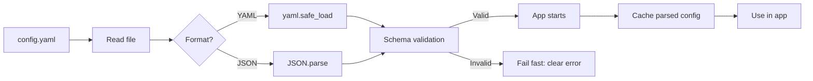

## Overview

Most apps need external configuration to behave differently across environments without
rebuilding. YAML and JSON are the dominant formats, but parsing alone isn't enough.
Invalid configs cause runtime failures. This recipe shows how to parse a file and
validate it before the app starts.

I once debugged a production outage caused by a missing colon in a YAML file — the parser
silently returned `null` for the entire database section, and the app connected to
`localhost` with empty credentials. That's when I learned that parsing without validation
is just deferred debugging.

## When to Use

- Loading database credentials, API keys, or feature flags from external files.
- Supporting several deployment environments with different settings.
- Validating user-supplied configuration to fail fast on startup.
- Migrating from hard-coded constants to file-based configuration.

## When NOT to Use

- For secrets that should never touch disk: use [environment variables](/recipes/environment-variables/)
  or a secret manager.
- When a single environment variable is enough; don't add a config file for one value.

## Solution

### Python with Pydantic

```python
import json
import yaml
from pydantic import BaseModel, Field, ValidationError
from pathlib import Path

class DatabaseConfig(BaseModel):
    host: str
    port: int = Field(default=5432, ge=1, le=65535)
    username: str
    password: str

class AppConfig(BaseModel):
    app_name: str
    debug: bool = False
    database: DatabaseConfig

def load_config(path: str) -> AppConfig:
    file_path = Path(path)
    raw = file_path.read_text(encoding="utf-8")

    if file_path.suffix in (".yaml", ".yml"):
        data = yaml.safe_load(raw)
    elif file_path.suffix == ".json":
        data = json.loads(raw)
    else:
        raise ValueError(f"Unsupported config format: {file_path.suffix}")

    return AppConfig.model_validate(data)

try:
    config = load_config("config.yaml")
    print(config.database.host)
except ValidationError as e:
    print("Config validation failed:", e)
```

### JavaScript with Zod

```javascript
import { readFileSync } from "fs";
import { parse as parseYaml } from "yaml";
import { z } from "zod";

const dbSchema = z.object({
  host: z.string(),
  port: z.number().int().min(1).max(65535).default(5432),
  username: z.string(),
  password: z.string().min(8),
});

const appSchema = z.object({
  appName: z.string(),
  debug: z.boolean().default(false),
  database: dbSchema,
});

function loadConfig(path) {
  const raw = readFileSync(path, "utf-8");
  const ext = path.split(".").pop();
  const data = ext === "json" ? JSON.parse(raw) : parseYaml(raw);
  return appSchema.parse(data);
}

try {
  const config = loadConfig("config.yaml");
  console.log(config.database.host);
} catch (err) {
  console.error("Config validation failed:", err.errors);
}
```

### Java with Jackson and Jakarta Validation

```java
import com.fasterxml.jackson.databind.ObjectMapper;
import com.fasterxml.jackson.dataformat.yaml.YAMLFactory;
import jakarta.validation.*;
import jakarta.validation.constraints.*;
import java.io.File;
import java.util.Set;

public class ConfigLoader {

  public record DatabaseConfig(
    @NotBlank String host,
    @Min(1) @Max(65535) int port,
    @NotBlank String username,
    @NotBlank String password
  ) {}

  public record AppConfig(
    @NotBlank String appName,
    boolean debug,
    @NotNull @Valid DatabaseConfig database
  ) {}

  public static AppConfig load(String path) {
    ObjectMapper mapper = path.endsWith(".yaml") || path.endsWith(".yml")
      ? new ObjectMapper(new YAMLFactory())
      : new ObjectMapper();

    AppConfig config = mapper.readValue(new File(path), AppConfig.class);

    Validator validator = Validation.buildDefaultValidatorFactory().getValidator();
    Set<ConstraintViolation<AppConfig>> violations = validator.validate(config);
    if (!violations.isEmpty()) {
      throw new IllegalArgumentException("Config validation failed: " + violations);
    }
    return config;
  }
}
```

### Go

```go
package main

import (
    "encoding/json"
    "fmt"
    "os"
    "gopkg.in/yaml.v3"
)

type DatabaseConfig struct {
    Host     string `json:"host" yaml:"host"`
    Port     int    `json:"port" yaml:"port"`
    Username string `json:"username" yaml:"username"`
    Password string `json:"password" yaml:"password"`
}

type AppConfig struct {
    AppName  string         `json:"appName" yaml:"appName"`
    Debug    bool           `json:"debug" yaml:"debug"`
    Database DatabaseConfig `json:"database" yaml:"database"`
}

func loadConfig(path string) (*AppConfig, error) {
    data, err := os.ReadFile(path)
    if err != nil {
        return nil, fmt.Errorf("read file: %w", err)
    }

    var config AppConfig
    if path[len(path)-5:] == ".json" {
        err = json.Unmarshal(data, &config)
    } else {
        err = yaml.Unmarshal(data, &config)
    }
    if err != nil {
        return nil, fmt.Errorf("parse: %w", err)
    }

    if config.Database.Host == "" || config.Database.Port == 0 {
        return nil, fmt.Errorf("database.host and database.port are required")
    }
    return &config, nil
}
```

### Environment variable substitution

```yaml
app_name: "my-service"
debug: ${DEBUG:false}
database:
  host: ${DB_HOST:localhost}
  port: ${DB_PORT:5432}
  username: ${DB_USER:postgres}
  password: ${DB_PASSWORD}
```

```python
import os
import re
import yaml

def substitute_env_vars(content: str) -> str:
    pattern = re.compile(r'\$\{(\w+)(?::([^}]*))?\}')
    def replacer(match):
        var_name = match.group(1)
        default = match.group(2)
        return os.getenv(var_name, default if default is not None else "")
    return pattern.sub(replacer, content)

def load_config_with_env(path: str) -> dict:
    with open(path) as f:
        content = f.read()
    return yaml.safe_load(substitute_env_vars(content))
```

## Explanation

Every example follows the same three steps: read the file, parse it as YAML or JSON, then
validate the structure and values against a schema.

**Pydantic** (Python), **Zod** (JavaScript), and **Jakarta Validation** (Java) give you
declarative, type-safe schemas with clear error messages. In Go, you can use struct tags
and manual checks.

The point is to fail fast: validate at startup so bad config shows up immediately,
instead of failing later in production.

### YAML vs JSON vs TOML: which format?

YAML is the most readable for humans and supports comments, but it's also the most
dangerous — indentation errors, implicit type coercion (Norway becomes `false` because YAML parses `NO` as a
boolean), and anchor/alias complexity can bite you. JSON is simpler
and strictly typed, but no comments make it painful for hand-edited configs. TOML is a
good middle ground: readable, supports comments, and has a strict spec, but tooling is
less mature than YAML.

I prefer YAML for configs that humans edit (application settings, docker-compose) and
JSON for configs that machines generate (build outputs, API responses). For new projects
where I control the stack, I reach for TOML — it avoids the YAML footguns while keeping
readability.

### Merging base configs with environment overrides

Most production apps need a base config plus per-environment overrides. The pattern is:
load `config.base.yaml`, then load `config.{env}.yaml`, deep-merge the two (environment
wins), then apply environment variable substitutions. This gives you sensible defaults
without duplicating the entire config per environment.

Don't try to merge manually — use a library like `python-dotenv` with `deepupdate`,
`lodash.merge` in JS, or Spring's `@PropertySource` in Java. Deep merge is tricky to
get right with nested objects and arrays, and a bug here means your staging config
silently leaks into production.

### Security considerations

Config files often contain secrets — database passwords, API keys, TLS certificates.
Never commit them to version control. Use environment variables for secrets, keep
config files for non-sensitive settings, and inject secrets at runtime via a secret
manager like [HashiCorp Vault](https://www.vaultproject.io/) or AWS Secrets Manager.

If you must store secrets in files, encrypt them at rest and decrypt at runtime. Tools
like `sops` (Secrets OPerationS) let you commit encrypted YAML to git safely.

### How config loading works



The diagram shows the fail-fast pattern: invalid configs stop the app at startup with a
clear error message, rather than causing cryptic failures in production.

## Variants

|Format|Library|Best for|
|------|-------|--------|
|TOML|`toml` (Python), `@iarna/toml` (JS), `toml4j` (Java)|Rust/Cargo-style configs, simpler than YAML|
|INI|`configparser` (Python), `ini` (JS), `ini4j` (Java)|Simple key-value configs, Windows style|
|HOCON|`pyhocon` (Python), Lightbend Config (Java)|Complex configs with includes and substitution|
|Environment variables|`python-dotenv`, `dotenv` (JS), Spring `@Value`|Secrets and per-env overrides without files|

## Best Practices

- Validate at startup; don't use raw config without a schema. Pair this with
  [input validation](/recipes/input-validation/) for defense in depth.
- Keep credentials in environment variables or secret managers, not in config files.
  I've seen teams commit database passwords to git — it's a security incident waiting
  to happen.
- Provide sensible defaults to reduce required config. A new developer should be able
  to clone the repo and run the app with zero config changes.
- Fail with a clear message that shows the bad path and expected type. "Config
  validation failed: database.port expected int, got string" is infinitely better than
  "Error: invalid config".
- Version your config schema and document breaking changes. When you rename a field,
  log a deprecation warning if the old field is present, then fail in the next release.
- Cache the parsed config after startup; don't re-parse on every request. Parsing YAML
  is expensive — I once profiled an app that parsed the config 200 times per second
  because someone called `loadConfig()` in a hot path.
- Prefer JSON for machine-generated configs; it parses faster than YAML and doesn't
  have the indentation footguns.
- Use `yaml.safe_load` in Python, never `yaml.load` — the unsafe version can execute
  arbitrary Python code via custom tags.

## Common Mistakes

- Committing secrets into YAML/JSON files in version control. Use `git-secrets` or
  `trufflehog` to scan for leaked credentials before they reach the remote.
- Ignoring parse errors and silently falling back to empty or null values. This is how
  apps end up connecting to `localhost` with empty credentials in production.
- Using complex nested YAML without validation, leading to cryptic runtime errors. If
  your config has more than 3 levels of nesting, consider splitting it into two or
  three files.
- Not reloading configs after deployment changes, requiring restarts for minor updates.
  If you need hot reload, watch the file and re-validate on change.
- Mixing configuration logic with application code instead of a dedicated layer. Keep
  config loading in one module so it's easy to find and test.
- Using `yaml.load()` instead of `yaml.safe_load()` in Python — the unsafe version can
  execute arbitrary code. This is a known security vulnerability.
- Assuming YAML type coercion is intuitive. `NO` becomes `false`, `3.10` becomes
  `3.1`, and `1:2:3` becomes a sexagesimal number. Quote strings explicitly to avoid
  surprises.

## FAQ

### Should I use YAML or JSON for configuration?

YAML is more readable for humans and supports comments. JSON is simpler to parse and
strictly typed. Use YAML for hand-edited files and JSON for machine-generated configs.

### How do I handle secrets in config files?

Don't store secrets in plain config files. Use environment variables, secret managers,
or encrypted files decrypted at runtime.

### Can I reload configuration without restarting?

Yes, but carefully. Watch the file for changes and re-parse into an immutable config
object. Ensure thread-safe replacement and validation on reload to avoid partial
updates.

### Can I merge a base config with environment overrides?

Yes. Load a base file, then load an environment-specific file and merge it with a deep
merge. The environment values take precedence.

### Do I need a schema if the format is valid YAML/JSON?

Yes. Valid syntax doesn't mean valid values. A missing field or wrong type can still
crash the app at runtime.

## See Also

- [Pydantic docs](https://docs.pydantic.dev/latest/) — Python data validation using
  type hints.
- [Zod docs](https://zod.dev/) — TypeScript-first schema validation with static type
  inference.
- [Jackson docs](https://github.com/FasterXML/jackson) — Java JSON/YAML parsing with
  data binding.
- [Go yaml.v3](https://github.com/go-yaml/yaml) — YAML support for Go with struct tags.
- [YAML 1.2 spec](https://yaml.org/spec/1.2.2/) — official YAML specification.
