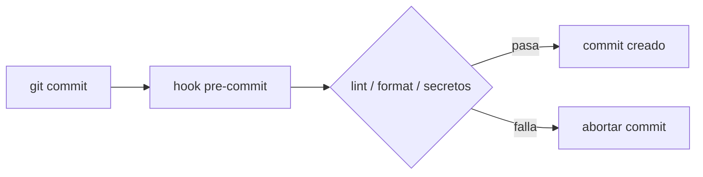

## Overview

Una vez vi a un compañero subir un archivo `.env` con una API key activa. La clave quedó en el repositorio tres horas hasta que un escaneo de CI la encontró. Un hook local de treinta segundos podría haber detenido el commit en su teclado. Ese es el valor real de los pre-commit hooks: feedback rápido y local sobre linting, formato, tests y seguridad antes de que algo llegue a [CI/CD](/recipes/cicd-pipeline-setup/).

Un pre-commit hook es un script ejecutable que corre entre `git commit` y el momento en que Git crea el objeto del commit. Si el script termina con un status distinto de cero, Git aborta el commit. Esta receta muestra cómo configurar hooks para Python, JavaScript y Java con los tres enfoques más comunes que uso en producción.

## Cuándo Usar

- Tu equipo sigue commiteando código que falla los checks de lint o formato en [GitHub Actions](/recipes/github-actions/) — un hook local acorta ese ciclo de minutos a segundos.
- Querés un estilo compartido sin depender únicamente de revisiones de pull request. Cuando el formateador corre antes del commit, los revisores pueden enfocarse en la lógica, no en comas faltantes.
- Necesitás detectar secretos o vulnerabilidades antes de que entren en la historia. Herramientas como `gitleaks` escanean el diff en stage localmente y detienen el commit si encuentran una clave.
- Querés una línea base consistente en todo el equipo. Un archivo de configuración rastreado en el repo es mucho más fácil de compartir que un README que dice "no te olvides de correr black".
- Tu proyecto ya tiene un formatter y linter. Un hook refuerza una regla que ya existe; no inventa una.

### Cuándo evitarlo

- El proyecto no tiene un formatter o linter compartido. El hook sin una regla solo agrega fricción y enseña a la gente a usar `--no-verify`.
- Tus checks tardan más de unos segundos. Los hooks lentos son lo primero que todos saltean.
- Estás reemplazando las puertas de CI con hooks locales. Los hooks son una conveniencia, no la puerta final.
- Trabajás en un repositorio con muchos archivos binarios grandes. Correr checks sobre todo el working tree en cada commit puede ser desperdiciado.

## Solución

Las configuraciones de abajo están listas para copiar y pegar, pero el repo
companion tiene el proyecto completo con todos los archivos de configuración en
un solo lugar: `https://github.com/MathiasPaulenko/stack-practices-resources`
bajo `resources/recipes/devops/pre-commit-hooks`.

### Python — el framework pre-commit

El paquete `pre-commit` de Python instala y ejecuta hooks desde un solo archivo YAML. Es cross-language, así que la misma configuración puede correr checks de Python, shell y JavaScript.

```yaml
# .pre-commit-config.yaml
repos:
  - repo: https://github.com/pre-commit/pre-commit-hooks
    rev: v5.0.0
    hooks:
      - id: trailing-whitespace
      - id: end-of-file-fixer
      - id: check-yaml
      - id: check-added-large-files
        args: ["--maxkb=500"]

  - repo: https://github.com/psf/black
    rev: 25.1.0
    hooks:
      - id: black
        language_version: python3.12

  - repo: https://github.com/PyCQA/flake8
    rev: 7.1.2
    hooks:
      - id: flake8
        args: ["--max-line-length=100"]

  - repo: https://github.com/pre-commit/mirrors-mypy
    rev: v1.15.0
    hooks:
      - id: mypy
        additional_dependencies: [types-requests]
```

Instalá el hook y corrélo manualmente antes del primer commit:

```bash
pip install pre-commit
pre-commit install
pre-commit run --all-files
```

### JavaScript — husky + lint-staged

Husky instala el hook de Git, y `lint-staged` limita el chequeo a los archivos en stage. Así el commit sigue rápido porque solo se lintean y formatean los archivos cambiados.

```json
// package.json
{
  "devDependencies": {
    "eslint": "^9.0.0",
    "prettier": "^3.3.0",
    "husky": "^9.1.0",
    "lint-staged": "^15.2.0"
  },
  "lint-staged": {
    "*.{js,jsx,ts,tsx}": ["eslint --fix", "prettier --write"],
    "*.{json,md,yaml}": ["prettier --write"]
  },
  "scripts": {
    "prepare": "husky",
    "lint": "eslint .",
    "format": "prettier --write ."
  }
}
```

Creá el hook con la sintaxis de husky v9:

```bash
npx husky init
```

Luego reemplazá el contenido de `.husky/pre-commit` con:

```bash
npx lint-staged
```

### Node — simple-git-hooks + lint-staged

Si querés una alternativa más liviana a husky, `simple-git-hooks` escribe el hook de Git desde `package.json` con cero overhead en runtime.

```json
// package.json
{
  "devDependencies": {
    "simple-git-hooks": "^2.11.0",
    "lint-staged": "^15.2.0"
  },
  "simple-git-hooks": {
    "pre-commit": "npx lint-staged"
  },
  "lint-staged": {
    "*.{js,ts}": ["eslint --fix", "prettier --write"]
  }
}
```

Activálo una vez:

```bash
npx simple-git-hooks
```

### Java — Gradle Spotless + hook nativo

Para proyectos Java mantengo las reglas de formateo dentro del build y uso un hook de Git nativo para ejecutarlas.

```groovy
// build.gradle
plugins {
    id 'com.diffplug.spotless' version '6.25.0'
}

spotless {
    java {
        googleJavaFormat()
        removeUnusedImports()
    }
}
```

```bash
# .husky/pre-commit o git-hooks/pre-commit (chmod +x)
#!/bin/sh
./gradlew spotlessCheck
if [ $? -ne 0 ]; then
    echo "Spotless check failed. Run './gradlew spotlessApply' to fix."
    exit 1
fi
```

Para Maven, el plugin `git-build-hook-maven-plugin` puede instalar hooks rastreados desde un directorio `git-hooks/` durante el build, así el equipo obtiene el hook automáticamente después de `mvn install`.

### Cross-language — lefthook

`lefthook` es un gestor de hooks escrito en Go que funciona sin runtimes de lenguaje. Lo uso en equipos políglotas donde el mismo repo tiene Python, Go y JavaScript.

```yaml
# lefthook.yml
pre-commit:
  commands:
    lint-js:
      glob: "*.{js,ts}"
      run: npx eslint {staged_files}
    lint-py:
      glob: "*.py"
      run: pre-commit run --files {staged_files}
    check-secrets:
      run: gitleaks protect --staged
```

```bash
lefthook install
```

## Explicación

Un hook en `.git/hooks/pre-commit` es un script ejecutable. Git lo ejecuta después de que escribís `git commit` y antes de escribir el objeto del commit. Si el script termina con un status distinto de cero, Git aborta el commit.



- El framework **pre-commit** (Python) instala y ejecuta hooks desde un solo archivo YAML. Funciona cross-language, cachea las herramientas que necesita y corre checks en paralelo cuando puede.
- **husky** instala el hook de Git y **lint-staged** limita el chequeo a los archivos en stage, así el commit sigue rápido. El script `prepare` en `package.json` asegura que el hook se instale en cada `npm install`.
- Los **hooks nativos** permiten que cualquier proyecto ejecute un script shell personalizado. Esto es útil para Java, Go o proyectos C++ que ya tienen una herramienta de build.
- **lefthook** y **simple-git-hooks** son alternativas cuando querés menos overhead o soporte cross-language sin un runtime de Python.

El compromiso es real: los hooks agregan segundos a cada commit, los desarrolladores pueden saltearlos con `--no-verify`, y hay que instalarlos en cada clon nuevo. Por eso los mismos checks deberían correr en [CI/CD](/recipes/cicd-pipeline-setup/).

## Variantes

| Stack | Herramienta | Notas |
| --- | --- | --- |
| Python | Framework `pre-commit` | Maduro; más de 200 hooks comunitarios |
| JavaScript / TypeScript | `husky` + `lint-staged` | Solo verifica archivos en stage; sintaxis v9 más simple |
| Node | `simple-git-hooks` + `lint-staged` | Cero overhead; configuración en `package.json` |
| Java | Gradle `spotless` o plugin Maven | El formateo es parte del build |
| Go | `pre-commit` + `golangci-lint` | Reusá el framework Python con hooks de Go |
| Polyglot | `lefthook` | Una sola config para varios lenguajes |
| Secretos | `gitleaks` o `trufflehog` | Agregalo a la misma config para bloquear API keys |
| Mensajes de commit | `commitlint` | Corré en el hook `commit-msg` para forzar convenciones |

## Mejores Prácticas

- Mantené los hooks rápidos verificando solo archivos en stage. Usá `lint-staged`, el filtro `files` en `.pre-commit-config.yaml` o patrones glob de `lefthook`.
- Preferí herramientas que auto-arreglen y re-stagen archivos, así el commit guarda la versión corregida. `prettier --write` y `black` son buenas; `eslint --fix` puede ser demasiado agresivo, así que probalo primero.
- Agregá un script `prepare` o `postinstall` para que los hooks se instalen con `npm install` o `pip install`.
- Corré los mismos checks en CI. Los hooks locales atrapan errores temprano; CI es la puerta final.
- Documentá el escape de `--no-verify`, pero pedí revisión cuando alguien lo use.
- Fijá versiones de herramientas y cacheá instalaciones. Hooks reproducibles significan menos "a mí me funciona".
- Mantené `.pre-commit-config.yaml` o `package.json` bajo control de versiones. Los hooks mismos viven en `.git/hooks/`, que no es rastreado.
- Rotá credenciales inmediatamente si un secreto se cuela a través de un `--no-verify`. El hook es la primera línea de defensa, no la última.

## Errores Comunes

- **Verificar todo el repo en cada commit.** Convierte un commit rápido en una espera larga. Solución: usá `lint-staged` o agregá un filtro `files` a cada hook en `.pre-commit-config.yaml`.
- **No auto-instalar los hooks.** Clones nuevos los saltearán silenciosamente. Solución: usá un script `prepare` que ejecute `husky` o `pre-commit install`.
- **Dejar que formateadores peleen.** Alineá ESLint y Prettier con `eslint-config-prettier` para que una herramienta no deshaga la otra.
- **Correr tests lentos o de integración en un pre-commit hook.** Mantené tests unitarios que terminen en menos de 10 segundos; cualquier cosa más lenta pertenece a CI.
- **Tratar los hooks como reemplazo de CI.** Son la primera línea de defensa, no la última. CI todavía necesita los mismos checks sobre el código completo.
- **Olvidar que `--no-verify` es un bypass deliberado.** Si alguien lo usa, hacelo visible en la pull request para que se revise.

## Solución de Problemas

### El hook corre pero no bloquea el commit

Un pre-commit hook detiene el commit solo si su código de salida es distinto de cero. Si una herramienta está configurada para arreglar y salir con 0, parecerá que el commit pasó aunque haya modificado archivos. Corré `pre-commit run --all-files` para ver qué cambió, y luego `git add` los arreglos antes de commitear de nuevo.

### El hook es lento incluso con lint-staged

Fijate en cuántas herramientas están encadenadas. Cada `eslint --fix` seguido de `prettier --write` inicia un proceso nuevo. Combinálas donde sea posible, o corré el formateador más liviano primero.

### Los finales de línea de Windows rompen el hook shell

Si `.husky/pre-commit` o `git-hooks/pre-commit` tiene finales CRLF, Git en runners de Linux puede fallar con un error de bad interpreter. Agregá `* text=auto eol=lf` a un archivo `.gitattributes` rastreado.

### pre-commit no se encuentra después de `pip install`

Asegurate de que el entorno virtual esté activo, o instalalo con `pipx install pre-commit` para que el binario esté en el `PATH` del sistema.

## FAQ

### ¿Puedo saltear los pre-commit hooks una vez?

Sí: `git commit --no-verify` (o `-n`). Usalo solo para emergencias y hacé un commit de limpieza después. Explicá por qué saltaste el hook en la pull request.

### ¿Debería ejecutar tests en pre-commit hooks?

Tests unitarios que terminen en menos de 10 segundos están bien. Cualquier cosa más lenta pertenece a [CI/CD](/recipes/cicd-pipeline-setup/) para no entrenar al equipo a saltear hooks.

### ¿Cómo comparto hooks con el equipo?

Guardá la configuración de hooks en el repo. El framework `pre-commit`, `husky` y los plugins de Maven/Gradle leen desde archivos rastreados. Nunca hagas commit directamente en `.git/hooks/`, que no es rastreado.

### ¿Cómo agrego escaneo de secretos?

Agregá un hook de `gitleaks` o `trufflehog` a la misma `.pre-commit-config.yaml` o a `lint-staged`:

```yaml
repos:
  - repo: https://github.com/gitleaks/gitleaks
    rev: v8.21.2
    hooks:
      - id: gitleaks
```

### ¿Cómo bloqueo mensajes de commit mal escritos?

Usá un hook `commit-msg` con `commitlint`:

```javascript
// commitlint.config.js
module.exports = {
  extends: ['@commitlint/config-conventional'],
  rules: {
    'type-enum': [2, 'always', ['feat', 'fix', 'docs', 'style', 'refactor', 'test', 'chore', 'ci', 'perf']],
    'subject-max-length': [2, 'always', 72],
  },
};
```

### ¿Por qué mi hook reformateó un archivo pero el commit igual falló?

El hook cambió la copia de trabajo pero no re-stagenó el archivo. Configurá la herramienta para re-stagenar automáticamente o volvé a ejecutar `git add`. Algunas herramientas, como `lint-staged`, pueden hacer esto; de lo contrario, agregá los archivos arreglados manualmente.

## See Also

- [Git hooks documentation](https://git-scm.com/book/en/v2/Customizing-Git-Git-Hooks)
- [pre-commit framework](https://pre-commit.com/)
- [husky documentation](https://typicode.github.io/husky/)
- [lint-staged repository](https://github.com/lint-staged/lint-staged)
- [gitleaks repository](https://github.com/gitleaks/gitleaks)
- [commitlint documentation](https://commitlint.js.org/)
- Internos: [Unit Testing](/recipes/unit-testing/) y [Container Security Scanning](/recipes/container-security-scanning/)
