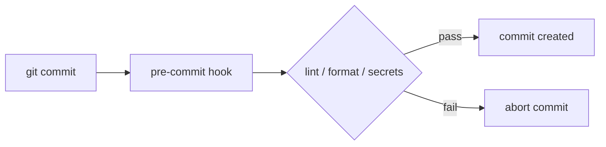

## Overview

I once watched a teammate push a `.env` file with a live API key. The secret sat in the repository for three hours before a CI scan caught it. A thirty-second local hook could have stopped the commit at the keyboard. That's the real value of pre-commit hooks: fast, local feedback on linting, formatting, tests and security before anything reaches [CI/CD](/recipes/cicd-pipeline-setup/).

A pre-commit hook is an executable script that runs between `git commit` and the moment Git creates the commit object. If the script exits with a non-zero status, Git aborts the commit. In this recipe I'll walk through the three setups I actually use in production: the Python `pre-commit` framework, `husky` plus `lint-staged` for Node, and a native Git hook for Java.

## When to Use

- Your team keeps committing code that fails lint or format checks in [GitHub Actions](/recipes/github-actions/) — a local hook shortens that feedback loop from minutes to seconds.
- You want a shared style without waiting for every pull request review. When the formatter runs before the commit, reviewers can focus on logic, not trailing commas.
- You need to catch secrets or vulnerabilities before they enter history. Tools like `gitleaks` scan the staged diff locally and stop the commit if they find a key.
- You need the whole team to start from the same formatting and linting baseline. A tracked configuration file in the repo is much easier to share than a README that says "don't forget to run black."
- Your project already has a formatter and linter. A hook enforces a rule that already exists; it doesn't invent one.

### When to avoid

- The project hasn't agreed on a shared formatter or linter. A hook without a rule just adds friction and teaches people to run `--no-verify`.
- Your checks take more than a few seconds. Slow hooks become the first thing everyone skips.
- You're replacing CI gates with local hooks. Hooks are a convenience, not the final gate.
- The repository has many large binary files that don't benefit from linting. Running checks on the whole working tree every time is wasteful.

## Solution

The configurations below are copy-paste ready, but the companion repo has the
full runnable project with every config file in one place:
`https://github.com/MathiasPaulenko/stack-practices-resources` under
`resources/recipes/devops/pre-commit-hooks`.

### Python — the pre-commit framework

The Python `pre-commit` package installs and runs hooks from a single YAML file. It's cross-language, so the same config can run Python, shell and JavaScript checks.

```yaml
# .pre-commit-config.yaml
repos:
  - repo: https://github.com/pre-commit/pre-commit-hooks
    rev: v5.0.0
    hooks:
      - id: trailing-whitespace
      - id: end-of-file-fixer
      - id: check-yaml
      - id: check-added-large-files
        args: ["--maxkb=500"]

  - repo: https://github.com/psf/black
    rev: 25.1.0
    hooks:
      - id: black
        language_version: python3.12

  - repo: https://github.com/PyCQA/flake8
    rev: 7.1.2
    hooks:
      - id: flake8
        args: ["--max-line-length=100"]

  - repo: https://github.com/pre-commit/mirrors-mypy
    rev: v1.15.0
    hooks:
      - id: mypy
        additional_dependencies: [types-requests]
```

Install the hook and run it manually before the first commit:

```bash
pip install pre-commit
pre-commit install
pre-commit run --all-files
```

### JavaScript — husky + lint-staged

Husky installs the Git hook, and `lint-staged` narrows the check to files in the staging area. That keeps the commit fast because only changed files are linted and formatted.

```json
// package.json
{
  "devDependencies": {
    "eslint": "^9.0.0",
    "prettier": "^3.3.0",
    "husky": "^9.1.0",
    "lint-staged": "^15.2.0"
  },
  "lint-staged": {
    "*.{js,jsx,ts,tsx}": ["eslint --fix", "prettier --write"],
    "*.{json,md,yaml}": ["prettier --write"]
  },
  "scripts": {
    "prepare": "husky",
    "lint": "eslint .",
    "format": "prettier --write ."
  }
}
```

Create the hook with husky v9 syntax:

```bash
npx husky init
```

Then replace the contents of `.husky/pre-commit` with:

```bash
npx lint-staged
```

### Node — simple-git-hooks + lint-staged

If you want a lighter alternative to husky, `simple-git-hooks` writes the Git hook from `package.json` with zero runtime overhead.

```json
// package.json
{
  "devDependencies": {
    "simple-git-hooks": "^2.11.0",
    "lint-staged": "^15.2.0"
  },
  "simple-git-hooks": {
    "pre-commit": "npx lint-staged"
  },
  "lint-staged": {
    "*.{js,ts}": ["eslint --fix", "prettier --write"]
  }
}
```

Activate it once:

```bash
npx simple-git-hooks
```

### Java — Gradle Spotless + native hook

For Java projects I keep the formatting rules inside the build and use a native Git hook to trigger them.

```groovy
// build.gradle
plugins {
    id 'com.diffplug.spotless' version '6.25.0'
}

spotless {
    java {
        googleJavaFormat()
        removeUnusedImports()
    }
}
```

```bash
# .husky/pre-commit or git-hooks/pre-commit (chmod +x)
#!/bin/sh
./gradlew spotlessCheck
if [ $? -ne 0 ]; then
    echo "Spotless check failed. Run './gradlew spotlessApply' to fix."
    exit 1
fi
```

For Maven, the `git-build-hook-maven-plugin` can install tracked hooks from a `git-hooks/` directory during the build, so the team gets the hook automatically after `mvn install`.

### Cross-language — lefthook

`lefthook` is a Go-based hook manager that works without language runtimes. I use it in polyglot teams where the same repository has Python, Go and JavaScript.

```yaml
# lefthook.yml
pre-commit:
  commands:
    lint-js:
      glob: "*.{js,ts}"
      run: npx eslint {staged_files}
    lint-py:
      glob: "*.py"
      run: pre-commit run --files {staged_files}
    check-secrets:
      run: gitleaks protect --staged
```

```bash
lefthook install
```

## Explanation

A hook in `.git/hooks/pre-commit` is an executable script. Git runs it after you run `git commit` and before it writes the commit object. If the script exits with a non-zero status, Git aborts the commit.



- The **pre-commit** framework (Python) installs and runs hooks from a single YAML file. It handles many languages, caches the tools it needs and runs checks in parallel when it can.
- **husky** installs the Git hook and **lint-staged** narrows the check to staged files, so the commit stays fast. The `prepare` script in `package.json` makes sure the hook is installed on every `npm install`.
- A **native hook** lets any project run a custom shell script before the commit is written, which is a good fit for Java, Go or C++ projects that already rely on a build tool.
- I use **lefthook** and **simple-git-hooks** when I want less overhead or cross-language support without a Python runtime.

There's a real trade-off: hooks add seconds to every commit, developers can bypass them with `--no-verify`, and they must be installed in every fresh clone. That's the reason the same checks should still run in [CI/CD](/recipes/cicd-pipeline-setup/).

## Variants

| Stack | Tooling | Notes |
| --- | --- | --- |
| Python | `pre-commit` framework | Mature; 200+ community hooks available |
| JavaScript / TypeScript | `husky` + `lint-staged` | Only staged files are checked; v9 syntax is simpler |
| Node | `simple-git-hooks` + `lint-staged` | Zero runtime; configuration in `package.json` |
| Java | Gradle `spotless` or Maven plugin | Formatting is part of the build |
| Go | `pre-commit` + `golangci-lint` | Reuse the Python framework with Go hooks |
| Polyglot | `lefthook` | One config for several languages |
| Secrets | `gitleaks` or `trufflehog` | Add to the same config to block API keys |
| Commit messages | `commitlint` | Run on the `commit-msg` hook to enforce conventions |

## Best Practices

- Keep hooks fast by checking only staged files. Use `lint-staged`, the `files` filter in `.pre-commit-config.yaml` or `lefthook` glob patterns.
- Prefer tools that auto-fix and re-stage files, so the commit keeps the corrected version. `prettier --write` and `black` are good; `eslint --fix` can be too aggressive, so test it first.
- Add a `prepare` or `postinstall` script so hooks install on `npm install` or `pip install`.
- Run the same checks in CI that you run locally. Hooks catch mistakes early, but CI is still the final gate.
- I document `--no-verify` for emergencies, but I ask for a review when someone uses it.
- Pin tool versions and cache installations. Reproducible hooks mean fewer "works on my machine" problems.
- Keep a `.pre-commit-config.yaml` or `package.json` under version control. The hooks themselves live in `.git/hooks/`, which isn't tracked.
- Rotate credentials immediately if a secret slips through a `--no-verify` skip. The hook is the first line of defense, not the last.

## Common Mistakes

- **Checking the whole repo on every commit.** It turns a quick commit into a long wait. Fix it by using `lint-staged` or by adding a `files` filter to each hook in `.pre-commit-config.yaml`.
- **Not auto-installing hooks.** New clones will skip them without warning. Fix it with a `prepare` script that runs `husky` or `pre-commit install`.
- **Letting formatters fight each other.** Align ESLint and Prettier with `eslint-config-prettier` so one tool doesn't undo the other.
- **Running slow tests or heavy integration checks in a pre-commit hook.** Keep unit tests that finish under ten seconds; anything slower belongs in CI.
- **Treating hooks as a replacement for CI.** They're the first line of defense rather than the last. CI still needs the same checks on the full codebase.
- **Forgetting that `--no-verify` is a deliberate bypass.** If someone uses it, make it visible in the pull request so it gets reviewed.

## Troubleshooting

### The hook runs but doesn't block the commit

A pre-commit hook only stops the commit when its exit code is non-zero. When a tool is set to fix and exit 0, it looks like the commit passed even if it changed files. Run `pre-commit run --all-files` to see what the hook modified, then `git add` those files and commit again.

### The hook is slow even with lint-staged

Count how many tools are chained together. Each `eslint --fix` followed by `prettier --write` starts a new process. Combine them where possible, or run the lighter formatter first.

### Windows line endings break the shell hook

If `.husky/pre-commit` or `git-hooks/pre-commit` has CRLF line endings, Git on Linux runners may fail with a bad interpreter error. Add `* text=auto eol=lf` to a tracked `.gitattributes` file.

### pre-commit isn't found after `pip install`

Make sure the virtual environment is active, or install with `pipx install pre-commit` so the binary is on the system `PATH`.

## FAQ

### Can I skip pre-commit hooks once?

Yes: use `git commit --no-verify` (or `-n`) when you really need to. Follow up with a cleanup commit and explain why you bypassed the hook in the pull request.

### Should I run tests in pre-commit hooks?

Unit tests under 10 seconds are fine. Anything slower belongs in [CI/CD](/recipes/cicd-pipeline-setup/) so you don't train the team to skip hooks.

### How do I share hooks across the team?

Store hook configuration in the repo. The `pre-commit` framework, `husky` and Maven/Gradle plugins all read from tracked files. Never commit directly into `.git/hooks/`, which isn't tracked.

### How do I add secret scanning?

Add a `gitleaks` or `trufflehog` hook to the same `.pre-commit-config.yaml` or `lint-staged` pipeline:

```yaml
repos:
  - repo: https://github.com/gitleaks/gitleaks
    rev: v8.21.2
    hooks:
      - id: gitleaks
```

### How do I block bad commit messages?

Use a `commit-msg` hook with `commitlint`:

```javascript
// commitlint.config.js
module.exports = {
  extends: ['@commitlint/config-conventional'],
  rules: {
    'type-enum': [2, 'always', ['feat', 'fix', 'docs', 'style', 'refactor', 'test', 'chore', 'ci', 'perf']],
    'subject-max-length': [2, 'always', 72],
  },
};
```

### Why did my hook reformat a file but the commit still failed?

The hook changed the working copy but didn't re-add the file to the index. Either make the tool re-stage automatically or run `git add` again. Some tools, like `lint-staged`, can do this with the `--allow-empty` or `--follow-symbolic-links` options; otherwise, add the fixed files manually.

## See Also

- [Git hooks documentation](https://git-scm.com/book/en/v2/Customizing-Git-Git-Hooks)
- [pre-commit framework](https://pre-commit.com/)
- [husky documentation](https://typicode.github.io/husky/)
- [lint-staged repository](https://github.com/lint-staged/lint-staged)
- [gitleaks repository](https://github.com/gitleaks/gitleaks)
- [commitlint documentation](https://commitlint.js.org/)
- Internal: [Unit Testing](/recipes/unit-testing/) and [Container Security Scanning](/recipes/container-security-scanning/)
