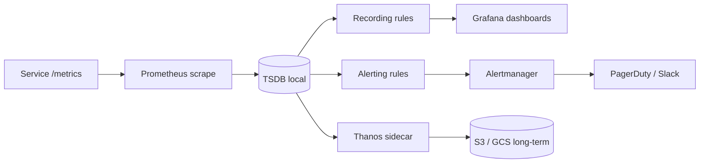

## Resumen

Prometheus recolecta métricas en series temporales haciendo scraping a endpoints HTTP
que exponen datos en su formato de texto. Instrumentás tus servicios con counters,
gauges, histograms y summaries, luego usás PromQL para consultar los datos y reglas de
alertas para notificar cuando algo se rompe.

Me una vez a un equipo cuyo PagerDuty disparaba cada 30 minutos porque nadie había
seteado una duración `for` en sus alertas. Cada pico transitorio despertaba al ingeniero
de guardia. Pasamos un fin de semana reescribiendo las reglas para que disparen solo con
condiciones sostenidas en lugar de picos momentáneos, y el ruido bajó 90%. Esa
experiencia me enseñó que la instrumentación es solo la mitad del trabajo — la otra mitad
es escribir alertas que signifiquen algo de verdad.

Esta receta cubre instrumentación, configuración de scraping, recording rules, reglas
de alertas y enrutamiento de Alertmanager. Usa [prom-client](https://github.com/siimon/prom-client)
para Node.js y [prometheus_client](https://github.com/prometheus/client_python) para
Python, ambas librerías oficiales-adyacentes que exponen el endpoint `/metrics` que
Prometheus espera.

## Cuándo Usar

- Necesitás datos numéricos con timestamp sobre el comportamiento de la aplicación e
  infraestructura.
- Querés alertas basadas en síntomas (tasa de errores, latencia) en lugar de causas
  crudas.
- Necesitás queries precomputadas para dashboards o alertas rápidas.
- Querés enrutar alertas por severidad o equipo.

## Cuándo NO Usar

- Para debugging profundo de eventos individuales: usá logs o traces en su lugar.
- Para almacenamiento a largo plazo sin planificar: Prometheus guarda datos localmente
  por default.
- Cuando necesitás un modelo push de métricas: usá Pushgateway solo para jobs de corta
  duración.

## Solución

### Instrumentar métricas de aplicación

```typescript
// metrics/server.ts
import prometheus from 'prom-client';

const register = new prometheus.Registry();
prometheus.collectDefaultMetrics({ register });

const httpRequestsTotal = new prometheus.Counter({
  name: 'http_requests_total',
  help: 'Total number of HTTP requests',
  labelNames: ['method', 'route', 'status_code'],
  registers: [register],
});

const activeConnections = new prometheus.Gauge({
  name: 'active_connections',
  help: 'Number of active connections',
  registers: [register],
});

const httpRequestDuration = new prometheus.Histogram({
  name: 'http_request_duration_seconds',
  help: 'Duration of HTTP requests in seconds',
  labelNames: ['method', 'route'],
  buckets: [0.01, 0.05, 0.1, 0.5, 1, 2, 5],
  registers: [register],
});

function metricsMiddleware(req, res, next) {
  const start = Date.now();
  res.on('finish', () => {
    const duration = (Date.now() - start) / 1000;
    httpRequestsTotal.inc({
      method: req.method,
      route: req.route?.path || 'unknown',
      status_code: res.statusCode,
    });
    httpRequestDuration.observe(
      { method: req.method, route: req.route?.path || 'unknown' },
      duration
    );
  });
  next();
}

app.get('/metrics', async (req, res) => {
  res.set('Content-Type', register.contentType);
  res.end(await register.metrics());
});
```

### Configuración de scraping

```yaml
# prometheus.yml
global:
  scrape_interval: 15s
  evaluation_interval: 15s

scrape_configs:
  - job_name: 'prometheus'
    static_configs:
      - targets: ['localhost:9090']

  - job_name: 'api'
    static_configs:
      - targets: ['api:3000']
    metrics_path: '/metrics'
    scrape_interval: 5s
```

### Reglas de alertas

```yaml
# rules/alerts.yml
groups:
  - name: api_alerts
    rules:
      - alert: HighErrorRate
        expr: |
          (
            sum(rate(http_requests_total{status_code=~"5.."}[5m]))
            /
            sum(rate(http_requests_total[5m]))
          ) > 0.05
        for: 2m
        labels:
          severity: critical
        annotations:
          summary: "High error rate on {{ $labels.route }}"
          description: "Error rate is {{ $value | humanizePercentage }}"

      - alert: SlowRequests
        expr: |
          histogram_quantile(0.95,
            sum(rate(http_request_duration_seconds_bucket[5m])) by (le, route)
          ) > 0.5
        for: 5m
        labels:
          severity: warning
        annotations:
          summary: "Slow requests on {{ $labels.route }}"
```

### Recording rules

```yaml
# rules/records.yml
groups:
  - name: api_records
    rules:
      - record: job:http_requests_total:rate5m
        expr: sum(rate(http_requests_total[5m])) by (job)

      - record: job:http_request_duration:p95
        expr: |
          histogram_quantile(0.95,
            sum(rate(http_request_duration_seconds_bucket[5m])) by (job, le)
          )
```

### Enrutamiento de Alertmanager

```yaml
# alertmanager.yml
global:
  smtp_smarthost: 'smtp.example.com:587'
  smtp_from: 'alerts@example.com'

route:
  group_by: ['alertname', 'severity']
  group_wait: 10s
  group_interval: 5m
  repeat_interval: 4h
  receiver: 'default'

receivers:
  - name: 'default'
    email_configs:
      - to: 'oncall@example.com'
    slack_configs:
      - api_url: 'https://hooks.slack.com/services/...'
        channel: '#alerts'

  - name: 'pagerduty'
    pagerduty_configs:
      - routing_key: 'your-routing-key'

  - name: 'slack-warnings'
    slack_configs:
      - api_url: 'https://hooks.slack.com/services/...'
        channel: '#warnings'

  - name: 'db-team'
    email_configs:
      - to: 'db-team@example.com'
```

### Exporter personalizado en Python

```python
from prometheus_client import Counter, Histogram, Gauge, start_http_server
import time
import random

REQUESTS = Counter('app_requests_total', 'Total requests', ['endpoint', 'method'])
LATENCY = Histogram('app_request_duration_seconds', 'Request latency', ['endpoint'])
ACTIVE_CONNECTIONS = Gauge('app_active_connections', 'Active connections')

def handle_request(endpoint, method):
    start = time.time()
    REQUESTS.labels(endpoint=endpoint, method=method).inc()
    time.sleep(random.uniform(0.01, 0.5))
    LATENCY.labels(endpoint=endpoint).observe(time.time() - start)

if __name__ == '__main__':
    start_http_server(9090)
    while True:
        handle_request('/api/users', 'GET')
        ACTIVE_CONNECTIONS.set(random.randint(1, 100))
        time.sleep(0.1)
```

## Explicación

- **Counter**: solo aumenta. Usalo para requests, errores o tareas completadas.
- **Gauge**: sube y baja. Usalo para memoria, conexiones o profundidad de cola.
- **Histogram**: agrupa observaciones en buckets. Usalo para latencia o tamaño de
  respuesta.
- **Summary**: similar a un histogram, pero calcula quantiles del lado del cliente.
- **Recording rules**: precomputan queries caras de PromQL para que los
  [dashboards de Grafana](/recipes/grafana-dashboards-observability/) carguen más rápido.
- **Alerting rules**: evalúan expresiones de PromQL y envían alertas a Alertmanager.
- **Alertmanager**: agrupa, silencia y enruta alertas al receptor correcto. Combinálo
  con [logging estructurado](/recipes/structured-logging/) para que el on-call pueda
  saltar de una alerta a los logs subyacentes.

### Elegir el tipo de métrica correcto

Los cuatro tipos de métricas existen por diferentes razones, y elegir el incorrecto rompe
las queries. Los counters solo aumentan — son perfectos para conteos de requests y
errores porque podés computar un rate con `rate()` o `increase()`. Los gauges suben y
bajan, así que usalos para cosas que tienen un estado actual: uso de memoria, profundidad
de cola, conexiones activas. Nunca uses un gauge para algo acumulativo.

Los histograms y summaries miden distribuciones, pero difieren en dónde ocurre la
agregación. Un histogram agrupa observaciones en el cliente y te deja computar quantiles
del lado del servidor con `histogram_quantile()`. Eso significa que podés agregar entre
instancias — p95 entre 10 pods es una sola expresión de PromQL. Un summary calcula
quantiles en el cliente, así que no podés promediarlos entre instancias. En la práctica,
los histograms son la opción default por esta ventaja de agregación. La
[documentación de Prometheus sobre tipos de métricas](https://prometheus.io/docs/concepts/metric_types/)
profundiza en los trade-offs.

### Cardinalidad de labels y costo de almacenamiento

Cada combinación única de labels crea una nueva serie temporal. Prometheus guarda cada
serie en disco, y las queries escanean series que matchean el selector. Un label con 10
valores multiplica tu conteo de series por 10; un label con valores ilimitados como
`user_id` o `session_id` explota el almacenamiento y hace las queries lentas. Vi a un
equipo agregar `user_id` como label "para debugear" y ver a Prometheus morir por OOM en
menos de una hora porque generaron 50,000 series nuevas en un solo scrape. Mantené los
labels a un set pequeño de valores estables: `method`, `route`, `status_code`, `job`. Si
necesitás data por usuario, usá logs o traces, no métricas.

### Retención de datos y almacenamiento a largo plazo

Prometheus guarda datos localmente por 15 días por default (configurable con
`--storage.tsdb.retention.time`). Es suficiente para alertas y dashboards de corto plazo,
pero no para capacity planning o tendencias year-over-year. Para almacenamiento a largo
plazo, [Thanos](https://thanos.io/) y [Cortex](https://cortexmetrics.io/) son las dos
opciones principales. Thanos sidecar sube bloques a S3/GCS y provee una vista global de
query. Cortex es un backend escalable horizontalmente compatible con Prometheus. Ambos te
permiten guardar años de data sin sobrecargar tu instancia local de Prometheus.

### El pipeline de monitoreo de un vistazo



El diagrama muestra el pipeline completo: Prometheus hace scraping de tu servicio, guarda
data en el TSDB local, evalúa recording y alerting rules, y enruta las alertas activas a
través de Alertmanager. Thanos opcionalmente sube bloques a object storage para retención
a largo plazo.

## Variantes

|Tipo de exporter|Cuándo usarlo|
|----------------|-------------|
|Librería in-app|Control total de labels y métricas de negocio|
|Node exporter|Métricas de hardware y SO para Linux/Unix|
|Blackbox exporter|Sondear endpoints desde afuera|
|Pushgateway|Jobs por lotes de corta duración que Prometheus no puede scrapear directamente|

## Buenas Prácticas

- Alertá por síntomas (alta tasa de errores, latencia) en lugar de causas (uso de CPU).
  Una alerta de CPU alta no te dice si los usuarios están sufriendo el impacto; una alerta de tasa
  de errores alta sí.
- Mantené la cardinalidad de labels baja; valores ilimitados como user IDs explotan el
  almacenamiento. Si no estás seguro, revisá `prometheus_tsdb_head_series` — si crece
  rápido, tenés un problema de cardinalidad.
- Seteá una duración `for` apropiada para evitar alertas intermitentes. Uso 2-5 minutos
  para la mayoría de las alertas; menos de 1 minuto casi siempre es ruido.
- Usá recording rules para queries que corren frecuentemente en dashboards. Un `rate()`
  sobre 5 minutos computado cada 15 segundos es barato una vez; correrlo 50 veces por
  carga de dashboard no lo es.
- Enrutá alertas críticas a paging (PagerDuty, Opsgenie) y las de warning a chat (Slack,
  Mattermost). No pagees por warnings — tu ingeniero on-call va a empezar a ignorarlas.
- Mantené corta la retención local; usá Thanos o Cortex para almacenamiento a largo
  plazo. Para retención de logs a gran escala junto con métricas, ver
  [agregación de logs](/recipes/log-aggregation/).
- Scrapeá solo lo que necesitás; `scrape_interval` puede variar de 15s a varios
  minutos. La mayoría de los servicios no necesita resolución de 5 segundos — 15s es el
  default de Prometheus por una razón.
- Versioná tus reglas de alertas en Git y revisalas en PRs. Una regla de alerta es
  código, no config, y merece el mismo proceso de review.

## Errores Comunes

- Usar labels de alta cardinalidad como user IDs o session IDs. Vi esto crashear una
  instancia de Prometheus en menos de una hora — 50,000 series nuevas de un solo scrape.
- Alertar por causas en lugar de síntomas. "CPU > 80%" no te dice nada sobre el impacto
  en usuarios; "tasa de errores > 5% por 5m" sí.
- No agrupar alertas, lo que inunda al canal de on-call. Seteá `group_by: ['alertname',
  'severity']` en Alertmanager para que las alertas relacionadas lleguen como una sola
  notificación.
- Olvidar setear `for`, así cada parpadeo despierta al equipo. Esta es la causa #1 de
  fatiga de alertas en mi experiencia — un pico de 30 segundos dispara un page a las 3 AM.
- Repetir alertas sensibles sin un `repeat_interval`. Sin esto, una alerta activa envía
  una notificación y después queda en silencio — el ingeniero on-call puede no verla.
- Consultar métricas crudas en dashboards en lugar de recording rules. Un dashboard que
  corre `histogram_quantile()` sobre buckets crudos en cada carga va a ser lento y va a
  poner carga innecesaria en Prometheus.
- Poner secrets en los archivos de config de Alertmanager. Usá variables de entorno o un
  secret manager como Vault — Alertmanager soporta templates `{{ .Env.SLACK_API_URL }}`
  en versiones newer.

## Preguntas Frecuentes

### ¿En qué se diferencian las métricas de los logs?

Las métricas son agregados numéricos en el tiempo, ideales para tendencias y
umbrales. Los logs son eventos discretos, mejores para debuggear incidentes
específicos.

### ¿Puedo usar Prometheus sin Kubernetes?

Sí. Prometheus corre como un binario standalone y puede hacer scraping a cualquier
endpoint HTTP que exponga métricas.

### ¿Cuál es la diferencia entre histogram y summary?

Un histogram agrupa observaciones en buckets en el servidor y se puede agregar entre
instancias. Un summary calcula quantiles del lado del cliente y no te deja promediar entre instancias.
entre instancias.

### ¿Cuándo debería usar Pushgateway?

Solo para jobs por lotes de corta duración que terminan antes de que Prometheus pueda
hacer scraping. No lo uses para servicios de larga duración.

### ¿Cómo elijo la duración del `for`?

Setealo lo suficientemente largo para evitar ruido, pero lo suficientemente corto para
que importe. Dos a cinco minutos es un punto de partida común.

### ¿Qué códigos de estado deberían disparar alertas?

Alertá por tasas sostenidas de errores (5xx) o latencia, no por un solo request
fallido.

## Ver También

- [Documentación de Prometheus](https://prometheus.io/docs/introduction/overview/) —
  docs oficiales cubriendo configuración, PromQL y mejores prácticas.
- [Documentación de Alertmanager](https://prometheus.io/docs/alerting/latest/alertmanager/)
  — enrutamiento, agrupación, silenciado y configuración de receivers.
- [prom-client (Node.js)](https://github.com/siimon/prom-client) — la librería usada en
  los ejemplos TypeScript de esta receta.
- [prometheus_client (Python)](https://github.com/prometheus/client_python) — el cliente
  oficial de Python para métricas de Prometheus.
- [Thanos](https://thanos.io/getting-started.md/) — almacenamiento a largo plazo y vista
  global de query para Prometheus.
