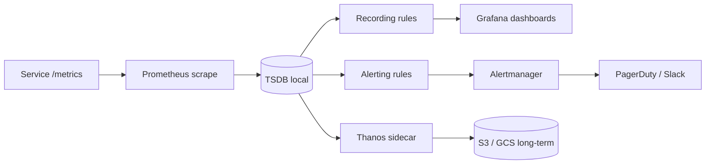

## Overview

Prometheus collects time-series metrics by scraping HTTP endpoints that expose data in
its text format. You instrument your services with counters, gauges, histograms, and
summaries, then query the data with PromQL and set up alerting rules to notify you when
something breaks.

I once joined a team whose PagerDuty was firing every 30 minutes because nobody had set a
`for` duration on their alerts. Every transient blip paged the on-call engineer. We spent
a weekend rewriting the alerting rules to fire on sustained conditions instead of
momentary spikes, and the noise dropped by 90%. That experience taught me that
instrumentation is only half the job — the other half is writing alerts that actually
mean something.

This recipe covers instrumentation, scrape config, recording rules, alerting rules, and
Alertmanager routing. It uses [prom-client](https://github.com/siimon/prom-client) for
Node.js and [prometheus_client](https://github.com/prometheus/client_python) for Python,
both official-adjacent libraries that expose the `/metrics` endpoint Prometheus expects.

## When to Use

- You need numeric, time-stamped data about application and infrastructure behavior.
- You want alerts based on symptoms (error rate, latency) rather than raw causes.
- You need precomputed queries for dashboards or fast alerting.
- You want to route alerts by severity or team.

## When NOT to Use

- For deep debugging of individual events: use logs or traces instead.
- For long-term storage without planning: Prometheus keeps data locally by default.
- When you need a push model for metrics: use the Pushgateway only for short-lived
  jobs.

## Solution

### Instrument application metrics

```typescript
// metrics/server.ts
import prometheus from 'prom-client';

const register = new prometheus.Registry();
prometheus.collectDefaultMetrics({ register });

const httpRequestsTotal = new prometheus.Counter({
  name: 'http_requests_total',
  help: 'Total number of HTTP requests',
  labelNames: ['method', 'route', 'status_code'],
  registers: [register],
});

const activeConnections = new prometheus.Gauge({
  name: 'active_connections',
  help: 'Number of active connections',
  registers: [register],
});

const httpRequestDuration = new prometheus.Histogram({
  name: 'http_request_duration_seconds',
  help: 'Duration of HTTP requests in seconds',
  labelNames: ['method', 'route'],
  buckets: [0.01, 0.05, 0.1, 0.5, 1, 2, 5],
  registers: [register],
});

function metricsMiddleware(req, res, next) {
  const start = Date.now();
  res.on('finish', () => {
    const duration = (Date.now() - start) / 1000;
    httpRequestsTotal.inc({
      method: req.method,
      route: req.route?.path || 'unknown',
      status_code: res.statusCode,
    });
    httpRequestDuration.observe(
      { method: req.method, route: req.route?.path || 'unknown' },
      duration
    );
  });
  next();
}

app.get('/metrics', async (req, res) => {
  res.set('Content-Type', register.contentType);
  res.end(await register.metrics());
});
```

### Scrape configuration

```yaml
# prometheus.yml
global:
  scrape_interval: 15s
  evaluation_interval: 15s

scrape_configs:
  - job_name: 'prometheus'
    static_configs:
      - targets: ['localhost:9090']

  - job_name: 'api'
    static_configs:
      - targets: ['api:3000']
    metrics_path: '/metrics'
    scrape_interval: 5s
```

### Alerting rules

```yaml
# rules/alerts.yml
groups:
  - name: api_alerts
    rules:
      - alert: HighErrorRate
        expr: |
          (
            sum(rate(http_requests_total{status_code=~"5.."}[5m]))
            /
            sum(rate(http_requests_total[5m]))
          ) > 0.05
        for: 2m
        labels:
          severity: critical
        annotations:
          summary: "High error rate on {{ $labels.route }}"
          description: "Error rate is {{ $value | humanizePercentage }}"

      - alert: SlowRequests
        expr: |
          histogram_quantile(0.95,
            sum(rate(http_request_duration_seconds_bucket[5m])) by (le, route)
          ) > 0.5
        for: 5m
        labels:
          severity: warning
        annotations:
          summary: "Slow requests on {{ $labels.route }}"
```

### Recording rules

```yaml
# rules/records.yml
groups:
  - name: api_records
    rules:
      - record: job:http_requests_total:rate5m
        expr: sum(rate(http_requests_total[5m])) by (job)

      - record: job:http_request_duration:p95
        expr: |
          histogram_quantile(0.95,
            sum(rate(http_request_duration_seconds_bucket[5m])) by (job, le)
          )
```

### Alertmanager routing

```yaml
# alertmanager.yml
global:
  smtp_smarthost: 'smtp.example.com:587'
  smtp_from: 'alerts@example.com'

route:
  group_by: ['alertname', 'severity']
  group_wait: 10s
  group_interval: 5m
  repeat_interval: 4h
  receiver: 'default'

receivers:
  - name: 'default'
    email_configs:
      - to: 'oncall@example.com'
    slack_configs:
      - api_url: 'https://hooks.slack.com/services/...'
        channel: '#alerts'

  - name: 'pagerduty'
    pagerduty_configs:
      - routing_key: 'your-routing-key'

  - name: 'slack-warnings'
    slack_configs:
      - api_url: 'https://hooks.slack.com/services/...'
        channel: '#warnings'

  - name: 'db-team'
    email_configs:
      - to: 'db-team@example.com'
```

### Custom Python exporter

```python
from prometheus_client import Counter, Histogram, Gauge, start_http_server
import time
import random

REQUESTS = Counter('app_requests_total', 'Total requests', ['endpoint', 'method'])
LATENCY = Histogram('app_request_duration_seconds', 'Request latency', ['endpoint'])
ACTIVE_CONNECTIONS = Gauge('app_active_connections', 'Active connections')

def handle_request(endpoint, method):
    start = time.time()
    REQUESTS.labels(endpoint=endpoint, method=method).inc()
    time.sleep(random.uniform(0.01, 0.5))
    LATENCY.labels(endpoint=endpoint).observe(time.time() - start)

if __name__ == '__main__':
    start_http_server(9090)
    while True:
        handle_request('/api/users', 'GET')
        ACTIVE_CONNECTIONS.set(random.randint(1, 100))
        time.sleep(0.1)
```

## Explanation

- **Counter**: only goes up. Use it for requests, errors, or completed tasks.
- **Gauge**: goes up and down. Use it for memory, connections, or queue depth.
- **Histogram**: counts observations into buckets. Use it for latency or response size.
- **Summary**: like a histogram, but it computes quantiles on the client side.
- **Recording rules**: precompute expensive PromQL queries so
  [Grafana dashboards](/recipes/grafana-dashboards-observability/) load faster.
- **Alerting rules**: evaluate PromQL expressions and send firing alerts to
  Alertmanager.
- **Alertmanager**: groups, silences, and routes alerts to the right receiver. Pair it
  with [structured logging](/recipes/structured-logging/) so on-call can pivot from an
  alert to the underlying log lines.

### Choosing the right metric type

The four metric types exist for different reasons, and picking the wrong one leads to
broken queries. Counters only go up — they're perfect for request counts and error
counts because you can compute a rate with `rate()` or `increase()`. Gauges go up and
down, so use them for things that have a current state: memory usage, queue depth, active
connections. Never use a gauge for something cumulative.

Histograms and summaries both measure distributions, but they differ in where the
aggregation happens. A histogram buckets observations on the client and lets you compute
quantiles server-side with `histogram_quantile()`. That means you can aggregate across
instances — p95 across 10 pods is a single PromQL expression. A summary computes quantiles
on the client, so you can't average them across instances. In practice, histograms are the
default choice because of this aggregation advantage. The [Prometheus docs on metric
types](https://prometheus.io/docs/concepts/metric_types/) go deeper on the trade-offs.

### Label cardinality and storage cost

Every unique combination of labels creates a new time series. Prometheus stores each
series on disk, and queries scan series matching the selector. A label with 10 values
multiplies your series count by 10; a label with unbounded values like `user_id` or
`session_id` explodes storage and makes queries slow. I've seen a team add `user_id` as a
label "for debugging" and watch Prometheus OOM within hours because they generated 50,000
new series in a single scrape. Keep labels to a small set of stable values: `method`,
`route`, `status_code`, `job`. If you need per-user data, use logs or traces, not metrics.

### Data retention and long-term storage

Prometheus keeps data locally for 15 days by default (configurable via `--storage.tsdb.retention.time`).
That's enough for alerting and short-term dashboards, but not for capacity planning or
year-over-year trends. For long-term storage, [Thanos](https://thanos.io/) and
[Cortex](https://cortexmetrics.io/) are the two main options. Thanos sidecar uploads
blocks to S3/GCS and gives you a global query view. Cortex is a horizontally scalable
Prometheus-compatible backend. Both let you keep years of data without overloading your
local Prometheus instance.

### The monitoring pipeline at a glance



The diagram shows the full pipeline: Prometheus scrapes your service, stores data in the
local TSDB, evaluates recording and alerting rules, and routes firing alerts through
Alertmanager. Thanos optionally uploads blocks to object storage for long-term retention.

## Variants

|Exporter type|When to use|
|-------------|-----------|
|In-app library|Full control over labels and business metrics|
|Node exporter|Hardware and OS metrics for Linux/Unix|
|Blackbox exporter|Probe endpoints from the outside|
|Pushgateway|Short-lived batch jobs that Prometheus can't scrape directly|

## Best Practices

- Alert on symptoms (high error rate, latency) rather than causes (CPU usage). A high CPU
  alert doesn't tell you whether users are feeling the impact; a high error-rate alert does.
- Keep label cardinality low; unbounded values like user IDs explode storage. If you're
  unsure, check `prometheus_tsdb_head_series` — if it's growing fast, you've got a
  cardinality problem.
- Set a `for` duration that avoids flapping but still matters. I use 2-5 minutes for most
  alerts; anything shorter than 1 minute is almost always noise.
- Use recording rules for queries that run often in dashboards. A `rate()` over 5 minutes
  computed every 15 seconds is cheap once; running it 50 times per dashboard load isn't.
- Route critical alerts to paging (PagerDuty, Opsgenie) and warnings to chat (Slack,
  Mattermost). Don't page for warnings — your on-call engineer will start ignoring them.
- Keep Prometheus data retention short; use Thanos or Cortex for long-term storage.
  For large-scale log retention alongside metrics, see
  [log aggregation](/recipes/log-aggregation/).
- Scrape only what you need; `scrape_interval` can be 15s or several minutes. Most
  services don't need 5-second resolution — 15s is the Prometheus default for a reason.
- Version your alert rules in Git and review them in PRs. An alert rule is code, not
  config, and it deserves the same review process.

## Common Mistakes

- Using high-cardinality labels such as user IDs or session IDs. I've seen this crash a
  Prometheus instance in under an hour — 50,000 new series from a single scrape.
- Alerting on causes instead of symptoms. "CPU > 80%" tells you nothing about user
  impact; "error rate > 5% for 5m" does.
- Not grouping alerts, which floods the on-call channel. Set `group_by: ['alertname',
  'severity']` in Alertmanager so related alerts arrive as one notification.
- Forgetting to set `for`, so every blip pages the team. This is the #1 cause of alert
  fatigue in my experience — a 30-second spike triggers a page at 3 AM.
- Retrying sensitive alert routing without a `repeat_interval`. Without it, a firing
  alert sends one notification and then goes silent — the on-call engineer might miss it.
- Querying raw metrics in dashboards instead of using recording rules. A dashboard that
  runs `histogram_quantile()` over raw buckets on every load will be slow and put
  unnecessary load on Prometheus.
- Putting secrets in Alertmanager config files. Use environment variables or a secret
  manager like Vault — Alertmanager supports `{{ .Env.SLACK_API_URL }}` templates in
  newer versions.

## FAQ

### How are metrics different from logs?

Metrics are numeric aggregates over time, ideal for trends and thresholds. Logs are
discrete events, better for debugging specific incidents.

### Can I use Prometheus without Kubernetes?

Yes. Prometheus runs as a standalone binary and can scrape any HTTP endpoint that
exposes metrics.

### What is the difference between a histogram and a summary?

A histogram buckets observations on the server and is aggregatable across instances. A
summary computes quantiles on the client and doesn't let you average across instances.

### When should I use the Pushgateway?

Only for short-lived batch jobs that finish before Prometheus can scrape them. Don't
use it for long-running services.

### How do I choose the `for` duration?

Set it long enough to avoid noise but short enough to matter. Two to five minutes is a
common starting point.

### What status codes should trigger alerts?

Alert on sustained high error rates (5xx) or latency, not on a single failed request.

## See Also

- [Prometheus documentation](https://prometheus.io/docs/introduction/overview/) —
  official docs covering configuration, PromQL, and best practices.
- [Alertmanager documentation](https://prometheus.io/docs/alerting/latest/alertmanager/)
  — routing, grouping, silencing, and receiver configuration.
- [prom-client (Node.js)](https://github.com/siimon/prom-client) — the library used in
  this recipe's TypeScript examples.
- [prometheus_client (Python)](https://github.com/prometheus/client_python) — the
  official Python client for Prometheus metrics.
- [Thanos](https://thanos.io/getting-started.md/) — long-term storage and global query
  view for Prometheus.
