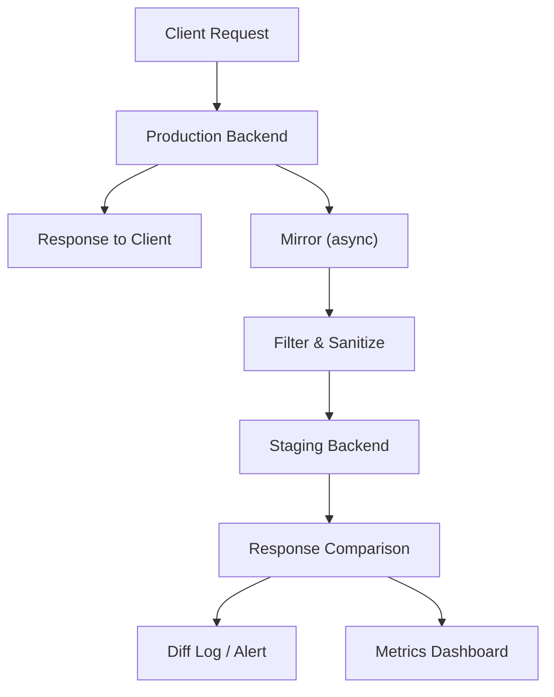

## Visión General

Traffic mirroring manda una copia de los requests reales de producción a un
ambiente de staging o shadow, y tus usuarios no se enteran. Pero vos podés ver
cómo tu sistema maneja patrones de requests, headers y payloads reales, algo
que los tests sintéticos simplemente no pueden replicar.

## Cuándo Usar

- Los tests sintéticos de load testing no capturan la complejidad messy de
  requests del mundo real.
- Validás una nueva versión de servicio contra tráfico de producción antes del
  cutover.
- Hacés benchmark de cambios de infra como upgrades de versión de DB o bumps
  de kernel antes de rollout.
- Testeás disaster recovery reproduciendo tráfico de producción contra sistemas
  standby.

### Cuándo evitarlo

No mirroré si tu app tiene problemas con requests duplicados. Mirror de
POSTs o pagos no idempotentes causa side effects reales. Vi equipos que
cobraron dos veces a clientes por mirrorar un endpoint de pagos sin
idempotency keys.

Saltalo si staging comparte bases de datos o cuentas de terceros con
producción. Las escrituras del mirror corrompen el estado de producción,
y ese es un mal día para todos.

Y si no podés aislar side effects, ni lo intentes. El tráfico mirror no
tiene por qué enviar emails reales, cobrar pagos ni disparar webhooks.

## Solución

### AWS VPC Traffic Mirroring

```bash
# Crear un traffic mirror target (NLB o ENI)
aws ec2 create-traffic-mirror-target \
  --network-load-balancer-arn arn:aws:elasticloadbalancing:us-east-1:123456789012:loadbalancer/net/staging-nlb/abc123

# Crear un mirror filter para tráfico HTTP/HTTPS
aws ec2 create-traffic-mirror-filter-rule \
  --traffic-mirror-filter-id tmf-1234567890abcdef0 \
  --traffic-direction ingress \
  --rule-action accept \
  --protocol 6 \
  --destination-port-range FromPort=80,ToPort=443

# Crear la mirror session
aws ec2 create-traffic-mirror-session \
  --network-interface-id eni-1234567890abcdef0 \
  --traffic-mirror-target-id tmt-1234567890abcdef0 \
  --traffic-mirror-filter-id tmf-1234567890abcdef0 \
  --session-number 1 \
  --packet-length 1500
```

### Nginx mirror module

```nginx
server {
    listen 80;
    server_name api.example.com;

    location /api/ {
        mirror /staging_mirror;
        mirror_request_body on;

        proxy_pass http://production_backend;
        proxy_set_header Host $host;
    }

    location /staging_mirror {
        internal;
        proxy_pass http://staging_backend$request_uri;
        proxy_set_header Host staging-api.example.com;
        proxy_set_header X-Mirrored-From $host;

        # No bloquear producción esperando a staging
        proxy_connect_timeout 1s;
        proxy_read_timeout 1s;
        proxy_ignore_client_abort on;
    }
}
```

### Istio traffic mirroring (Kubernetes)

```yaml
apiVersion: networking.istio.io/v1beta1
kind: VirtualService
metadata:
  name: api-mirror
spec:
  hosts:
    - api.example.com
  http:
    - match:
        - uri:
            prefix: /api
      route:
        - destination:
            host: api-production
            port:
              number: 8080
          weight: 100
      mirror:
        host: api-staging
        port:
          number: 8080
      mirrorPercentage:
        value: 10.0
```

### Envoy traffic mirroring

```yaml
static_resources:
  listeners:
    - name: listener_0
      address:
        socket_address:
          address: 0.0.0.0
          port_value: 8080
      filter_chains:
        - filters:
            - name: envoy.filters.network.http_connection_manager
              typed_config:
                "@type": type.googleapis.com/envoy.extensions.filters.network.http_connection_manager.v3.HttpConnectionManager
                stat_prefix: ingress_http
                route_config:
                  name: local_route
                  virtual_hosts:
                    - name: backend
                      domains: ["*"]
                      routes:
                        - match:
                            prefix: "/api"
                          route:
                            cluster: production_backend
                          request_mirror_policy:
                            cluster: staging_backend
                            runtime_fraction:
                              default_value:
                                numerator: 10
                                denominator: HUNDRED
                http_filters:
                  - name: envoy.filters.http.router
                    typed_config:
                      "@type": type.googleapis.com/envoy.extensions.filters.http.router.v3.Router

  clusters:
    - name: production_backend
      connect_timeout: 0.25s
      type: STRICT_DNS
      lb_policy: ROUND_ROBIN
      load_assignment:
        cluster_name: production_backend
        endpoints:
          - lb_endpoints:
              - endpoint:
                  address:
                    socket_address:
                      address: api-production.default.svc.cluster.local
                      port_value: 8080

    - name: staging_backend
      connect_timeout: 0.25s
      type: STRICT_DNS
      lb_policy: ROUND_ROBIN
      load_assignment:
        cluster_name: staging_backend
        endpoints:
          - lb_endpoints:
              - endpoint:
                  address:
                    socket_address:
                      address: api-staging.staging.svc.cluster.local
                      port_value: 8080
```

### GoReplay para replay a nivel TCP

```bash
# Capturar y replayar tráfico en vivo
gor --input-raw :8080 --output-http http://staging-api:8080

# Mirror 10% del tráfico
gor --input-raw :8080 --output-http "http://staging-api:8080|10%"

# Guardar a archivo para replay posterior
gor --input-raw :8080 --output-file requests.gor

# Replay a 2x velocidad
gor --input-file "requests.gor|200%" --output-http http://staging-api:8080

# Filtrar POSTs a /api
gor --input-raw :8080 --http-allow-method POST --http-allow-url ^/api --output-http http://staging-api:8080
```

### Comparación de respuestas

```javascript
const express = require("express");
const app = express();

app.use(async (req, res, next) => {
  const prodResponse = await fetch(`http://production${req.url}`, {
    method: req.method,
    headers: req.headers,
    body: JSON.stringify(req.body),
  });

  const prodJson = await prodResponse.json();

  const stagingResponse = await fetch(`http://staging${req.url}`, {
    method: req.method,
    headers: req.headers,
    body: JSON.stringify(req.body),
  }).catch(() => null);

  if (stagingResponse) {
    const stagingJson = await stagingResponse.json();
    const diff = deepDiff(prodJson, stagingJson);
    if (diff) {
      console.log(JSON.stringify({
        url: req.url,
        method: req.method,
        diff,
        timestamp: new Date().toISOString(),
      }));
    }
  }

  res.status(prodResponse.status).json(prodJson);
});

function deepDiff(obj1, obj2) {
  const diff = {};
  for (const key of Object.keys(obj1)) {
    if (JSON.stringify(obj1[key]) !== JSON.stringify(obj2[key])) {
      diff[key] = { prod: obj1[key], staging: obj2[key] };
    }
  }
  return Object.keys(diff).length > 0 ? diff : null;
}
```

## Explicación



**Mirror vs. canary vs. shadow**:

| Patrón | Impacto usuario | Fuente de respuesta | Caso de uso |
| --- | --- | --- | --- |
| Mirror | Ninguno | Producción | Testing y análisis shadow |
| Canary | Parcial | Nueva versión | Rollout gradual |
| Blue-green | Switch | Una versión | Cutover instantáneo |
| Shadow | Ninguno (async) | Producción | Análisis sin latencia crítica |

El tráfico mirror es un duplicado. Llega al mirror target además del backend de
producción, así que el response path de producción debe seguir independiente. El
mirroring a nivel red copia paquetes, mientras que el de aplicación envía HTTP
requests. Las configs a nivel aplicación permiten filtrar por URL, método y
headers fácilmente.

Consideraciones clave:

- **Idempotencia**: los POST/PUT mirror deben ser seguros de repetir. Consultá
  [idempotent API endpoints](/recipes/idempotent-api-endpoints/).
- **Aislamiento de estado**: mantené la base de staging completamente separada
  de producción, sin tablas ni connection strings compartidos.
- **Side effects**: desactivá email, pagos y notificaciones en el mirror target.
- **Latencia**: nunca dejes que el mirror bloquee las respuestas de producción.
- **Costo**: el mirroring a nivel red con porcentajes altos satura el ancho de
  banda de la ENI. Los mirrors a nivel aplicación agregan overhead de CPU por
  request duplicado.
- **Filtrado**: quitá health checks, assets estáticos y probes de monitoreo
  antes de mirrorar para no distorsionar las métricas de staging.

### Trade-offs a tener en cuenta

- **Dependencia de disponibilidad del mirror target**: si el mirror target cae,
  producción sigue sin afectarse (el mirror es fire-and-forget), pero perdés
  signal de testing hasta que recupere.
- **Costo operativo**: correr staging a escala completa se pone caro. La
  mayoría de los equipos con los que trabajé se quedan con 1-10% de mirroring
  en lugar de 100% para mantener las facturas de cloud razonables.
- **Thread safety del cliente**: los mirrors a nivel aplicación que hacen
  `await` de la respuesta de staging van a bloquear producción. Siempre usá
  async fire-and-forget.
- **Ciclo de vida de tokens**: si producción rota auth tokens, el mirror target
  necesita la misma lógica de rotación o va a empezar a rechazar requests.

## Variantes

| Herramienta | Nivel | Overhead | Ideal para |
| --- | --- | --- | --- |
| AWS Traffic Mirroring | Red (ENI) | Bajo | Workloads en EC2 |
| Nginx mirror | Aplicación | Mínimo | Arquitecturas basadas en Nginx |
| Istio | Service mesh | Bajo | Microservicios en Kubernetes |
| Envoy | Sidecar | Bajo | Configs de proxy custom |
| GoReplay | Aplicación | Medio | Replay y captura a nivel TCP |

## Mejores Prácticas

- Empezá con 1% de tráfico y aumentá gradualmente. No arranques con 100%.
- Sanitizá requests mirror. Quitá PII, tokens de auth y datos de pago antes de
  enviar a staging.
- Desactivá efectos salientes en el target: webhooks, emails, APIs de terceros y
  push notifications.
- Monitoreá el mirror target por separado. El tráfico mirror puede disparar
  alertas, así que usá umbrales y dashboards separados.
- Filtrá health checks y requests de monitoreo para no contaminar datos de
  staging.
- Filtrá assets estáticos. Mirror de CSS, JS e imágenes desperdicia recursos y
  distorsiona métricas.
- Usá async fire-and-forget para mirrors a nivel aplicación. Nunca hagás `await`
  de la respuesta del mirror.
- Compará respuestas de producción y mirror para detectar regresiones en shape,
  latencia y códigos de estado.

## Errores Comunes

- Mirror sin idempotencia. Cobrar dos veces a un cliente porque se mirroró el
  pago es un riesgo real. Usá idempotency keys para endpoints mutables.
- Compartir bases de datos entre producción y mirror target. Las escrituras del
  mirror corrompen datos de producción.
- Bloquear producción con latencia del mirror target. Siempre seteá timeouts
  cortos e ignorá errores del mirror.
- Mirror de health checks y probes de monitoreo. Agrega ruido a las analíticas
  de staging.
- Olvidar desactivar side effects. En casi todo incidente de mirror que
  debuggeé, la causa raíz fue staging enviando emails reales a clientes reales
  porque alguien se olvidó de flippear un flag.
- Mirror de tráfico a un endpoint de staging público sin autenticación, que
  es cómo datos de producción y credenciales terminan expuestos.

## Estrategia de Testing

No subas el porcentaje de mirror hasta haber testeado tu setup en tres capas
distintas.

Primero, verificá que el mirror target efectivamente reciba requests. En el
host de staging, abrí `tcpdump` y enviá algunos requests a producción:

```bash
# En el host de staging, escuchá tráfico mirror entrante
tcpdump -i eth0 port 8080 -c 10 --direction=in
```

Si no llega nada en segundos, revisá firewall rules, security groups y la
config del mirror filter. En mi experiencia, la misconfiguración de firewall
es la causa de la mayoría de los failures de setup de mirror.

Segundo, verificá la idempotencia. Enviá el mismo request dos veces y
confirmá que no obtengas dobles cargas ni filas extra en la base:

```python
import requests

# Enviá el mismo request idempotente dos veces (simulando mirror + producción)
headers = {"Idempotency-Key": "test-123", "Content-Type": "application/json"}
r1 = requests.post("http://api.example.com/payments", json={"amount": 100}, headers=headers)
r2 = requests.post("http://api.example.com/payments", json={"amount": 100}, headers=headers)

assert r1.status_code == r2.status_code
assert r1.json()["id"] == r2.json()["id"]  # Mismo recurso, no duplicado
```

Tercero, compará respuestas entre prod y staging para detectar regresiones:

```python
import requests
import json

def compare_responses(url, method="GET", headers=None, body=None):
    prod = requests.request(method, f"http://production{url}", headers=headers, json=body)
    staging = requests.request(method, f"http://staging{url}", headers=headers, json=body)
    assert prod.status_code == staging.status_code, f"Status mismatch: {prod.status_code} vs {staging.status_code}"
    prod_json = prod.json()
    staging_json = staging.json()
    # Comparar shape del schema, no valores exactos (timestamps van a diferir)
    assert set(prod_json.keys()) == set(staging_json.keys()), "Schema mismatch"
    return True
```

Combiná esto con [load testing k6](/recipes/load-testing-k6/) para validar que
staging maneja el volumen mirror sin degradarse.

## Consideraciones de Seguridad

- **Sanitización de PII**: quitá información personal identificable de headers
  y bodies antes de mirrorar. Usá un middleware que redacte campos como
  `Authorization`, `Cookie`, `X-API-Key` y datos de pago.
- **Stripping de auth tokens**: nunca envíes tokens de auth de producción a
  staging. Si staging necesita auth, usá un token exchange separado o una
  service account dedicada al tráfico mirror.
- **Aislamiento de staging**: nunca dejes que staging comparta bases de datos,
  caches ni cuentas de terceros con producción. Una vez rastreé un data leak
  de producción hasta una shared Stripe key. Nada divertido.
- **mTLS entre mirror source y target**: para mirroring a nivel red entre VPCs,
  usá mTLS para encriptar el tráfico mirror en tránsito.
- **Audit logging**: logueá cada mirror session con start time, porcentaje,
  filter rules y target. Cuando hay data leakage, este log es la diferencia
  entre un fix de 20 minutos y una investigación de 3 días.
- **Sin endpoints de staging públicos**: el mirror target no debe ser
  públicamente accesible. Usá private subnets, VPN o Transit Gateway.

## Monitoreo

Monitoreá tanto la infraestructura del mirror como el target de staging por
separado de producción:

| Métrica | Qué te dice | Umbral de alerta |
| --- | --- | --- |
| `mirror_requests_total` | Rate de requests mirror | Caída repentina puede indicar misconfig |
| `mirror_errors_total` | Fallos de delivery del mirror | `> 1%` de requests mirror |
| `staging_response_latency_p99` | Tiempo de respuesta de staging bajo carga mirror | `> 2x` latencia de producción |
| `response_diff_count` | Cantidad de mismatches prod/staging | Aumento sostenido sobre baseline |
| `mirror_target_health` | Health del endpoint de staging | Cualquier target unhealthy |

Para [Istio](https://istio.io/latest/docs/tasks/traffic-management/mirroring/),
usá las métricas built-in de Envoy (`envoy_cluster_upstream_rq_total` para el
cluster mirror). Para Nginx, habilitá el módulo stub status y trackeá las
conexiones activas del backend de staging.

Seteá un dashboard separado para métricas de mirror para que las alertas de
staging no contaminen el alerting de producción. Usá
[Prometheus monitoring alerts](/recipes/prometheus-monitoring-alerts/) para
alerting estructurado.

## Solución de Problemas

| Síntoma | Causa probable | Solución |
| --- | --- | --- |
| No llega tráfico a staging | Firewall o security group bloqueando | Revisá inbound rules en el host de staging para el puerto mirror |
| Requests mirror timeout | Staging backend muy lento o caído | Reducí el porcentaje de mirror o aumentá capacidad de staging |
| Latencia de producción aumenta | El mirror está bloqueando el response path | Cambiá a async fire-and-forget; nunca hagás `await` del mirror |
| Cobros duplicados en staging | Endpoint no idempotente mirrorado | Agregá idempotency keys o excluí endpoints de pago del mirror |
| Base de staging corrompida | DB compartida entre prod y staging | Aislá la DB de staging; usá credenciales y connection strings separados |
| Errores de auth en staging | Tokens de producción enviados a staging | Quitá el header `Authorization` y re-autenticá con credenciales de staging |
| Costo alto de infraestructura mirror | Mirrorando 100% del tráfico | Reducí a 1-10%; filtrá assets estáticos y health checks |

## FAQ

### ¿El mirroring impacta la performance de producción?

Mínimo si se hace bien. El mirroring a nivel red agrega overhead cercano a cero.
Los mirrors a nivel aplicación deberían ser async fire-and-forget con timeouts
cortos.

### ¿Puedo mirrorar tráfico entre regiones?

Sí, pero aumenta la latencia. AWS Traffic Mirroring funciona dentro del mismo
VPC. Cross-region requiere VPN, Transit Gateway o un mirror a nivel aplicación.

### ¿Cuál es la diferencia entre mirroring y load testing?

Load testing martilla tu sistema con tráfico artificial para encontrar dónde
se rompe. El mirroring es complementario: manda tráfico real para que detectes
regresiones de comportamiento. Usá ambos juntos: mirror para validación de
regresiones, [load testing k6](/recipes/load-testing-k6/) para testing de
capacidad y estrés.

### ¿Por qué fallan mis requests mirror en staging?

El culpable habitual es mismatch de auth tokens. Los tokens de producción no
funcionan en staging si los ambientes usan identity providers separados. Quitá
el header `Authorization` y re-autenticá con credenciales de staging, o usá un
servicio de token exchange compartido.

### ¿Cuándo conviene Istio sobre Nginx para mirroring?

Istio es mejor cuando ya estás corriendo un service mesh en Kubernetes y querés
config de mirror a nivel VirtualService. Para arquitecturas de single-proxy,
Nginx es la opción más simple. Consultá la
[doc de Istio traffic mirroring](https://istio.io/latest/docs/tasks/traffic-management/mirroring/)
para capacidades específicas de mesh como mirror basado en porcentaje e inyección
automática de headers.

### ¿Debería mirrorar 100% del tráfico?

No hasta validar idempotencia, aislar estado, desactivar side effects y
confirmar que el target soporta la carga. Empezá con 1% y subí gradualmente,
mirando latencia y error rates de staging en cada paso.

## See Also

- [Documentación de AWS VPC Traffic Mirroring](https://docs.aws.amazon.com/vpc/latest/mirroring/what-is-traffic-mirroring.html)
- [Documentación del módulo Nginx mirror](https://nginx.org/en/docs/http/ngx_http_mirror_module.html)
- [Istio traffic mirroring](https://istio.io/latest/docs/tasks/traffic-management/mirroring/)
- [Envoy request mirror policy](https://www.envoyproxy.io/docs/envoy/latest/api-v3/config/route/v3/route_components.proto#envoy-v3-api-field-config-route-v3-routeaction-request-mirror-policies)
- [GoReplay GitHub](https://github.com/buger/goreplay)
- [Repositorio companion](https://mathiaspaulenko.github.io/stack-practices-resources/): ejemplos y configs ejecutables
- [Blue-green deployment](/recipes/blue-green-deployment/)
- [Guía de canary deployment](/guides/canary-deployment-guide/)
- [Load testing con k6](/recipes/load-testing-k6/)
- [Graceful shutdown](/recipes/graceful-shutdown/)
- [Prometheus monitoring alerts](/recipes/prometheus-monitoring-alerts/)
