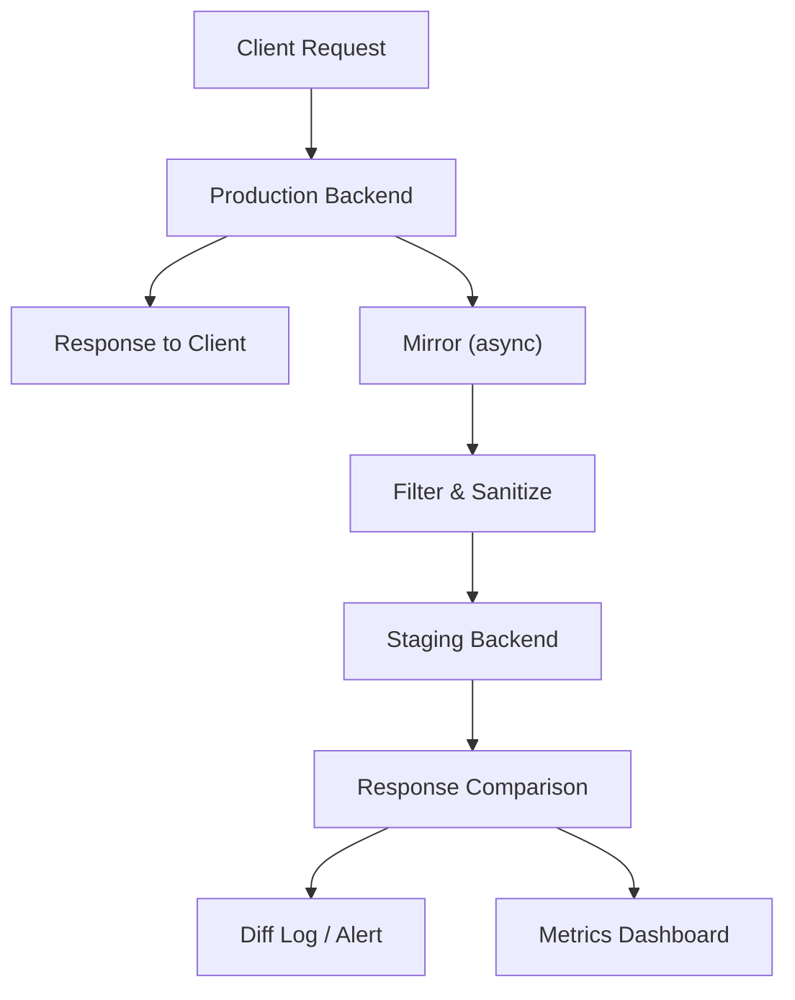

## Overview

Traffic mirroring sends a copy of real production requests to a staging or
shadow environment, and your users don't notice a thing. But you get to see
how your system handles actual request patterns, headers, and payloads, which
synthetic tests simply can't replicate.

## When to Use

- Synthetic load tests miss the messy complexity of real-world requests.
- Validating a new service version against production traffic before cutover.
- Benchmarking infra changes like DB version upgrades or kernel bumps before
  rolling them out.
- Testing disaster recovery by replaying production traffic against standby
  systems.

### When to avoid

Don't mirror if your app struggles with duplicated requests. Mirroring
non-idempotent POST or payment calls causes real side effects. I've seen
teams accidentally double-charge customers because they mirrored a payment
endpoint without idempotency keys.

Skip it if staging shares databases or third-party accounts with production.
Mirrored writes corrupt production state, and that's a bad day for everyone.

And if you can't isolate side effects, forget it. Mirrored traffic has no
business sending real emails, charging payments, or triggering webhooks.

## Solution

### AWS VPC Traffic Mirroring

```bash
# Create a traffic mirror target (NLB or ENI)
aws ec2 create-traffic-mirror-target \
  --network-load-balancer-arn arn:aws:elasticloadbalancing:us-east-1:123456789012:loadbalancer/net/staging-nlb/abc123

# Create a mirror filter for HTTP/HTTPS traffic
aws ec2 create-traffic-mirror-filter-rule \
  --traffic-mirror-filter-id tmf-1234567890abcdef0 \
  --traffic-direction ingress \
  --rule-action accept \
  --protocol 6 \
  --destination-port-range FromPort=80,ToPort=443

# Create the mirror session
aws ec2 create-traffic-mirror-session \
  --network-interface-id eni-1234567890abcdef0 \
  --traffic-mirror-target-id tmt-1234567890abcdef0 \
  --traffic-mirror-filter-id tmf-1234567890abcdef0 \
  --session-number 1 \
  --packet-length 1500
```

### Nginx mirror module

```nginx
server {
    listen 80;
    server_name api.example.com;

    location /api/ {
        mirror /staging_mirror;
        mirror_request_body on;

        proxy_pass http://production_backend;
        proxy_set_header Host $host;
    }

    location /staging_mirror {
        internal;
        proxy_pass http://staging_backend$request_uri;
        proxy_set_header Host staging-api.example.com;
        proxy_set_header X-Mirrored-From $host;

        # Do not block production on staging response
        proxy_connect_timeout 1s;
        proxy_read_timeout 1s;
        proxy_ignore_client_abort on;
    }
}
```

### Istio traffic mirroring (Kubernetes)

```yaml
apiVersion: networking.istio.io/v1beta1
kind: VirtualService
metadata:
  name: api-mirror
spec:
  hosts:
    - api.example.com
  http:
    - match:
        - uri:
            prefix: /api
      route:
        - destination:
            host: api-production
            port:
              number: 8080
          weight: 100
      mirror:
        host: api-staging
        port:
          number: 8080
      mirrorPercentage:
        value: 10.0
```

### Envoy traffic mirroring

```yaml
static_resources:
  listeners:
    - name: listener_0
      address:
        socket_address:
          address: 0.0.0.0
          port_value: 8080
      filter_chains:
        - filters:
            - name: envoy.filters.network.http_connection_manager
              typed_config:
                "@type": type.googleapis.com/envoy.extensions.filters.network.http_connection_manager.v3.HttpConnectionManager
                stat_prefix: ingress_http
                route_config:
                  name: local_route
                  virtual_hosts:
                    - name: backend
                      domains: ["*"]
                      routes:
                        - match:
                            prefix: "/api"
                          route:
                            cluster: production_backend
                          request_mirror_policy:
                            cluster: staging_backend
                            runtime_fraction:
                              default_value:
                                numerator: 10
                                denominator: HUNDRED
                http_filters:
                  - name: envoy.filters.http.router
                    typed_config:
                      "@type": type.googleapis.com/envoy.extensions.filters.http.router.v3.Router

  clusters:
    - name: production_backend
      connect_timeout: 0.25s
      type: STRICT_DNS
      lb_policy: ROUND_ROBIN
      load_assignment:
        cluster_name: production_backend
        endpoints:
          - lb_endpoints:
              - endpoint:
                  address:
                    socket_address:
                      address: api-production.default.svc.cluster.local
                      port_value: 8080

    - name: staging_backend
      connect_timeout: 0.25s
      type: STRICT_DNS
      lb_policy: ROUND_ROBIN
      load_assignment:
        cluster_name: staging_backend
        endpoints:
          - lb_endpoints:
              - endpoint:
                  address:
                    socket_address:
                      address: api-staging.staging.svc.cluster.local
                      port_value: 8080
```

### GoReplay for TCP-level replay

```bash
# Capture and replay live traffic
gor --input-raw :8080 --output-http http://staging-api:8080

# Mirror 10% of traffic
gor --input-raw :8080 --output-http "http://staging-api:8080|10%"

# Save to file for later replay
gor --input-raw :8080 --output-file requests.gor

# Replay at 2x speed
gor --input-file "requests.gor|200%" --output-http http://staging-api:8080

# Filter POST requests to /api
gor --input-raw :8080 --http-allow-method POST --http-allow-url ^/api --output-http http://staging-api:8080
```

### Response comparison

```javascript
const express = require("express");
const app = express();

app.use(async (req, res, next) => {
  const prodResponse = await fetch(`http://production${req.url}`, {
    method: req.method,
    headers: req.headers,
    body: JSON.stringify(req.body),
  });

  const prodJson = await prodResponse.json();

  const stagingResponse = await fetch(`http://staging${req.url}`, {
    method: req.method,
    headers: req.headers,
    body: JSON.stringify(req.body),
  }).catch(() => null);

  if (stagingResponse) {
    const stagingJson = await stagingResponse.json();
    const diff = deepDiff(prodJson, stagingJson);
    if (diff) {
      console.log(JSON.stringify({
        url: req.url,
        method: req.method,
        diff,
        timestamp: new Date().toISOString(),
      }));
    }
  }

  res.status(prodResponse.status).json(prodJson);
});

function deepDiff(obj1, obj2) {
  const diff = {};
  for (const key of Object.keys(obj1)) {
    if (JSON.stringify(obj1[key]) !== JSON.stringify(obj2[key])) {
      diff[key] = { prod: obj1[key], staging: obj2[key] };
    }
  }
  return Object.keys(diff).length > 0 ? diff : null;
}
```

## Explanation



**Mirror vs. canary vs. shadow**:

| Pattern | User impact | Response source | Use case |
| --- | --- | --- | --- |
| Mirror | None | Production only | Testing and shadow analysis |
| Canary | Partial | New version | Gradual rollout |
| Blue-green | Switched | One version | Instant cutover |
| Shadow | None (async) | Production | Latency-insensitive analysis |

Mirrored traffic is a duplicate. It reaches the mirror target in addition to the
production backend, so the production response path must remain independent.
Network-level mirroring copies packets, while application-level mirroring sends
HTTP requests. Application-level setups can filter by URL, method, and headers
easily.

Key considerations:

- **Idempotency**: mirrored POST/PUT requests must be safe to repeat. See
  [idempotent API endpoints](/recipes/idempotent-api-endpoints/).
- **State isolation**: keep the staging database completely separate from
  production, no shared tables or connection strings.
- **Side effects**: disable email, payment, and notification services in the
  mirror target.
- **Latency**: never let the mirror block production responses.
- **Cost**: network-level mirroring at high percentages saturates ENI
  bandwidth. Application-level mirrors add CPU overhead per duplicated request.
- **Filtering**: strip health checks, static assets, and monitoring probes
  before mirroring to avoid skewing staging metrics.

### Trade-offs worth knowing

- **Vault availability dependency**: if the mirror target goes down, production
  continues unaffected (the mirror is fire-and-forget), but you lose testing
  signal until it recovers.
- **Operational cost**: running full-scale staging gets pricey. Most teams
  I've worked with settle on 1-10% mirroring rather than 100% to keep cloud
  bills reasonable.
- **Client thread safety**: application-level mirrors that `await` the staging
  response will block production. Always use async fire-and-forget.
- **Token lifecycle**: if production rotates auth tokens, the mirror target
  needs the same rotation logic or it will start rejecting requests.

## Variants

| Tool | Level | Overhead | Best for |
| --- | --- | --- | --- |
| AWS Traffic Mirroring | Network (ENI) | Low | EC2-based workloads |
| Nginx mirror | Application | Minimal | Nginx-based architectures |
| Istio | Service mesh | Low | Kubernetes microservices |
| Envoy | Sidecar | Low | Custom proxy configurations |
| GoReplay | Application | Medium | TCP-level replay and capture |

## Best Practices

- Start with 1% of traffic and increase gradually. Never start at 100%.
- Sanitize mirrored requests. Strip PII, auth tokens, and payment data before
  sending to staging.
- Disable outbound effects in the mirror target: webhooks, emails, third-party
  API calls, and push notifications.
- Monitor the mirror target separately. Mirrored traffic can trigger alerts, so
  use separate thresholds and dashboards.
- Filter out health checks and monitoring requests so they don't pollute staging
  data.
- Filter static assets. Mirroring CSS, JS, and images wastes resources and skews
  metrics.
- Use async fire-and-forget for application-level mirrors. Never `await` the
  mirror response.
- Compare production and mirror responses to detect regressions in shape,
  latency, and status codes.

## Common Mistakes

- Mirroring without idempotency. Charging a customer twice because the payment
  API was mirrored is a real risk. Use idempotency keys for all mutating
  endpoints.
- Sharing databases between production and the mirror target. Writes from
  mirrored traffic corrupt production data.
- Blocking production on mirror target latency. Always set short timeouts and
  ignore mirror errors.
- Mirroring health checks and monitoring probes. This adds noise to staging
  analytics.
- Forgetting to disable side effects. In nearly every mirror incident I've
  debugged, the root cause was staging sending real emails to real customers
  because someone forgot to flip a flag.
- Mirroring traffic to a public staging endpoint without authentication,
  which is how production data and credentials end up exposed.

## Testing Strategy

Hold off on ramping up the mirror percentage until you've tested your setup
in three layers.

First, check that the mirror target actually receives requests. On the staging
host, fire up `tcpdump` and send a few requests to production:

```bash
# On the staging host, listen for incoming mirrored traffic
tcpdump -i eth0 port 8080 -c 10 --direction=in
```

If nothing arrives within seconds, check firewall rules, security groups, and
the mirror filter configuration. In my experience, firewall misconfiguration
accounts for most mirror setup failures.

Second, verify idempotency. Send the same request twice and confirm you don't
get double charges or extra database rows:

```python
import requests

# Send the same idempotent request twice (simulating mirror + production)
headers = {"Idempotency-Key": "test-123", "Content-Type": "application/json"}
r1 = requests.post("http://api.example.com/payments", json={"amount": 100}, headers=headers)
r2 = requests.post("http://api.example.com/payments", json={"amount": 100}, headers=headers)

assert r1.status_code == r2.status_code
assert r1.json()["id"] == r2.json()["id"]  # Same resource, not duplicated
```

Third, compare responses between prod and staging to catch regressions:

```python
import requests
import json

def compare_responses(url, method="GET", headers=None, body=None):
    prod = requests.request(method, f"http://production{url}", headers=headers, json=body)
    staging = requests.request(method, f"http://staging{url}", headers=headers, json=body)
    assert prod.status_code == staging.status_code, f"Status mismatch: {prod.status_code} vs {staging.status_code}"
    prod_json = prod.json()
    staging_json = staging.json()
    # Compare schema shape, not exact values (timestamps will differ)
    assert set(prod_json.keys()) == set(staging_json.keys()), "Schema mismatch"
    return True
```

Pair this with [load testing k6](/recipes/load-testing-k6/) to validate that
staging handles the mirrored volume without degrading.

## Security Considerations

- **PII sanitization**: strip personally identifiable information from headers
  and bodies before mirroring. Use a middleware that redacts fields like
  `Authorization`, `Cookie`, `X-API-Key`, and payment data.
- **Auth token stripping**: never send production auth tokens to staging. If
  staging needs auth, use a separate token exchange or a service account
  dedicated to mirror traffic.
- **Staging isolation**: never let staging share databases, caches, or
  third-party accounts with production. I once traced a production data leak
  to a shared Stripe key. Not fun.
- **mTLS between mirror source and target**: for network-level mirroring across
  VPCs, use mTLS to encrypt mirrored traffic in transit.
- **Audit logging**: log every mirror session with start time, percentage,
  filter rules, and target. When data leaks, this log is the difference
  between a 20-minute fix and a 3-day investigation.
- **No public staging endpoints**: the mirror target must not be publicly
  accessible. Use private subnets, VPN, or Transit Gateway.

## Monitoring

Monitor both the mirror infrastructure and the staging target separately from
production:

| Metric | What it tells you | Alert threshold |
| --- | --- | --- |
| `mirror_requests_total` | Mirror request rate | Sudden drop may indicate mirror misconfiguration |
| `mirror_errors_total` | Mirror delivery failures | `> 1%` of mirror requests |
| `staging_response_latency_p99` | Staging response time under mirror load | `> 2x` production latency |
| `response_diff_count` | Number of prod/staging response mismatches | Sustained increase over baseline |
| `mirror_target_health` | Staging endpoint health | Any unhealthy target |

For [Istio](https://istio.io/latest/docs/tasks/traffic-management/mirroring/),
use the built-in Envoy metrics (`envoy_cluster_upstream_rq_total` for the
mirror cluster). For Nginx, enable the stub status module and track the
staging backend's active connections.

Set up a separate dashboard for mirror metrics so staging alerts don't
contaminate production alerting. Use [Prometheus monitoring
alerts](/recipes/prometheus-monitoring-alerts/) for structured alerting.

## Troubleshooting

| Symptom | Likely cause | Fix |
| --- | --- | --- |
| No traffic reaching staging | Firewall or security group blocking | Check inbound rules on the staging host for the mirror port |
| Mirror requests timing out | Staging backend too slow or down | Reduce mirror percentage or increase staging capacity |
| Production latency increases | Mirror is blocking the response path | Switch to async fire-and-forget; never `await` the mirror |
| Duplicate charges in staging | Non-idempotent endpoint mirrored | Add idempotency keys or exclude payment endpoints from mirror |
| Staging database corrupted | Shared database between prod and staging | Isolate staging DB; use separate credentials and connection strings |
| Auth errors in staging | Production tokens sent to staging | Strip `Authorization` header and re-authenticate with staging credentials |
| High mirror infrastructure cost | Mirroring 100% of traffic | Reduce to 1-10%; filter out static assets and health checks |

## FAQ

### Does mirroring impact production performance?

Minimal if done correctly. Network-level mirroring adds near-zero overhead.
Application-level mirrors should be async fire-and-forget with short timeouts.

### Can I mirror traffic across regions?

Yes, but latency increases. AWS Traffic Mirroring works within the same VPC.
Cross-region requires VPN, Transit Gateway, or an application-level mirror.

### What's the difference between mirroring and load testing?

Load testing hammers your system with artificial traffic to find where it
breaks. Mirroring is complementary: it pipes real traffic through so you catch
behavioral regressions. Use both together: mirror for regression validation,
[load testing k6](/recipes/load-testing-k6/) for capacity and stress testing.

### Why are my mirrored requests failing in staging?

The usual culprit is auth token mismatch. Production tokens don't work in
staging if the environments use separate identity providers. Strip the
`Authorization` header and re-authenticate with staging credentials, or use a
shared token exchange service.

### When should I choose Istio over Nginx for mirroring?

Istio is better when you're already running a service mesh in Kubernetes and
want mirror configuration at the VirtualService level. For single-proxy
architectures, Nginx is the simpler pick. See the
[Istio traffic mirroring docs](https://istio.io/latest/docs/tasks/traffic-management/mirroring/)
for mesh-specific capabilities like percentage-based mirroring and automatic
header injection.

### Should I mirror 100% of traffic?

Not until you've validated idempotency, isolated state, disabled side effects,
and confirmed the mirror target can handle the load. Start at 1% and ramp up
gradually, watching staging latency and error rates at each step.

## See Also

- [AWS VPC Traffic Mirroring documentation](https://docs.aws.amazon.com/vpc/latest/mirroring/what-is-traffic-mirroring.html)
- [Nginx mirror module documentation](https://nginx.org/en/docs/http/ngx_http_mirror_module.html)
- [Istio traffic mirroring](https://istio.io/latest/docs/tasks/traffic-management/mirroring/)
- [Envoy request mirror policy](https://www.envoyproxy.io/docs/envoy/latest/api-v3/config/route/v3/route_components.proto#envoy-v3-api-field-config-route-v3-routeaction-request-mirror-policies)
- [GoReplay GitHub](https://github.com/buger/goreplay)
- [Companion code repository](https://mathiaspaulenko.github.io/stack-practices-resources/): runnable examples and configs
- [Blue-green deployment](/recipes/blue-green-deployment/)
- [Canary deployment guide](/guides/canary-deployment-guide/)
- [Load testing with k6](/recipes/load-testing-k6/)
- [Graceful shutdown](/recipes/graceful-shutdown/)
- [Prometheus monitoring alerts](/recipes/prometheus-monitoring-alerts/)
