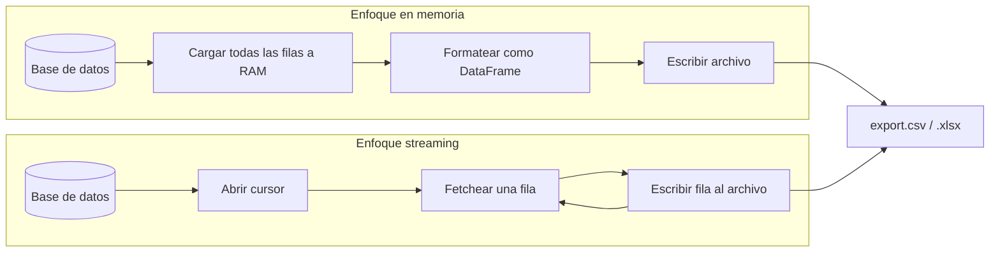

## Visión General

La exportación a CSV y Excel es el proceso de convertir datos estructurados en
formatos de archivo compatibles con hojas de cálculo para descarga, compartir o
analizar. Exportar a CSV o Excel es algo que casi todo dashboard de
administración o
herramienta de reporting necesita. La parte complicada es manejar datasets
grandes sin quedarse sin memoria. Esta receta cubre generación eficiente de
CSV/Excel en Python, JavaScript y Java. Para la operación inversa, ver la
[receta de import CSV/Excel](/es/recipes/import-csv-excel/).

## Cuándo Usar

- Los usuarios necesitan descargar reportes o datos filtrados desde una app web.
- Migrás datos entre sistemas y necesitás un formato de archivo intermedio.
- Construís un panel de administración con exportación masiva.
- Procesás datos para hojas de cálculo, BI u otras apps externas.
- Necesitás [stream processing](/es/recipes/stream-processing/) para fuentes de
  datos ilimitadas que no entran en memoria.

### Cuándo evitarlo

- Necesitás una respuesta de API en tiempo real. El streaming de archivos
  bloquea o complica el request.
- El dataset entra en memoria y solo necesitás una exportación puntual. Un
  script simple alcanza.
- Necesitás un reporte con gráficos y visuales. Usá una librería de reporting.

## Solución

### Python (pandas y csv)

Usa [pandas](https://pandas.pydata.org/docs/reference/api/pandas.DataFrame.to_csv.html)
y el módulo built-in `csv`.

```python
import csv
import pandas as pd

# Dataset pequeño: pandas a CSV
users = [
    {"id": 1, "name": "Alice", "email": "alice@example.com"},
    {"id": 2, "name": "Bob", "email": "bob@example.com"},
]
df = pd.DataFrame(users)
df.to_csv("users.csv", index=False)

# Dataset grande: streaming CSV con un generador
def generate_rows(cursor):
    for row in cursor:
        yield row

with open("export.csv", "w", newline="", encoding="utf-8") as f:
    writer = csv.writer(f)
    writer.writerow(["id", "name", "email"])
    for row in generate_rows(db_cursor):
        writer.writerow(row)

# Excel con múltiples hojas
with pd.ExcelWriter("report.xlsx", engine="openpyxl") as writer:
    df.to_excel(writer, sheet_name="Users", index=False)
```

### JavaScript (fast-csv y xlsx)

Usa [fast-csv](https://www.npmjs.com/package/fast-csv) y
[xlsx (SheetJS)](https://www.npmjs.com/package/xlsx).

```javascript
const { format } = require("fast-csv");
const XLSX = require("xlsx");

const rows = [
  { id: 1, name: "Alice", email: "alice@example.com" },
  { id: 2, name: "Bob", email: "bob@example.com" },
];

// Dataset pequeño: CSV en memoria
format.write(rows, { headers: true }).pipe(process.stdout);

// Dataset grande: streaming a respuesta HTTP
async function streamCsv(res, dbQuery) {
  res.setHeader("Content-Type", "text/csv");
  res.setHeader("Content-Disposition", "attachment; filename=export.csv");
  const stream = dbQuery.stream();
  stream.pipe(format({ headers: true })).pipe(res);
}

// Generación Excel
const ws = XLSX.utils.json_to_sheet(rows);
const wb = XLSX.utils.book_new();
XLSX.utils.book_append_sheet(wb, ws, "Users");
XLSX.writeFile(wb, "users.xlsx");
```

### Java (Apache Commons CSV + Apache POI)

Usa [Apache Commons CSV](https://commons.apache.org/proper/commons-csv/) y
[Apache POI](https://poi.apache.org/).

```java
import org.apache.commons.csv.CSVFormat;
import org.apache.commons.csv.CSVPrinter;
import org.apache.poi.ss.usermodel.*;
import org.apache.poi.xssf.usermodel.XSSFWorkbook;
import java.io.*;
import java.nio.file.*;

public class Exporter {

    public void exportCsv(Iterable<Iterable<String>> rows, Path path) throws IOException {
        try (BufferedWriter writer = Files.newBufferedWriter(path);
             CSVPrinter printer = new CSVPrinter(writer, CSVFormat.DEFAULT.withHeader("id", "name", "email"))) {
            for (Iterable<String> row : rows) {
                printer.printRecord(row);
            }
        }
    }

    public void exportExcel(Iterable<Iterable<String>> rows, Path path) throws IOException {
        try (Workbook workbook = new XSSFWorkbook()) {
            Sheet sheet = workbook.createSheet("Users");
            int rowNum = 0;
            for (Iterable<String> rowData : rows) {
                Row row = sheet.createRow(rowNum++);
                int colNum = 0;
                for (String cellData : rowData) {
                    row.createCell(colNum++).setCellValue(cellData);
                }
            }
            workbook.write(Files.newOutputStream(path));
        }
    }
}
```

### Sanitización de CSV injection

CSV injection ocurre cuando el valor de una celda empieza con `=`, `+`, `-` o
`@` y Excel lo interpreta como una fórmula. Vi este exploit en producción donde
datos generados por usuarios llegaron a una hoja de cálculo del equipo de
finanzas.

```python
# Python
def sanitize_csv_cell(value: str) -> str:
    if value and value[0] in ("=", "+", "-", "@"):
        return f"'{value}"
    return value

# Aplicar antes de escribir
writer.writerow([sanitize_csv_cell(str(v)) for v in row])
```

```javascript
// JavaScript
function sanitizeCsvCell(value) {
  if (value && ["=", "+", "-", "@"].includes(value[0])) {
    return `'${value}`;
  }
  return value;
}

rows.map((row) =>
  Object.fromEntries(
    Object.entries(row).map(([k, v]) => [k, sanitizeCsvCell(String(v))])
  )
);
```

```java
// Java
public static String sanitizeCsvCell(String value) {
    if (value != null && !value.isEmpty()
            && "=+-@".indexOf(value.charAt(0)) >= 0) {
        return "'" + value;
    }
    return value;
}
```

### Apache POI SXSSF para archivos Excel grandes

Cuando necesitás formato Excel con más de 100K filas, `XSSFWorkbook` se queda
sin memoria. `SXSSFWorkbook` mantiene solo una ventana deslizante de filas en
memoria y flusha el resto a disco.

```java
import org.apache.poi.xssf.streaming.SXSSFWorkbook;
import org.apache.poi.xssf.streaming.SXSSFSheet;
import org.apache.poi.xssf.streaming.SXSSFRow;

public void exportLargeExcel(Iterable<List<String>> rows, Path path) throws IOException {
    try (SXSSFWorkbook workbook = new SXSSFWorkbook(100)) { // ventana de 100 filas
        SXSSFSheet sheet = workbook.createSheet("Data");
        int rowNum = 0;
        for (List<String> rowData : rows) {
            SXSSFRow row = sheet.createRow(rowNum++);
            for (int i = 0; i < rowData.size(); i++) {
                row.createCell(i).setCellValue(rowData.get(i));
            }
        }
        workbook.write(Files.newOutputStream(path));
        workbook.dispose(); // limpia archivos temporales
    }
}
```

La llamada `dispose()` elimina los archivos temporales en disco. Olvidarla fuga
espacio en `java.io.tmpdir`. Una vez rastreé un directorio temp de 40GB causado
por un `dispose()` faltante en un job de exportación batch.

### Endpoint Express.js con streaming y manejo de errores

```javascript
const express = require("express");
const { format } = require("fast-csv");
const app = express();

app.get("/export/users", async (req, res) => {
  res.setHeader("Content-Type", "text/csv");
  res.setHeader("Content-Disposition", "attachment; filename=users.csv");

  try {
    const cursor = db.collection("users").find({}, { batchSize: 1000 });
    const stream = cursor.stream();
    const csvStream = format({ headers: true });

    stream.on("error", (err) => {
      console.error("DB stream error:", err);
      if (!res.headersSent) res.status(500).send("Export failed");
      stream.destroy();
    });

    csvStream.on("error", (err) => {
      console.error("CSV stream error:", err);
      stream.destroy();
    });

    req.on("aborted", () => {
      stream.destroy();
      csvStream.destroy();
    });

    stream.pipe(csvStream).pipe(res);
  } catch (err) {
    if (!res.headersSent) res.status(500).json({ error: err.message });
  }
});

app.listen(3000);
```

El handler `req.on("aborted")` detiene el cursor de la base de datos cuando el
cliente se desconecta. Sin eso, la query sigue corriendo y desperdicia
recursos. La opción `batchSize` controla cuántos documentos MongoDB fetcha por
round trip de red — lo seteo en 1000 como balance entre memoria y latencia.

## Explicación

La decisión central es **memoria vs. conveniencia**. Para parsear archivos CSV
en lugar de escribirlos, ver la
[receta de parse CSV files](/es/recipes/parse-csv-files/).



El path de streaming mantiene solo una fila en memoria a la vez, mientras que el
enfoque en memoria carga todo el dataset antes de escribir nada.

| Enfoque | Cómo funciona | Ideal para |
| --- | --- | --- |
| **En memoria** | Carga todos los datos, los formatea y escribe a disco | Datasets menores a ~100K filas |
| **Streaming** | Procesa una fila a la vez y escribe directamente | Datasets grandes o ilimitados |

CSV es texto plano y fácil de stream. Los `.xlsx` son archivos ZIP con XML,
así que `openpyxl` y Apache POI los construyen en memoria o con ventanas
deslizantes. Para archivos Excel muy grandes usá Apache POI `SXSSF` o escribí
CSV y dejá que el usuario lo abra en Excel.

### Benchmark: en memoria vs streaming

Corrí un benchmark exportando 500K filas de datos de usuarios en una máquina de
4 cores y 8GB. Los números de abajo son aproximados — los resultados dependen
del ancho de fila, velocidad de disco y driver de base de datos.

| Enfoque | Lenguaje | Filas/seg | Memoria pico | Tamaño archivo |
| --- | --- | --- | --- | --- |
| `csv.writer` + cursor | Python | ~75K | ~20 MB | 45 MB CSV |
| `pandas.to_csv` | Python | ~200K | ~1.2 GB | 45 MB CSV |
| `fast-csv` + stream | Node.js | ~100K | ~25 MB | 45 MB CSV |
| `XSSFWorkbook` | Java | ~8K | ~900 MB | 120 MB XLSX |
| `SXSSFWorkbook` (window=100) | Java | ~12K | ~50 MB | 120 MB XLSX |

La conclusión clave: `pandas.to_csv` es rápido pero necesita todos los datos en
RAM. Los enfoques de streaming son 5-10x más eficientes en memoria a un costo
modesto de velocidad. SXSSF es más lento que CSV plano pero maneja formato
Excel sin OOM. Para cualquier cosa mayor a 100K filas, por defecto uso streaming
CSV y salteo Excel salvo que el usuario lo necesite específicamente.

## Variantes

| Formato | Librería | Streaming | Ideal para |
| --- | --- | --- | --- |
| CSV | Python `csv` | Sí | Universal, liviano, cualquier tamaño |
| CSV | `fast-csv` (JS) | Sí | Exports streaming en Node.js |
| CSV | Apache Commons CSV | Sí | Java enterprise |
| Excel | `openpyxl` (Python) | Parcial (`write_only`) | Reportes multi-hoja |
| Excel | `xlsx` (JS) | No | Generación del lado del cliente |
| Excel | Apache POI SXSSF | Sí | Archivos Excel grandes (>100K filas) |

## Mejores Prácticas

- Stream anything que supere 10K filas. Mantener millones de objetos en memoria
  crashea.
- Seteá un nombre significativo en `Content-Disposition`, como
  `report-2024-01-users.csv`.
- Elegí CSV para intercambio de datos. Excel es más lento y propietario.
- Sanitizá celdas que empiecen con `=`, `+`, `-` o `@` para prevenir
  [CSV injection](https://owasp.org/www-community/attacks/CSV_Injection).
  Anteponé un tab o una comilla simple.
- Formateá fechas y números explícitamente. Usá ISO 8601 para los valores de
  fecha.
- Agregá un UTF-8 BOM (`\ufeff`) al inicio de CSV para Excel en Windows.
- Cerrá los [file handles](/es/recipes/read-write-file/) y descartá los
  archivos temporales de `SXSSFWorkbook`.

## Errores Comunes

- Cargar millones de filas en memoria de una. `SELECT * FROM huge_table` en un
  DataFrame crashea. Stream o paginá.
- Olvidar el BOM para Excel en Windows. Los caracteres especiales se ven mal.
- Ignorar CSV injection. Un valor como `=cmd|' /C calc'!A0` puede ejecutar una
  fórmula en Excel.
- Bloquear el event loop de Node.js. Generá archivos grandes de forma
  asíncrona o en un worker.
- No cerrar `Workbook` u `OutputStream` en Java, lo que fuga memoria y bloquea
  archivos.

## FAQ

### ¿Cómo exporto un millón de filas sin crashear?

Usá streaming. En Python escribí una fila a la vez con `csv.writer`. En Java
usá Apache POI `SXSSFWorkbook` con ventana deslizante. En JavaScript pipeá un
cursor a la respuesta HTTP.

### ¿Debería exportar CSV o Excel?

Usá CSV para intercambio de datos, archivos grandes o cuando el usuario va a
importar en otro sistema. Usá Excel cuando necesitás formato, varias hojas,
fórmulas o usuarios no técnicos esperen una hoja de cálculo.

### ¿Cómo manejo caracteres especiales y encoding?

Siempre escribí UTF-8. Agregá un BOM (`\ufeff`) al inicio para Excel en Windows.
Doblá las comillas dobles dentro de los campos CSV. Para Excel, `openpyxl` y POI
manejan Unicode nativamente.

### ¿Cómo exporto varios CSV como ZIP?

```python
import zipfile
import csv
import io

def export_csv_zip(datasets, output_path):
    with zipfile.ZipFile(output_path, "w", zipfile.ZIP_DEFLATED) as zf:
        for filename, rows in datasets.items():
            buffer = io.StringIO()
            if rows:
                writer = csv.DictWriter(buffer, fieldnames=rows[0].keys())
                writer.writeheader()
                writer.writerows(rows)
            zf.writestr(f"{filename}.csv", buffer.getvalue())
```

### ¿Cómo exporto a Excel con fórmulas?

Usá `openpyxl` (Python) o Apache POI (Java) para escribir fórmulas como strings
en celdas. En Python:

```python
from openpyxl import Workbook

wb = Workbook()
ws = wb.active
ws["A1"] = 10
ws["A2"] = 20
ws["A3"] = "=SUM(A1:A2)"
wb.calculation.calcMode = "auto"
wb.save("formulas.xlsx")
```

### ¿Cuáles son las características de rendimiento?

Python `csv.writer` con cursor: ~50K-100K filas/segundo y memoria constante.
pandas `to_csv`: ~200K filas/segundo pero necesita todos los datos en RAM.
Apache POI `SXSSFWorkbook`: ~10K filas/segundo y ~50 MB constantes. `fast-csv`
en Node.js: ~100K filas/segundo y ~20 MB. Los archivos CSV suelen ser 3-4x más
chicos que XLSX.

## Ver También

- [Repositorio companion — ejemplos ejecutables](https://mathiaspaulenko.github.io/stack-practices-resources/resources/recipes/file-handling/export-csv-excel/)
  en Python, JavaScript y Java.
- [Documentación de pandas to_csv](https://pandas.pydata.org/docs/reference/api/pandas.DataFrame.to_csv.html)
  — referencia oficial para export CSV con DataFrame.
- [Apache POI SXSSF streaming](https://poi.apache.org/components/spreadsheet/)
  — generación de hojas de cálculo grandes con ventana deslizante.
- [OWASP CSV Injection](https://owasp.org/www-community/attacks/CSV_Injection)
  — guía de seguridad para ataques de inyección de fórmulas.
- [RFC 4180 formato CSV](https://datatracker.ietf.org/doc/html/rfc4180)
  — la especificación del formato CSV.
- [MDN Content-Disposition](https://developer.mozilla.org/en-US/docs/Web/HTTP/Headers/Content-Disposition)
  — header HTTP para prompts de descarga de archivos.
