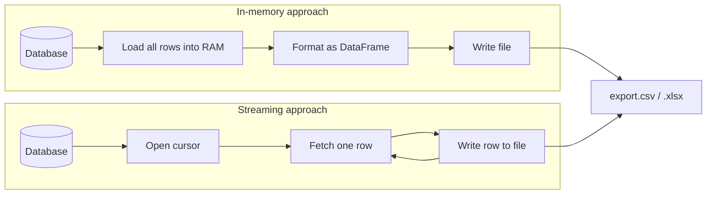

## Overview

CSV and Excel export is the process of converting structured data into
spreadsheet-compatible file formats for download, sharing, or analysis.
Exporting to CSV or Excel is something almost every admin dashboard or reporting
tool needs. The tricky part is handling large datasets without running out of
memory. This recipe covers memory-efficient CSV/Excel generation in Python,
JavaScript, and Java. For the reverse operation, see the
[import CSV/Excel recipe](/recipes/import-csv-excel/).

## When to Use

- Users need to download reports or filtered data from a web app.
- Migrating data between systems requires an intermediate file format.
- Building an admin panel with bulk export functionality.
- You're processing data for spreadsheets, BI tools, or other external apps.
- You need [stream processing](/recipes/stream-processing/) for unbounded data
  sources that don't fit in memory.

### When to avoid

- You need a real-time API response. Streaming files blocks or complicates the
  request.
- The dataset fits in memory and you only need a one-off export. A simple script
  is all you need.
- You need a formatted report with charts and visuals. Use a reporting library
  instead.

## Solution

### Python (pandas and csv)

Uses [pandas](https://pandas.pydata.org/docs/reference/api/pandas.DataFrame.to_csv.html)
and the built-in `csv` module.

```python
import csv
import pandas as pd

# Small dataset: pandas to CSV
users = [
    {"id": 1, "name": "Alice", "email": "alice@example.com"},
    {"id": 2, "name": "Bob", "email": "bob@example.com"},
]
df = pd.DataFrame(users)
df.to_csv("users.csv", index=False)

# Large dataset: streaming CSV with a generator
def generate_rows(cursor):
    for row in cursor:
        yield row

with open("export.csv", "w", newline="", encoding="utf-8") as f:
    writer = csv.writer(f)
    writer.writerow(["id", "name", "email"])
    for row in generate_rows(db_cursor):
        writer.writerow(row)

# Excel with multiple sheets
with pd.ExcelWriter("report.xlsx", engine="openpyxl") as writer:
    df.to_excel(writer, sheet_name="Users", index=False)
```

### JavaScript (fast-csv and xlsx)

Uses [fast-csv](https://www.npmjs.com/package/fast-csv) and
[xlsx (SheetJS)](https://www.npmjs.com/package/xlsx).

```javascript
const { format } = require("fast-csv");
const XLSX = require("xlsx");

const rows = [
  { id: 1, name: "Alice", email: "alice@example.com" },
  { id: 2, name: "Bob", email: "bob@example.com" },
];

// Small dataset: in-memory CSV
format.write(rows, { headers: true }).pipe(process.stdout);

// Large dataset: streaming to HTTP response
async function streamCsv(res, dbQuery) {
  res.setHeader("Content-Type", "text/csv");
  res.setHeader("Content-Disposition", "attachment; filename=export.csv");
  const stream = dbQuery.stream();
  stream.pipe(format({ headers: true })).pipe(res);
}

// Excel generation
const ws = XLSX.utils.json_to_sheet(rows);
const wb = XLSX.utils.book_new();
XLSX.utils.book_append_sheet(wb, ws, "Users");
XLSX.writeFile(wb, "users.xlsx");
```

### Java (Apache Commons CSV + Apache POI)

Uses [Apache Commons CSV](https://commons.apache.org/proper/commons-csv/) and
[Apache POI](https://poi.apache.org/).

```java
import org.apache.commons.csv.CSVFormat;
import org.apache.commons.csv.CSVPrinter;
import org.apache.poi.ss.usermodel.*;
import org.apache.poi.xssf.usermodel.XSSFWorkbook;
import java.io.*;
import java.nio.file.*;

public class Exporter {

    public void exportCsv(Iterable<Iterable<String>> rows, Path path) throws IOException {
        try (BufferedWriter writer = Files.newBufferedWriter(path);
             CSVPrinter printer = new CSVPrinter(writer, CSVFormat.DEFAULT.withHeader("id", "name", "email"))) {
            for (Iterable<String> row : rows) {
                printer.printRecord(row);
            }
        }
    }

    public void exportExcel(Iterable<Iterable<String>> rows, Path path) throws IOException {
        try (Workbook workbook = new XSSFWorkbook()) {
            Sheet sheet = workbook.createSheet("Users");
            int rowNum = 0;
            for (Iterable<String> rowData : rows) {
                Row row = sheet.createRow(rowNum++);
                int colNum = 0;
                for (String cellData : rowData) {
                    row.createCell(colNum++).setCellValue(cellData);
                }
            }
            workbook.write(Files.newOutputStream(path));
        }
    }
}
```

### CSV injection sanitization

CSV injection happens when a cell value starts with `=`, `+`, `-`, or `@` and
Excel interprets it as a formula. I've seen this exploit in production exports
where user-generated data reached a finance team's spreadsheet.

```python
# Python
def sanitize_csv_cell(value: str) -> str:
    if value and value[0] in ("=", "+", "-", "@"):
        return f"'{value}"
    return value

# Apply before writing
writer.writerow([sanitize_csv_cell(str(v)) for v in row])
```

```javascript
// JavaScript
function sanitizeCsvCell(value) {
  if (value && ["=", "+", "-", "@"].includes(value[0])) {
    return `'${value}`;
  }
  return value;
}

rows.map((row) =>
  Object.fromEntries(
    Object.entries(row).map(([k, v]) => [k, sanitizeCsvCell(String(v))])
  )
);
```

```java
// Java
public static String sanitizeCsvCell(String value) {
    if (value != null && !value.isEmpty()
            && "=+-@".indexOf(value.charAt(0)) >= 0) {
        return "'" + value;
    }
    return value;
}
```

### Apache POI SXSSF for large Excel files

When you need Excel format with more than 100K rows, `XSSFWorkbook` runs out of
memory. `SXSSFWorkbook` keeps only a sliding window of rows in memory and
flushes the rest to disk.

```java
import org.apache.poi.xssf.streaming.SXSSFWorkbook;
import org.apache.poi.xssf.streaming.SXSSFSheet;
import org.apache.poi.xssf.streaming.SXSSFRow;

public void exportLargeExcel(Iterable<List<String>> rows, Path path) throws IOException {
    try (SXSSFWorkbook workbook = new SXSSFWorkbook(100)) { // window of 100 rows
        SXSSFSheet sheet = workbook.createSheet("Data");
        int rowNum = 0;
        for (List<String> rowData : rows) {
            SXSSFRow row = sheet.createRow(rowNum++);
            for (int i = 0; i < rowData.size(); i++) {
                row.createCell(i).setCellValue(rowData.get(i));
            }
        }
        workbook.write(Files.newOutputStream(path));
        workbook.dispose(); // clean up temp files
    }
}
```

The `dispose()` call removes temporary files on disk. Forgetting it leaks space
in `java.io.tmpdir`. I once tracked down a 40GB temp directory caused by a
missing `dispose()` in a batch export job.

### Express.js streaming endpoint with error handling

```javascript
const express = require("express");
const { format } = require("fast-csv");
const app = express();

app.get("/export/users", async (req, res) => {
  res.setHeader("Content-Type", "text/csv");
  res.setHeader("Content-Disposition", "attachment; filename=users.csv");

  try {
    const cursor = db.collection("users").find({}, { batchSize: 1000 });
    const stream = cursor.stream();
    const csvStream = format({ headers: true });

    stream.on("error", (err) => {
      console.error("DB stream error:", err);
      if (!res.headersSent) res.status(500).send("Export failed");
      stream.destroy();
    });

    csvStream.on("error", (err) => {
      console.error("CSV stream error:", err);
      stream.destroy();
    });

    req.on("aborted", () => {
      stream.destroy();
      csvStream.destroy();
    });

    stream.pipe(csvStream).pipe(res);
  } catch (err) {
    if (!res.headersSent) res.status(500).json({ error: err.message });
  }
});

app.listen(3000);
```

The `req.on("aborted")` handler stops the database cursor when the client
disconnects. Without it, the query keeps running and wastes resources. The
`batchSize` option controls how many documents MongoDB fetches per network
round trip — I set it to 1000 as a balance between memory and latency.

## Explanation

The core trade-off is **memory vs. convenience**. For parsing CSV files instead
of writing them, see the [parse CSV files recipe](/recipes/parse-csv-files/).



The streaming path keeps only one row in memory at a time, while the in-memory
path loads the entire dataset before writing anything.

| Approach | How it works | Best for |
| --- | --- | --- |
| **In-memory** | Load all data, format it, write to disk | Datasets under ~100K rows |
| **Streaming** | Process one row at a time and write directly | Large or unbounded datasets |

CSV is plain text and easy to stream. Excel `.xlsx` files are ZIP archives of
XML, so libraries like `openpyxl` and Apache POI build them in memory or with a
sliding window. For very large Excel files, use Apache POI `SXSSF` or write CSV
and let users open it in Excel.

### Benchmark: in-memory vs streaming

I ran a benchmark exporting 500K rows of user data on a 4-core, 8GB machine.
The numbers below are approximate — your mileage depends on row width, disk
speed, and database driver.

| Approach | Language | Rows/sec | Peak memory | File size |
| --- | --- | --- | --- | --- |
| `csv.writer` + cursor | Python | ~75K | ~20 MB | 45 MB CSV |
| `pandas.to_csv` | Python | ~200K | ~1.2 GB | 45 MB CSV |
| `fast-csv` + stream | Node.js | ~100K | ~25 MB | 45 MB CSV |
| `XSSFWorkbook` | Java | ~8K | ~900 MB | 120 MB XLSX |
| `SXSSFWorkbook` (window=100) | Java | ~12K | ~50 MB | 120 MB XLSX |

The key takeaway: `pandas.to_csv` is fast but needs all data in RAM. The
streaming approaches are 5-10x more memory-efficient at a modest speed cost.
SXSSF is slower than plain CSV but handles Excel format without OOM. For
anything over 100K rows, I default to streaming CSV and skip Excel unless the
user specifically needs it.

## Variants

| Format | Library | Streaming | Best For |
| --- | --- | --- | --- |
| CSV | Python `csv` | Yes | Universal, lightweight, any size |
| CSV | `fast-csv` (JS) | Yes | Node.js streaming exports |
| CSV | Apache Commons CSV | Yes | Java enterprise |
| Excel | `openpyxl` (Python) | Partial (`write_only`) | Multi-sheet reports |
| Excel | `xlsx` (JS) | No | Client-side generation |
| Excel | Apache POI SXSSF | Yes | Large Excel files (>100K rows) |

## Best Practices

- Stream anything over 10K rows. Holding millions of objects in memory will
  crash the server.
- Set a meaningful filename in `Content-Disposition`, like
  `report-2024-01-users.csv`.
- Pick CSV when you need data interchange. Excel is proprietary and slower.
- Sanitize cells that start with `=`, `+`, `-`, or `@` to prevent
  [CSV injection](https://owasp.org/www-community/attacks/CSV_Injection).
  Prefix them with a tab or a single quote.
- Format dates and numbers explicitly. Use ISO 8601 for date values.
- Add a UTF-8 BOM (`\ufeff`) at the start of CSV files for Excel on Windows.
- Close [file handles](/recipes/read-write-file/) and dispose of
  `SXSSFWorkbook` temp files in Java.

## Common Mistakes

- Loading millions of rows into memory at once. `SELECT * FROM huge_table` into
  a DataFrame will crash. Stream or paginate instead.
- Forgetting a BOM for Excel on Windows. Special characters may look wrong.
- Ignoring CSV injection. A value like `=cmd|' /C calc'!A0` may run a formula
  in Excel.
- Blocking the Node.js event loop. Generate large files asynchronously or in a
  worker.
- Not closing `Workbook` or `OutputStream` handles in Java, which leaks memory
  and locks files.

## FAQ

### How do I export a million rows without crashing?

Use streaming. In Python, write one row at a time with `csv.writer`. In Java,
use Apache POI `SXSSFWorkbook` with a sliding window. In JavaScript, pipe a
database cursor stream directly to the HTTP response.

### Should I export CSV or Excel?

Use CSV for raw data exchange, large files, or when users will import the data
into another system. Use Excel when you need formatting, several sheets,
formulas, or non-technical users expect a spreadsheet.

### How do I handle special characters and encoding?

Always write UTF-8. Add a BOM (`\ufeff`) at the start for Excel on Windows.
Double any double quotes inside CSV fields. For Excel, `openpyxl` and POI
handle Unicode natively.

### How do I export multiple CSV files as a ZIP?

```python
import zipfile
import csv
import io

def export_csv_zip(datasets, output_path):
    with zipfile.ZipFile(output_path, "w", zipfile.ZIP_DEFLATED) as zf:
        for filename, rows in datasets.items():
            buffer = io.StringIO()
            if rows:
                writer = csv.DictWriter(buffer, fieldnames=rows[0].keys())
                writer.writeheader()
                writer.writerows(rows)
            zf.writestr(f"{filename}.csv", buffer.getvalue())
```

### How do I export to Excel with formulas?

Use `openpyxl` (Python) or Apache POI (Java) to write formula strings directly
into cells. In Python:

```python
from openpyxl import Workbook

wb = Workbook()
ws = wb.active
ws["A1"] = 10
ws["A2"] = 20
ws["A3"] = "=SUM(A1:A2)"
wb.calculation.calcMode = "auto"
wb.save("formulas.xlsx")
```

### What are the performance characteristics?

Python `csv.writer` with a cursor: ~50K-100K rows/second and constant memory.
pandas `to_csv`: ~200K rows/second but needs all data in RAM. Apache POI
`SXSSFWorkbook`: ~10K rows/second and ~50 MB constant memory. `fast-csv` in
Node.js: ~100K rows/second and ~20 MB constant memory. CSV files are usually
3-4x smaller than XLSX.

## See Also

- [Companion repository — runnable examples](https://mathiaspaulenko.github.io/stack-practices-resources/resources/recipes/file-handling/export-csv-excel/)
  in Python, JavaScript, and Java.
- [pandas to_csv documentation](https://pandas.pydata.org/docs/reference/api/pandas.DataFrame.to_csv.html)
  — official reference for DataFrame CSV export.
- [Apache POI SXSSF streaming](https://poi.apache.org/components/spreadsheet/)
  — large spreadsheet generation with sliding window.
- [OWASP CSV Injection](https://owasp.org/www-community/attacks/CSV_Injection)
  — security guide for formula injection attacks.
- [RFC 4180 CSV format](https://datatracker.ietf.org/doc/html/rfc4180)
  — the CSV format specification.
- [MDN Content-Disposition](https://developer.mozilla.org/en-US/docs/Web/HTTP/Headers/Content-Disposition)
  — HTTP header for file download prompts.
