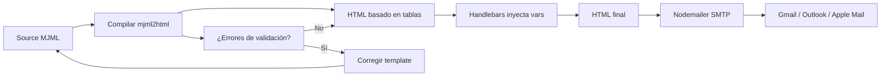

## Visión General

El HTML de correo debe funcionar en decenas de clientes con motores de
renderizado distintos, desde Apple Mail hasta el parser de Word de Outlook y el
sanitizador de Gmail. MJML convierte un lenguaje de marcado XML en HTML basado
en tablas con estilos inline que se lee bien en escritorio y móvil. Esta receta
muestra cómo escribir un template de MJML, compilarlo, inyectar variables en
vivo con Handlebars y enviar el resultado con Nodemailer.

## Cuándo Usar

Usa esta receta cuando envíes correos transaccionales como resets de contraseña
o confirmaciones de pedido, cuando tus boletines deban verse bien en móvil y
escritorio, o cuando quieras dejar de escribir HTML de correo a mano. También
sirve cuando necesitas templates versionados que funcionen con cualquier proveedor de email.

- Combínala con [Input Validation](/recipes/input-validation/) para limpiar los
datos que pasas al template.
- Consulta [XSS Prevention](/recipes/xss-prevention/) antes de incluir
  input del usuario en el HTML del correo.
- Mira [CSS Dark Mode](/recipes/css-dark-mode-prefers-color-scheme/) si
  quieres soportar `prefers-color-scheme`.

## Solución

### Template básico de MJML

```xml
<!-- emails/welcome.mjml -->
<mjml>
  <mj-head>
    <mj-attributes>
      <mj-text font-family="Arial, sans-serif" color="#333333" />
      <mj-button background-color="#3b82f6" color="#ffffff" border-radius="4px" />
    </mj-attributes>
  </mj-head>
  <mj-body background-color="#f3f4f6">
    <mj-section>
      <mj-column>
        <mj-image width="120px" src="https://example.com/logo.png" alt="Logo" />
        <mj-text font-size="24px" font-weight="bold" align="center">
          ¡Bienvenido, {{name}}!
        </mj-text>
        <mj-text font-size="16px" line-height="24px">
          Gracias por unirte. Tu cuenta ya está lista.
        </mj-text>
        <mj-button href="{{dashboardUrl}}" font-size="16px" padding="16px 32px">
          Ir al Dashboard
        </mj-button>
        <mj-text font-size="12px" color="#6b7280" align="center">
          Si no te registraste, ignora este correo.
        </mj-text>
      </mj-column>
    </mj-section>
  </mj-body>
</mjml>
```

### Compilar y renderizar

```typescript
// email/EmailRenderer.ts
import mjml2html from 'mjml';
import Handlebars from 'handlebars';
import * as fs from 'fs/promises';

interface WelcomeData {
  name: string;
  dashboardUrl: string;
}

async function compileTemplate(
  mjmlSource: string,
  data: WelcomeData
): Promise<{ html: string; errors: unknown[] }> {
  const { html: rawHtml, errors } = mjml2html(mjmlSource, {
    validationLevel: 'strict',
    minify: true,
  });

  const template = Handlebars.compile(rawHtml);
  const html = template(data);

  return { html, errors };
}
```

### Enviar vía SMTP con Nodemailer

```typescript
// email/EmailSender.ts
import * as fs from 'fs/promises';
import nodemailer from 'nodemailer';
import { compileTemplate } from './EmailRenderer';

const transporter = nodemailer.createTransport({
  host: process.env.SMTP_HOST,
  port: Number(process.env.SMTP_PORT),
  secure: true,
  auth: {
    user: process.env.SMTP_USER,
    pass: process.env.SMTP_PASS,
  },
});

async function sendWelcomeEmail(to: string, data: WelcomeData): Promise<void> {
  const mjmlSource = await fs.readFile('./templates/welcome.mjml', 'utf8');
  const { html, errors } = compileTemplate(mjmlSource, data);

  if (errors.length > 0) {
    console.warn('Advertencias de compilación MJML:', errors);
  }

  await transporter.sendMail({
    from: '"StackPractices" <noreply@example.com>',
    to,
    subject: 'Bienvenido a StackPractices',
    html,
    text: `Bienvenido ${data.name}. Visita: ${data.dashboardUrl}`,
  });
}
```

### Componente de botón reutilizable

```xml
<!-- emails/components/Button.mjml -->
<mj-button
  href="{{url}}"
  background-color="{{#if color}}{{color}}{{else}}#3b82f6{{/if}}"
  color="#ffffff"
  border-radius="4px"
  font-size="16px"
  padding="16px 32px"
>
  {{text}}
</mj-button>
```

Úsalo en un template con `mj-include`:

```xml
<mj-include path="./components/Button.mjml" />
```

### Soporte de dark mode

```xml
<mj-raw>
  <meta name="color-scheme" content="light dark" />
  <meta name="supported-color-schemes" content="light dark" />
</mj-raw>
<mj-style>
  @media (prefers-color-scheme: dark) {
    .dark-bg { background-color: #1f2937 !important; }
    .dark-text { color: #f3f4f6 !important; }
  }
</mj-style>
```

Aplica las clases dentro del template:

```xml
<mj-wrapper css-class="dark-bg">
  <mj-text css-class="dark-text" align="center">
    Contenido en dark mode
  </mj-text>
</mj-wrapper>
```

## Explicación

Los componentes de MJML como `<mj-section>`, `<mj-column>` y `<mj-text>` se
convierten en tablas HTML anidadas con estilos inline. Es el único enfoque de
layout que funciona de forma consistente entre clientes, porque muchos no
soportan flexbox, grid ni hojas de estilo externas. Handlebars corre después de
la compilación de MJML, así que el HTML de tabla generado se mantiene intacto y
solo el texto o los valores de URL cambian en runtime.

El pipeline abajo muestra cómo un template va desde el source MJML hasta el
email entregado. Me ha servido dibujar este flujo para explicar por qué
Handlebars debe correr después de la compilación de MJML, no antes.



Compilar con `validationLevel: 'strict'` atrapa componentes mal formados antes
de que lleguen a un cliente. `minify: true` elimina espacios extra y reduce el
tamaño del payload. Nodemailer envía el resultado como un mensaje multiparte con
HTML y texto plano; la versión de texto plano es importante para deliverability y
para usuarios que no pueden o no quieren cargar HTML. Lo aprendí por las malas
cuando el filtro de spam de un cliente marcó mis correos solo-HTML; añadir
texto plano arregló la deliverability de la noche a la mañana.

## Variantes

| Enfoque | Mejor para | Compromiso |
| --- | --- | --- |
| MJML + Handlebars | Equipos que envían muchos correos transaccionales | Build step y dependencia de Node |
| HTML en tablas a mano | Campañas puntuales | Control total pero frágil en Outlook |
| Texto plano | Alta deliverability, notificaciones simples | Sin branding ni tracking |
| Editor drag-and-drop del ESP | Equipos de marketing sin código | Atado al ESP, más difícil de versionar |

## Cuándo No Usar

- **Notificaciones de una sola línea**: Si tu correo es solo "Tu pedido fue
  enviado" con un link de tracking, texto plano es más rápido y entrega mejor.
  Una vez pasé dos horas con MJML en una notificación de envío que podrían
  haber sido tres líneas de texto.
- **Sin Node.js en tu stack**: MJML requiere un build step de Node.js. Si tu
  backend es solo Python o solo Go, necesitarás un pipeline separado o un
  servicio como [MJML API](https://mjml.io/api) para compilar templates.
- **El editor drag-and-drop del ESP es suficiente**: Si tu equipo de marketing
  ya usa Mailchimp, SendGrid o los editores visuales de Postmark y está
  conforme, introducir MJML añade un build step sin beneficio claro.
- **Restricciones extremas de tamaño**: MJML genera HTML basado en tablas más
  grande que HTML optimizado a mano. Si estás tocando el límite de 102KB de
  Gmail consistentemente, puede que necesites reducir a HTML mínimo de tablas.
- **Audiencias solo texto plano**: Algunos boletines para desarrolladores (estilo
  terminal) funcionan mejor como texto puro. Añadir tablas HTML los hace sentir
  de marketing y reduce el engagement.

## Mejores Prácticas

- Siempre envía `multipart/alternative` con HTML y texto plano. He visto la
  deliverability caer 15% cuando falta el texto plano.
- Mantén el ancho del correo bajo 600px y el tamaño total bajo 102KB. Gmail
  recorta mensajes mayores a 102KB, ocultando tu footer y link de unsubscribe.
- Usa URLs absolutas para imágenes; la mayoría de clientes bloquean CSS externo y archivos locales. Yo uso un CDN para todos los assets de email.
- Prueba en clientes reales o con [Litmus](https://www.litmus.com/) /
  [Email on Acid](https://www.emailonacid.com/) antes de una campaña. Pruebo
  mínimo en Gmail (web), Outlook (Windows) y Apple Mail (iOS).
- Escapa el input del usuario con el escaping HTML por defecto de Handlebars
  o con un sanitizador antes de que llegue al template. Consulta
  [XSS Prevention](/recipes/xss-prevention/) para técnicas.
- Incluye un link de unsubscribe en cada correo de marketing. No es solo buena
  práctica. Es legalmente obligatorio por CAN-SPAM y GDPR.
- Agrega alt text a las imágenes para que el correo se lea cuando las imágenes están bloqueadas.
  Muchos clientes bloquean imágenes por defecto en la primera apertura.

## Errores Comunes

- Usar web fonts o `@font-face`; quédate en fuentes del sistema como Arial,
  Georgia y Verdana. Una vez probé usar Inter en una campaña y Outlook
  renderizó Times New Roman en su lugar.
- Depender de flexbox, grid, `border-radius` o `position`; muchos clientes los ignoran.
  MJML maneja esto por ti, pero si añades CSS custom, pruébalo.
- Olvidar la versión de texto plano; los filtros de spam y algunos usuarios la necesitan.
- Embeber imágenes base64 grandes; inflan el mensaje y pueden ser eliminadas.
- Confiar en bloques `<style>` del cliente; Gmail los elimina en muchos casos. Usa estilos inline o `<mj-style>` para media queries de dark mode.
- Incluir input del usuario sin escapar; puede llevar a inyección de HTML. Vi
  una vez un correo de reset de contraseña que renderizó el nombre display de
  un usuario como script tag porque el template no lo escapaba.

## Preguntas Frecuentes

### ¿Necesito MJML si uso SendGrid?

SendGrid provee templates, pero MJML te da markup versionado que puedes
renderizar y enviar con cualquier proveedor. Además facilita las pruebas
locales. Yo prefiero MJML porque puedo testear offline sin depender del
editor de SendGrid.

### ¿Puedo usar React para renderizar MJML?

Sí. El paquete `mjml-react` te permite escribir MJML como componentes JSX y
seguir compilandolo con el mismo pipeline. Lo he usado en un proyecto con
React y funciona bien, aunque el build step es un poco más lento.

### ¿Por qué mi template se ve mal en Outlook?

Outlook en Windows usa el motor de HTML de Word, que no soporta CSS moderno.
MJML genera HTML basado en tablas con comentarios condicionales pensados
específicamente para Outlook. Aun así, siempre pruebo en Outlook antes de
enviar; hay边缘 cases que ni MJML cubre.

### ¿Puedo usar mis propias fuentes de marca?

La mayoría de clientes no carga web fonts. Usa una pila de fuentes del sistema
y prueba el fallback. Yo intenté usar Inter una vez y Outlook lo renderizó
como Times New Roman.

### ¿Cómo pruebo correos antes de enviarlos?

Renderiza el template, envía un correo de prueba a ti mismo y revísalo en
Gmail, Outlook y Apple Mail. Para campañas grandes, uso Litmus o Email on
Acid. Siempre envío al menos tres pruebas antes de una campaña real.

## Puntos Clave

- Mantén los correos bajo 600px de ancho y 102KB total. Gmail recorta
  cualquier cosa más grande, ocultando tu footer y link de unsubscribe.
  Siempre verifico el tamaño antes de enviar.
- Siempre envía multipart/alternative con HTML y texto plano. El texto plano
  mejora deliverability y accesibilidad.
- Prueba en al menos tres clientes: Gmail (web), Outlook (Windows) y Apple
  Mail (iOS). Outlook es el más frágil; si funciona ahí, suele funcionar
  en todos lados.
- Escapa todo input del usuario con el escaping por defecto de Handlebars o un
  sanitizador. La inyección de HTML en email es un riesgo real, especialmente
  en flujos de reset de contraseña.
- Usa fuentes del sistema (Arial, Georgia, Verdana). Las web fonts fallan en
  la mayoría de clientes y tu fallback puede verse peor de lo que esperas.

## Ver También

- [Documentación de MJML](https://mjml.io/docs) - referencia oficial de
  componentes MJML y guía de inicio.
- [Documentación de Nodemailer](https://nodemailer.com/about/) - configuración
  de transporte SMTP, adjuntos y opciones de autenticación.
- [Documentación de Handlebars](https://handlebarsjs.com/guide/) - sintaxis de
  templates, helpers y comportamiento de HTML escaping.
- [mjml-react](https://github.com/wix-incubator/mjml-react) - escribe MJML como
  componentes JSX para pipelines de email basados en React.
- [Litmus](https://www.litmus.com/) - testing de email en 90+ clientes con
  screenshots y previews de dark mode.
- [Email on Acid](https://www.emailonacid.com/) - plataforma alternativa de
  testing de email con validación pre-envío.
- [CSS Dark Mode](/recipes/css-dark-mode-prefers-color-scheme/) - implementar
  dark mode en contextos web y email.
- [XSS Prevention](/recipes/xss-prevention/) - sanitizar input del usuario
  antes de que llegue a templates y contextos HTML.
