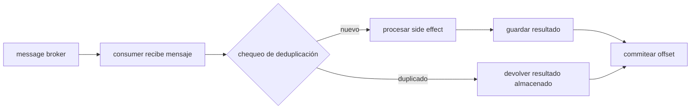

## Visión General

Hace un año vi cómo un servicio de pagos cobraba dos veces a un cliente porque un consumer se cayó entre procesar el
mensaje y commitear el offset. El duplicado no era un bug en la lógica de negocio. Era una entrega duplicada que el
consumer procesó de nuevo porque no tenía memoria del primer intento. Ese es el daño que previene la idempotencia en
mensajes.

La mayoría de los message brokers prometen at-least-once delivery. Los retries, los rebalances de consumers, los fallos
del producer y los problemas de red generan mensajes duplicados. La idempotencia significa que procesar el mismo mensaje
dos veces deja al sistema en el mismo estado que procesarlo una vez. No es una feature que el broker tenga. Es una
decisión que tomás dentro del consumer.

Esta receta muestra cómo construir consumers idempotentes con Redis, PostgreSQL y Kafka. Yo usé el patrón de Redis para
webhooks de pagos de alto throughput, el de PostgreSQL para ledgers financieros donde la base ya es la fuente de verdad,
y el de Kafka para stream processing donde la semántica de retries importa. Cada enfoque tiene trade-offs, y ninguno
pretende que el exactly-once delivery sea gratis.

## Cuándo Usar

- Tu broker solo garantiza at-least-once delivery, que es el default de Kafka, RabbitMQ, SQS y la mayoría de los
  servicios pub/sub en la nube.
- Los producers reintentan publishes fallidos y pueden crear duplicados antes de recibir un acknowledgement.
- Los consumer groups se rebalancean y reprocesan offsets anteriores, especialmente en
  [Kafka event streaming](/recipes/kafka-event-streaming/) o [RabbitMQ task queues](/recipes/rabbitmq-task-queue/).
- Un cobro, envío, email o movimiento de inventario duplicado causaría un daño real o generaría trabajo de soporte.
- Necesitás la misma protección en múltiples runtimes, porque un bus de eventos usualmente alimenta servicios en
  Node.js, Python, Java y Go al mismo tiempo.

### Cuándo evitarlo

- El consumer solo fija un valor, como `status = shipped`. Eso ya es idempotente por sí solo.
- Procesar duplicados es inofensivo, como actualizar una cache que ya tiene el TTL correcto.
- Tu broker te da exactly-once semantics para tu caso de uso, como SQS FIFO con deduplication IDs, y estás dispuesto a
  aceptar sus límites.

## Solución

Podés copiar los snippets de abajo y adaptarlos a tu stack. El repo companion tiene versiones ejecutables de cada uno,
incluyendo el `docker-compose.yml` necesario para levantar Redis, PostgreSQL y Kafka localmente.

### Clave de idempotencia con Redis (Node.js)

El cliente de Redis puede setear una clave solo si no existe y darle expiración en una sola llamada. Yo uso este patrón
para webhooks de pago porque el check debe quedar debajo de un milisegundo de punta a punta.

```javascript
const redis = require("redis");
const client = await redis.createClient({ url: "redis://localhost:6379" }).connect();

async function processPayment(message) {
  const idempotencyKey = message.idempotencyKey || message.orderId;
  const key = `idempotency:${idempotencyKey}`;

  // SET NX EX: set solo si no existe, con expiración de 24h
  const locked = await client.set(key, "processing", { NX: true, EX: 86400 });

  if (!locked) {
    const stored = await client.get(key);
    console.log("Mensaje duplicado o en vuelo ignorado:", idempotencyKey, stored);
    return stored === "processing" ? { status: "in_flight" } : JSON.parse(stored);
  }

  try {
    const result = await chargeCustomer(message);
    await client.set(key, JSON.stringify(result), { EX: 86400 });
    return result;
  } catch (err) {
    // Borrar el lock para que el siguiente retry pueda intentar de nuevo.
    // Solo hacer esto si el error ocurrió antes de cualquier side effect.
    await client.del(key);
    throw err;
  }
}
```

### Tabla de deduplicación en PostgreSQL

Cuando la base de datos ya es la fuente de verdad, guardar el registro de deduplicación en la misma transacción que el
side effect es la opción más segura. Yo inserto el ID del mensaje y la actualización de negocio dentro de una
transacción.

```sql
CREATE TABLE processed_messages (
    message_id UUID PRIMARY KEY,
    processed_at TIMESTAMPTZ DEFAULT NOW(),
    result JSONB
);
```

```sql
-- El consumer usa INSERT ... ON CONFLICT DO NOTHING
-- y escribe el side effect en la misma transacción.
BEGIN;

WITH inserted AS (
    INSERT INTO processed_messages (message_id, result)
    VALUES (
        'msg_abc123'::UUID,
        '{"status": "shipped"}'::JSONB
    )
    ON CONFLICT (message_id) DO NOTHING
    RETURNING message_id
)
UPDATE inventory
SET quantity = 10
WHERE id = 1
  AND EXISTS (SELECT 1 FROM inserted);

COMMIT;
```

Si el `INSERT` encuentra un duplicado, el `UPDATE` ve un `inserted` vacío y no hace nada. La transacción sigue siendo
válida y el duplicado se descarta silenciosamente.

### Consumer de Kafka en Python con deduplicación en Redis

Es el mismo patrón de Redis envuelto en un consumer de Kafka. La parte crítica es que el check de deduplicación y el
commit del offset pasan ambos después de que el side effect tenga éxito. Si el consumer se cae antes de terminar, el
siguiente consumer puede reintentar el mensaje.

```python
import json
import redis
from kafka import KafkaConsumer

r = redis.Redis(host='localhost', port=6379, decode_responses=True)

consumer = KafkaConsumer(
    'orders',
    bootstrap_servers=['localhost:9092'],
    group_id='payment-workers',
    enable_auto_commit=False,
    value_deserializer=lambda m: json.loads(m.decode('utf-8'))
)

for message in consumer:
    payload = message.value
    key = f"idempotency:{payload.get('idempotencyKey', payload['orderId'])}"

    if r.set(key, 'processing', nx=True, ex=86400):
        try:
            result = charge_customer(payload)
            r.set(key, json.dumps(result), ex=86400)
            consumer.commit_sync()
        except Exception:
            r.delete(key)
            raise
    else:
        print(f"Saltando duplicado: {key}")
        consumer.commit_sync()
```

### Consumer de Kafka en Java con commits manuales

Con el consumer de Kafka en Java, el código decide exactamente cuándo se commitea el offset. El ejemplo de abajo chequea
una clave de Redis antes de hacer el trabajo, y commitea el offset solo después de que el side effect y el
almacenamiento del resultado tengan éxito.

```java
Properties props = new Properties();
props.put(ConsumerConfig.BOOTSTRAP_SERVERS_CONFIG, "localhost:9092");
props.put(ConsumerConfig.GROUP_ID_CONFIG, "payment-workers");
props.put(ConsumerConfig.KEY_DESERIALIZER_CLASS_CONFIG, StringDeserializer.class);
props.put(ConsumerConfig.VALUE_DESERIALIZER_CLASS_CONFIG, StringDeserializer.class);
props.put(ConsumerConfig.ENABLE_AUTO_COMMIT_CONFIG, false);

KafkaConsumer<String, String> consumer = new KafkaConsumer<>(props);
consumer.subscribe(List.of("orders"));

while (true) {
    ConsumerRecords<String, String> records = consumer.poll(Duration.ofMillis(100));
    for (ConsumerRecord<String, String> record : records) {
        String key = "idempotency:" + extractIdempotencyKey(record.value());

        Boolean locked = jedis.set(key, "processing", SetParams.setParams().nx().ex(86400));
        if (Boolean.TRUE.equals(locked)) {
            try {
                String result = chargeCustomer(record.value());
                jedis.set(key, result, SetParams.setParams().ex(86400));
                consumer.commitSync();
            } catch (Exception e) {
                jedis.del(key);
                throw e;
            }
        } else {
            consumer.commitSync();
        }
    }
}
```

### Kafka idempotent producer (Java)

El producer idempotente de Kafka elimina duplicados causados por retries del producer dentro de una sola partición. No
elimina duplicados causados por tu aplicación enviando el mismo evento dos veces, y no funciona entre particiones.

```java
Properties props = new Properties();
props.put(ProducerConfig.BOOTSTRAP_SERVERS_CONFIG, "localhost:9092");
props.put(ProducerConfig.KEY_SERIALIZER_CLASS_CONFIG, StringSerializer.class);
props.put(ProducerConfig.VALUE_SERIALIZER_CLASS_CONFIG, StringSerializer.class);

props.put(ProducerConfig.ENABLE_IDEMPOTENCE_CONFIG, true);
props.put(ProducerConfig.ACKS_CONFIG, "all");
props.put(ProducerConfig.RETRIES_CONFIG, 10);
props.put(ProducerConfig.MAX_IN_FLIGHT_REQUESTS_PER_CONNECTION, 5);

Producer<String, String> producer = new KafkaProducer<>(props);
producer.send(new ProducerRecord<>("orders", orderId, payload));
```

## Explicación

Un consumer es idempotente cuando procesar el mismo mensaje dos veces deja al sistema en el mismo estado que procesarlo
una vez. En la práctica encontré tres caminos.

### Deduplicación con un store externo

Yo siempre verifico una clave en Redis o base de datos antes de tocar el side effect. Si el mensaje ya tiene un
resultado almacenado, lo devuelvo en lugar de llamar al side effect otra vez. Es el patrón al que vuelvo más seguido en
producción; funciona con Kafka, RabbitMQ, SQS o cualquier otro broker.

### Idempotencia natural

A veces podés escribir la operación para que repetirla no haga daño. Tomá este update SQL como ejemplo.
`UPDATE inventory SET quantity = 10 WHERE id = 1` fija un valor absoluto en lugar de decrementarlo, y
`INSERT ... ON CONFLICT DO NOTHING` simplemente salta duplicados. Intento usar este enfoque siempre que puedo porque
evita un round-trip extra y es la opción más barata.

### Idempotencia a nivel de broker

El producer idempotente de Kafka deduplica reintentos por partición, así que la aplicación necesita menos chequeos.
RabbitMQ no tiene la misma garantía, así que los consumers ahí siempre necesitan su propia deduplicación.



Me aseguro de que la clave de deduplicación sea única y estable. Un UUID creado por el producer al publicar funciona, y
también una business key que ya esté en el mensaje como `orderId` o `paymentId`. Para pipelines genéricos usé un hash
del contenido con un algoritmo resistente a colisiones. Prefiero las business keys porque hacen más fácil el debugging;
un hash puede ocultar duplicados que el producer en realidad intentó que sean distintos.

El store de deduplicación agrega latencia, costo y un nuevo punto de falla, así que el compromiso es real. Si Redis está
caído, el consumer tiene que decidir: rechaza el mensaje y espera a que el broker reintente, o lo procesa y acepta el
riesgo de un duplicado. También me aseguro de que el mismo chequeo corra en CI y en un job de reconciliación. El store
necesita un TTL; yo mantengo las claves entre 24 y 72 horas, más que la ventana de redelivery del broker. Para Kafka, el
setting relevante es `offsets.retention.minutes`. Para SQS, es el visibility timeout multiplicado por la cantidad máxima
de retries más un buffer.

Ningún broker puede darte exactly-once entre particiones. El producer idempotente de Kafka solo deduplica reintentos
para una sola sesión de producer y una sola partición. Si tu consumer lee de varias particiones, un rebalance puede
mover la propiedad de la partición y causar reprocessamiento. La única protección es una clave de deduplicación guardada
fuera del consumer.

## Variantes

| Enfoque | Ideal para | Compromiso |
| --- | --- | --- |
| Redis `SET NX` | Alto throughput | Pérdida de datos si Redis falla antes de persistir |
| Índice único en base de datos | Datos financieros o críticos | Más lento; requiere round-trip a la base |
| Idempotencia natural | Actualizaciones de estado simples | Requiere diseñar la operación para que sea segura |
| Kafka idempotent producer | Stream processing | Exactly-once por partición, no entre particiones |
| RabbitMQ manual ack con dedup | Queue workers | El consumer debe manejar el store de dedup |
| SQS FIFO deduplication ID | Pipelines serverless | Ventana de deduplicación de cinco minutos |
| DynamoDB conditional write | Stacks polyglot en AWS | Lecturas eventualmente consistentes |
| Bloom filter | Pre-filtro eficiente en memoria | Puede dar falsos positivos |

## Mejores Prácticas

- Guardá el resultado del procesamiento, no solo un flag. Devolver el mismo resultado ante duplicados hace al sistema
  predecible y ayuda a los callers que esperan una respuesta.
- Aplicá TTL al store de deduplicación. Mantené las claves entre 24 y 72 horas, más que la ventana de redelivery del
  broker. Ventanas más largas cuestan más storage; ventanas más cortas dejan pasar duplicados.
- Usá business keys cuando podás. `orderId` es más fácil de razonar que un UUID de mensaje aleatorio, especialmente
  cuando estás mirando un log de producción a las 2 de la mañana.
- Manejá el estado `processing`. Una clave seteada sin resultado significa que el mensaje se cayó a mitad de camino.
  Borrala o reprocesala con cuidado, y solo después de asegurarte de que el side effect no se completó.
- Yo no asumo que el broker me dé exactly-once delivery. Verifico lo mismo en el código del consumer y vuelvo a correr
  los mismos chequeos en un job de reconciliación.
- Limpiá registros de deduplicación expirados. Los TTLs o cron jobs evitan que el storage crezca sin límite.
- Mantené el chequeo de dedup y el commit del offset juntos. Si guardás el resultado pero fallás al commitear el offset,
  el consumer va a reprocesar el mensaje y va a encontrar la clave ya presente. Eso es seguro. Si commiteás el offset
  antes de guardar el resultado, un duplicado todavía puede correr.

## Errores Comunes

- Guardar las claves de deduplicación solo en memoria es riesgoso porque un restart del consumer o un rebalance las
  borra, así que siempre uso Redis, PostgreSQL, DynamoDB o cualquier store que sobreviva al consumer.
- Usar campos no únicos como claves de idempotencia va a fallar porque los timestamps o números de secuencia cambian en
  cada retry, así que me quedo con una business key estable o un UUID generado por el producer.
- Asumir que el broker entrega exactly-once sin verificación es una trampa; el producer idempotente de Kafka solo cubre
  reintentos dentro de una partición y SQS FIFO tiene una ventana de deduplicación de cinco minutos, así que leé la
  letra chica antes de confiar.
- Llamar side effects no idempotentes dentro del camino de procesamiento es peligroso porque enviar un email o cobrar
  una tarjeta antes del chequeo de dedup no se puede deshacer, así que hacé el chequeo primero, después el side effect,
  y después guardá el resultado.
- Dejar crecer la tabla de deduplicación hasta convertirla en un cuello de botella la vuelve lenta y cara, así que uso
  TTLs, particionado por fecha, o un cleanup job programado.
- Permitir retries antes de que el lock de deduplicación se libere hace que un retry rápido vea `processing` y salte, lo
  cual está bien. Pero si el primer intento se cayó sin borrar la clave, el retry también va a saltar, así que agregá un
  timeout o un camino a dead letter para claves `processing` más viejas que tu tiempo máximo de procesamiento.

## FAQ

### ¿Cuál es la diferencia entre idempotencia y deduplicación?

La deduplicación evita que un mensaje se procese dos veces. La idempotencia significa que si se procesa dos veces, el
estado final es el mismo que si se hubiera procesado una vez. Usualmente funcionan juntas.

### ¿Por qué el exactly-once delivery es imposible en sistemas distribuidos?

Una red, un proceso o un disco pueden fallar en cualquier punto entre el broker y el consumer. No podés garantizar que
un mensaje haya sido procesado exactamente una vez sin una única fuente de verdad. El objetivo práctico es el
exactly-once processing, que conseguís haciendo el consumer idempotente.

### ¿Cuánto tiempo debería conservar las claves de deduplicación?

Yo las mantengo más que la ventana máxima de redelivery que espero ver. Para Kafka, usá `offsets.retention.minutes`.
Para SQS, usá `visibility timeout × max retries + buffer`. Yo suelo empezar con 24 horas y aumentar si veo duplicados
tardíos.

### ¿Qué hace una buena idempotency key?

Busco algo estable y único. Cuando el mensaje ya tiene una business key como `orderId` o `paymentId`, la uso. Si no,
genero un UUID al publicar y lo propago en cada retry.

### ¿Puedo confiar en el producer idempotente de Kafka entre particiones?

No. El producer idempotente de Kafka deduplica reintentos dentro de una sola sesión de producer y una sola partición. No
previene el reprocessamiento después de un rebalance del consumer o un restart del producer. Tu consumer todavía
necesita su propio store de dedup.

### ¿Qué pasa si el store de deduplicación se cae?

El consumer tiene que elegir una de esas dos opciones, y ambas tienen un costo. Si procesa el mensaje sin el chequeo,
los duplicados son posibles. Si rechaza el mensaje, el broker va a reintentar. Yo prefiero rechazar y dejar que el loop
de retry lo maneje, porque un cobro duplicado suele ser peor que unos minutos de demora.

### ¿Cómo manejo idempotencia entre varios servicios?

Elegí un store de deduplicación centralizado que todos los consumers puedan verificar, como Redis, PostgreSQL o
DynamoDB. Yo guardo el ID del mensaje y el resultado ahí, así cada servicio verifica la misma clave antes de actuar. Si
necesitás transacciones entre servicios, considerá un patrón de
[event-driven microservices](/recipes/event-driven-microservices/) con una
[dead-letter queue](/recipes/dead-letter-queue/) para los fallos.

## See Also

- [Kafka idempotent producer documentation](https://kafka.apache.org/documentation/#producerconfigs_enable.idempotence).
- [Redis SET command](https://redis.io/commands/set/).
- [PostgreSQL INSERT ... ON CONFLICT](https://www.postgresql.org/docs/current/sql-insert.html).
- [AWS SQS FIFO docs](https://docs.aws.amazon.com/AWSSimpleQueueService/latest/SQSDeveloperGuide/FIFO-queues.html).
- [RabbitMQ consumer acknowledgements](https://www.rabbitmq.com/docs/confirms).
- Internos: [Event-Driven Microservices](/recipes/event-driven-microservices/) y
  [Dead Letter Queue](/recipes/dead-letter-queue/).
