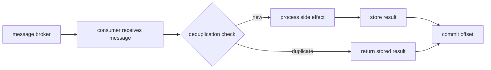

## Overview

Last year I watched a payment service charge a customer twice because a consumer crashed between processing the message and committing the offset. The duplicate had nothing to do with the business logic. It was a duplicate delivery that the consumer happily processed again because it had no memory of the first attempt. That's the kind of problem idempotency is designed to stop.

Most message brokers only promise at-least-once delivery. Retries, consumer rebalances, producer failures and network hiccups all create duplicates. Idempotency means processing the same message twice leaves the system in the same state as processing it once. It isn't a feature the broker has. You make that decision inside the consumer, not in the broker.

In this recipe I will walk through the three setups I actually run in production: Redis for fast payment webhooks, PostgreSQL for financial ledgers where the database is already the source of truth, and Kafka for stream processing where retry semantics matter. Each one has trade-offs, and none of them pretend that exactly-once delivery is free.

## When to Use

- Your broker only guarantees at-least-once delivery, which is the default for Kafka, RabbitMQ, SQS and most cloud pub/sub services.
- Producers retry failed publishes and may create duplicates before they receive an acknowledgement.
- Consumer groups rebalance and reprocess earlier offsets, especially in [Kafka event streaming](/recipes/kafka-event-streaming/) or [RabbitMQ task queues](/recipes/rabbitmq-task-queue/).
- A duplicate charge, shipment, email or inventory movement would do real damage or create support work.
- You need the same protection in several runtimes, because an event bus usually feeds Node.js, Python, Java and Go services at the same time.

### When to avoid

- The consumer just sets a fixed value, such as `status = shipped`. That's naturally idempotent without extra work.
- Duplicate processing is harmless, such as refreshing a cache that already has the correct TTL.
- Your broker gives you exactly-once semantics for your use case, such as SQS FIFO with deduplication IDs, and you're willing to accept its limits.

## Solution

Feel free to copy the snippets below and adapt them to whichever stack you're running. The companion repo has runnable versions of each one, including the `docker-compose.yml` needed to start Redis, PostgreSQL and Kafka locally.

### Redis idempotency key (Node.js)

The `redis` client can set a key only if it doesn't exist and give it an expiry in one call. I use this pattern for payment webhooks because the check has to stay under a millisecond end to end.

```javascript
const redis = require('redis');
const client = await redis.createClient({ url: 'redis://localhost:6379' }).connect();

async function processPayment(message) {
  const idempotencyKey = message.idempotencyKey || message.orderId;
  const key = `idempotency:${idempotencyKey}`;

  // SET NX EX: set only if not exists, with 24h expiry
  const locked = await client.set(key, 'processing', { NX: true, EX: 86400 });

  if (!locked) {
    const stored = await client.get(key);
    console.log('Duplicate or in-flight message ignored:', idempotencyKey, stored);
    return stored === 'processing' ? { status: 'in_flight' } : JSON.parse(stored);
  }

  try {
    const result = await chargeCustomer(message);
    await client.set(key, JSON.stringify(result), { EX: 86400 });
    return result;
  } catch (err) {
    // Remove the lock so the next retry can attempt again.
    // Only do this if the error happened before any side effect.
    await client.del(key);
    throw err;
  }
}
```

### PostgreSQL deduplication table

When the database is already the source of truth, keeping the deduplication record in the same transaction as the side effect is the safest choice. I insert the message ID and the business update inside one transaction.

```sql
CREATE TABLE processed_messages (
    message_id UUID PRIMARY KEY,
    processed_at TIMESTAMPTZ DEFAULT NOW(),
    result JSONB
);
```

```sql
-- Consumer uses INSERT ... ON CONFLICT DO NOTHING
-- and writes the side effect in the same transaction.
BEGIN;

WITH inserted AS (
    INSERT INTO processed_messages (message_id, result)
    VALUES (
        'msg_abc123'::UUID,
        '{"status": "shipped"}'::JSONB
    )
    ON CONFLICT (message_id) DO NOTHING
    RETURNING message_id
)
UPDATE inventory
SET quantity = 10
WHERE id = 1
  AND EXISTS (SELECT 1 FROM inserted);

COMMIT;
```

If the `INSERT` finds a duplicate, the `UPDATE` sees an empty `inserted` set and does nothing. The transaction is still valid and the duplicate is silently dropped.

### Python Kafka consumer with Redis deduplication

This is the same Redis pattern wrapped around a Kafka consumer. The critical part is that the deduplication check and the offset commit both happen after the side effect succeeds. If the consumer dies in the middle, the next consumer can pick the message up again.

```python
import json
import redis
from kafka import KafkaConsumer

r = redis.Redis(host='localhost', port=6379, decode_responses=True)

consumer = KafkaConsumer(
    'orders',
    bootstrap_servers=['localhost:9092'],
    group_id='payment-workers',
    enable_auto_commit=False,
    value_deserializer=lambda m: json.loads(m.decode('utf-8'))
)

for message in consumer:
    payload = message.value
    key = f"idempotency:{payload.get('idempotencyKey', payload['orderId'])}"

    if r.set(key, 'processing', nx=True, ex=86400):
        try:
            result = charge_customer(payload)
            r.set(key, json.dumps(result), ex=86400)
            consumer.commit_sync()
        except Exception:
            r.delete(key)
            raise
    else:
        print(f"Skipping duplicate: {key}")
        consumer.commit_sync()
```

### Java Kafka consumer with manual commits

With Java's Kafka consumer, the code decides exactly when the offset gets committed. The example below checks a Redis key before doing work, then commits the offset only after the side effect and the result storage both succeed.

```java
Properties props = new Properties();
props.put(ConsumerConfig.BOOTSTRAP_SERVERS_CONFIG, "localhost:9092");
props.put(ConsumerConfig.GROUP_ID_CONFIG, "payment-workers");
props.put(ConsumerConfig.KEY_DESERIALIZER_CLASS_CONFIG, StringDeserializer.class);
props.put(ConsumerConfig.VALUE_DESERIALIZER_CLASS_CONFIG, StringDeserializer.class);
props.put(ConsumerConfig.ENABLE_AUTO_COMMIT_CONFIG, false);

KafkaConsumer<String, String> consumer = new KafkaConsumer<>(props);
consumer.subscribe(List.of("orders"));

while (true) {
    ConsumerRecords<String, String> records = consumer.poll(Duration.ofMillis(100));
    for (ConsumerRecord<String, String> record : records) {
        String key = "idempotency:" + extractIdempotencyKey(record.value());

        Boolean locked = jedis.set(key, "processing", SetParams.setParams().nx().ex(86400));
        if (Boolean.TRUE.equals(locked)) {
            try {
                String result = chargeCustomer(record.value());
                jedis.set(key, result, SetParams.setParams().ex(86400));
                consumer.commitSync();
            } catch (Exception e) {
                jedis.del(key);
                throw e;
            }
        } else {
            consumer.commitSync();
        }
    }
}
```

### Kafka idempotent producer (Java)

Kafka's idempotent producer removes duplicates caused by producer retries within a single partition. It won't remove duplicates caused by your application sending the same event twice, and it doesn't work across partitions.

```java
Properties props = new Properties();
props.put(ProducerConfig.BOOTSTRAP_SERVERS_CONFIG, "localhost:9092");
props.put(ProducerConfig.KEY_SERIALIZER_CLASS_CONFIG, StringSerializer.class);
props.put(ProducerConfig.VALUE_SERIALIZER_CLASS_CONFIG, StringSerializer.class);

props.put(ProducerConfig.ENABLE_IDEMPOTENCE_CONFIG, true);
props.put(ProducerConfig.ACKS_CONFIG, "all");
props.put(ProducerConfig.RETRIES_CONFIG, 10);
props.put(ProducerConfig.MAX_IN_FLIGHT_REQUESTS_PER_CONNECTION, 5);

Producer<String, String> producer = new KafkaProducer<>(props);
producer.send(new ProducerRecord<>("orders", orderId, payload));
```

## Explanation

A consumer is idempotent when processing the same message twice leaves the system in the same state as processing it once. In practice I have found three different approaches.

### Deduplication with an external store

I always look up the Redis or database key before I touch the side effect. When the message already has a stored result, I return it instead of calling the side effect again. I keep coming back to this pattern in production; it works with Kafka, RabbitMQ, SQS or any other broker I have tried.

### Natural idempotency

In some cases the operation can be written so that repeating it does no harm. Consider this SQL update. `UPDATE inventory SET quantity = 10 WHERE id = 1` sets an absolute value instead of decrementing it, and `INSERT ... ON CONFLICT DO NOTHING` just skips duplicates. I try to use this one whenever I can because it avoids an extra round-trip and is the cheapest option.

### Broker-level idempotency

Kafka's idempotent producer removes duplicates from retries inside one partition, so the application has fewer checks to do. RabbitMQ doesn't have the same guarantee, so consumers there always need their own deduplication.



I make sure the deduplication key is both unique and stable. A UUID created by the producer at publish time works, and so does a business key already in the message such as `orderId` or `paymentId`. For generic pipelines I have used a hash of the message content with a collision-resistant algorithm. I prefer business keys because they make debugging easier; a hash can hide duplicates the producer actually intended to be different.

The deduplication store adds latency, cost and a new point of failure, so the trade-off is real. If Redis goes down, the consumer has to decide: reject the message and wait for the broker to retry, or process it and accept the risk of a duplicate. I also make sure the same check runs in CI and in a reconciliation job. The store needs a TTL; I keep keys for 24 to 72 hours, which is longer than the broker's redelivery window. For Kafka, the relevant setting is `offsets.retention.minutes`. For SQS, it's the visibility timeout times the maximum number of retries plus a buffer.

No broker can give you cross-partition exactly-once. Kafka's idempotent producer only deduplicates retries for a single producer session and a single partition. If your consumer reads from several partitions, a rebalance can still move partition ownership and cause reprocessing. The only protection is a deduplication key stored outside the consumer.

## Variants

| Approach | Best for | Trade-off |
| --- | --- | --- |
| Redis `SET NX` | High-throughput checks | Data loss if Redis fails before persistence |
| Database unique index | Financial or critical data | Slower; needs a round-trip to the database |
| Natural idempotency | Simple state updates | Requires designing the operation to be safe |
| Kafka idempotent producer | Stream processing | Exactly-once per partition, not across partitions |
| RabbitMQ manual ack with dedup | Queue workers | Consumer must manage the dedup store |
| SQS FIFO deduplication ID | Serverless pipelines | Five-minute deduplication window |
| DynamoDB conditional write | AWS polyglot stacks | Eventually consistent reads can miss recent writes |
| Bloom filter | Memory-efficient pre-filter | False positives are possible |

## Best Practices

- Store the processing result, not just a flag. Returning the same result for duplicates makes the system predictable and helps callers that expect a response.
- TTL your deduplication store. Keep keys for 24 to 72 hours, which is longer than the broker's redelivery window. Longer windows cost more storage; shorter windows let duplicates through.
- I reach for a business key first when one is available. `orderId` is easier to reason about than a random message UUID, especially when you're staring at a production log at 2 a.m.
- Handle the `processing` state. A key set without a result means the message crashed mid-flight. Delete it or reprocess it carefully, and only after making sure the side effect didn't complete.
- I don't assume the broker gives me exactly-once delivery. I make the same check in the consumer code and again in a reconciliation job.
- Clean up expired deduplication records. TTLs or cron jobs prevent unbounded storage growth.
- Keep the dedup check and the offset commit together. If you store the result but fail to commit the offset, the consumer will reprocess the message and find the key already present. That is safe. If you commit the offset before storing the result, a duplicate can still run.

## Common Mistakes

- Keeping deduplication keys only in memory is risky because a consumer restart or a rebalance wipes them out, so I always use Redis, PostgreSQL, DynamoDB or any store that survives the consumer.
- Using non-unique fields as idempotency keys will fail because timestamps or sequence numbers change on every retry, so I stick to a stable business key or a producer-generated UUID.
- Assuming the broker gives exactly-once delivery without verification is a trap; Kafka's idempotent producer only covers retries within one partition and SQS FIFO has a five-minute deduplication window, so read the fine print before you trust it.
- Calling non-idempotent side effects inside the processing path is dangerous because sending an email or charging a card before the dedup check can't be undone, so always do the check first, then the side effect, then store the result.
- Letting the deduplication table grow forever turns it into a bottleneck and a cost problem, so I use TTLs, partitioning by date, or a scheduled cleanup job.
- Allowing retries before the deduplication lock has been released means a fast retry will see `processing` and skip, which is expected. But if the first attempt crashed without deleting the key, the retry will also skip, so add a timeout or a dead-letter path for `processing` keys older than your maximum processing time.

## FAQ

### What is the difference between idempotency and deduplication?

Deduplication stops a message from being processed twice. Idempotency means that processing the same message twice leaves the final state unchanged from processing it once. They usually work together.

### Why is exactly-once delivery impossible in distributed systems?

A network, process or disk can fail anywhere between the broker and your consumer. Proving a message was processed exactly once needs a single place everyone trusts, and I have watched teams spend weeks before accepting that the broker alone can't be that place. The practical goal is exactly-once processing, and you get there by making the consumer idempotent.

### How long should I keep deduplication keys?

I set the TTL longer than the maximum redelivery window I expect to see. For Kafka, use `offsets.retention.minutes`. For SQS, use `visibility timeout × max retries + buffer`. I usually start with 24 hours and increase it if I see late duplicates.

### What makes a good idempotency key?

I want something stable and unique. When the message already has a business key like `orderId` or `paymentId`, I use it. Otherwise I generate a UUID at publish time and propagate it through every retry.

### Can I trust Kafka's idempotent producer across partitions?

No. Kafka's idempotent producer deduplicates retries within a single producer session and partition. It doesn't prevent reprocessing after a consumer rebalance or a producer restart. Your consumer still needs its own dedup store, because Kafka can't cover rebalances or a consumer restart.

### What happens if the deduplication store goes down?

The consumer has to pick one of those two options, and both have a cost. If it processes the message without the check, duplicates are possible. If the consumer rejects the message, the broker will retry it. I prefer to reject and let the retry loop handle it, because a duplicate charge is usually worse than a few minutes of delay.

### How do I handle idempotency across multiple services?

Pick a centralized deduplication store that every consumer can check, such as Redis, PostgreSQL or DynamoDB. I put both the message ID and the result in the same record, so every service checks the same key before it acts. If you need cross-service transactions, consider an [event-driven microservices](/recipes/event-driven-microservices/) pattern with a [dead-letter queue](/recipes/dead-letter-queue/) for failures.

## See Also

- [Kafka idempotent producer documentation](https://kafka.apache.org/documentation/#producerconfigs_enable.idempotence).
- [Redis SET command](https://redis.io/commands/set/).
- [PostgreSQL INSERT ... ON CONFLICT](https://www.postgresql.org/docs/current/sql-insert.html).
- [AWS SQS exactly-once processing](https://docs.aws.amazon.com/AWSSimpleQueueService/latest/SQSDeveloperGuide/FIFO-queues.html).
- [RabbitMQ consumer acknowledgements](https://www.rabbitmq.com/docs/confirms).
- Internal: [Event-Driven Microservices](/recipes/event-driven-microservices/) and [Dead Letter Queue](/recipes/dead-letter-queue/).
