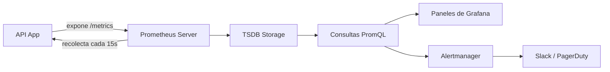

## Visión General

Prometheus es un sistema de monitoreo de métricas open source que recolecta
series temporales haciendo scraping de endpoints `/metrics` en un schedule. Si
estás corriendo contenedores o Kubernetes, es la herramienta a la que la
mayoría de los equipos recurre primero. Instrumentá tu API con contadores,
histogramas y gauges para ver latencia, tasas de error, rendimiento y métricas
de negocio en tiempo real.

Usé Prometheus en varias APIs en producción, desde servicios Node.js chicos
hasta flotas grandes de microservicios en Go. El patrón de instrumentación es
el mismo sin importar el lenguaje: exponé un endpoint `/metrics`, dejá que
Prometheus lo recolecte, y consultá las series almacenadas con PromQL. Esta
receta cubre Node.js, Go y Python con ejemplos para copiar y pegar, más reglas
de alerta y cálculos de SLO.

## Cuándo Usar

- Configurás monitoreo para APIs REST o gRPC.
- Definís SLOs y SLIs para microservicios.
- Creás paneles de [Grafana](/recipes/grafana-dashboards-observability/) para salud de API.
- Alertás sobre picos de latencia p99 o tasas de error.
- Seguís métricas de negocio como registros o ingresos por endpoint.

### Cuándo evitarlo

- Ya usás un APM administrado que cubre tus necesidades sin configuración
  adicional.
- El tráfico es tan bajo que la cardinalidad de métricas no justifica la
  sobrecarga.
- Necesitás trazas distribuidas primero. Empezá con [trazas
  distribuidas](/recipes/distributed-tracing/) en ese caso.

## Solución

El [repositorio companion](https://github.com/mathiaspaulenko/stack-practices-resources/tree/main/resources/recipes/observability/prometheus-api-monitoring) contiene ejemplos ejecutables en Node.js, Go y Python, más Docker Compose para testing local.

### Instrumentación con cliente Prometheus (Node.js)

```javascript
const client = require('prom-client');

// Counter: requests totales
const httpRequestsTotal = new client.Counter({
  name: 'http_requests_total',
  help: 'Número total de requests HTTP',
  labelNames: ['method', 'route', 'status_code']
});

// Histogram: duración de requests
const httpRequestDuration = new client.Histogram({
  name: 'http_request_duration_seconds',
  help: 'Duración de requests HTTP en segundos',
  labelNames: ['method', 'route'],
  buckets: [0.01, 0.05, 0.1, 0.5, 1, 2, 5]
});

// Gauge: conexiones activas
const activeConnections = new client.Gauge({
  name: 'http_active_connections',
  help: 'Número de conexiones HTTP activas'
});

// Middleware
app.use((req, res, next) => {
  activeConnections.inc();
  const end = httpRequestDuration.startTimer();

  res.on('finish', () => {
    end({ method: req.method, route: req.route?.path || 'unknown' });
    httpRequestsTotal.inc({
      method: req.method,
      route: req.route?.path || 'unknown',
      status_code: res.statusCode
    });
    activeConnections.dec();
  });

  next();
});
```

### Instrumentación en Go

Go tiene la mejor librería cliente de Prometheus. El paquete oficial
`prometheus/client_golang` expone métricas vía `promhttp`:

```go
package main

import (
    "net/http"
    "github.com/prometheus/client_golang/prometheus"
    "github.com/prometheus/client_golang/prometheus/promhttp"
)

var (
    httpRequests = prometheus.NewCounterVec(
        prometheus.CounterOpts{
            Name: "http_requests_total",
            Help: "Total HTTP requests",
        },
        []string{"method", "route", "status"},
    )
    httpDuration = prometheus.NewHistogramVec(
        prometheus.HistogramOpts{
            Name:    "http_request_duration_seconds",
            Help:    "HTTP request duration",
            Buckets: []float64{0.01, 0.05, 0.1, 0.5, 1, 2, 5},
        },
        []string{"method", "route"},
    )
)

func init() {
    prometheus.MustRegister(httpRequests)
    prometheus.MustRegister(httpDuration)
}

func main() {
    http.Handle("/metrics", promhttp.Handler())
    http.ListenAndServe(":8080", nil)
}
```

Prefiero Go para APIs de alto rendimiento porque el cliente tiene sobrecarga
casi nula y se integra limpiamente con `net/http`. El patrón de middleware es
idéntico a Node.js: envolvé el handler, registrá el tiempo de inicio,
incrementá los contadores en la respuesta.

### Instrumentación en Python

Para APIs en Python, `prometheus_client` funciona con Flask, Django y FastAPI:

```python
from prometheus_client import Counter, Histogram, generate_latest
from flask import Flask, request

app = Flask(__name__)

http_requests = Counter(
    'http_requests_total',
    'Total HTTP requests',
    ['method', 'route', 'status_code']
)

http_duration = Histogram(
    'http_request_duration_seconds',
    'HTTP request duration',
    ['method', 'route'],
    buckets=[0.01, 0.05, 0.1, 0.5, 1, 2, 5]
)

@app.before_request
def before():
    request.start_time = time.time()

@app.after_request
def after(response):
    route = request.endpoint or 'unknown'
    http_requests.labels(request.method, route, response.status_code).inc()
    http_duration.labels(request.method, route).observe(time.time() - request.start_time)
    return response

@app.route('/metrics')
def metrics():
    return generate_latest(), 200
```

El cliente de Python es un poco más pesado que el de Go, pero para la mayoría
de las APIs web la sobrecarga es despreciable. Lo corrí en servicios Flask que
manejan 500 requests por segundo sin problemas.

### Reglas de alerta

```yaml
# prometheus-alerts.yml
groups:
  - name: api_alerts
    rules:
      - alert: HighErrorRate
        expr: rate(http_requests_total{status_code=~"5.."}[5m]) > 0.05
        for: 2m
        labels:
          severity: critical
        annotations:
          summary: "Tasa de error alta detectada"

      - alert: HighLatency
        expr: histogram_quantile(0.99, rate(http_request_duration_seconds_bucket[5m])) > 1
        for: 5m
        labels:
          severity: warning
```

### Queries PromQL para dashboards

```text
# Requests por segundo
rate(http_requests_total[5m])

# Latencia p99
histogram_quantile(0.99, rate(http_request_duration_seconds_bucket[5m]))

# Tasa de error
rate(http_requests_total{status_code=~"5.."}[5m])
```

## Explicación

Prometheus usa un modelo de pull. Tu aplicación expone un endpoint
`/metrics`; el servidor de Prometheus lo recolecta periódicamente (predeterminado
15 segundos). Las series temporales se guardan localmente en un TSDB y se
consultan con PromQL. Alertmanager enruta las alertas activas a Slack, PagerDuty
o email.



La configuración de scrape le dice a Prometheus dónde encontrar tus endpoints:

```yaml
# prometheus.yml
scrape_configs:
  - job_name: 'api'
    scrape_interval: 15s
    static_configs:
      - targets: ['localhost:8080']
```

**Tipos de métricas**:

| Tipo | Uso | Ejemplo |
| --- | --- | --- |
| **Counter** | Valores que crecen monotónicamente | `http_requests_total` |
| **Histogram** | Observaciones en buckets, suma y conteo | `http_request_duration_seconds` |
| **Gauge** | Valores que suben o bajan | `http_active_connections` |
| **Summary** | Cuantiles pre-calculados | Preferí histograms para agregación |

Los histogramas suelen ser mejores que los summaries porque podés agregarlos
entre instancias. Con summaries no podés hacer eso: los cuantiles se calculan
en el cliente y se pierden al agregar.

### Cardinalidad y almacenamiento

Cada combinación única de labels crea una nueva serie temporal. Un contador con
labels `method`, `route` y `status_code` produce una serie por combinación. Con
50 rutas, 5 métodos y 10 códigos de estado, llegás a 2.500 series de una sola
métrica. Agregá un label `user_id` y vas a tener millones.

Una vez vi a un equipo agregar `session_id` como label en un contador de
requests. En horas, Prometheus consumía 8 GB de RAM y el scraping empezó a
timeout. La solución fue sacar el label y mover el tracking de sesiones a logs.

Reglas que sigo:

- Mantené la cardinalidad de labels por debajo de 10.000 combinaciones por
  métrica.
- Nunca uses `user_id`, `session_id` o `request_id` como labels.
- Usá `route` (el patrón, no la ruta completa) en vez de `path`.
- Monitoreá la cantidad de series con `prometheus_tsdb_head_series`.

### Retención

Prometheus almacena datos localmente por 15 días por defecto. Para retención
más larga, usá Thanos, Cortex o Mimir para enviar bloques a almacenamiento de
objetos.
Encontré que 15-30 días alcanzan para la mayoría de las necesidades de alertas
y paneles. El análisis de tendencias a largo plazo se sirve mejor downsamplando
en Thanos que manteniendo datos crudos por meses.

### SLOs y SLIs

Una vez que las métricas fluyen, definí SLOs (Service Level Objectives) para
fijar expectativas. Un SLO común para una API es "el 99% de los requests
completa en menos de 500ms en 30 días". El SLI (Service Level Indicator) es la
medición real:

```text
# SLI: porcentaje de requests bajo 500ms
sum(rate(http_request_duration_seconds_bucket{le="0.5"}[30d]))
/
sum(rate(http_request_duration_seconds_count[30d]))

# Error budget restante
1 - (
  sum(rate(http_requests_total{status_code=~"5.."}[30d]))
  /
  sum(rate(http_requests_total[30d]))
)
```

Sigo el error budget en Grafana. Cuando baja de 20% restante, el equipo sabe
que hay que congelar feature work y enfocarse en confiabilidad. Esta simple
visualización cambió cómo mi equipo priorizaba fixes.

## Variantes

| Lenguaje | Librería | Notas |
| --- | --- | --- |
| Node.js | prom-client | Registro integrado; funciona con Express, Fastify |
| Go | prometheus/client_golang | Cliente oficial; mejor rendimiento |
| Python | prometheus_client | Middleware para Flask/Django disponible |
| Java | Micrometer | Integración con Spring Boot |
| Rust | prometheus | Compatible con async |

## Mejores Prácticas

- Usá labels con moderación. La alta cardinalidad degrada el rendimiento de
  Prometheus rápido. Mi regla: si un label puede tener más de 100 valores, no
  pertenece a una métrica.
- Preferí histograms sobre summaries para latencia. Podés agregar histograms
  entre instancias; con summaries no podés.
- Nombrá métricas con unidades: `_seconds`, `_bytes`, `_total`. Las consultas
  PromQL se vuelven autoexplicativas cuando el nombre incluye la unidad.
- Instrumentá fallos, no solo éxitos. Trackeá 4xx y 5xx por separado para poder
  alertar sobre tasa de error sin capturar errores de cliente.
- Mantené los buckets del histogram enfocados. Para la mayoría de las APIs uso
  `[0.01, 0.05, 0.1, 0.5, 1, 2, 5]`. Más buckets significa más
  almacenamiento; menos significa menos resolución.
- Hacé scraping de `/metrics` por un puerto o ruta interna separada cuando sea
  posible. Esto mantiene el tráfico de monitoreo fuera de tu API pública y
  evita exposición accidental.
- Empezá con la retención predeterminada de 15 días y ajustala cuando conozcas
  tus necesidades reales de almacenamiento. Vi equipos configurar 90 días de
  retención desde el principio y quedarse sin disco en un mes.

## Errores Comunes

- Labels de alta cardinalidad como IDs de usuario o sesión. Esta es la causa
  número uno de problemas de rendimiento de Prometheus que vi en producción.
- Sin sufijos de unidad en los nombres de métricas. Sin `_seconds` o `_bytes`,
  las consultas PromQL se vuelven ambiguas y los paneles más difíciles de leer.
- No trackear requests fallidos. Si solo contás éxitos, tu alerta de tasa de
  error nunca se dispara.
- Demasiados buckets en el histogram. Cada bucket agrega una serie. Vi equipos
  usar 50 buckets cuando 7 alcanzaban, triplicando el almacenamiento sin
  beneficio.
- Ignorar errores de scraping en el endpoint `/metrics`. Si el scraping falla
  silenciosamente, tus paneles muestran datos stale y las alertas pierden
  incidentes reales.
- Mezclar métricas de negocio e infraestructura en la misma instancia sin
  planificar retenciones distintas. Las métricas de negocio suelen necesitar
  retención más larga que las de infraestructura.

## FAQ

### ¿Cuánta memoria necesita Prometheus?

Aproximadamente 1–3 KB por serie temporal activa. Una API con 100 endpoints y
pocos labels suele entrar en 2–4 GB de RAM.

### ¿Puede Prometheus manejar logs y trazas?

No. Usá Prometheus para métricas, Loki para logs y Jaeger para trazas. Grafana
puede unificar los tres en un solo panel.

### ¿Cuál es la diferencia entre histogram y summary?

Los histograms agrupan datos y permiten agregación entre instancias. Los
summaries precalculan cuantiles en el cliente, pero esos cuantiles no se pueden
agregar entre instancias.

### ¿Cómo reduzco los costos de almacenamiento de Prometheus?

Usá retención de 15–30 días para Prometheus local, recording rules para
consultas frecuentes, y Thanos o Cortex para almacenamiento a largo plazo.
Limitá labels de alta cardinalidad y remové métricas no usadas.

### ¿Puedo usar Prometheus para métricas de negocio?

Sí, pero poné esas métricas en una instancia o namespace separado. Suelen tener
más cardinalidad y distintas necesidades de retención.

### ¿Cómo pruebo reglas de alerta antes de desplegar?

Usá `promtool test rules` con un archivo de prueba que defina series de entrada
y las alertas esperadas. Así detectás PromQL roto y umbrales incorrectos sin
esperar un incidente en producción.

### ¿Cómo calculo latencia p99 con PromQL?

Usá `histogram_quantile` con las series `_bucket`:

```text
histogram_quantile(0.99, sum(rate(http_request_duration_seconds_bucket[5m])) by (le))
```

El label `le` es obligatorio. Le dice a la función qué límites de bucket usar.
Sin `sum by (le)`, el cálculo de cuantil se rompe.

### ¿Qué labels causan alta cardinalidad en Prometheus?

Cualquier label con valores no acotados: `user_id`, `session_id`,
`request_id`, `email`, `ip`. Cada valor único genera su propia serie temporal.
Agregá `user_id` a un contador y 10.000 usuarios van a producir 10.000 series
separadas bajo el mismo nombre de métrica.

## Ver También

- [Documentación de Prometheus](https://prometheus.io/docs/introduction/overview/): docs oficiales con referencia de configuración
- [prom-client (Node.js)](https://github.com/siimon/prom-client): cliente Prometheus para Node.js
- [prometheus/client_golang](https://github.com/prometheus/client_golang): cliente oficial de Go
- [prometheus_client (Python)](https://github.com/prometheus/client_python): cliente Python con soporte Flask/Django
- [Documentación de Grafana](https://grafana.com/docs/): paneles y visualización
- [Configuración de Alertmanager](https://prometheus.io/docs/alerting/latest/alertmanager/): enrutamiento y reglas de notificación
- [Guía de Monitoreo y Alertas](/guides/monitoring-alerting-guide/): patrones de observabilidad más amplios
- [Trazas Distribuidas](/recipes/distributed-tracing/): cuando las métricas no alcanzan
