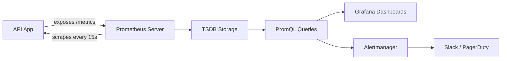

## Overview

Prometheus is an open-source metrics monitoring system that collects time series
by scraping `/metrics` endpoints on a schedule. If you run containers or
Kubernetes, it's likely the first metrics tool you'll reach for. Instrument your
API with counters, histograms, and gauges to see request latency, error rates,
throughput, and business-level metrics in real time.

I've run Prometheus on production APIs ranging from small Node.js services to
Go microservices fleets. The instrumentation pattern stays the same regardless
of language: expose a `/metrics` endpoint, let Prometheus scrape it, and query
the stored series with PromQL. This recipe covers Node.js, Go, and Python with
copy-paste examples, plus alerting rules and SLO calculations.

Tested with Prometheus 3.13.2 LTS, prom-client 15.1.3 (Node.js),
prometheus/client_golang v1.24.1 (Go), and prometheus_client 0.21.1 (Python).

## When to Use

- Setting up monitoring for REST or gRPC APIs.
- Defining SLOs and SLIs for microservices.
- Creating [Grafana dashboards](/recipes/grafana-dashboards-observability/) for API health.
- Alerting on p99 latency or error rate spikes.
- Tracking business metrics (signups, revenue) per endpoint.

### When to avoid

- You already use a managed APM (Datadog, New Relic) that covers your needs.
- The API traffic is so low that metric cardinality isn't worth the overhead.
- You need distributed tracing first. Start with [distributed tracing](/recipes/distributed-tracing/) instead.

## Solution

The [companion repository](https://github.com/mathiaspaulenko/stack-practices-resources/tree/main/resources/recipes/observability/prometheus-api-monitoring) contains runnable examples in Node.js, Go, and Python, plus Docker Compose for local testing.

### Prometheus client instrumentation (Node.js)

```javascript
const client = require('prom-client');

// Counter: total requests
const httpRequestsTotal = new client.Counter({
  name: 'http_requests_total',
  help: 'Total number of HTTP requests',
  labelNames: ['method', 'route', 'status_code']
});

// Histogram: request duration
const httpRequestDuration = new client.Histogram({
  name: 'http_request_duration_seconds',
  help: 'Duration of HTTP requests in seconds',
  labelNames: ['method', 'route'],
  buckets: [0.01, 0.05, 0.1, 0.5, 1, 2, 5]
});

// Gauge: active connections
const activeConnections = new client.Gauge({
  name: 'http_active_connections',
  help: 'Number of active HTTP connections'
});

// Middleware
app.use((req, res, next) => {
  activeConnections.inc();
  const end = httpRequestDuration.startTimer();

  res.on('finish', () => {
    end({ method: req.method, route: req.route?.path || 'unknown' });
    httpRequestsTotal.inc({
      method: req.method,
      route: req.route?.path || 'unknown',
      status_code: res.statusCode
    });
    activeConnections.dec();
  });

  next();
});
```

### Go instrumentation

Go has the best Prometheus client library. The official
`prometheus/client_golang` package exposes metrics via `promhttp`:

```go
package main

import (
    "net/http"
    "github.com/prometheus/client_golang/prometheus"
    "github.com/prometheus/client_golang/prometheus/promhttp"
)

var (
    httpRequests = prometheus.NewCounterVec(
        prometheus.CounterOpts{
            Name: "http_requests_total",
            Help: "Total HTTP requests",
        },
        []string{"method", "route", "status"},
    )
    httpDuration = prometheus.NewHistogramVec(
        prometheus.HistogramOpts{
            Name:    "http_request_duration_seconds",
            Help:    "HTTP request duration",
            Buckets: []float64{0.01, 0.05, 0.1, 0.5, 1, 2, 5},
        },
        []string{"method", "route"},
    )
)

func init() {
    prometheus.MustRegister(httpRequests)
    prometheus.MustRegister(httpDuration)
}

func main() {
    http.Handle("/metrics", promhttp.Handler())
    http.ListenAndServe(":8080", nil)
}
```

I prefer Go for high-throughput APIs because the client has near-zero overhead
and integrates cleanly with `net/http`. The middleware pattern is identical to
Node.js: wrap the handler, record start time, increment counters on response.

### Python instrumentation

For Python APIs, `prometheus_client` works with Flask, Django, and FastAPI:

```python
from prometheus_client import Counter, Histogram, generate_latest
from flask import Flask, request

app = Flask(__name__)

http_requests = Counter(
    'http_requests_total',
    'Total HTTP requests',
    ['method', 'route', 'status_code']
)

http_duration = Histogram(
    'http_request_duration_seconds',
    'HTTP request duration',
    ['method', 'route'],
    buckets=[0.01, 0.05, 0.1, 0.5, 1, 2, 5]
)

@app.before_request
def before():
    request.start_time = time.time()

@app.after_request
def after(response):
    route = request.endpoint or 'unknown'
    http_requests.labels(request.method, route, response.status_code).inc()
    http_duration.labels(request.method, route).observe(time.time() - request.start_time)
    return response

@app.route('/metrics')
def metrics():
    return generate_latest(), 200
```

The Python client is slightly heavier than Go's, but for most web APIs the
overhead is negligible. I ran it on Flask services at 500 requests per second
without hitting any bottleneck.

### Alerting rules

```yaml
# prometheus-alerts.yml
groups:
  - name: api_alerts
    rules:
      - alert: HighErrorRate
        expr: rate(http_requests_total{status_code=~"5.."}[5m]) > 0.05
        for: 2m
        labels:
          severity: critical
        annotations:
          summary: "High error rate detected"

      - alert: HighLatency
        expr: histogram_quantile(0.99, rate(http_request_duration_seconds_bucket[5m])) > 1
        for: 5m
        labels:
          severity: warning
```

### PromQL queries for dashboards

```text
# Requests per second
rate(http_requests_total[5m])

# p99 latency
histogram_quantile(0.99, rate(http_request_duration_seconds_bucket[5m]))

# Error rate
rate(http_requests_total{status_code=~"5.."}[5m])
```

## Explanation

Prometheus follows a pull model. Your application exposes a `/metrics` endpoint;
the Prometheus server scrapes it on a schedule (default 15 seconds). The
scraped time series are stored locally in a TSDB and queried with PromQL.
Alertmanager routes firing alerts to Slack, PagerDuty, or email.



The scrape config tells Prometheus where to find your endpoints:

```yaml
# prometheus.yml
scrape_configs:
  - job_name: 'api'
    scrape_interval: 15s
    static_configs:
      - targets: ['localhost:8080']
```

**Metric types**:

| Type | Use for | Example |
| --- | --- | --- |
| **Counter** | Monotonically increasing values | `http_requests_total` |
| **Histogram** | Bucketed observations, sum, count | `http_request_duration_seconds` |
| **Gauge** | Values that go up or down | `http_active_connections` |
| **Summary** | Pre-calculated quantiles | Use histograms instead for aggregation |

Histograms are usually better than summaries because you can aggregate them
across instances. Summaries can't be aggregated.

### Cardinality and storage

Every unique label combination spawns a new time series. A counter with labels
`method`, `route`, and `status_code` produces one series per combination. With
50 routes, 5 methods, and 10 status codes, that's 2,500 series from one metric.
Add a `user_id` label and you'll have millions.

I once saw a team add `session_id` as a label on a request counter. Within hours,
Prometheus was consuming 8 GB of RAM and scraping started timing out. The fix
was removing the label and moving session tracking to logs instead.

Rules of thumb I follow:

- Keep label cardinality under 10,000 combinations per metric.
- Never put `user_id`, `session_id`, or `request_id` in labels.
- Use `route` (the pattern, not the full path) instead of `path`.
- Monitor series count with `prometheus_tsdb_head_series`.

### Retention

Prometheus stores data locally for 15 days by default. For longer retention,
use Thanos, Cortex, or Mimir to ship blocks to object storage. In my experience,
15-30 days covers most alerting and dashboarding needs. For long-term trend
analysis, downsample in Thanos rather than keeping raw data for months.

### SLOs and SLIs

Once your metrics flow, define SLOs (Service Level Objectives) to set
expectations. A typical API SLO might be "99% of requests complete in under
500ms over 30 days." The SLI (Service Level Indicator) is the actual
measurement:

```text
# SLI: percentage of requests under 500ms
sum(rate(http_request_duration_seconds_bucket{le="0.5"}[30d]))
/
sum(rate(http_request_duration_seconds_count[30d]))

# Error budget remaining
1 - (
  sum(rate(http_requests_total{status_code=~"5.."}[30d]))
  /
  sum(rate(http_requests_total[30d]))
)
```

I track the error budget in Grafana. When it drops below 20% remaining, we
freeze feature work and shift to reliability. That chart changed how my team
prioritized bug fixes more than any postmortem process we tried.

## Variants

| Language | Library | Notes |
| --- | --- | --- |
| Node.js | prom-client | Built-in registry; works with Express, Fastify |
| Go | prometheus/client_golang | Official client; best performance |
| Python | prometheus_client | Flask/Django middleware available |
| Java | Micrometer | Spring Boot integration |
| Rust | prometheus | Async-compatible |

## Best Practices

- Use labels sparingly. High cardinality degrades Prometheus performance fast.
  I keep a rule: if a label can have more than 100 values, it doesn't belong in
  a metric.
- Prefer histograms over summaries for latency. You can aggregate histograms
  across instances; you can't with summaries.
- Name metrics with units: `_seconds`, `_bytes`, `_total`. PromQL queries
  become self-documenting when the name includes the unit.
- Instrument failures, not just successes. Track 4xx and 5xx separately so you
  can alert on error rate without catching client errors.
- Keep histogram buckets focused. The bucket set `[0.01, 0.05, 0.1, 0.5, 1, 2, 5]`
  covers most API latency distributions. Add more buckets and you pay in storage;
  use fewer and you lose resolution.
- Scrape `/metrics` over a separate port or internal route when possible. That
  way monitoring traffic stays off your public API and internal metrics don't
  leak to the internet.
- Start with the 15-day default and adjust from there. I've seen teams set
  90-day retention upfront and run out of disk within a month.

## Common Mistakes

- High-cardinality labels like user IDs or session IDs. Every Prometheus
  outage I've debugged traces back to this: someone added a label that exploded
  the series count.
- Missing unit suffixes in metric names. Without `_seconds` or `_bytes`, PromQL
  queries become ambiguous and dashboards harder to read.
- Not tracking failed requests. If you only count successes, your error rate
  alert will never fire.
- Too many histogram buckets. Each bucket adds a series. I've seen teams use 50
  buckets when 7 would do, tripling storage for no benefit.
- Ignoring scrape errors on the `/metrics` endpoint. If scraping fails silently,
  your dashboards show stale data and alerts miss real incidents.
- Mixing business and infrastructure metrics in the same instance without
  planning for different retention. Business metrics often need longer retention
  than infrastructure ones.

## FAQ

### How much memory does Prometheus need?

Roughly 1–3 KB per active time series. An API with 100 endpoints and a few
labels often fits in 2–4 GB of RAM.

### Can Prometheus handle logs and traces?

No. Use Prometheus for metrics, Loki for logs, and Jaeger for traces. Grafana
can unify all three in one dashboard.

### What is the difference between histogram and summary?

Histograms bucket data and allow aggregation across instances. Summaries
pre-calculate quantiles but can't be aggregated.

### How do I reduce Prometheus storage costs?

Use 15–30 day retention for local Prometheus, recording rules for frequent
queries, and Thanos or Cortex for long-term storage. Limit high-cardinality
labels and remove unused metrics.

### Can I use Prometheus for business metrics?

Yes, but put business metrics in a separate instance or namespace. They often
have higher cardinality and different retention needs.

### How do I test alert rules before deploying?

Use `promtool test rules` with a test file that defines input series and the
expected alerts. This catches broken PromQL and thresholds without waiting for
a production incident.

### How do I calculate p99 latency with PromQL?

Use `histogram_quantile` with the `_bucket` series:

```text
histogram_quantile(0.99, sum(rate(http_request_duration_seconds_bucket[5m])) by (le))
```

The `le` label is required. It tells the function which bucket boundaries to
use. Without `sum by (le)`, the quantile calculation breaks.

### What labels cause high cardinality in Prometheus?

Any label with unbounded values: `user_id`, `session_id`, `request_id`,
`email`, `ip`. Each unique value spawns its own time series. Add `user_id` to a
counter and 10,000 users will produce 10,000 separate series under the same
metric name.

## See Also

- [Prometheus Documentation](https://prometheus.io/docs/introduction/overview/): official docs with configuration reference
- [prom-client (Node.js)](https://github.com/siimon/prom-client): Prometheus client for Node.js
- [prometheus/client_golang](https://github.com/prometheus/client_golang): official Go client
- [prometheus_client (Python)](https://github.com/prometheus/client_python): Python client with Flask/Django support
- [Grafana Documentation](https://grafana.com/docs/): dashboarding and visualization
- [Alertmanager Configuration](https://prometheus.io/docs/alerting/latest/alertmanager/): routing and notification rules
- [Monitoring and Alerting Guide](/guides/monitoring-alerting-guide/): broader observability patterns
- [Distributed Tracing](/recipes/distributed-tracing/): when metrics aren't enough
