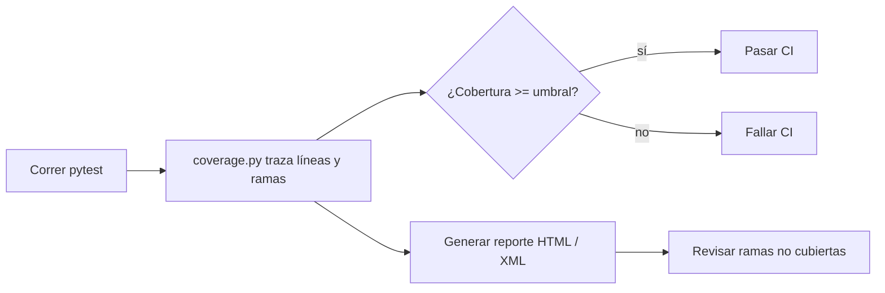

## Visión General

He mergeado PRs que parecían verdes, solo para descubrir después que toda una rama de lógica de validación nunca se
había ejecutado. `pytest-cov` es el plugin de pytest al que recurro cuando quiero atrapar eso antes de que llegue a
producción.

Envuelve `coverage.py`, registra qué líneas y ramas se alcanzan durante la corrida de tests, imprime un resumen de
cobertura y puede fallar CI si el porcentaje cae bajo un umbral. También genera reportes HTML y me permite ignorar
archivos o líneas que no necesito contar.

## Cuándo Usar

Uso esta configuración cuando:

- Quiero un número medible de cobertura antes de mergear PRs
- CI debe fallar cuando el código nuevo no está suficientemente testeado
- Necesito un reporte HTML para encontrar paths no testeados
- Quiero branch coverage, no solo line coverage
- Estoy agregando cobertura a un proyecto Flask, Django o Python simple

## Cuándo NO Usar

No uso la cobertura como la única señal de calidad. Mide qué se ejecutó, no qué afirma el test en realidad.

- No persigas 100% de cobertura con tests triviales solo para alcanzar el número
- No incluyas scripts one-off o código autogenerado en la medición
- No confíes solo en la cobertura cuando la corrección importa mucho; combinála con
  [mutation testing](/recipes/implement-mutation-testing/)
  o [property testing](/recipes/python-hypothesis-property-testing/)

## Solución

### Setup

```bash
pip install pytest pytest-cov
```

### Run básico de cobertura

```bash
pytest --cov=myapp tests/
```

Esto imprime un resumen en la terminal:

```text
---------- coverage: platform linux, python 3.12 ----------
Name                    Stmts   Miss  Cover
-------------------------------------------
myapp/__init__.py           2      0   100%
myapp/models.py            45      5    89%
myapp/services.py          80     12    85%
myapp/api.py               60      8    87%
-------------------------------------------
TOTAL                     187     25    87%
```

### Exigir cobertura mínima

```bash
pytest --cov=myapp --cov-fail-under=80 tests/
```

Si la cobertura cae por debajo de 80%, pytest termina con un código non-zero, fallando CI.

### Reporte HTML

```bash
pytest --cov=myapp --cov-report=html tests/
```

Abre `htmlcov/index.html` en un navegador. Las líneas verdes están cubiertas, las rojas no, con
highlighting línea por línea.

### Branch coverage

```bash
pytest --cov=myapp --cov-branch --cov-report=term-missing tests/
```

Branch coverage verifica que el test ejecute tanto el path `if` como el `else` de cada condicional. Line coverage solo
puede miss branches donde la condición es siempre true o siempre false en los tests.

### Configuración en `pyproject.toml`

```toml
[tool.pytest.ini_options]
addopts = "--cov=myapp --cov-report=term-missing --cov-report=html --cov-branch"

[tool.coverage.run]
source = ["myapp"]
branch = true
omit = [
    "myapp/__init__.py",
    "myapp/migrations/*",
    "*/tests/*",
]

[tool.coverage.report]
show_missing = true
skip_covered = false
fail_under = 80
exclude_lines = [
    "pragma: no cover",
    "def __repr__",
    "if TYPE_CHECKING:",
    "raise NotImplementedError",
    "if __name__ == .__main__.:",
]
```

### Excluir líneas específicas

```python
def get_config(key: str, default=None):
    if key in os.environ:
        return os.environ[key]
    return default  # pragma: no cover
```

El comentario `# pragma: no cover` le dice a coverage que ignore esa línea.

### Excluir bloques enteros

```python
if TYPE_CHECKING:
    from myapp.models import User  # pragma: no cover
```

El patrón `exclude_lines` saca la línea `if TYPE_CHECKING:` del reporte. Cada línea que está debajo, como el import,
sigue necesitando su propia exclusión; por eso el import lleva `# pragma: no cover`.

### Cobertura para multiprocessing

```python
# pyproject.toml
[tool.coverage.run]
concurrency = ["multiprocessing", "thread"]
parallel = true
```

`parallel = true` le dice a cada proceso que escriba su propio archivo de datos; ejecutá `coverage combine` antes de
reportar.

### Cobertura con ejecución paralela de tests

```bash
pytest -n auto --cov=myapp --cov-report=term-missing
```

Con `pytest-xdist`, cada worker escribe su propio archivo `.coverage`. Usa `coverage combine` antes de generar el
reporte:

```bash
coverage combine
coverage report
coverage html
```

### Elegir un formato de reporte

| Formato | Cuándo lo uso | Salida clave |
|---|---|---|
| `term-missing` | Feedback rápido en CI | Pares archivo:línea de sentencias no cubiertas |
| `html` | Encontrar ramas no cubiertas visualmente | `htmlcov/index.html` con código coloreado |
| `xml` | Dashboards externos (Codecov, SonarQube) | `coverage.xml` para herramientas |
| `json` | Análisis programático | Stats por archivo en formato legible por máquina |

Yo uso `term-missing` por defecto en CI y `html` cuando necesito investigar gaps.

## Explicación

`coverage.py` corre junto a tus tests y registra cada línea ejecutable que se alcanza. Luego cuenta cuántas de esas
líneas fueron tocadas y convierte eso en un porcentaje. [Line coverage](/recipes/measure-test-coverage/) te dice si una
sentencia se ejecutó; branch coverage va más allá y verifica si cada `if/else`, `and`, `or` y ternaria tomó ambos
caminos.



He visto un line coverage alto esconder tests débiles: una sola llamada puede ejecutar muchas líneas sin afirmar nada
concreto. Branch coverage hace eso más difícil porque fuerza a la suite a ejercitar ambos lados de los condicionales.

Yo suelo empezar con 80-90% para módulos que manejan dinero, auth o validación, y subo el umbral
solo cuando los gaps son reales, no excluidos. Para código de pegamento o archivos generados, un
número más bajo está bien si entiendo por qué es bajo.

## Variantes

### Usar `coverage.py` directamente (sin pytest)

```bash
coverage run -m pytest tests/
coverage report -m
coverage html
```

### Coverage diff con `diff-cover`

```bash
pip install diff-cover
coverage xml
diff-cover coverage.xml --compare-branch=origin/main --html-report=coverage-diff.html
```

Esto muestra cobertura solo para las líneas cambiadas en la rama actual — útil para revisiones de PR.

### Tendencias de cobertura con `coverage-badge`

```bash
pip install coverage-badge
coverage-badge -o coverage-badge.svg
```

Genera un SVG badge con el porcentaje de cobertura actual para tu README.

## Mejores Prácticas

- Yo empiezo con 80-90% para módulos que manejan pagos, auth o validación. Para prototipos o código de pegamento, un
  número más bajo está bien si puedo explicarlo.
- Agrego `--cov-branch` en CI para que paths `else` no testeados aparezcan como faltantes.
- Excluyo archivos de migración, `__init__.py` y la suite de tests de la medición.
- Uso `# pragma: no cover` solo para helpers de depuración y stubs abstractos; nunca para paths de error.
- Reviso el reporte HTML antes de subir el umbral; el número agregado esconde gaps locales.
- Publico un reporte XML con `--cov-report=xml` para que SonarQube, Codecov o Coveralls lo consuman.

## Errores Comunes

- **Perseguir 100% de cobertura**:
    una vez vi un PR que llegó a 100% con tests que solo llamaban funciones sin afirmar nada. El número se veía
    excelente; la seguridad era una ilusión.
- **No usar branch coverage**: [line coverage](/recipes/measure-test-coverage/) de 100% puede aún miss branches `else`.
- **Incluir archivos de test en la cobertura**: `tests/` debería excluirse — estás midiendo código de producción.
- **No combinar archivos de cobertura paralelos**: con `pytest-xdist`, cada worker escribe un archivo separado.
- **Excluir demasiado**: si excluyes cada línea difícil de testear, el número pierde sentido.
- **Commitear artifacts de cobertura al control de versiones**:
    agregá `.coverage`, `htmlcov/`, `.coverage.*` y badges generados a `.gitignore`. Solo la config y los archivos de
    test deben estar en el repo.

## Notas de Producción

- **El reporte de cobertura está vacío**:
    asegurate de que `--cov` apunte a un paquete, no a un script de top-level, y de que `source` esté configurado en la
    config.
- **Branch coverage es más bajo de lo esperado**:
    agregá `--cov-branch` y revisá el reporte HTML para condicionales que siempre toman el mismo path.
- **La cobertura cae después de agregar `pytest-xdist`**:
    cada worker escribe su propio archivo `.coverage.*`. Ejecutá `coverage combine` antes de `coverage report` o
    `coverage html`.
- **diff-cover reporta 0% de líneas cambiadas**:
    generá `coverage.xml` con `coverage xml` y obtené la rama de comparación antes.
- **El badge en el README está desactualizado**:
    regenerá el SVG en CI como artifact o subilo a una rama `badges`; no subas el archivo generado a `main`.

## Preguntas Frecuentes

### ¿Cuál es la diferencia entre line coverage y branch coverage?

Line coverage verifica si una sentencia se ejecutó. Branch coverage verifica si ambos paths de un `if/else` se tomaron.

### ¿Qué archivos debería excluir de la cobertura?

Lista los paths en la opción `omit` bajo `[tool.coverage.run]` en `pyproject.toml`.
Revisá el [ejemplo de implementación](#excluyo-un-archivo-entero-de-la-cobertura).

### ¿Puedo apuntar la cobertura a un solo archivo de test?

Apuntá `--cov` al módulo que el test ejercita, no a todo el paquete.
El [ejemplo de implementación](#obtengo-cobertura-para-un-solo-archivo-de-test) cubre un solo archivo.

### ¿Puedo usar pytest-cov con Django o Flask?

Sí. Configurá `--cov` a tu paquete y asegurate de que el módulo de settings de Django esté
disponible durante los tests.
Mira el [ejemplo de implementación](#usar-pytest-cov-con-django-o-flask).

### ¿Cómo bloquea diff-cover un PR con menos cobertura?

Usá `diff-cover --fail-under=100` sobre las líneas cambiadas en el PR.
El [ejemplo de implementación](#fallo-ci-solo-cuando-la-cobertura-disminuye) muestra el gate de diff-cover.

### ¿Cómo excluyo líneas de la cobertura?

Agregá `# pragma: no cover` para exclusiones puntuales, o listá patrones en `exclude_lines`.
Revisá el [ejemplo de implementación](#excluyo-líneas-de-la-cobertura).

### ¿Por qué debería preferir branch coverage sobre line coverage?

Agregá `--cov-branch` a pytest o configurá `branch = true` en la config de coverage.
El [ejemplo de implementación](#mido-branch-coverage-en-lugar-de-line-coverage) activa branch coverage.

### ¿Cuál es la mejor forma de mantener actualizado el badge de cobertura?

Usá `coverage-badge` para crear un SVG desde el reporte.
El [ejemplo de implementación](#genero-badges-de-cobertura-para-mi-readme) genera el badge SVG.

### ¿Cómo manejo cobertura con multiprocessing?

Configurá `concurrency = multiprocessing` y ejecutá `coverage combine` antes de reportar.
El [ejemplo de implementación](#manejo-cobertura-con-multiprocessing) usa `concurrency = multiprocessing`.

### ¿Cómo integro cobertura con GitHub Actions?

Ejecutá pytest con `--cov-report=xml` y subí el XML con la acción de Codecov.
El [ejemplo de implementación](#integro-cobertura-con-github-actions) sube el XML a Codecov en CI.

## Ejemplos de Implementación

### Excluyo un archivo entero de la cobertura

```toml
[tool.coverage.run]
omit = ["myapp/legacy/*", "myapp/migrations/*"]
```

### Obtengo cobertura para un solo archivo de test

```bash
pytest tests/test_models.py --cov=myapp.models --cov-report=term-missing
```

### Usar pytest-cov con Django o Flask

```bash
pytest --cov=myproject --cov-report=html
```

Para Django, asegúrate de que `DJANGO_SETTINGS_MODULE` esté configurado en tu configuración de test.

### Fallo CI solo cuando la cobertura disminuye

```bash
coverage xml
diff-cover coverage.xml --compare-branch=origin/main --fail-under=100
```

### Excluyo líneas de la cobertura

```ini
[report]
exclude_lines =
    pragma: no cover
    def __repr__
    raise NotImplementedError
    if __name__ == .__main__.:
```

Estos patrones son expresiones regulares. Por ejemplo, `if __name__ == .__main__.:` coincide con
`if __name__ == "__main__":` porque el `.` en regex coincide con las comillas. Excluye código de depuración,
métodos repr y stubs de métodos abstractos. No excluyas paths de error handling — esos son críticos de testear.

### Mido branch coverage en lugar de line coverage

```bash
pytest --cov=myapp --cov-branch --cov-report=term-missing
```

Branch coverage reporta si el test ejecutó tanto el path true como el false de cada condicional. Detecta else branches
faltantes y paths de short-circuit evaluation que line coverage no detecta.

### Genero badges de cobertura para mi README

```bash
pip install coverage-badge
coverage-badge -o coverage.svg
```

Agrega el badge a tu README: ``. En CI, genera el badge como artifact y commitealo a una rama
`badges` o subelo a un servicio de badges como shields.io.

### Manejo cobertura con multiprocessing

```ini
[run]
concurrency = multiprocessing
parallel = True
```

Esto genera archivos de coverage data separados por proceso. Ejecuta `coverage combine` después de la suite de tests
para mergeearlos. Sin esto, la cobertura de procesos child se pierde.

### Integro cobertura con GitHub Actions

```yaml
- run: pytest --cov=myapp --cov-report=xml
- uses: codecov/codecov-action@v4
  with:
    file: ./coverage.xml
```

Codecov publica un comentario en PRs con el diff de cobertura y visualiza líneas no cubiertas. Usa `fail_under` en
`.coveragerc` para que falle el job de CI si la cobertura baja de un threshold.

## Puntos Clave

- `pytest-cov` envuelve `coverage.py` y me da reportes de líneas cubiertas, ramas ejecutadas y líneas faltantes en una
  sola corrida de pytest.
- Elijo un umbral realista en `pyproject.toml` o en CI y lo subo solo cuando los gaps sean reales, no excluidos.
- Branch coverage atrapa paths `else` no testeados que line coverage esconde.
- Excluyo `migrations/`, archivos de test y `__init__.py`; uso `pragma: no cover` solo para helpers de depuración o
  stubs abstractos.
- Combino archivos de cobertura paralelos y subo un reporte XML para dashboards de CI.

## Lectura Adicional

Si querés profundizar, estos recursos cubren las herramientas y prácticas mencionadas:

- [Documentación de coverage.py](https://coverage.readthedocs.io/)
- [Documentación de pytest-cov](https://pytest-cov.readthedocs.io/)
- [Guía completa de pytest en producción](/es/guides/complete-guide-pytest-production/)
- [Fixtures y parametrización en pytest](/recipes/python-pytest-fixtures-parametrize/)
- [Mutation testing en Python](/recipes/implement-mutation-testing/)
- [Mocking de APIs externas con Python](/recipes/python-mock-external-apis-responses/)
