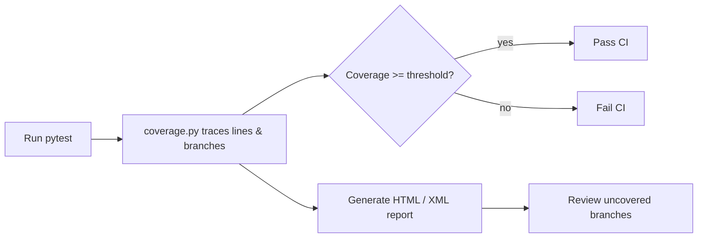

## Overview

I've merged PRs that looked green on the surface, only to discover later that a whole branch of validation logic had
never been exercised. `pytest-cov` is the pytest plugin I reach for when I want to catch that before it reaches
production.

It wraps `coverage.py`, records which lines and branches are reached during the test run, prints a coverage summary, and
can fail CI if the percentage falls below a threshold. It also generates HTML reports and lets me ignore files or lines
that don't need to be counted.

## When to Use

I use this setup when:

- I want a measurable coverage number before merging PRs
- CI must fail when new code isn't tested enough
- I need an HTML report to find untested code paths
- I want branch coverage, not just line coverage
- I'm adding coverage to a Flask, Django, or plain Python project

## When NOT to Use

I don't use coverage as the only quality signal. It measures what ran, not what the test actually asserts.

- Don't chase 100% coverage with trivial tests just to hit the number
- Don't include one-off scripts or auto-generated code in the measurement
- Don't rely on coverage alone when correctness really matters; pair it with
  [mutation testing](/recipes/implement-mutation-testing/)
  or [property testing](/recipes/python-hypothesis-property-testing/)

## Solution

### Setup

```bash
pip install pytest pytest-cov
```

### Basic coverage run

```bash
pytest --cov=myapp tests/
```

This prints a summary to the terminal:

```text
---------- coverage: platform linux, python 3.12 ----------
Name                    Stmts   Miss  Cover
-------------------------------------------
myapp/__init__.py           2      0   100%
myapp/models.py            45      5    89%
myapp/services.py          80     12    85%
myapp/api.py               60      8    87%
-------------------------------------------
TOTAL                     187     25    87%
```

### Enforce minimum coverage

```bash
pytest --cov=myapp --cov-fail-under=80 tests/
```

If coverage falls below 80%, pytest exits with a non-zero code, failing CI.

### HTML report

```bash
pytest --cov=myapp --cov-report=html tests/
```

Open `htmlcov/index.html` in a browser. Green lines are covered, red lines are missed, with line-by-line highlighting.

### Branch coverage

```bash
pytest --cov=myapp --cov-branch --cov-report=term-missing tests/
```

Branch coverage checks that the test runs both the `if` and `else` paths of each conditional. Line coverage alone can
miss branches where the condition is always true or always false in tests.

### Configuration in `pyproject.toml`

```toml
[tool.pytest.ini_options]
addopts = "--cov=myapp --cov-report=term-missing --cov-report=html --cov-branch"

[tool.coverage.run]
source = ["myapp"]
branch = true
omit = [
    "myapp/__init__.py",
    "myapp/migrations/*",
    "*/tests/*",
]

[tool.coverage.report]
show_missing = true
skip_covered = false
fail_under = 80
exclude_lines = [
    "pragma: no cover",
    "def __repr__",
    "if TYPE_CHECKING:",
    "raise NotImplementedError",
    "if __name__ == .__main__.:",
]
```

### Excluding specific lines

```python
def get_config(key: str, default=None):
    if key in os.environ:
        return os.environ[key]
    return default  # pragma: no cover
```

The `# pragma: no cover` comment tells coverage to ignore that line.

### Excluding entire blocks

```python
if TYPE_CHECKING:
    from myapp.models import User  # pragma: no cover
```

The `exclude_lines` pattern removes the `if TYPE_CHECKING:` line itself, not every line inside the block, so the import
line still gets a `# pragma: no cover`.

### Coverage for multiprocessing

```python
# pyproject.toml
[tool.coverage.run]
concurrency = ["multiprocessing", "thread"]
parallel = true
```

Set `parallel = true` so each process writes its own data file, then run `coverage combine` before you report.

### Coverage with parallel test runs

```bash
pytest -n auto --cov=myapp --cov-report=term-missing
```

With `pytest-xdist`, each worker writes its own `.coverage` file. Use `coverage combine` before generating the report:

```bash
coverage combine
coverage report
coverage html
```

### Choosing a report format

| Format | When I use it | Key output |
|---|---|---|
| `term-missing` | Quick CI feedback | File:line pairs of missed statements |
| `html` | Finding uncovered branches visually | `htmlcov/index.html` with colored source |
| `xml` | External dashboards (Codecov, SonarQube) | `coverage.xml` for tools |
| `json` | Programmatic analysis | Machine-readable per-file stats |

I default to `term-missing` in CI and `html` when I need to explore gaps.

## Explanation

`coverage.py` runs alongside your tests and records each executable line that's reached. It then counts how many of
those lines were hit and converts that into a percentage. [Line coverage](/recipes/measure-test-coverage/) tells you
whether a statement ran; branch coverage goes further and checks whether each `if/else`, `and`, `or`, and ternary took
both paths.



I've seen high line coverage hide weak tests: a single call can exercise many lines without asserting anything
meaningful. Branch coverage makes that harder because it forces the test suite to run both sides of conditionals.

I usually start with 80-90% for modules that handle money, auth, or validation, and I raise the threshold only after the
gaps are real, not excluded. For thin glue code or generated files, a lower number is fine as long as I understand why
it's low.

## Variants

### Using `coverage.py` directly (without pytest)

```bash
coverage run -m pytest tests/
coverage report -m
coverage html
```

### Coverage diff with `diff-cover`

```bash
pip install diff-cover
coverage xml
diff-cover coverage.xml --compare-branch=origin/main --html-report=coverage-diff.html
```

This shows coverage only for lines changed in the current branch — useful for PR reviews.

### Coverage trends with `coverage-badge`

```bash
pip install coverage-badge
coverage-badge -o coverage-badge.svg
```

Generates an SVG badge with the current coverage percentage for your README.

## Best Practices

- I start with 80-90% for modules that handle payments, auth, or validation. For prototypes or glue code, a lower number
  is fine as long as I can explain it.
- I add `--cov-branch` in CI so untested `else` paths show up as missing.
- I exclude migration files, `__init__.py`, and the test suite from the measurement.
- I only use `# pragma: no cover` for debug helpers and abstract stubs; never for error paths.
- I review the HTML report before raising the threshold; the aggregate number hides local gaps.
- I publish an XML report with `--cov-report=xml` so SonarQube, Codecov, or Coveralls can consume it.

## Common Mistakes

- **Chasing 100% coverage**:
    I once saw a PR hit 100% with tests that only called functions and asserted nothing. The number looked great; the
    safety was an illusion.
- **Not using branch coverage**:
    [line coverage](/recipes/measure-test-coverage/) of 100% can still miss `else` branches.
- **Including test files in coverage**: `tests/` should be excluded — you're measuring production code.
- **Not combining parallel coverage files**:
    with `pytest-xdist`, each worker writes a separate file. Run `coverage combine` before reporting.
- **Excluding too much**: if you exclude every hard-to-test line, the number becomes meaningless.
- **Committing coverage artifacts to version control**:
    put `.coverage`, `htmlcov/`, `.coverage.*`, and any generated badges in `.gitignore`. Only your config and actual
    test files belong in the repo.

## Production Notes

- **Coverage report is empty**:
    make sure `--cov` points to a package, not a top-level script, and that `source` is set in the config.
- **Branch coverage is lower than expected**:
    add `--cov-branch` and check the HTML report for conditionals that always take the same path.
- **Coverage drops after adding `pytest-xdist`**:
    each worker writes its own `.coverage.*` file, so run `coverage combine` before `coverage report` or `coverage
    html`.
- **diff-cover reports 0% changed lines**:
    generate `coverage.xml` with `coverage xml` and fetch the comparison branch first.
- **Badge in README is stale**:
    regenerate the SVG in CI as an artifact or push it to a `badges` branch; don't commit the generated file to `main`.

## FAQ

### What is the difference between line coverage and branch coverage?

Line coverage tracks whether a statement ran. Branch coverage checks whether both sides of an `if/else` were actually
executed.

### Which files should I exclude from coverage?

List the file or directory patterns under the `omit` option in `[tool.coverage.run]`.
Check the [implementation example](#exclude-a-whole-file-from-coverage).

### Can I target coverage to a single test file?

Point `--cov` at the module the test exercises instead of the whole package.
The [implementation example](#get-coverage-for-a-single-test-file) covers a single-file setup.

### Can I use pytest-cov with Django or Flask?

Yes — point `--cov` at the package. With Django, keep `DJANGO_SETTINGS_MODULE` set while the tests run.
See the [implementation example](#use-pytest-cov-with-django-or-flask).

### How does diff-cover block PRs with lower coverage?

For PRs, run `diff-cover --fail-under=100` against the changed lines.
The [implementation example](#fail-ci-only-on-decreased-coverage) shows the diff-cover CI gate.

### How do I exclude lines from coverage?

For a single line you want coverage to skip, add `# pragma: no cover` at the end of that line. For patterns that show up
repeatedly, add them to `exclude_lines` in the config.
See the [implementation example](#exclude-lines-from-coverage).

### Why should I prefer branch coverage over line coverage?

Add `--cov-branch` to pytest, or set `branch = true` in your coverage config.
The [implementation example](#measure-branch-coverage-instead-of-line-coverage) turns on branch coverage.

### What is the best way to keep a coverage badge updated?

To turn the report into an SVG badge, use `coverage-badge`.
The [implementation example](#generate-coverage-badges-for-my-readme) creates the SVG badge.

### How do I handle coverage with multiprocessing?

When tests spawn processes, set `concurrency = multiprocessing` in the coverage config, then run `coverage combine`
before the report.
The [implementation example](#handle-coverage-with-multiprocessing) uses `concurrency = multiprocessing`.

### How do I integrate coverage with GitHub Actions?

Run pytest with `--cov-report=xml`, then upload the generated `coverage.xml` with the Codecov action.
The [implementation example](#integrate-coverage-with-github-actions) runs the Codecov upload in CI.

## Implementation Examples

### Exclude a whole file from coverage

```toml
[tool.coverage.run]
omit = ["myapp/legacy/*", "myapp/migrations/*"]
```

### Get coverage for a single test file

```bash
pytest tests/test_models.py --cov=myapp.models --cov-report=term-missing
```

### Use pytest-cov with Django or Flask

```bash
pytest --cov=myproject --cov-report=html
```

For Django, ensure `DJANGO_SETTINGS_MODULE` is set in your test configuration.

### Fail CI only on decreased coverage

```bash
coverage xml
diff-cover coverage.xml --compare-branch=origin/main --fail-under=100
```

### Exclude lines from coverage

```ini
[report]
exclude_lines =
    pragma: no cover
    def __repr__
    raise NotImplementedError
    if __name__ == .__main__.:
```

These patterns are regular expressions, which is why `if __name__ == .__main__.:` matches `if __name__ ==
"__main__":` — the `.` wildcard matches the quotes too. Use it for debug-only code, repr methods, and abstract
method stubs, but don't
exclude error handling paths because those are critical to test.

### Measure branch coverage instead of line coverage

```bash
pytest --cov=myapp --cov-branch --cov-report=term-missing
```

Branch coverage reports whether the test ran both the true and false paths of each conditional. It catches missing else
branches and short-circuit evaluation paths that line coverage misses.

### Generate coverage badges for my README

```bash
pip install coverage-badge
coverage-badge -o coverage.svg
```

Add the badge to your README: ``. In CI, generate the badge as an artifact and commit it to a
`badges` branch or upload to a badge service like shields.io.

### Handle coverage with multiprocessing

```ini
[run]
concurrency = multiprocessing
parallel = True
```

This spawns separate coverage data files per process, so run `coverage combine` after the test suite to merge them.
Without that step, coverage from child processes is lost.

### Integrate coverage with GitHub Actions

```yaml
- run: pytest --cov=myapp --cov-report=xml
- uses: codecov/codecov-action@v4
  with:
    file: ./coverage.xml
```

Codecov posts a comment on PRs with coverage diff and visualizes uncovered lines. Use `fail_under` in `.coveragerc` to
fail the CI job if coverage drops below a threshold.

## Key Takeaways

- `pytest-cov` wraps `coverage.py` and gives me line, branch, and missing-line reports in a single pytest run.
- I pick a realistic threshold in `pyproject.toml` or CI and raise it only after the gaps are real, not excluded.
- Branch coverage catches untested `else` paths that line coverage hides.
- I exclude `migrations/`, test files, and `__init__.py`; I use `pragma: no cover` only for debug helpers or abstract
  stubs.
- I combine parallel coverage files and upload an XML report for CI dashboards.

## Further Reading

For more detail, see the official docs and related recipes below:

- [coverage.py documentation](https://coverage.readthedocs.io/)
- [pytest-cov documentation](https://pytest-cov.readthedocs.io/)
- [Complete pytest production guide](/guides/complete-guide-pytest-production/)
- [pytest fixtures and parametrization](/recipes/python-pytest-fixtures-parametrize/)
- [Mutation testing in Python](/recipes/implement-mutation-testing/)
- [Mocking external APIs with Python](/recipes/python-mock-external-apis-responses/)
